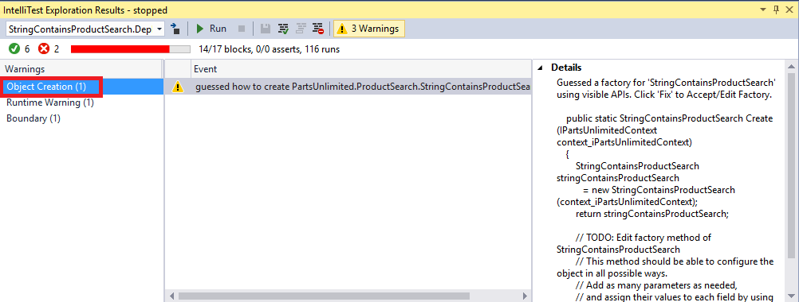
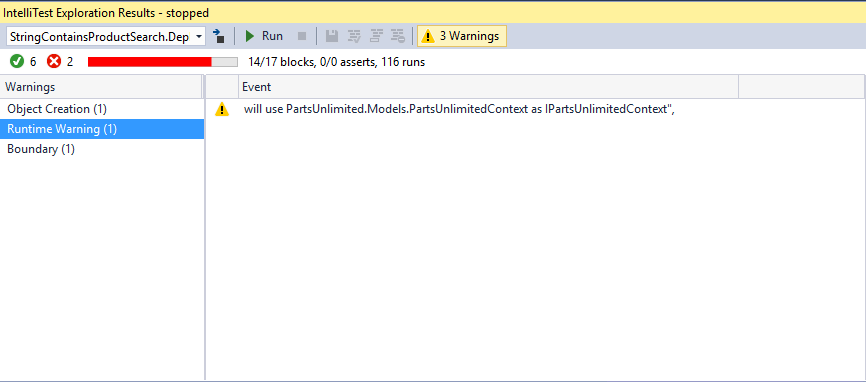
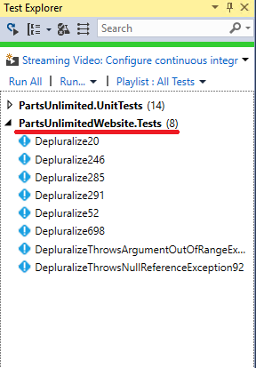

# Introduction to IntelliTest

## Overview

**[IntelliTest](https://msdn.microsoft.com/en-IN/library/dn823749.aspx)** explores your **.NET code** to generate test data and a suite of unit tests. For every statement in the code, a test input is generated that will execute that statement.
A case analysis is performed for every conditional branch in the code. For example, **if statements, assertions, and all operations** that can throw exceptions are analyzed. This 
analysis is used to generate test data for a parameterized unit test for each of your methods, creating unit tests with high code coverage.

When you run IntelliTest, you can easily see which tests are failing and add any necessary code to fix them. You can select which of the generated tests to save into a test project to provide a regression suite. As you change your code, rerun IntelliTest to keep the generated tests in sync with your code changes.

**Pre-requisites**

- Visual Studio 2017 (download [here](https://www.visualstudio.com/vs/visual-studio-2017-rc/))

- Download the Parts Unlimited project [here](https://github.com/Microsoft/PartsUnlimited/tree/aspnet45)

### Task 1: Running IntelliTest

1. Download and extract the zip file

2. Open the solution in **Visual Studio 2017**

3. Scroll down to the **ProductSearch | StringContainsProductSearch method from StringContainsProductSearch.cs** file. This method is responsible for searching a product asynchronously using product title among all the products present in the database. As with most real-world code, this code interacts with other objects and layers.

 
4. Right Click within the class **StringContainsProductSearch** and then select **IntelliTest | Run IntelliTest**

 

### Task 2: Understanding IntelliTest warnings

1. After **IntelliTest** runs, **6 tests** are generated with a **code coverage (15/41 blocks)**. In addition, there are **21 warnings** reported.

 

2. Click on **warnings** button.

 

3. Select the **Object Creation** warning category. . IntelliTest has also discovered publicly accessible APIs though which to instantiate QueryDataStore (in this case that happens to be the public constructor). The APIs need to be publicly accessible because IntelliTest needs to actually call them to instantiate the type. 

 

4. Select the **first Object Creation** warning. This warning alerts us about the APIs that it discovered. If we prefer, those calls could be persisted as a Factory method by clicking the Fix button, although we will not do so now.

 

5. Select the **second Object Creation** warning. This warning alerts us that IntelliTest was not automatically able to instantiate the object and indicates that we have some more work to do in order to get this working.

 

6. Next, select the **Uninstrumented Method** warning category  from the list.

 

  This information is important to note, because IntelliTest works by [instrumenting code and monitoring execution](https://blogs.msdn.microsoft.com/visualstudioalm/2014/12/11/smart-unit-tests-a-mental-model/). However, it does not instrument the entire universe of code for two reasons,
 1) It cannot know a **priori** what comprises that universe of code and
 2) That would make the system very slow. Therefore, that is why we see this **“uninstrumented method”** warning.

7. Select the **Boundary warning** category from the list.

 

 When the number of branches in the code path that IntelliTest is exploring is large, it can trip an internal boundary that has been  configured for fast interactive performance. Hence, it raises a warning and stops the exploration.

8. Select the **Runtime** warning category from the list.

 
 
 This warning indicates that IntelliTest has discovered and will use **PartsUnlimited.Models.PartsUnlimitedContext** as **IPartsUnlimitedContext**.
 
9. Select the tests and click **save** button to save as **Regression Suite**. This creates a **New Project** named **PartsUnlimitedWebsite.Tests** with the generated Parameterized Unit Test found in **StringContainsProductSearchTest.cs**.

 
 
 

