#Cloud Load Testing using Visual Studio Team Services

##Overview

[Visual Studio and Team Services](https://www.visualstudio.com/team-services/) provide a wide range of tools and capabilities for performance testing your websites and applications. You can scale your tests to hundreds of thousands of concurrent users and generate load from multiple regions worldwide.
Generate hundreds of thousands of connections in minutes – Cloud-based load testing leveraging the power of Azure is like having a whole performance lab at your fingertips.

##Pre-requisites

- Visual Studio Team Services account (Create one from [here](https://www.visualstudio.com/team-services/cloud-load-testing/))
- Visual Studio 2017 download ([here](https://www.visualstudio.com/vs/visual-studio-2017-rc/))
- Download the Parts Unlimited project [here](https://github.com/Microsoft/PartsUnlimited/tree/aspnet45)

###Task 1: Creating Web Performance Test for the Hosted WebSite

1. Download and extract the zip file.

2. Open the solution in Visual Studio 2017.

3. Right click on the **Parts Unlimited** solution and click **Add | New Project** and select **Web Performance and Load Test Project** template from **Visual C# | Test**. Name the project **PartsUnlimitedWebandLoad** and click **OK**.
  
  

4. The new **web and load test** project is created with default test settings and a single web test definition file named **WebTest1.webtest**. 
   Click the **Add Recording** button at the top of the Web Performance Test Editor to start recording as shown below-

 

5. **Internet Explorer** and the **Web Test Recorder** now opens in Record mode. You can verify by looking at the toolbar at the top of the recorder window. You can also pause, stop, or reset the recording at any time.
  
6. From your **Internet Explorer**, type **http://partsunlimiteddev.azurewebsites.net** to launch the **Parts Unlimited** website.
   Note that the requests are logged in the test recorder as shown below-
   
   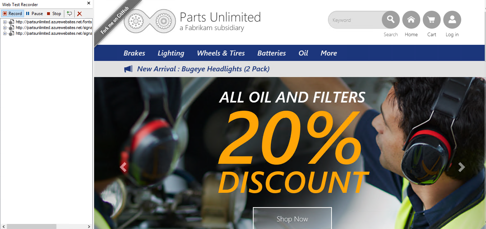

 **Note**- Your application should be hosted on **Cloud** (Microsoft Azure), or else you can use our azure hosted website  **http://partsunlimiteddev.azurewebsites.net**

7. Once you complete browsing the products, click **stop** in your Test recorder. The web test detects all the **dynamic parameters** and runs your test producing a **pass/fail result**.

 
 
 

###Task 2: Running Load Test on Cloud (VSTS) from Visual Studio

1. Select **Project | Add Load Test** from the main menu in Visual Studio.

2. In the New Load Test Wizard, select **Cloud-based Load Test with VSTS** and click **Next** to start defining the load test scenario.

 
 
3. Specify the **Azure datacenter** from where the load will be generated.

 
 
4. The Run Settings for a load test allow you to specify how long the test should run using either time duration or a specific number of test iterations. We will use a time duration, but change it to **3 minutes** for demo purpose. The default sampling rate of **15 seconds** is fine here, and it is a good choice in general for shorter test runs. If you want to run longer tests, consider sampling less often as it will generate a lot less data to store in the load test database. Click **Next** to continue.

 
 
5. Enter a name for the scenario like **“BrowseAndOrderProduct”** but leave the default think time profile in place. The default uses the think times of the web performance tests as a median value with a normal distribution used to generate some variation. The goal is a more realistic generation of load on the web site. Click the **Next** button to continue on to the Load Pattern definition screen.

  
 
6. The **step load pattern** is used to specify a user load that increases with time up to a defined maximum user load. For stepping loads, you specify the Initial User Count, Maximum User Count, Step Duration (seconds), and Step User Count. In our case we have considered **500 users**.

 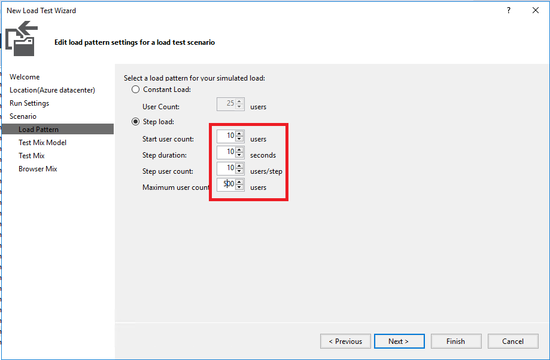
 
7. Read the description of each test mix model by clicking on it and viewing the description that appears on the right-hand side. Let’s say that our current production site gives us some indication of the percentage of browsing users that end up making purchases. Select the first option that models the test mix based on the total number of tests and then click Next to continue on to the Test Mix screen.

 
 
8. Click **Add** to load the Add Tests window. Select **both** tests, add them to the test mix, and then click **OK.**

 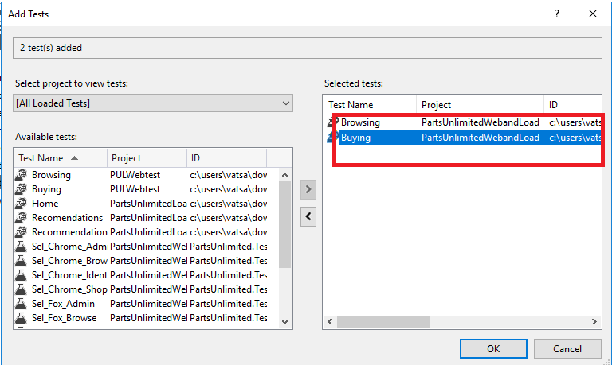
 
9. Let’s say that our production logs tell us that **25% of users** browsing the site will end up buying something. Change the Distribution to reflect this knowledge and then click **Next** to continue on to the Network Mix screen.

 

10. The **Browser Mix** screen allows you to specify one or more browser types and specify the distribution of those types across the tests to be executed by the virtual users. Just like the network mix, this allows us to more realistically model how the users interact with the web site. For the purpose of this exercise leave the default at **100% Internet Explorer 9.0** and click **Finish** to continue on to the Counter Sets screen.

 
 
11. You should be seeing the **Load Test** that was configured from the above steps.

 
 
12. Click on the **run** test from the above toolbar, you should see now that all the **resources are being acquired** on the cloud for your account.

 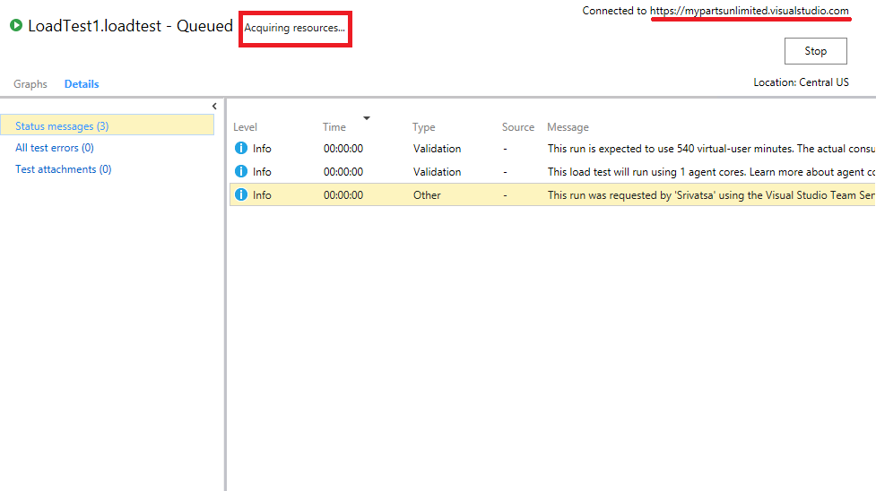
 
13. You can see the test is **In Progress** in your **Visual Studio**

 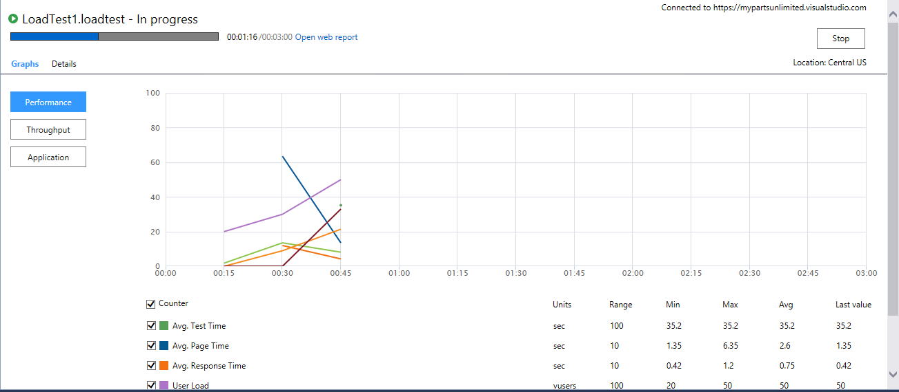
 
14. Once the test is completed, you can see the **Summary, Graphs, Throughput, Performance** and lot more information.

 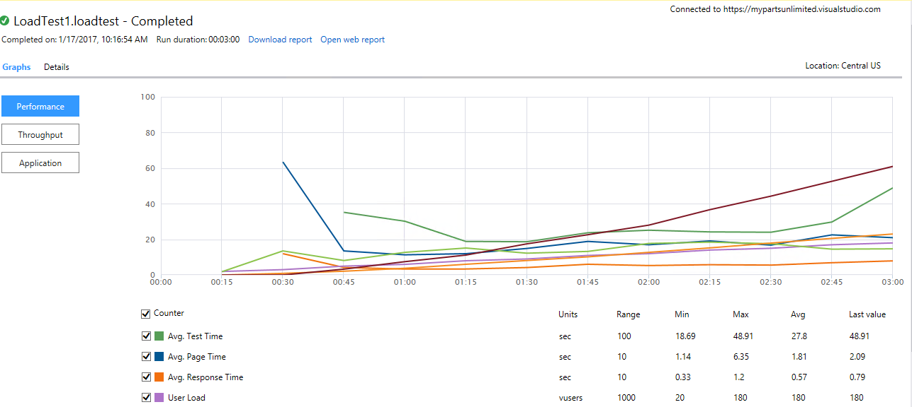

15. You can also login to your **VSTS account**, navigate to **Test | Load Test** hub and view your results. This test has run on **Azure datacenter** that we mentioned in the **Step 3**.

 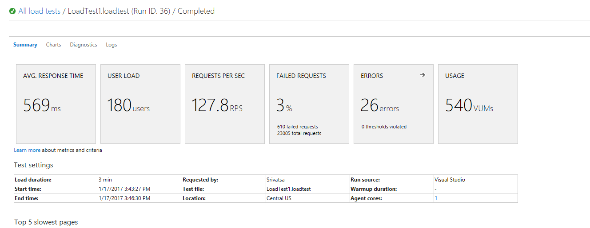
 
###Task 3: Authoring load test using Visual Studio Team Services.

We have 4 ways to author load test on VSTS. They are **[Visual Studio Test](https://www.visualstudio.com/en-us/docs/test/performance-testing/run-performance-tests-app-before-release), [Http Archive based test](https://blogs.msdn.microsoft.com/visualstudioalm/2016/05/20/feature-preview-creating-load-tests-using-http-archive/), [URL based test](https://www.visualstudio.com/en-us/docs/test/performance-testing/getting-started/get-started-simple-cloud-load-test), [Apache JMeter test](https://www.visualstudio.com/en-us/docs/test/performance-testing/getting-started/get-started-jmeter-test)**.

- ###Visual Studio Test:

1. Login to **VSTS account**. You should see the **Account home** page with the default Load Testing Virtual user minutes offering for free (20,000)

 
 
2. Navigate to **Load Test**. Click **New** and select **Visual Studio Test**

 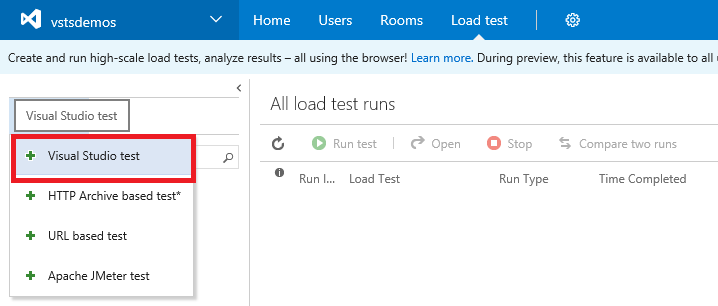
 
3. Remember we recorded the Web Performance test earlier in the **Demo 1**. Browse and navigate to any one of the **Tests(Browsing or Buying).**

 
 
4. You should be able to see as shown below once added.

 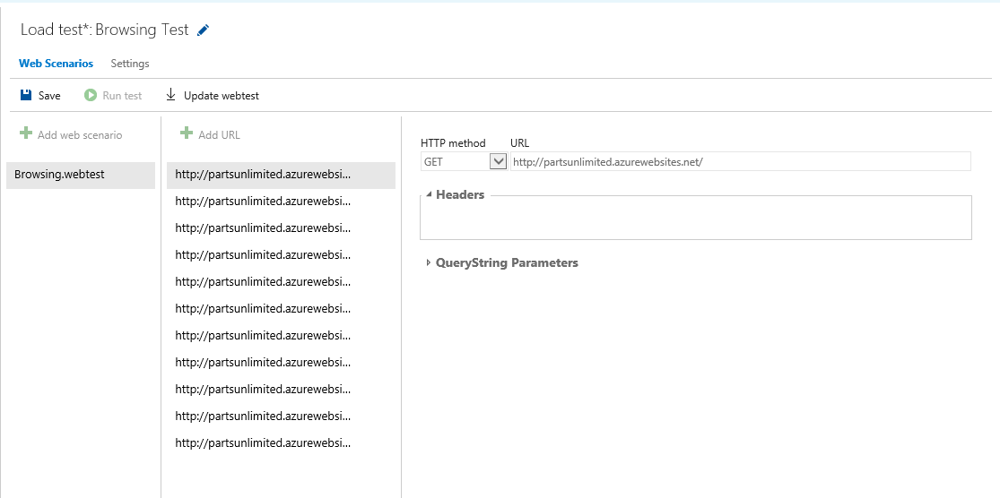
 
5. Navigate to the **Settings** pane. You can configure the test settings from here. At this moment we are going with the **Constant load** of users **100**.

 
 
6. You can see that the test is being **Queued**.

 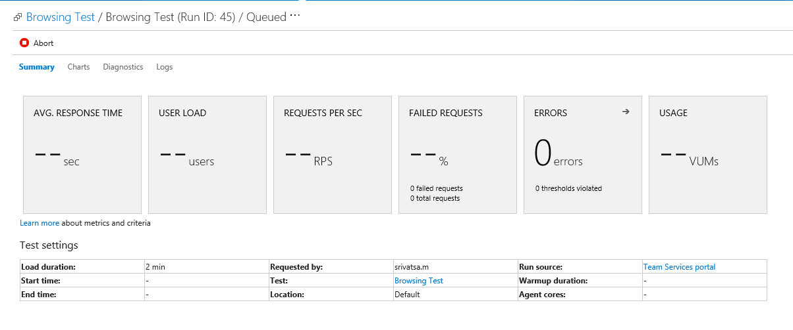
 
 
 
7. Once the test is completed, you can see the **Summary, Diagnostics, Charts** etc as shown in the below screencshots.

 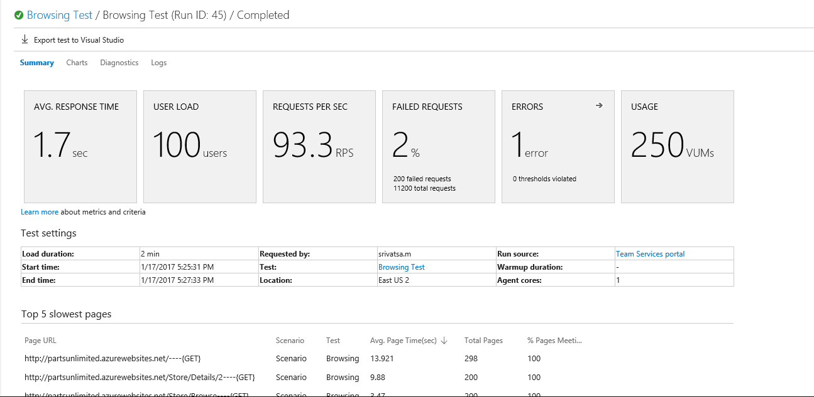
 
 
 
 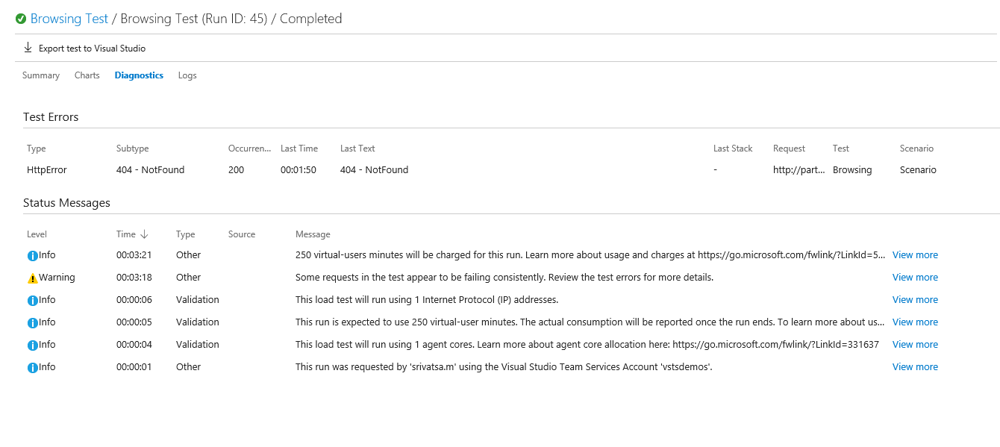

 
- ###HTTP Archive based Test

- **Create HTTP archive (.har) to use for load testing in Visual Studio Team Services**
 
 1. Launch the **browser (Chrome) and developer tools (Shortcut key- F12)**
   
     
    
 2. Check the **Preserve log**checkbox to ensure that the complete sequence of URL's for your scenario are captured. If this box is unchecked, the network activity recording is discarded whenever you reload the current page or load a different page, which means that an end to end user scenario may not be captured.
   
     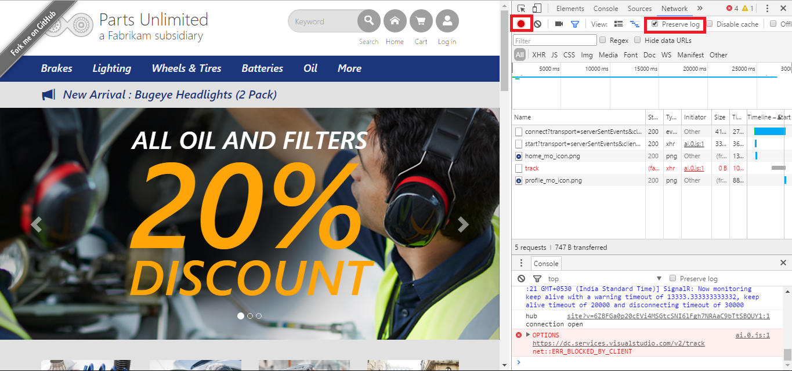 
     
 3. Exercise your user scenario – Enter the **URL** in the address bar and go through the sequence of actions a typical user would go through. For e.g., a user that comes to a retail store’s site to browse a product will go to the website, enter a product name in the search box, click on a link of interest in the search results, view the product information and so on and so forth.
   
        
 4. As you go through these actions, you will notice that all the traffic between the browser and the server is shown in the **Network tab of the developer tools.**
   
 5. Once you are done recording the user scenario, you can **save the URLs as HTTP archive (.har)**. In **Chrome**, you can do this by **right clicking in the URL list area and choosing “Save as HAR with content”** in the context menu. Provide a name to your **HTTP archive file** and save on your computer.
   
    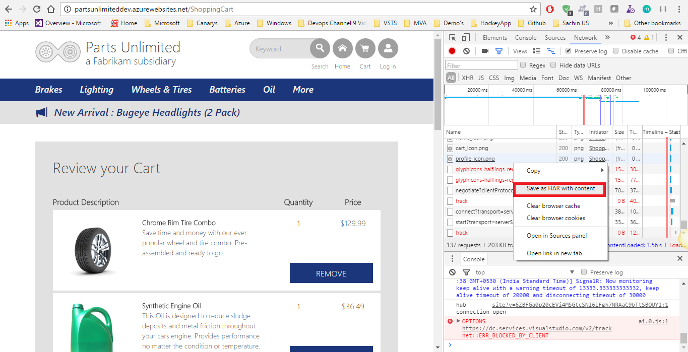
  
 6. Browse and navigate to the **Archive file** that you saved and click **OK**.
   
    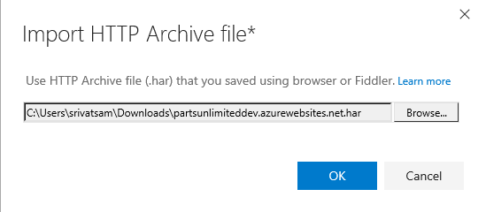
    
 7. Name your test and you should see all the recorded URL's as shown below-
   
    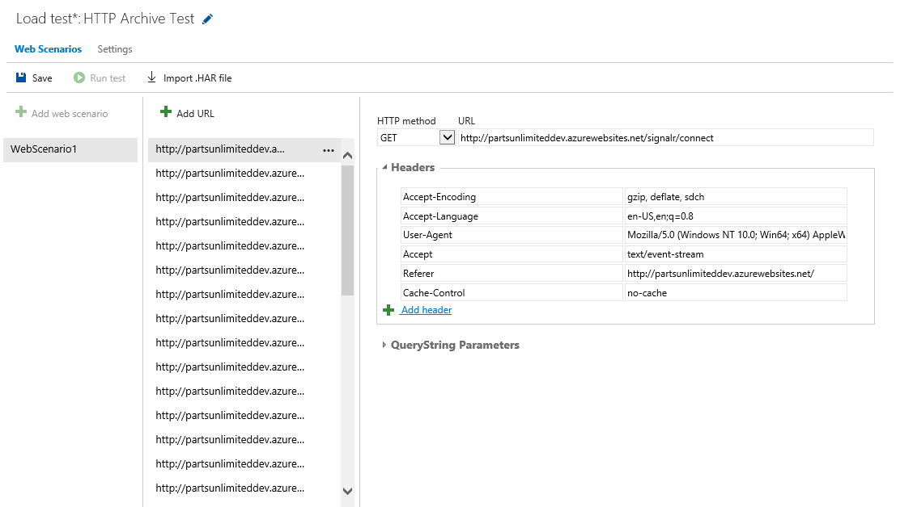
    
 8. Navigate to **Settings** pane and change the test settings if you wish. 
   
    
    
 9. Run the test. You should see the test running **In progress** 
   
    
    
 10. Once the test is completed, you should see the **Summary, Diagnostics etc**
   
    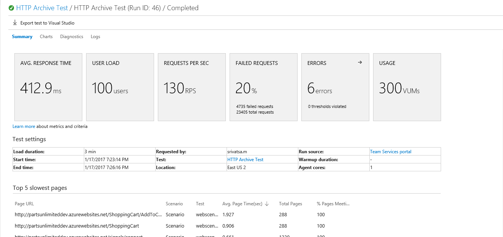
    
    
    
- ###URL based Test

 1. From your **VSTS account**, navigate to **Load Test** pane and Click **New**. Select **URL based Test**.
 
   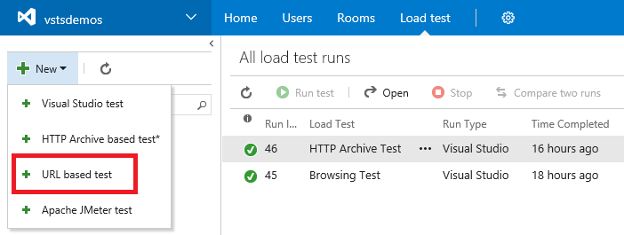
 
 2. Type a name for the load test, and enter the **URL** you want to test in the center column and in the details pane on the right. For a simple load test, leave the **HTTP method set to GET.**
 
   
  
 3. Open the **Settings** tab. Here you can change the parameters of the test such as the **duration, load pattern, number of users, and more**. To run the test near to your users, select a **Load location**. Then choose **Save.**
 
   
  
 4. When you have set up all the **URLs and parameters** for your test, start it by choosing **Run test**.
 
 5. As the test runs, you see live information about the progress of the test.
 
   
  
 6. When your test is done, look at the results to see how well your app performed. For example, you can see an overview of your app's performance in the **Summary tab**. This tab shows all of the main metrics such as **average response time, user load, requests per second, failed requests, any errors that might have occurred, and test usage**.
 
   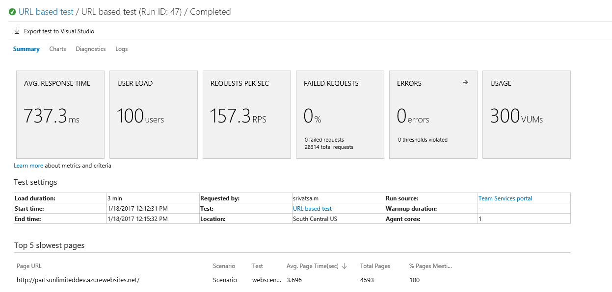
  
  
 7. Open the **Charts** tab to see a graphical representation of the test results over time. The charts show the **average performance, throughput, errors, and the results of each test request**. Hover your mouse pointer over a chart to see more details.
 
   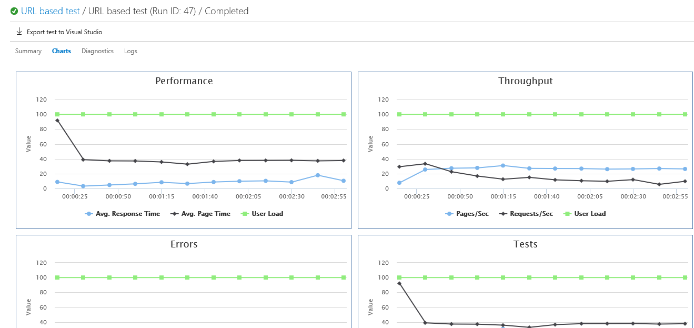
   
 8. Open the **Diagnostics** tab to see detailed information such as a list of errors and status messages.
 
   
