# Web Application Load and Performance Testing
## Overview
In this lab, you will be introduced to the web performance and load testing capabilities provided in Visual Studio Enterprise 2015. You will walk through a scenario using a fictional online storefront where your goal is to model and analyze its performance with a
number of simultaneous users. This will involve the definition of web performance tests that represent users browsing and ordering
products, the definition of a load test based on the web performance  tests, and finally the analysis of the load test results.

### Exercises
This hands-on lab includes the following exercises:
1.  Creating Web Performance Tests
2.  Load Testing
3.  Executing & Analyzing Load Tests

Estimated time to complete this lab: **60 minutes**.

 

## Exercise 1: Creating Web Performance Tests
------------------------------------------

1.  In this exercise, you will setup and execute a basic Web  performance test. This type of test generates HTTP requests and
    records expected responses while measuring response times   and throughput.

#### Task 1: Creating new Web Performance and Load Test Project

1.  Log in as **Adam** (VSALM\\Adam). All user passwords are
    **P2ssw0rd**.

2.  Launch **Visual Studio 2015** from the taskbar.

3.  Select **File |** **New | Project…** from the main menu.

4.  In the **New Project** window, select the **Web Performance and Load
    Test Project** template from **Visual C\# | Test** and then click
    **OK** to create the project.
        

#### Task 2: Recording Web Tests

1.  The new web and load test project is created with default test
    settings and a single web test definition file named
    **WebTest1.webtest**. Click the **Add Recording** button at the top
    of the Web Performance Test Editor to start recording.

    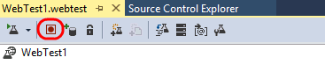

1.  Internet Explorer and the Web Test Recorder should now be open and
    in **Record** mode, which you can verify by looking at the toolbar
    at the top of the recorder window. You can pause, stop, or reset the
    recording at any time.
    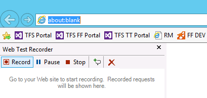

    ````
    **Note**: While the Web Test Recorder is in the Record state,  requests will be recorded complete with “**think time**”. Keep this
    in mind as you record scenarios as you think the average user would - pause on product pages, wait a few seconds to make sure your
    credit card is correct, and so on. We are not just creating this web test to ensure that requests and responses are correct, we will     also use it to do some load testing later on.
    ````

1.  In the next few steps, we will play the part of a customer browsing the site by clicking on a few products and drilling into
    product details. The goal here is to create a profile that represents the typical browsing scenario for the site for a
    single user.

2.  In **Internet Explorer**, click the **Tailspin Toys** button from the favorites bar to launch the Tailspin Toys website. Note that the request is logged in the test recorder.

    

1.  Click **Model Airplanes**.
    

1.  Click **Fourth Coffee Flyer**.

    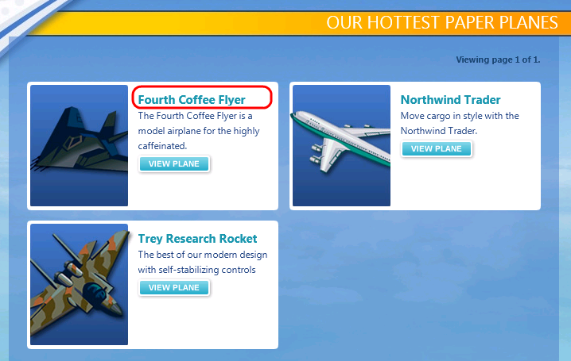

1.  Click the **Trey Research Rocket** link from the “You Might Also Like” section.

    

1.  Click **Stop** from the Web Test Recorder toolbar.
    

#### Task 3: Working with Web Tests in Visual Studio

1.  Once the Web Test Recorder stops recording and returns to Visual Studio, two tasks will commence:

1.  **Dynamic parameters** that could not be identified and extracted during the recording will be identified. Examples of dynamic
parameters include cookie values, ASP.NET view state, query string parameters, and post parameters. Extracting dynamic parameters when they are first used will allow the test to be run at any time in the future and therefore we will be able to utilize them as part of a
load test.

    The recorded web performance test will run and display results.

1.  Take a moment to view the recorded web requests and see that query string parameters were automatically extracted. Visual
Studio will also look for and extract hidden HTML fields and form post parameters.
    
    ````
    **Note:** There are two types of rules that can be applied to the response to each HTTP request, validation and extraction.
    **Validation rules** can be used to verify that pages have specific text, tags, attributes, or form fields on them.
    **Extraction rules** can be used to store results in the test context as name value pairs – and these rules can extract form fields, text, attributes, headers, regular expressions, and hidden fields.
    ````
Although it is out of the scope of this lab to dig into other Web performance test features, it is worth pointing a few of them out.

## Other Web Performance Test Features                                           

1.  Convert a recorded Web performance test into a coded Web performance test 
                                                                                
     > Add reporting names to clarify identification of Web requests            
                                                                                
     > Customize test with artificial think times                               
                                                                                
     > Configure the permitted response time for a Web page                     
                                                                                
     > Add a data source to bind to HTTP requests (database, XML, CSV)          
                                                                                
     > Customize execution by using loops, branching, and transactions          
                                                                                
     > Configure credentials for test (basic or Integrated Windows)             |

1.  

<!-- -->

1.  In **Solution Explorer**, **right-click** on **WebTest1.webtest**
    and select **Rename** to change the name to “Browsing.webtest”. This
    will make it easier to keep track of the scenario that we recorded.

<!-- -->

1.  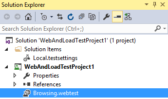

<!-- -->

1.  Figure 10

<!-- -->

1.  Updated web test name

<!-- -->

1.  

<!-- -->

1.  Let’s take a look at the recorded think times to make sure they
    are appropriate. Click the **Set Request Details** button from the
    toolbar to open the Request Details window.

<!-- -->

1.  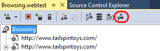

<!-- -->

1.  Figure 11

<!-- -->

1.  Location of Set Request Details button

<!-- -->

1.  

<!-- -->

1.  The **Request Details** window shows a grid containing all requests
    along with a reporting name, think time (in seconds), and response
    time goals (in seconds). For the purpose of this lab, make sure that
    the sum of all think times is no more than about 15 seconds. This
    will help ensure that we can get good results when we create a load
    test later on. Click **OK** to continue if you made any changes.

<!-- -->

1.  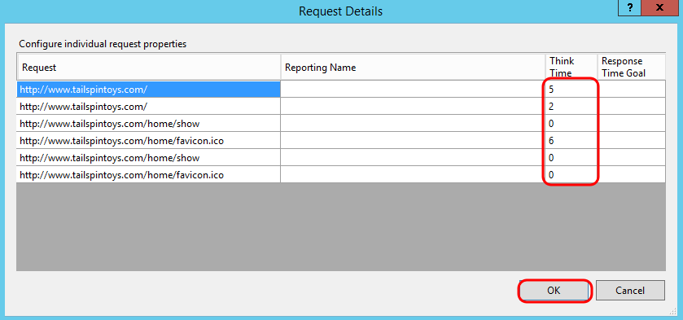

<!-- -->

1.  Figure 12

<!-- -->

1.  Request Details window

<!-- -->

1.  

<!-- -->

1.  

#### <span id="_Toc429734164" class="anchor"><span id="_Toc430858556" class="anchor"></span></span>Task 4: Recording an Additional Web Test Scenario

1.  Now let’s add in another web test to represent a customer that
    browses and purchases a product from the Tailspin Toys website.
    Select **Project | Add Web Performance Test** from the main menu in
    Visual Studio. We could have created a single web test that included
    both the browsing and buying scenario, but composing the tests in
    this fashion will make constructing a realistic load test easier
    later on.

2.  Navigate to **Tailspin Toys** and click **Paper Airplanes**.

<!-- -->

1.  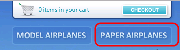

<!-- -->

1.  Figure 13

<!-- -->

1.  Clicking Paper Airplanes

<!-- -->

1.  

<!-- -->

1.  Click **Wingtip Toys Stunt Plane**.

<!-- -->

1.  

<!-- -->

1.  Figure 14

<!-- -->

1.  Clicking Wingtip Toys Stunt Plane

<!-- -->

1.  

<!-- -->

1.  Click **Add To Cart**.

<!-- -->

1.  

<!-- -->

1.  Figure 15

<!-- -->

1.  Adding product to cart

<!-- -->

1.  

<!-- -->

1.  Click **Checkout**.

<!-- -->

1.  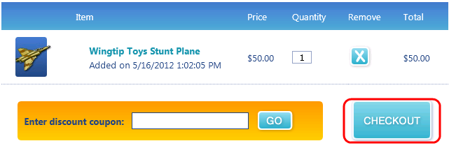

<!-- -->

1.  Figure 16

<!-- -->

1.  Check out

<!-- -->

1.  

<!-- -->

1.  Fill out the order form with some test data and then click **Review
    Order**.

<!-- -->

1.  

<!-- -->

1.  Figure 17

<!-- -->

1.  Entering address information

<!-- -->

1.  

<!-- -->

1.  Click **Place Order**.

<!-- -->

1.  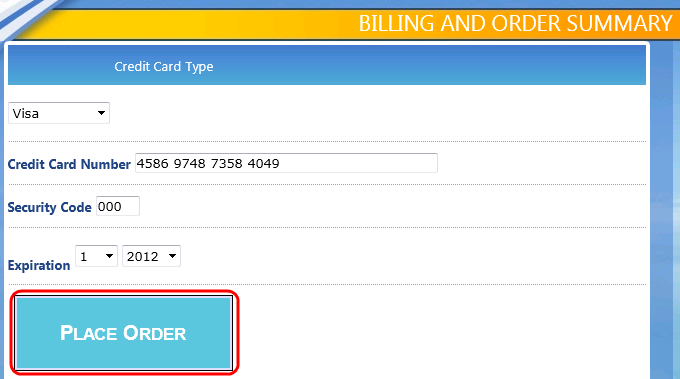

<!-- -->

1.  Figure 18

<!-- -->

1.  Placing the order

<!-- -->

1.  

<!-- -->

1.  After placing the order, you should see the receipt page. Click the
    **Stop** button in the Web Test Recorder to return to Visual Studio.

2.  In Solution Explorer, **right-click** on **WebTest1.webtest** and
    select **Rename** to change the name to “Buying.webtest”.

<!-- -->

1.  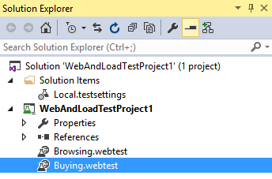

<!-- -->

1.  Figure 19

<!-- -->

1.  Updated web test name

<!-- -->

1.  

<!-- -->

1.  Load the **Test Results** window and note that the test run that was
    automatically kicked off ended up failing. **Double-click** the test
    run to view the test result details.

<!-- -->

1.  

<!-- -->

1.  Figure 20

<!-- -->

1.  Viewing test result details

<!-- -->

1.  

<!-- -->

1.  The **Test Result Details** window shows the sequential list of HTTP
    requests, responses, some Visual Studio test context, and
    other details. Take a few minutes to familiarize yourself with the
    information available here.

<!-- -->

1.  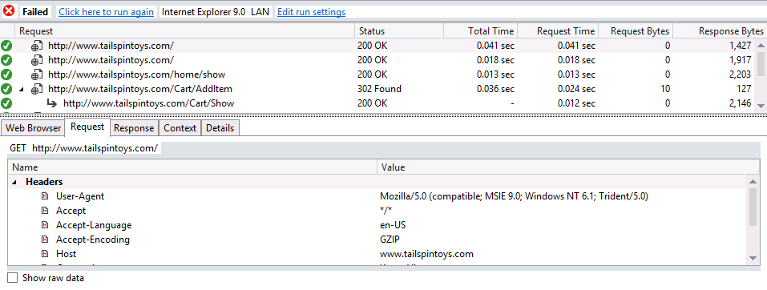

<!-- -->

1.  Figure 21

<!-- -->

1.  Test Result Details window showing test run results

<!-- -->

1.  

<!-- -->

1.  Scroll down to the request that shows where the web performance test
    failed and select it. Note that the returned status code is a
    **200** and the **Request and Response** tabs look fine.

<!-- -->

1.  

<!-- -->

1.  Figure 22

<!-- -->

1.  Response to order placement shows failure even though we have HTTP
    200

<!-- -->

1.  

<!-- -->

1.  If you click on the **Details** tab, you will see that the test
    failed because a **Response URL Validation** rule was expecting to
    see the same response URL that was recorded during the Web Test
    definition (and that included a unique order number).

<!-- -->

1.  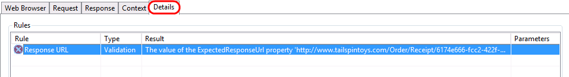

<!-- -->

1.  Figure 23

<!-- -->

1.  Details tab showing reason for failure

<!-- -->

1.  

<!-- -->

1.  Close the test result details window to return to the **Buying** web
    test in the editor.

2.  Now that we understand why the web test failed, we can make a
    modification so that it will succeed and still give us a good test
    representing a user browsing for and ordering a product. Scroll down
    to the **Validation Rules** node and locate the **Response URL**
    validation rule.

<!-- -->

1.  

<!-- -->

1.  Figure 24

<!-- -->

1.  Location of Response URL validation rule

<!-- -->

1.  

<!-- -->

1.  **Right-click** on the **Response URL** and select the
    **Delete** option.

<!-- -->

1.  

<!-- -->

1.  Figure 25

<!-- -->

1.  Deleting the Response URL validation rule

<!-- -->

1.  

<!-- -->

1.  Before we verify that removing the Response URL validation rule
    fixed the problem, let’s take a look at the recorded think times to
    make sure they are appropriate. Click the **Set Request Details**
    button from the toolbar to open the Request Details window.

<!-- -->

1.  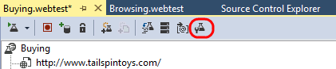

<!-- -->

1.  Figure 26

<!-- -->

1.  Location of Set Request Details button

<!-- -->

1.  

<!-- -->

1.  For the purpose of this lab, make sure that the sum of all think
    times are no more than about 30 seconds. This will help ensure that
    we can get good results when we create a load test later on. Click
    **OK** to continue if you made any changes.

<!-- -->

1.  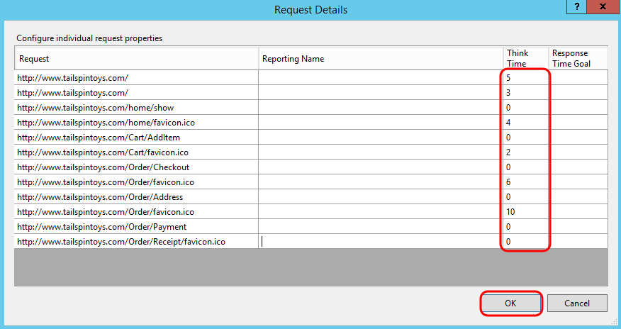

<!-- -->

1.  Figure 27

<!-- -->

1.  Request Details window

<!-- -->

1.  

<!-- -->

1.  **Run** the **Buying** web test again to make sure that it passes.

<!-- -->

1.  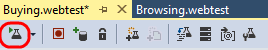

<!-- -->

1.  Figure 28

<!-- -->

1.  Location of Run Test button

<!-- -->

1.  

<!-- -->

1.  **Note:** By default, web performance tests will run without taking
    into consideration think times, although it can be configured in the
    test settings if desired.

<!-- -->

1.  

<!-- -->

1.  The web test results should now show green checkmarks next to
    each step.

<!-- -->

1.  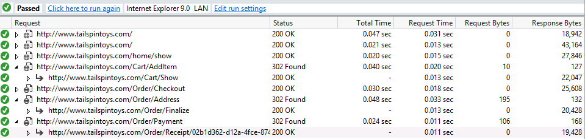

<!-- -->

1.  Figure 29

<!-- -->

1.  All web test requests passed

<!-- -->

1.  

<!-- -->

1.  Close the test results window.

2.  

<!-- -->

1.  In this exercise, you will use the web performance tests that you
    created in the previous exercise as the basis of a load test.
    Building one or more web performance tests that accurately reflect a
    user scenario is critical to the foundation of a useful load test.
    To create a load test we will define user load, specify the web
    performance tests to use, the type of network and browser simulation
    to use, and the performance counters and other metrics that we want
    to collect for the duration of the test.

<!-- -->

1.  Select **Project | Add Load Test** from the main menu in
    Visual Studio.

2.  In the **New Load Test Wizard**, select **On-premise Load Test** and
    click **Next** to start defining the load test scenario.

<!-- -->

1.  

<!-- -->

1.  Figure 30

<!-- -->

1.  New Load Test Wizard walks you through common setup options

<!-- -->

1.  

<!-- -->

1.  The **Run Settings** for a load test allow you to specify how long
    the test should run using either time duration or a specific number
    of test iterations. We will use a **time duration**, but change it
    to **1** minute for demonstration purposes. The default sampling
    rate of 5 seconds is fine here, and it is a good choice in general
    for shorter test runs. If you want to run longer tests, consider
    sampling less often as it will generate a lot less data to store in
    the load test database. Click **Next** to continue.

    

2.  Enter a name for the scenario like “**BrowseAndOrderProduct**” but
    leave the default think time profile in place. The default uses the
    think times of the web performance tests as a median value with a
    normal distribution used to generate some variation. The goal is a
    more realistic generation of load on the web site.

3.  Click the **Next** button to continue on to the Load Pattern
    definition screen.

<!-- -->

1.  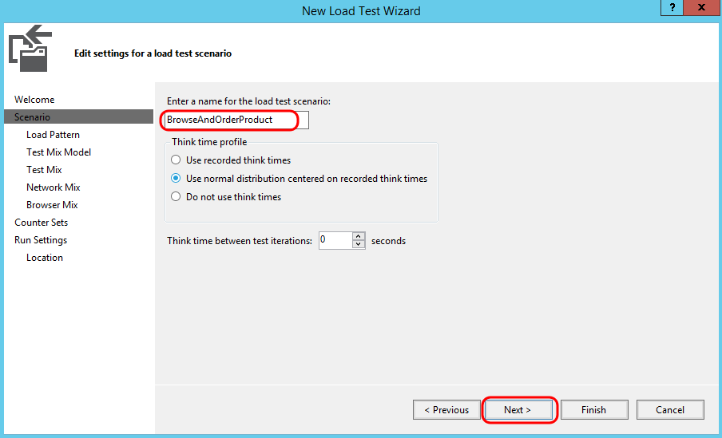

<!-- -->

1.  Figure 31

<!-- -->

1.  Starting to add scenario definition for load test

<!-- -->

1.  

<!-- -->

1.  Use the **Constant** load option (the default) for this load test,
    but change the **User Count** to **5** users since we are operating
    within a virtual machine. It is important to keep the simulated user
    count low enough such that the machine has enough resources to
    properly run IIS and the load test on the same machine. Depending
    upon the web site under test, using a step load to ramp up usage of
    the web site may be more realistic, but it also requires longer
    test runs.

<!-- -->

1.  

<!-- -->

1.  **Note:** The limit on the number of virtual users that you can use
    in your load tests was removed in Visual Studio Ultimate 2012
    (and above). You no longer have to purchase virtual user licenses to
    increase the number of virtual users that you can use in your
    load tests. The Visual Studio Ultimate Trial license, however, does
    limit you to 25 virtual users and only allows local tests.

<!-- -->

1.  

<!-- -->

1.  Click **Next** to continue on to the Test Mix Model
    definition screen.

<!-- -->

1.  

<!-- -->

1.  Figure 32

<!-- -->

1.  Setting up a constant virtual user load to run for duration of load
    test

<!-- -->

1.  

<!-- -->

1.  Read the description of each test mix model by clicking on it and
    viewing the description that appears on the right-hand side.

<!-- -->

1.  

<!-- -->

1.  Figure 33

<!-- -->

1.  Defining test mix model

<!-- -->

1.  

<!-- -->

1.  Let’s say that our current production site gives us some indication
    of the percentage of browsing users that end up making purchases.
    Select the first option that models the test mix **based on the
    total number of tests** and then click **Next** to continue on to
    the Test Mix screen.

<!-- -->

1.  

<!-- -->

1.  Figure 34

<!-- -->

1.  Defining test mix model

<!-- -->

1.  

<!-- -->

1.  Click **Add** to load the Add Tests window.

<!-- -->

1.  

<!-- -->

1.  Figure 35

<!-- -->

1.  Adding tests to the mix

<!-- -->

1.  

<!-- -->

1.  Select **both tests**, add them to the test mix, and then click
    **OK**.

<!-- -->

1.  

<!-- -->

1.  Figure 36

<!-- -->

1.  Adding tests to the mix

<!-- -->

1.  

<!-- -->

1.  **Note:** Load tests can include a mix of coded UI tests, web
    performance tests, and even other test types such as unit tests. It
    is important to note that for coded UI tests, you need one virtual
    or physical machine per user that you are simulating since it
    assumes that it has control over the entire user interface.

<!-- -->

1.  

<!-- -->

1.  Let’s say that our production logs tell us that 25% of users
    browsing the site end up buying something. Change the
    **Distribution** to reflect this knowledge and then click **Next**
    to continue on to the Network Mix screen.

<!-- -->

1.  

<!-- -->

1.  Figure 37

<!-- -->

1.  Defining test mix

<!-- -->

1.  

<!-- -->

1.  The **Network Mix** screen allows you to choose one or more network
    types and specify the distribution of those types across the tests
    to be executed by the virtual users. Select the **Network Type**
    dropdown to see the available options.

<!-- -->

1.  

<!-- -->

1.  Figure 38

<!-- -->

1.  Network Type options

<!-- -->

1.  

<!-- -->

1.  For the purpose of this lab, leave the default Network Type of
    **LAN** in place and click **Next** to continue on to the Browser
    Mix screen.

<!-- -->

1.  

<!-- -->

1.  Figure 39

<!-- -->

1.  Defining network mix for load test

<!-- -->

1.  

<!-- -->

1.  **Note:** Network emulation will not work when operating within this
    virtual machine environment because the URL under test loops back
    to localhost.

<!-- -->

1.  

<!-- -->

1.  The **Browser Mix** screen allows you to specify one or more browser
    types and specify the distribution of those types across the tests
    to be executed by the virtual users. Just like the network mix, this
    allows us to more realistically model how the users interact with
    the web site. For the purpose of this exercise leave the default at
    100% Internet Explorer 9.0 and click **Next** to continue on to the
    Counter Sets screen.

<!-- -->

1.  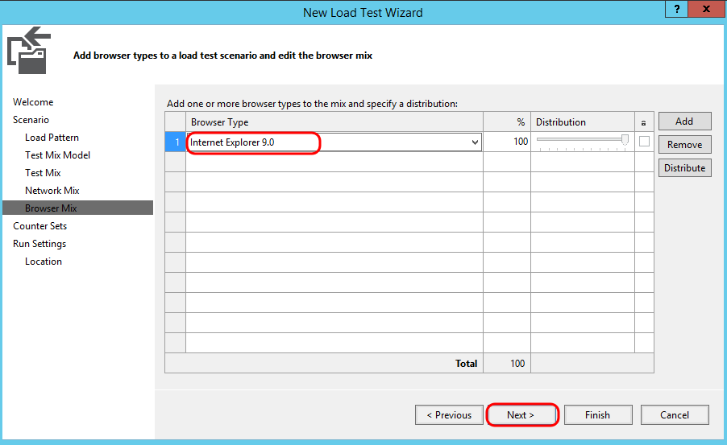

<!-- -->

1.  Figure 40

<!-- -->

1.  Defining browser mix for load test

<!-- -->

1.  

<!-- -->

1.  The **Counter Sets** screen allows you to specify the computers and
    counter sets from which to gather performance counters during the
    load test. Click the **Add Computer** button and type ‘**VSALM’**
    for the computer name.

2.  Select the **ASP.NET** and **SQL** counter sets to monitor since we
    are load testing a website. Note that **Controller Computer** and
    **Agent Computers** collect some data by default, and that both of
    these represent the same machine in this case. Once the counter sets
    have been set click **Finish** to save the configuration.

<!-- -->

1.  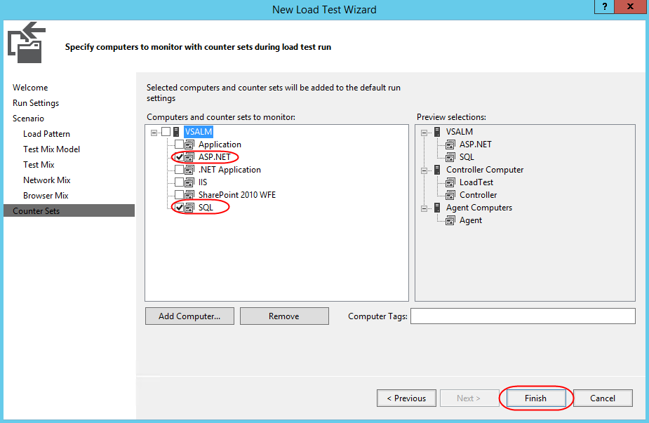

<!-- -->

1.  

<!-- -->

1.  **Note:** It is possible to modify or add counter sets to be used
    during load tests by working directly with the *.CounterSet* XML
    files located in the **%programfiles(x86)%\\Microsoft Visual Studio
    14.0\\Common7\\IDE\\Templates\\LoadTest\\CounterSets** directory.
    The **LoadTest** directory also contains network and
    browser definitions.

<!-- -->

1.  Let’s take a quick look at the test settings file. In Solution
    Explorer, **double-click** on the **Local.testsettings** file.

<!-- -->

1.  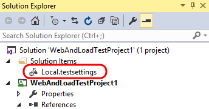

<!-- -->

1.  Figure 43

<!-- -->

1.  Loading test settings

<!-- -->

1.  

<!-- -->

1.  Note that you could perform test runs using [Visual Studio
    Online](http://www.visualstudio.com/en-us/get-started/load-test-your-app-vs),
    but for the purposes of this lab, we will run them locally. Select
    the “**Run tests using local computer or a test controller**” option
    if not already selected.

<!-- -->

1.  

<!-- -->

1.  Figure 44

<!-- -->

1.  Load testing using Visual Studio Online

<!-- -->

1.  

<!-- -->

1.  In the **Test Settings** window, select the **Data and Diagnostics**
    option to see the available adapters. Options include an ASP.NET
    Profiler, Event Log, IntelliTrace, Network Emulation, and more. No
    adapters are selected by default in part because many of them have a
    significant impact on the machines under test and can generate a
    large amount of data to be stored over the course of long
    load tests.

<!-- -->

1.  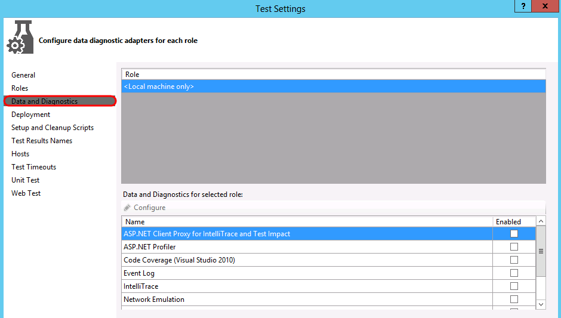

<!-- -->

1.  Figure 45

<!-- -->

1.  Data diagnostic adapters

<!-- -->

1.  

<!-- -->

1.  **Close** the **Test Settings** window and click **Yes** to save
    changes if asked.

<!-- -->

1.  In this exercise, you will execute the load test that you defined in
    the previous exercise and analyze the results.

#### <span id="_Toc429734167" class="anchor"><span id="_Toc430858559" class="anchor"></span></span>Task 1: Configuring Test Controller

1.  Open the load test that you defined in the previous exercise by
    **double-clicking** on it in **Solution Explorer** if necessary.

<!-- -->

1.  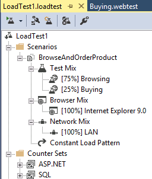

<!-- -->

1.  Figure 46

<!-- -->

1.  Load test definition

<!-- -->

1.  

<!-- -->

1.  Click the **Manage Test Controllers** button in the Load Test
    Editor toolbar.

<!-- -->

1.  

<!-- -->

1.  Figure 47

<!-- -->

1.  Manage Test Controllers button

<!-- -->

1.  

<!-- -->

1.  Note that the selected **Controller** is set to **&lt;Local – No
    controller&gt;**. Click the **ellipses** button to setup the
    connection string to the load test results store.

<!-- -->

1.  

<!-- -->

1.  Figure 48

<!-- -->

1.  Manage Test Controller window

<!-- -->

1.  

<!-- -->

1.  In the **Connection Properties** window use a Server Name of
    **VSALM**, use **Windows Authentication**, and use the default
    database name. Once you have the database connection properties in
    place, click **OK** to save.

<!-- -->

1.  

<!-- -->

1.  Figure 49

<!-- -->

1.  Setting connection properties to load test database for test
    controller

<!-- -->

1.  

<!-- -->

1.  Click **Close** to exit out of the Manage Test Controller window.

2.  

#### <span id="_Toc429734168" class="anchor"><span id="_Toc430858560" class="anchor"></span></span>Task 2: Executing and Monitoring Load Test

1.  Start the load test by clicking the **Run Test** button from
    the toolbar.

<!-- -->

1.  

<!-- -->

1.  Figure 50

<!-- -->

1.  Location of Run Test button

<!-- -->

1.  

<!-- -->

1.  Once the load test initializes and starts a 1-minute test run, the
    load test results window will load with the **Graphs** view visible.
    By default, you should see four panels showing some key statistics,
    with some key performance counters listed below that. Data is
    sampled every 5 seconds by default, but that can be changed in the
    load test settings.

<!-- -->

1.  

<!-- -->

1.  Figure 51

<!-- -->

1.  Load test results window showing KPIs during load test run

<!-- -->

1.  

<!-- -->

1.  **Note:** Screenshots showing statistics and graphs may vary widely
    from those that you see during your walkthrough of this lab. This is
    due primarily to the different hardware that you are running this
    virtual machine on. In addition, you may see some threshold
    violations that result from the VM being busy during test. In a real
    world situation, and especially one in which you want to drive more
    virtual users, you would probably best be served by using multiple
    machines during test; not only to generate the load but also for
    each component of your system as it will be deployed in production.

<!-- -->

1.  

<!-- -->

1.  

#### <span id="_Toc429734169" class="anchor"><span id="_Toc430858561" class="anchor"></span></span>Task 3: Viewing Load Test Results

1.  After the load test run finishes, it will automatically switch to
    the Summary view. The **Summary** view shows overall aggregate
    values and other key information about the test. Note that the
    hyperlinks to specific pages open up even more details in the
    **Tables** view.

<!-- -->

1.  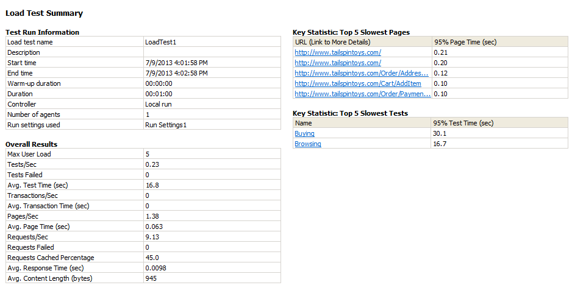

<!-- -->

1.  Figure 52

<!-- -->

1.  Summary view for load test results

<!-- -->

1.  

<!-- -->

1.  Switch to the Graphs view by clicking on the **Graphs** button in
    the toolbar.

<!-- -->

1.  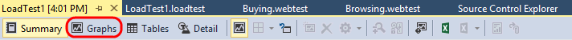

<!-- -->

1.  Figure 53

<!-- -->

1.  Graphs button

<!-- -->

1.  

<!-- -->

1.  Note that you can manipulate the graphs that you view. Select the
    **panels** drop down control in the toolbar and select the **Two
    Horizontal Panels** option.

<!-- -->

1.  

<!-- -->

1.  Figure 54

<!-- -->

1.  Customizing the graph view

<!-- -->

1.  

<!-- -->

1.  By default, the top graph will show **Key Indicators** and the
    bottom graph will show **Page Response Time**. Two very important
    sets of data for any web application.

<!-- -->

1.  

<!-- -->

1.  Figure 55

<!-- -->

1.  Graphs showing Key Indicators and Page Response Time

<!-- -->

1.  

<!-- -->

1.  Click on one of the **Key Indicator** graph lines or data points so
    select it. This will also highlight the counter that it is
    associated with below the graphs. The red line from the screenshot
    below represents the **User Load** at different points during the
    load test. It is always equal to **5** as we configured it to be.

<!-- -->

1.  

<!-- -->

1.  Figure 56

<!-- -->

1.  User Load data selected

<!-- -->

1.  

<!-- -->

1.  Click on the **Pages/Sec** row from the **Key Indicators** section
    of the counter grid to highlight it in the graph. In the screenshot
    shown below we can see that the average number of pages per second
    over the duration of the test was 1.38 (this may vary for you).

<!-- -->

1.  

<!-- -->

1.  Figure 57

<!-- -->

1.  Viewing counter data

<!-- -->

1.  

<!-- -->

1.  

#### <span id="_Toc429734170" class="anchor"><span id="_Toc430858562" class="anchor"></span></span>Task 4: Generating and Viewing Load Test Trend Reports

1.  Even though the initial load test may result in some numbers that
    don’t seem to provide a wealth of information it does provide a good
    baseline and allows us to make relative measures between test runs
    to help measure performance impacts of code changes. For example, if
    we had seen a relatively high level of batch requests per second
    during our initial load tests, perhaps that could be addressed by
    adding in some additional caching, and then re-testing to make sure
    that the request per second goes down.

2.  **Run** the load test one more time so that we have at least two
    test results to work with so that we can see how to perform some
    trend analysis.

3.  When the second load test is complete, click the **Create Excel
    Report** button from the toolbar to load Excel.

<!-- -->

1.  

<!-- -->

1.  Figure 58

<!-- -->

1.  Create Excel Report button

<!-- -->

1.  

<!-- -->

1.  In the **Generate a Load Test Report** window within Excel make sure
    that the **Create a report** option is selected and then click
    **Next** to continue.

<!-- -->

1.  

<!-- -->

1.  Figure 59

<!-- -->

1.  Creating a new load test report

<!-- -->

1.  

<!-- -->

1.  When prompted for the type of report to generate, select **Trend**
    and click **Next**.

<!-- -->

1.  

<!-- -->

1.  Figure 60

<!-- -->

1.  Selecting the Trend report type

<!-- -->

1.  

<!-- -->

1.  For **Report Name**, enter “**LoadTestTrend**” and click **Next**
    to continue.

<!-- -->

1.  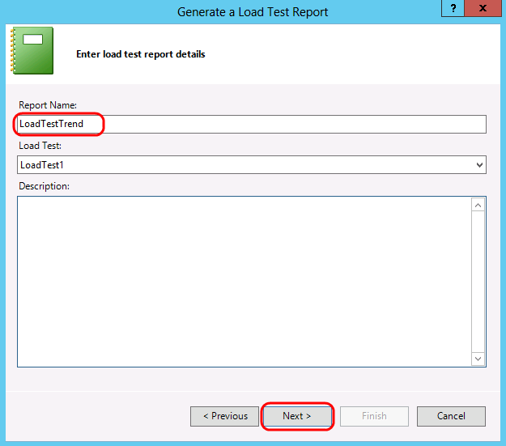

<!-- -->

1.  Figure 61

<!-- -->

1.  Naming the Trend report

<!-- -->

1.  

<!-- -->

1.  Select at least two load test runs to generate the trend report and
    then click **Next** to continue.

<!-- -->

1.  

<!-- -->

1.  Figure 62

<!-- -->

1.  Selecting test runs to generate trend report

<!-- -->

1.  

<!-- -->

1.  When prompted for counters to add to the report note that there will
    be a number of pre-selected defaults. Leave those defaults in place
    and click **Finish** to generate the report.

<!-- -->

1.  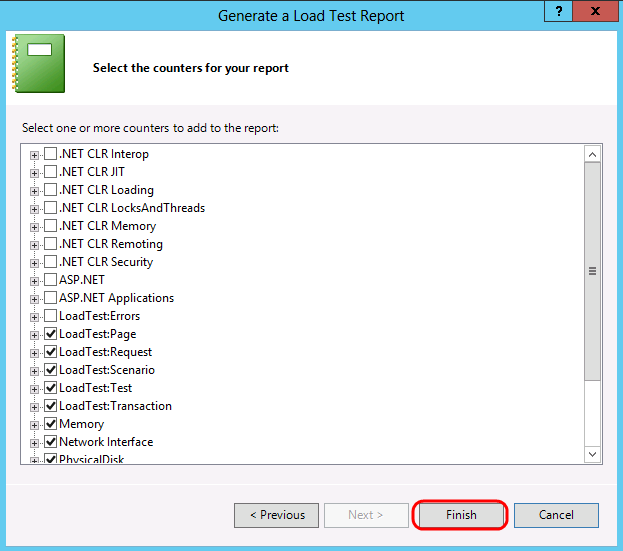

<!-- -->

1.  Figure 63

<!-- -->

1.  Selecting performance counters

<!-- -->

1.  

<!-- -->

1.  After the report is generated a table of contents will be displayed
    that provides hyperlinks to specific report sheets. Click the **Avg.
    Page Time** link.

<!-- -->

1.  

<!-- -->

1.  Figure 64

<!-- -->

1.  Table of contents for generated trend report

<!-- -->

1.  

<!-- -->

1.  The **Avg. Page Time** graph shows the average page time taken over
    the entire load test for each test run that you selected for
    trend analysis. The page time is a measure that includes all
    requests that were made for a web page so it is a useful performance
    indicator to measure. Since we did not make any modifications to the
    application under test we do not expect to see significant
    differences between the test runs.

<!-- -->

1.  

<!-- -->

1.  Figure 65

<!-- -->

1.  Avg. Page Time graph

<!-- -->

1.  

<!-- -->

1.  
