## Introduction

If you are in a job of developing or deploying the application, you’ve probably heard of Jenkins, a Continuous Integration (CI) server for automating software builds and deployments. Jenkins is extremely versatile and comes with lots of plugins that allow easy integration with many different platforms and source code management systems.

## Architecture and Workflow

The lab guides you in forking a copy of an existing project from Microsoft GitHub repository to your own GitHub repository; import the code into IntelliJ IDE. You will then change the code in the IDE and commit the code to your GitHub repository. The changes are polled by the Jenkins server and a CI build is triggered. 

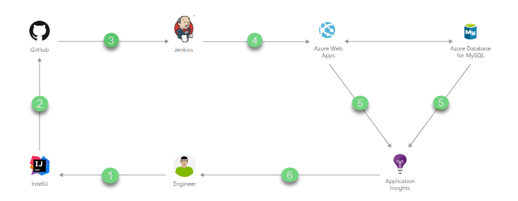
    
Jenkins then deploys the Java application to an Azure Web App which is backed by Azure database for MYSQL. Once the application is accessed, its performance metrics are captured with Azure Application Insights and is monitored continuously to improve its performance.

## What's covered in this lab

In this lab, you will learn how to set up import a public repository from Microsoft GitHub account, build the code in Jenkins and deploy the changes automatically on Azure Web App

- Install and configure Jenkins
- Fork a Microsoft GitHub repository to your GitHub account
- Configure GitHub webhook to notify changes to Jenkins
- Import code into IntelliJ and commit code to trigger a build job

## Before you begin

1. You should have a [GitHub](https://github.com/) account.

1. [Putty](https://www.putty.org/), a free SSH and Telnet client.

1. Follow the [Setting up Jenkins](https://www.azuredevopslabs.com/labs/vstsextend/jenkins/) 
exercise to set up and configure Jenkins server on Azure.

1. Download and install the Ultimate Trial edition of [IntelliJ IDEA](https://www.jetbrains.com/idea/download/download-thanks.html) on your machine.

1. **Microsoft Azure Account**: You will need a valid and active Azure account for the Azure labs. If you do not have one, you can sign up for a [free trial](https://azure.microsoft.com/en-us/free/).

1. Create an **[Azure Web App with MYSQL database](https://portal.azure.com/#create/Microsoft.WebSiteMySQLDatabase)**. While configuring the Database blade, replace the **Database name** value with **hotel_coupon** and enable **Application Insights**. Once created, access the created **Azure MYSQL database** resource and note down the following parameters' values from its **Properties** section -

    1. SERVER NAME
    1. SERVER ADMIN LOGIN NAME

    1. PASSWORD - The password that is provided in the **Database Server** during the creation.

    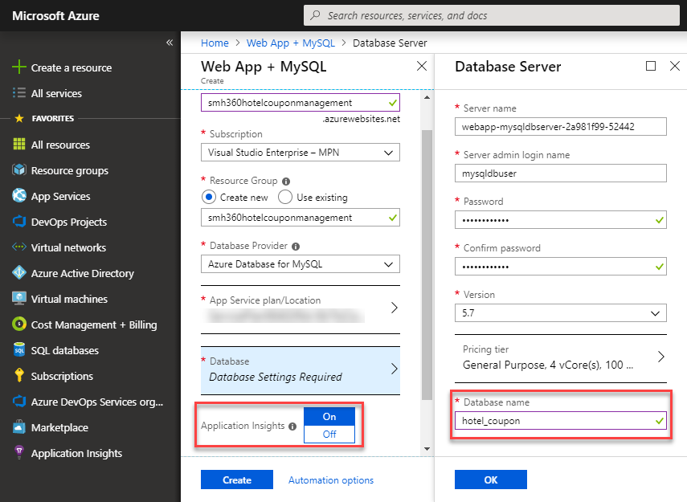

## Exercise 1: Configure Jenkins Plugins

Now that the Jenkins server is configured for use, let's install and configure the plugins required for the lab. There are 3 plugins - *Maven Integration*, *Azure Credential plugin* and *Azure App Service* that are required for the lab. **Maven Integration** plugin helps to build projects that use Apache Maven in Jenkins. **Azure App Service** plugin provides Jenkins native capability to continuously deploy to Azure Web Apps.**Azure Credential plugin** is required to add Azure Service Principal in the Jenkins server.

1. Access the Jenkins server, click **Manage Jenkins** on the home page and then choose **Manage Plugins**. Select the **Available** tab and search for `maven-plugin`. 

    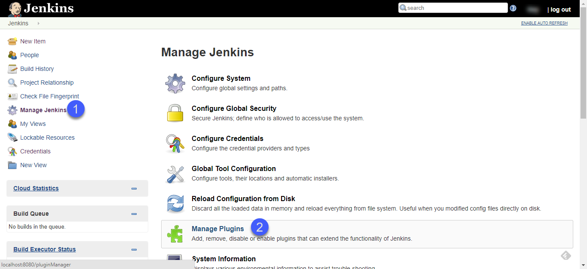

1. Select the **Maven Integration plugin** and select the **Install without restart** button to install the plugin.

    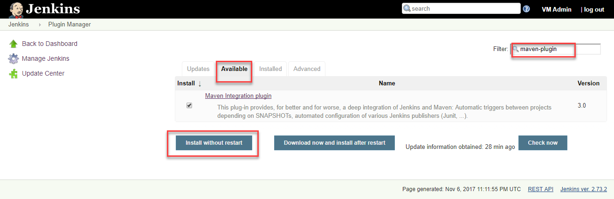

1. Next, search for `Azure App Service Plugin` and install the plugin with **Install without restart** button, if not already installed.

1. Search for `Azure Credential plugin` and repeat the previous steps to install the plugin.

1. Once the plugin is installed, go back to **Manage Jenkins** and select the **Global Tool Configuration** option.

    

1. To install Maven, select the **Install automatically** option and select the **Apply** button. The latest version of Maven at the time of writing this lab is 3.5.4

   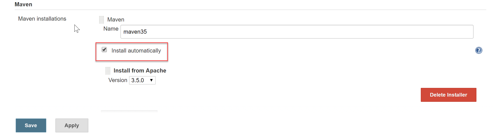

1. Select the *Back to Dashboard* button to return to the home page.

## Exercise 2: Configure Azure Service Principal in Jenkins

### Task 1 - Generate Azure Service Principal

An **Azure Service Principal** is required to create a connection to the provisioned Azure Web App from Jenkins for the application deployment. An Azure Service Principal is like a user identity with a specific role and specific permissions to access your resources in Azure.

1. Navigate to your Azure Portal and launch the **Cloud Shell** from the top navigation. Choose **Bash** as the storage for cloud shell to operate.

    

1. In the Cloud Shell, run the below command - 

    > az ad sp create-for-rbac --name "username" --password "password".  
     Replace the **username** and **password** with your own values.

1. Azure responds with a JSON that resembles the below image. You will use the values from this JSON to add the Azure Service Principal to Jenkins using the Azure Credential plugin. Copy the file content to a notepad which will be used in the next exercise.

    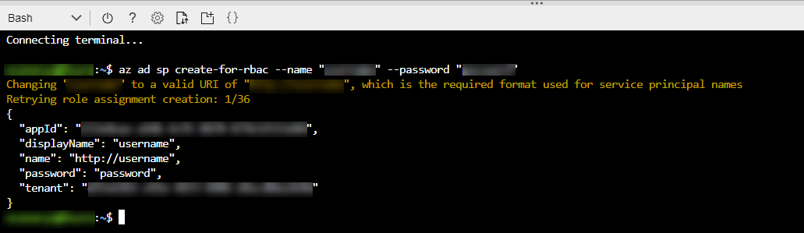

### Task 2 - Add Azure Service Principal to Jenkins

Now that the **Azure Service Principal** values are generated, you need to configure Jenkins with these values.

1. Select **Credentials** in the Jenkins server.

1. Select **System**, choose **Global credentials(unrestricted)** and then click **Add Credentials**.

    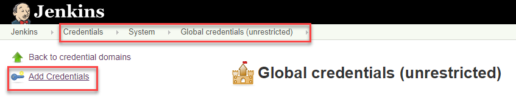

1. In the Add Credentials dialog, select **Microsoft Azure Service Principal** from the **Kind** drop-down.

1. Enter your **Subscription ID**, Use the **appId** value for **Client ID**, **password** value for **Client Secret**, and **tenant** value for **Tenant ID**. Provide a value for **ID** and click **Verify the service principal** to authenticate the values.

    

## Exercise 3:  Fork code in GitHub and configure Webhook to notify changes to Jenkins

Now that the Jenkins is ready to use, let us fork a project from the Microsoft GitHub repository to your GitHub repository. Once the repository is forked, you will create a webhook to notify Jenkins to trigger a CI build whenever there is a commit on your GitHub repository.

1. Sign-in to your GitHub account.

1. Navigate to the Microsoft's public **[ SmartHotel360-CouponManagement](https://github.com/Microsoft/SmartHotel360-CouponManagement)**  GitHub repository. Click the *Fork* button to create a personal copy of the project into your repository. 

    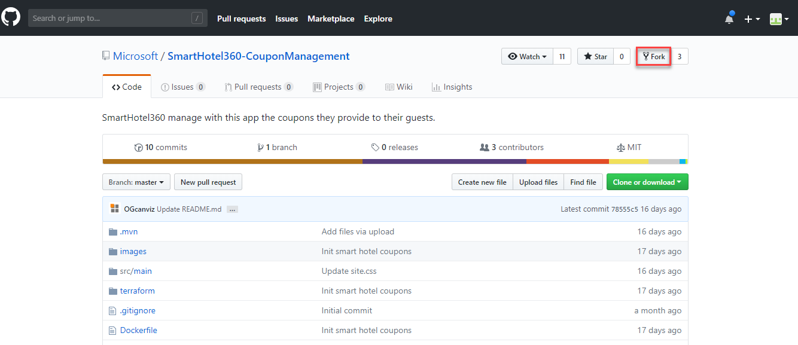

1. Once forked, it automatically takes you to your GitHub repository. Click **Settings** to see a list of options available for the repository.

    

1. Choose **Webhooks** and click **Add webhook**.

    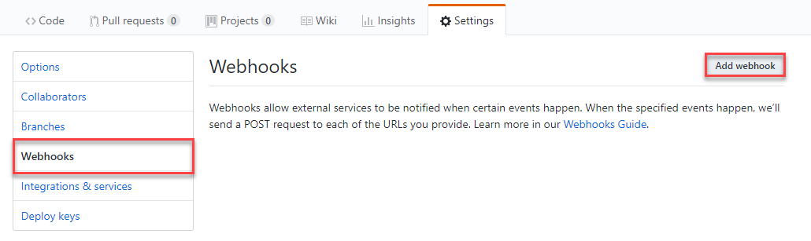

1. In the webhook details frame, provide values for the below parameters -

      1. Payload URL - DNS name of your Jenkins Azure VM 
        (**{name}.{location}.cloudapp.azure.com**)

      1. Content type - Select **application/json**

      1. Which events would you like to trigger this webhook? - Select **Just the push event**.

      1. Check the **Active** checkbox to have the webhook in Active mode.

      1. Click **Add webhook** button to save the changes.

    

1. Once the changes are saved, you will see a success message on the page and the changes are tested with a ping to the Jenkins server. 
    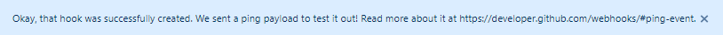

1. If the test succeeds, you will see a *green tick* next to the created webhook in the same change.

    

1. Jenkins will now receive push notifications for your repository, and related builds will be automatically triggered.

## Exercise 4: Configure Azure Web App and Azure MYSQL database connection 

After provisioning the Azure Web App and MYSQL database on the Azure portal, you have to configure the application's connection strings to point to the  Azure MYSQL database in order to pull the data.

1. Click open the created *Azure Web App* on the Azure portal and click **Application settings** in the app's blade.

    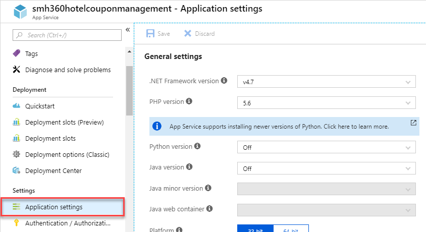

1. Since this is a Tomcat-based Java application, you have to change the settings of the Azure Web App to Java which otherwise is defaulted to .NET framework. Change the following values - 

    1. Java version  - `Java 8`

    1. Java minor version - `Newest`

    1. Java web container - `Newest Tomcat 9.0`

    

1. Now, you need to configure the application settings to fetch data from the Azure MYSQL database. Scroll down to the **Application Settings** section in the same window.  You will see that there are some values already present. These are **Application Insights** values related to the web app. Enter the following details and click **Save** -

**App Setting Name** | **Value**
   -----------------|------------
   SPRING_DATASOURCE_USERNAME | `SERVER ADMIN LOGIN NAME` value in the **Properties** section of the Azure MYSQL database
   SPRING_DATASOURCE_PASSWORD | `Password` value that was provided during the creation of the Azure MYSQL database
   SPRING_DATASOURCE_URL | Paste the following string for the value and replace MySQL Server Name, your user name and your password with the appropriate values - `jdbc:mysql://{MySQL Server Name}:3306/hotel_coupon?useSSL=true&requireSSL=false`

    
 

## Exercise 5: Create a build job in Jenkins

Now, you will create and configure a build job in Jenkins to trigger automatically whenever there is a change committed to your GitHub repository.

1. Access your Jenkins server, log-in and click **create new jobs**.

    

1. Provide an appropriate name to the job and choose **Maven project** as the project type and click **OK**.

    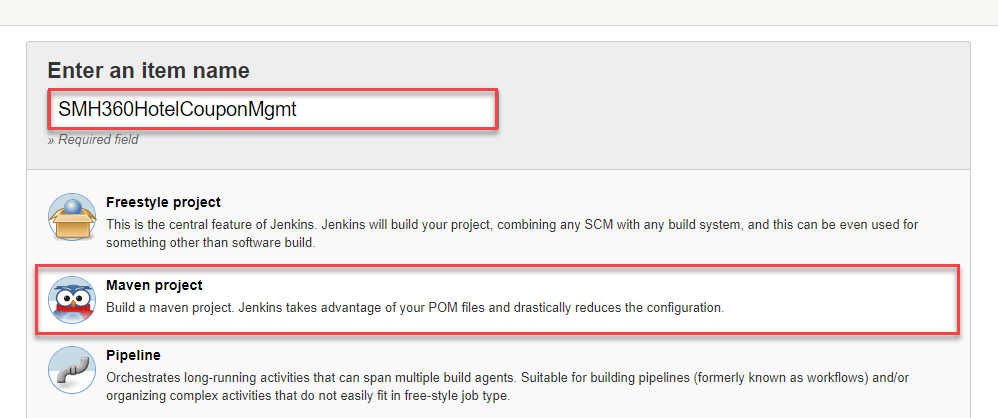

1. The next page is the project configuration page which allows you to define various aspects of the build. Click **Source Code Management** in the header and choose **Git**. Under the **Repository URL**, provide the URL of your GitHub repository to which the Microsoft project was forked. Credentials are not be required since you are using a public repository.

    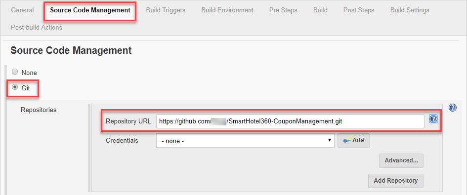

    > You will find the URL in the homepage of your GitHub repository. Click the **Clone or download** button and then the **Copy** icon under **Clone with HTTPS** section to copy the URL.

    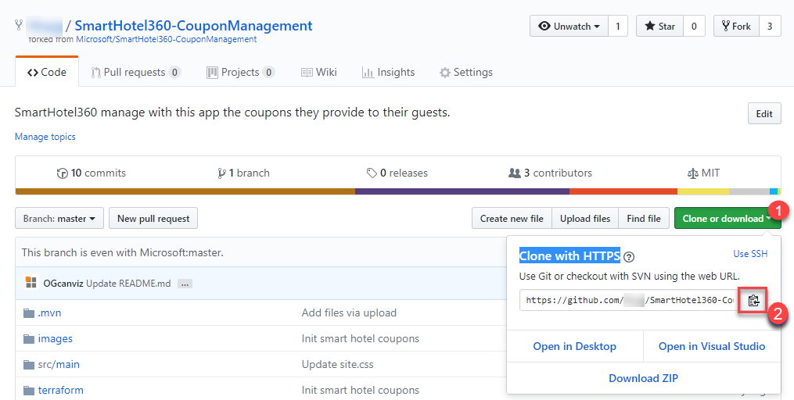

1.  Scroll down to the **Build Triggers** section and choose **GitHub hook trigger for GITScm polling** option. 

    > This feature enables builds after the webhook is triggered in your GitHub repository.

    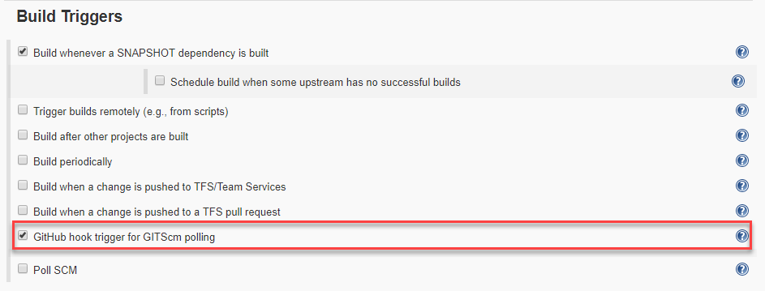

1. Scroll down further to the **Build** section. By default, **pom.xml** is provided as the file to build since it is under the module's root directory.

    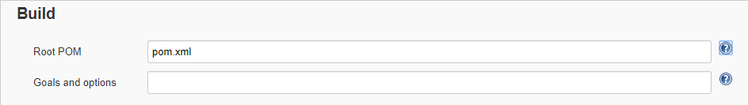

1. Finally, scroll down to the last option **Post-build Actions**. Click **Add post-build action** button and choose **Publish an Azure Web App**.

    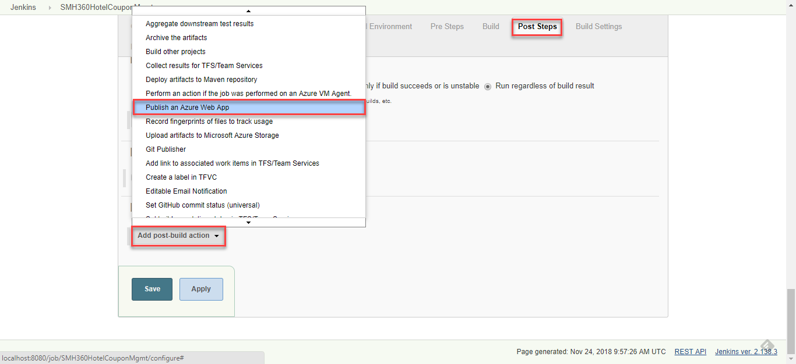

1. In the resulting window, let's take a look at the various options available to configure settings to deploy the application to an Azure Web App that was provisioned at the beginning of this lab.

    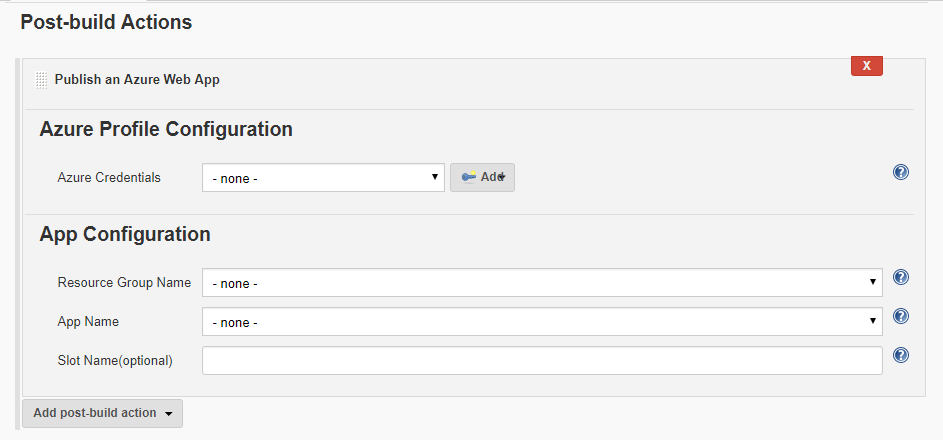

1. Under **Azure Profile Configuration**, choose the **Azure Credentials** drop down. Choose the **Azure Service Principal** that was created the *Task 2 of Exercise 2*.

    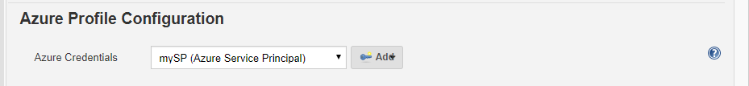

    > Once the correct Azure Service Principal is chosen from the list, it'll fetch the associated resource groups and resources from your Azure subscription and provide them as options in the **App Configurations** section. This will allow the Jenkins to deploy the application to chosen Azure Web App.

1. In the **App Configuration** section, choose the appropriate **Resource Group Name** and the corresponding **App Name** to which the application will be deployed. Under the **Publish Files** section, provide `ROOT.war` as the value for the parameter **Files** and `target` for the parameter **Source Directory(optional)**.

    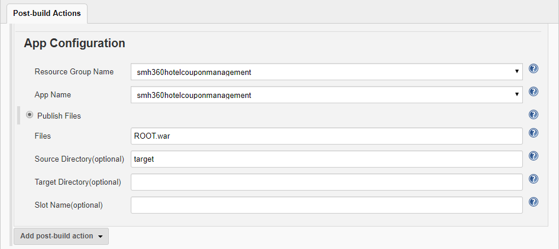

1. Click **Apply** to apply the changes and then **Save** to save the changes and redirect you to the Jenkins homepage.

1. In the home page, click **Build Now** to test the Jenkins build configuration.

    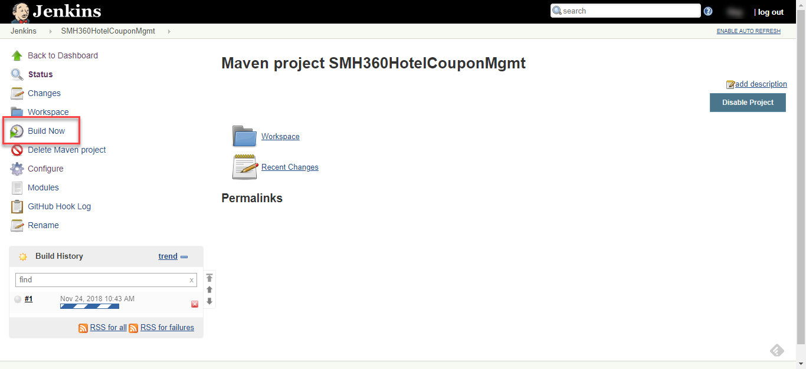

1. You will see a build in progress. To know more details of the build, click the progress bar and then **Console Output** to check the live build log.

    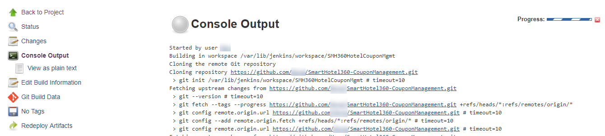

1. Once the build succeeds, click the App URL in the console output to see the application homepage. You should see a Java web app page displayed.

    

## Exercise 6: Import code into IntelliJ and commit a change to trigger CI and CD in Jenkins

With the settings and properties being created, you will now import the GitHub repository into a local folder with IntelliJ IDE, change a simple line of code, commit the code into your GitHub repository which in turn triggers a build and release in Jenkins to deploy the application to the Azure web app.

1. Click the **IntelliJ** icon to launch the IDE. Click the option **Check out from Version Control** and choose **Git**.

    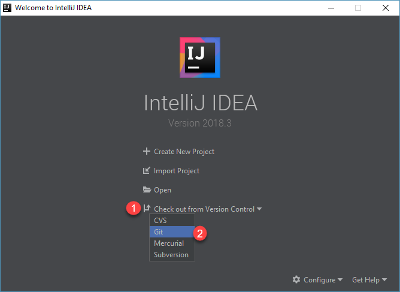

1. Provide your **GitHub URL** and click **Test** to verify if the URL is valid. Once the test succeeds, click **Clone** to clone the GitHub repository to the local folder.

    

1. Once the project is cloned, the IDE homepage is displayed. Click **Project** on the left side of the screen to expand the Project frame.

    

1. Expand the cloned project within the Project section.

    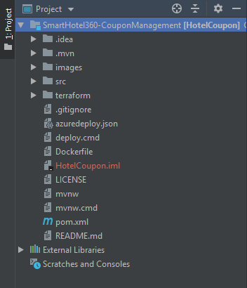

1. Navigate to `src\resources\template` path in the project and double-click the **login.html** code file to open it.

    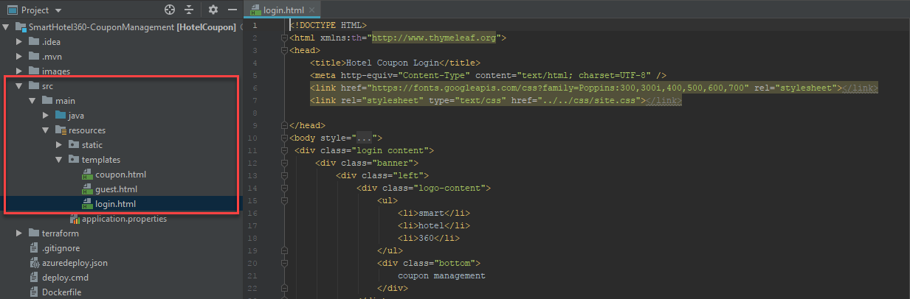 

    > Note: If a window pops-up to add **HotelCoupon.iml** file to Git, click **Cancel** to skip the operation. The file is not required by Git.

    

1. In the **login.html** file, scroll down to `Line 21` and add **v1.0** to the text **coupon management** and save the changes.

    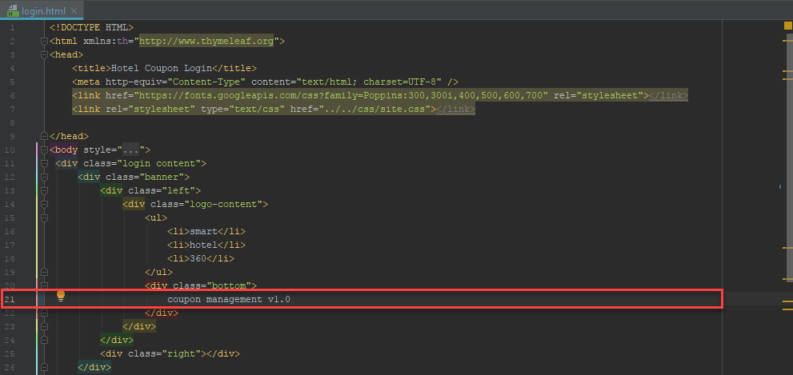

1. Click **VCS** in the menu and choose **Commit**. 

    

1. Provide an appropriate **Commit Message** and choose **Commit and Push** option in the **Commit** button options. Click **Commit and Push** in the *Code Analysis* pop-up window.

    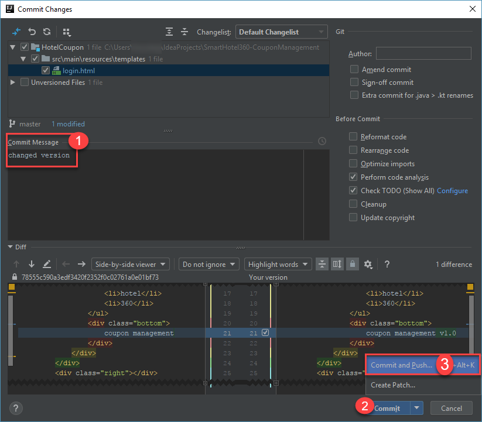

    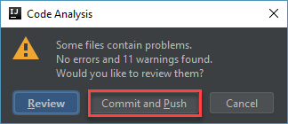

1. In the resulting **Push Commits** window, click **Push** to commit the changes to GitHub.

    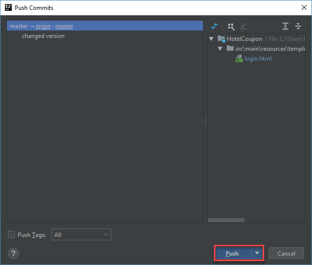

1. Once the push is successful, access the *Jenkins* server to see a build job in progress.

    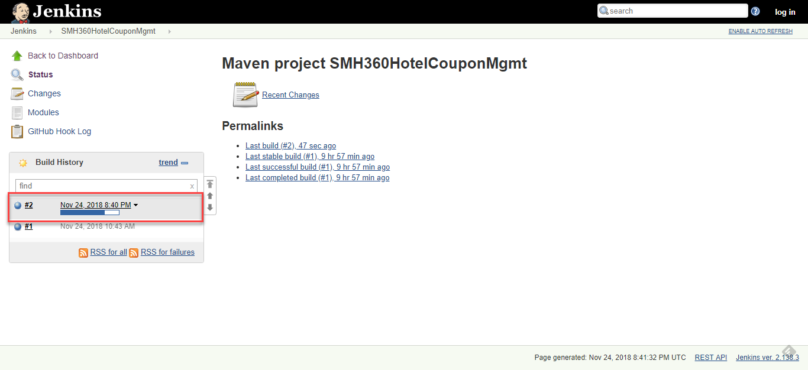

1. Click the build progress bar and then **Console Output** to see the build logs.

     

1. Once the build succeeds, click the Azure Web App URL in the build logs to access the application.

    

1. Provide the value for **username** as `me@smarthotel360.com` and the value for **password** as `1234` to login to the application and browse the registered guests. and generate various hotel coupons for them.

    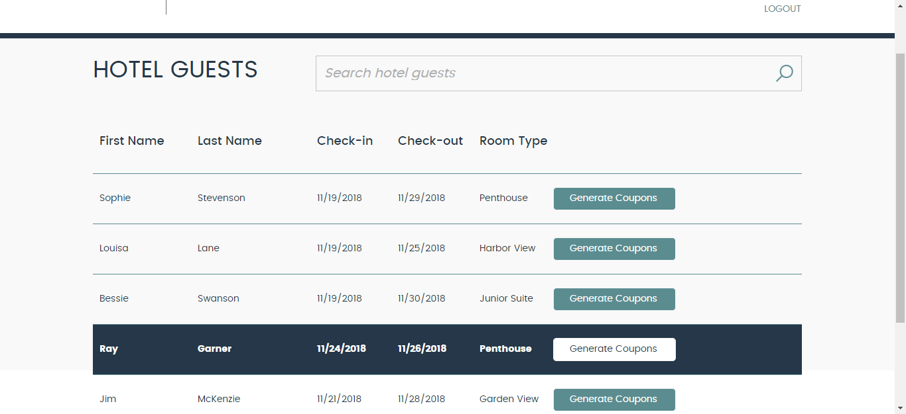

1. Choose a guest and click **Generate Coupons** to check out the various coupons generated for the user.
    
    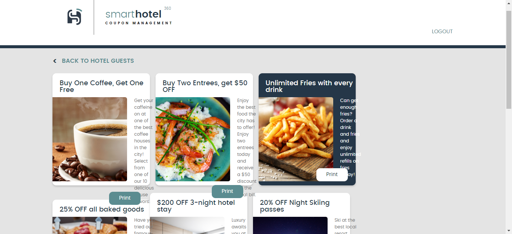

## Summary

In this lab, you have learnt how to trigger a CI build with Jenkins from GitHub and deploy the code to an Azure Web App.

