<div class="rw-ui-container"></div>
# Advanced Security

GitHub Advanced Security for Azure DevOps brings the **secret scanning, dependency scanning** and **CodeQL code scanning** solutions already available for GitHub users and natively integrates them into Azure DevOps to protect your Azure Repos and Pipelines. 

These scanning tools will natively embed automated security checks into the Azure DevOps platform, allowing developers to secure their code, secrets and supply chain without leaving their workflow.

Azure DevOps Advanced Security provides a range of security features to help organizations identify and address security vulnerabilities in their development processes.

- Dependency Scanning

- Secret scanning-push 

- Secret scanning-repo

- Code scanning

This lab is designed to help familiarize you with GitHub Advanced Security (GHAS) for Azure DevOps so that you can better understand how to use it in your own repositories.

## Task 1: Enable Advanced Security from Portal

GitHub Advanced Security for Azure DevOps includes extra permissions for more levels of control around Advanced Security results and management. Be sure to adjust individual permissions for your repository.

 To ensure Azure DevOps Advanced Security is enabled in your organization, you can follow these steps:

1.	Sign in to your Azure DevOps account with appropriate permissions to access organization settings.

2.	Navigate to the Azure DevOps organization and Team Project you want to check.

3.	In the lower-left corner, click on **Project **Settings. In the left menu area under Repos, click **Repositories**.

5.	Click on the **eShopOnWeb** repository.

6.	Click on Settings, then click **Advanced Security**, On to turn it on.

    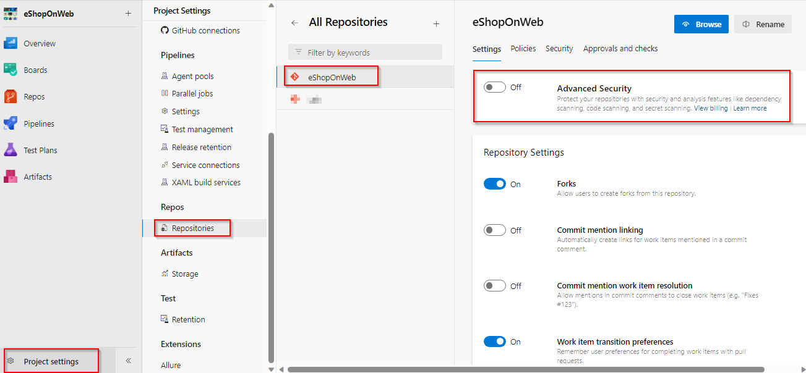

7.	Click Begin **Billing**.

    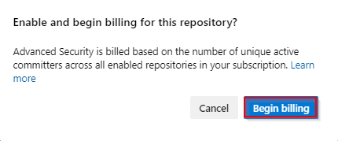

8.	Advanced Security and Push Protection are now enabled.
 

>**Note:** GitHub Advanced Security for Azure DevOps includes extra permissions for more levels of control around Advanced Security results and management. Be sure to adjust individual permissions for your repository. 


## Task 2: Setup Advanced Security permissions
1.	Select Security, under Azure DevOps Groups, and click on **Project Administrators**.

2.	Next to Advanced Security: manage and dismiss alerts, click the dropdown and select  **Allow**.

3.	Next to Advanced Security: manage settings, click the dropdown and select **Allow**.

4.	Next to Advanced Security: view alerts, click the dropdown and select **Allow**.

5.	If successful, a green checkmark ✅ appears next to the selected permission.

    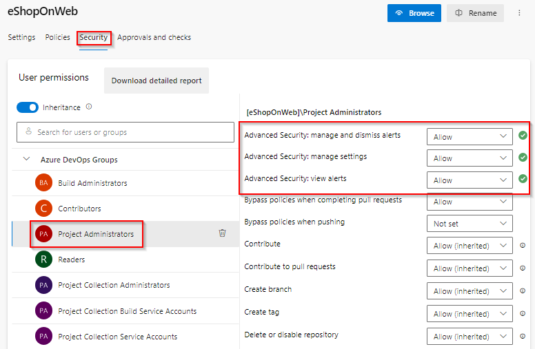


## Task 3: Setup Dependency Scanning
Dependency Scanning scans your project's dependencies such as libraries, frameworks, and packages, to identify any known security vulnerabilities or outdated versions that may pose a risk to your application

1.	Select and Edit the pipeline you want to add scanning to, **eShopOnweb**

    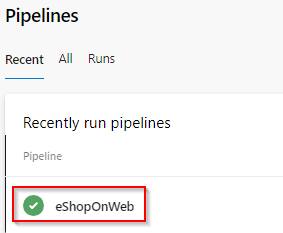


1.	Locate the section where the build steps are defined, hint: look for *- task: DotNetCoreCLI@2*.

1.	Add the task *Advanced Security Dependency Scanning*(AdvancedSecurity-Dependency-Scanning@1) directly to your YAML pipeline file.

1.	 *- task: AdvancedSecurity-Dependency-Scanning@1*

     *- task: AdvancedSecurity-Publish@1*
 
1.	Click **Save** to save the pipeline configuration file.

1.	The build will run automatically, initiating the dependency scanning task and publishing the results to Advanced Security. Please note that this process may take up to 10 minutes to finish. 


## Task 4: Resolution of Dependency Detections

1.	Go to the Repos tab and click on the Advanced Security menu item at the bottom.

1.	Click on **Dependencies** to see a list of all the dependencies alerts that have been found. This includes the Alert, Vulnerable package, and First detected date. We can easily clean up the dependencies.

### Dependency Scanning Alert Details

1.	Click on the item ***Improper Input Validation in IpMatcher...*** to see the details about this alert.

2.	This includes the Recommendation, Locations found,  Description, Severity, and the Date it was first detected. We can easily clean up the dependencies. 

    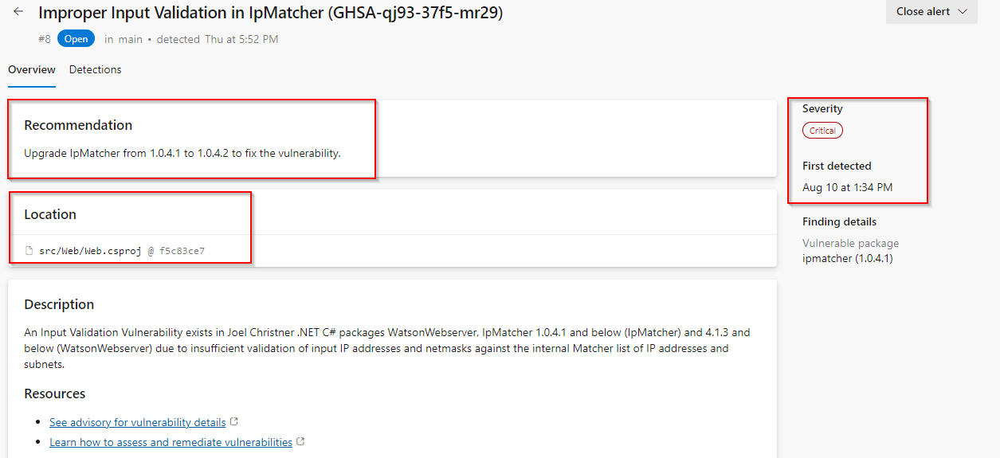

3.	You can also view the code that triggered the alert and what build detected it.
    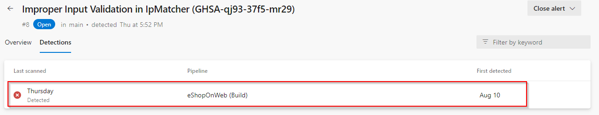

4.	Click on Detections to see the different builds that detected this alert.

>**ProTip!** - When a vulnerable component is no longer detected in the latest build for pipelines with the dependency scanning task, the state of the associated alert is automatically changed to Closed. To see these resolved alerts, you can use the State filter in the main toolbar and select Closed.

### Understanding Dependency Alerts 
In your repository, there are two types of dependencies: direct and transitive (also known as indirect).

- Direct dependencies, and components in your project.

- Transitive dependencies are components used by direct dependencies. 
Summary of Direct and Transitive Dependencies 
Fixing Dependency Alerts 
You can follow the recommended steps to manually update dependencies.

When a Dependency Alert is created in Azure DevOps Advanced Security, it will contain details about the vulnerability and steps you can take to resolve it.

1.	To view the alert, go to the Azure DevOps Advanced Security dashboard, scroll down and click on the alert  *Improper Input Validation in IpMatcher....*

1.	Review Recommendation, Location, Description, and Severity to understand the vulnerability and how to resolve it.

>**Note:** The reccomendation will provide you with the steps to resolve the vulnerability. For this one, simply update the package version from 1.0.4.1 to 1.0.4.2 to fix the vulerability.

1.	Click on the Locations to see the code that triggered the alert.
 
1.	From the code editor, update the package to 1.0.4.2. To do that, here we will use Visual Studio

1.	Clone the repository in Visual Studio and switch the *fixalert* branch 
  

>**Note:** This step is necessary since the main branch is protected by a pull request pipeline.

1. Once the source code is opened in Solution Explorer, navigate to the **Dependencies** section under Web.

    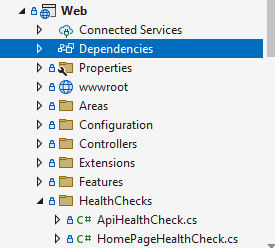

1. Right-click on Dependencies and choose *Manage Nuget Packages...*

    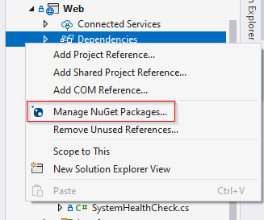

1. Click on IpMatcher and you will be able to see a warning regarding the vulnerability in that specific version.

    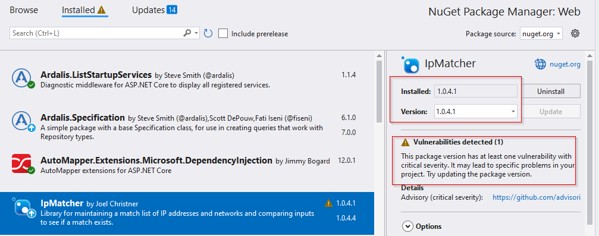

1. Change the version as per the suggestion that is 1.0.4.2 and Update

    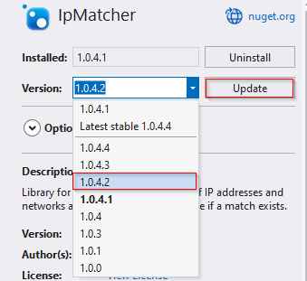

1.	Now, create the commit and push the changes to remote. Later, create  a pull request from *fixalert* to the *main*

1. Make sure to follow the policies and changes are merged in the *main*

>**Note:** The build will run automatically, initiating the dependency scanning task and publishing the results to Advanced Security and alert automatically closed.

> **ProTip!** Squash Merge is important. If we just commit, the exposed credential will still be in the history. To avoid this, fix code, use a Squash Merge, push it to repo, and you're done!

1.	Once the pipeline has been completed, **eShopOnWeb**, go to the Azure DevOps Advanced Security dashboard and click on Dependencies.

1.	You will see that the alert *Improper Input Validation in IpMatcher....*... no longer exists, as it is now closed.

>**Note:** This is a great way to ensure you are using the latest and greatest versions of your dependencies, and also, ensure you are not using any vulnerable versions

## Task 5: Secret Scanning Alerts

Secret Scanning scans your codebase and other resources to identify potential secrets that may have been inadvertently committed and provides alerts to mitigate the risk of exposure. Push protection also prevents any credentials from being leaked in the first place.

Once this is toggled on, it starts off a background scan of this repo and looks for exposed credentials. The scan doesn't just look at the tip of the main since attackers would look through all the branches and the entire commit history.

### Secret Scanning Alerts (Gain Insights) 
The Advance Security Alert hub is where all alerts are raised and where we gain insights, specifically under the category of Secrets. When a secret is found, you can click on it to access more information. The secret may be located in different places, including various commits. 
Secrets Review 
1.	Go to the Repos tab and click on the Advanced Security menu item at the bottom.

    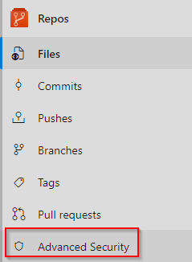

2.	Click on Secrets to see a list of all the exposed Secrets alerts that have been found. This includes the Alert and Introduced date. Click on the Microsoft Azure Storage account access key identifiable... to see more details about the alert and what you can do to clean up the secret.
   
    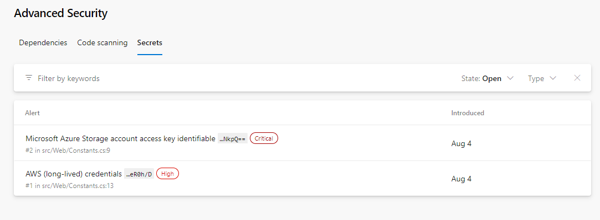

4.	Notice this includes the Recommendation, Locations found, Remediation Steps, Severity, and the Date it was first introduced. We can easily clean this up and dismiss the alert.
   
    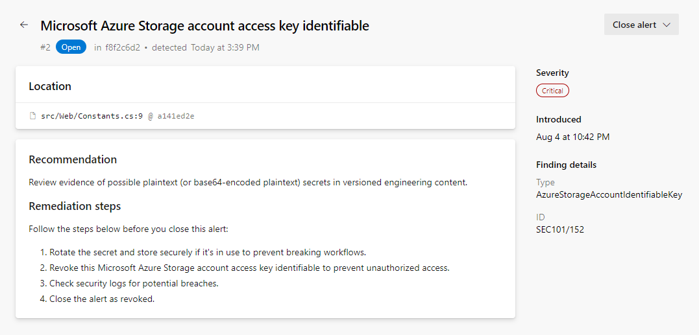

## Task 6: Protection of Repositories (Stop the Leak) 
Once a credential touches the repo, it's too late. Hackers might have already exploited it. The only way forward is to eliminate these leaks permanently and to find all the places they're actually being used in production.

>**Note:** Good news, GHAzDO focuses on preventing this in the first place. Bad news, these need to be manually fixed. There isn't an Easy Button.

**Push Protection**

Push Protection helps protect your repository by preventing unauthorized or malicious code from being pushed to your repository's branches.

Updating Secrets:

You can follow these steps to update a file. 
1.	While viewing the alert details, click on the line of code, _Constants._ _cs_.
   
    


3.	Click Edit to edit the file. This will open up the code editor and highlight the exact location of the secret. In this case, it's in the .cs    file.

4.	On line 9, update the variable name as "STORAGE_ID". 
    
    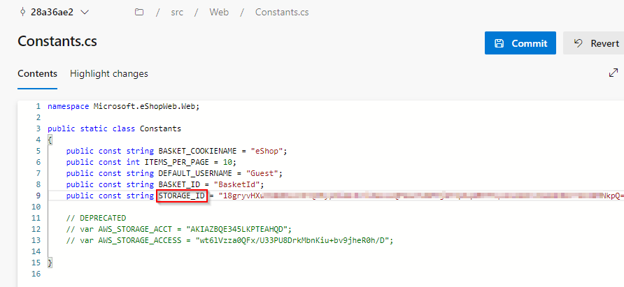

5.	Click Commit to save changes. Enter StorageDetails for the branch name and check Create a pull request, then click Commit again.

6.	The commit was rejected because the repository has both secret and branch protection enabled. This is a good thing! It's preventing us from checking in the exposed secret. Let's fix this.
   
    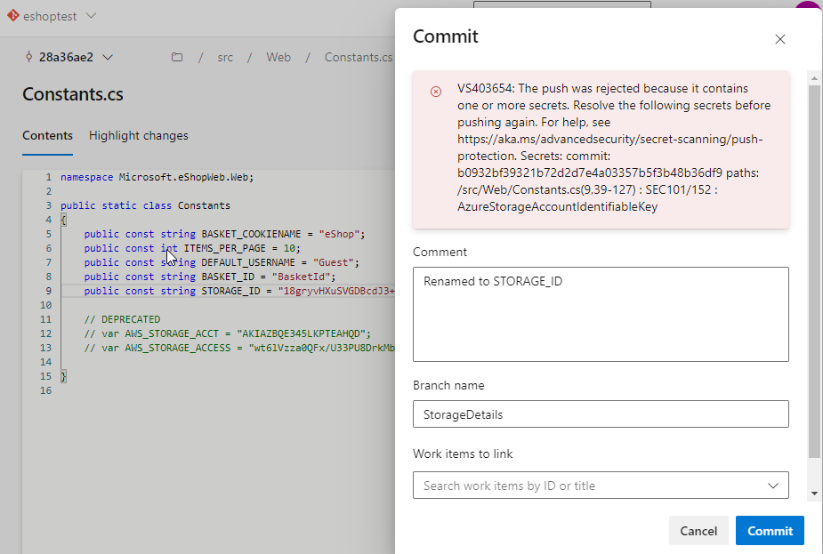

> **Note:** the code went up to the server, analyzed, then rejected, not stored anywhere. Using Secret push scanning, it catches secrets right before it becomes a problem.

> **ProTip!** This can't happen during a Pull Request. Once the code has pushed into topic branch, it's too late. PR analysis is best for dependency scanning but not secret push scanning, they are different.

**Fixing Exposed Secrets**

You can follow these steps to fix the exposed secret. 
1.	Click Cancel to return to the code editor.

>**Note:** This scenario is all too common. A developer is testing an application locally and needs to connect to a database, so what do they do? Of course, just put the connection string in the appsettings.json file. They forget to remove it before checking in the code. Now the secret is exposed in the repo, and not just the tip. The exposed credential will still be in the history. This is a huge security hole!

1.	On line 9, copy the STORAGE_ID value and note it down in a notepad. Now, replace this value with        #{STORAGE_ID}#.

1.	Click Commit to save changes. Enter SecretFix for the branch name and link a work item.

    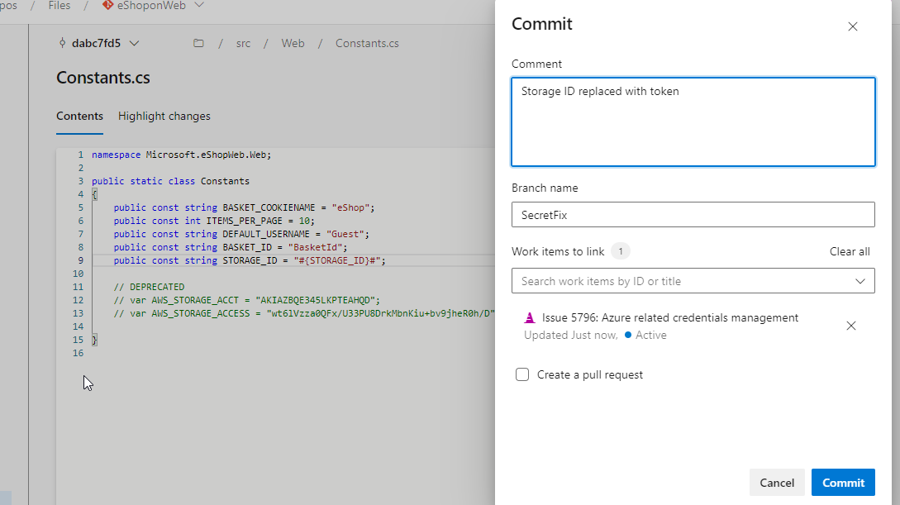

>**Note:** This step is necessary since the main branch is protected by a pull request pipeline.

1.	Next, we need to update the build pipeline to add a variable. Click on Pipelines and click on eShoponWeb.

10.	Click on *Edit* to edit the pipeline. Change to the SecretFix branch.
    
    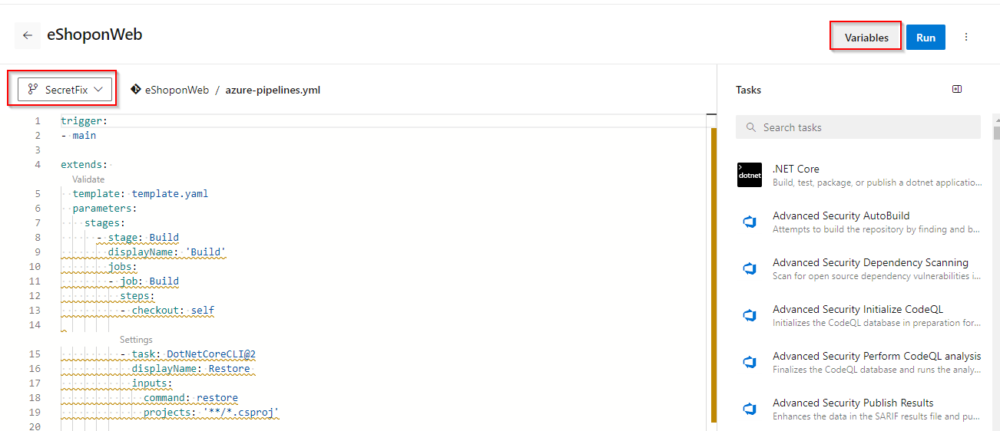
 
12.	Click on Variables and click + New Variable. Enter STORAGE_ID for the name and paste the URL from Notepad into the value field.

    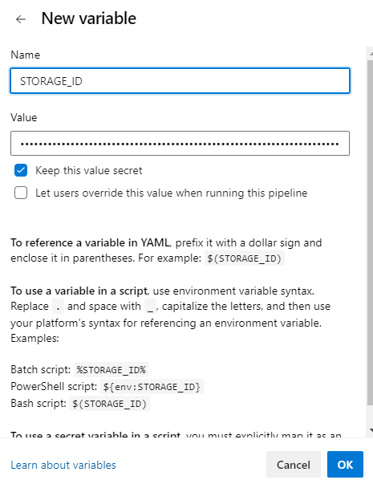

14.	Click Keep this value secret to hide the value, then click OK and Save. Next, we need to edit the pipeline and add a new build task to replace the #{STORAGE_ID}# with the actual value.

15.	While still in edit mode, add the following task between the Checkout and Restore tasks, around line 15. This will replace the #{STORAGE_ID}# with the actual value in the src/Web/Constants.cs file.
    ``` YAML

    - task: qetza.replacetokens.replacetokens-taskreplacetokens@5
            inputs:
              targetFiles: '**/*.cs'
              encoding: 'auto'
              tokenPattern: 'custom'
              tokenPrefix: '#{' 
              tokenSuffix: '}#' 
              verbosity: 'detailed' 
              keepToken: false 

    ```
    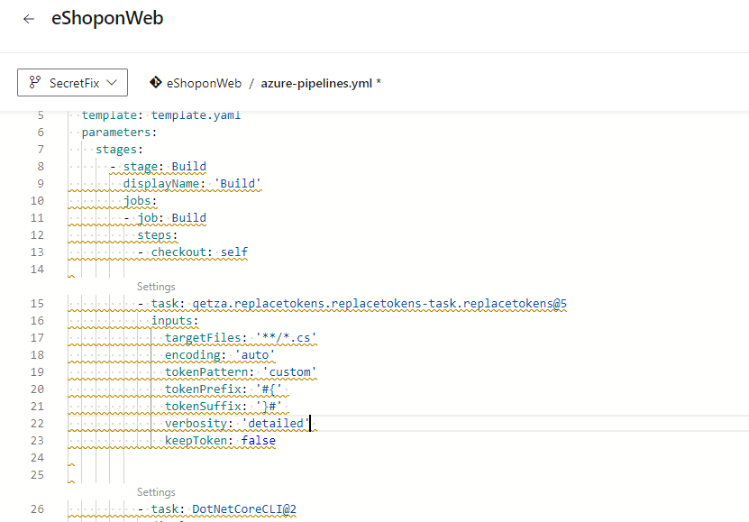

23.	Select Commit directly to the SecretFix branch, then click Save.

    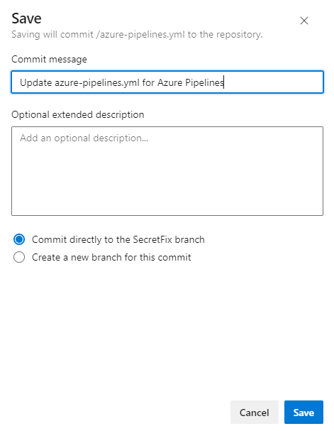

24.	Once the commit is saved, click on Repos, click Pull Requests, and click Create a pull request to merge the changes from branch SecretFix into branch main. 

25.	For the Title, enter the Fixed secret by adding a build token, and click Create. This will run the eShoponWeb pipeline to validate changes. 

26.	Once the eShoponWeb pipeline has been completed, click Approve and Complete.

27.	Change Merge Type to Squash commit and check box Delete SecretFix after merging, to merge changes into the main branch.

    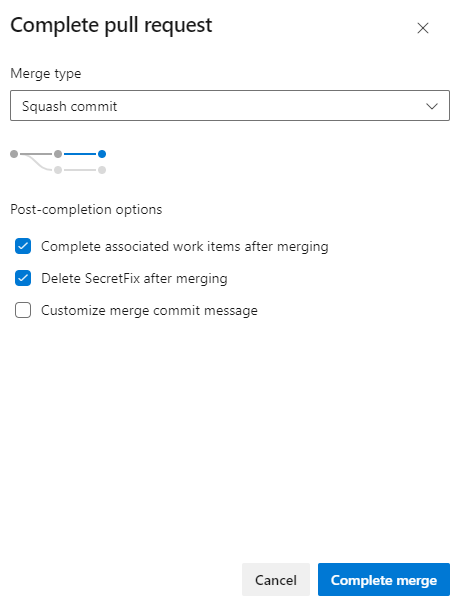

>**ProTip!** Squash Merge is important. If we just commit, the exposed credential will still be in the history. To avoid this, fix the code, use a Squash Merge, push it to repo, and you're done!

>**Note:** The build will run automatically, initiating the secret scanning task, and publishing the results to Advanced Security, and an alert will automatically be closed. However, the exposed issue will still be in the history and must be dismissed.

**Dismissing Alert**  
You can follow these steps to dismiss the alert. 
1.	Once the pipeline eShoponWeb has been completed, go to the Azure DevOps Advanced Security dashboard and click on Secrets. 

2.	Click on the following item, Microsoft Storage account... to see the exposed secret and how we easily dismiss the alert. 

3.	Click on Close alert to dismiss the alert, select Revoked, then click Close.
   
    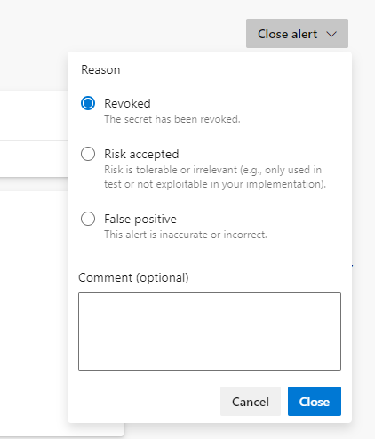


>**Note:** Once the code is merged into main, GHAzDO starts off a background scan of this repo and looks for exposed credentials. The scan doesn't just look at tip of main either, since attackers would look through all the branches and entire commit history.

5.	Go to the Azure DevOps Advanced Security dashboard and click on Secrets, you will see a list of other exposed Secrets alerts that have been found. 

6.	You will see that the alert Microsoft Storage account... no longer exists, as it is now revoked.

>**Note:** Anyone with contributor permissions for a repository can view a summary of all alerts for a repository but only project administrators can dismiss Advanced Security alerts.

## Task 7: Setup Code Scanning

Code scanning in GitHub Advanced Security for Azure DevOps lets you analyze the code in an Azure DevOps repository to find security vulnerabilities and coding errors. Any problems identified by the analysis are raised as an alert. Code scanning uses CodeQL to identify vulnerabilities.

1.	Select and Edit the pipeline you want to add scanning to, **eShopOnweb****

    


1.	Locate the section where the build steps are defined, hint: look for *- task: DotNetCoreCLI@2*.

1.	Add the task *Initialize CodeQL*(ms.advancedsecurity-tasks.codeql.init.AdvancedSecurity-Codeql-Init@1) directly to your YAML pipeline file. This task will be added before the Dotnet build.

1.	 *- task: ms.advancedsecurity-tasks.codeql.init.AdvancedSecurity-Codeql-Init@1*

     *- task: ms.advancedsecurity-tasks.codeql.analyze.AdvancedSecurity-Codeql-Analyze@1*. Add this task after dependency scanning.
 
1.	Click **Save** to save the pipeline configuration file.

## Task 8: Review Code Scanning Alert (Gain Insights)

1.	Go to the Repos tab and click on the Advanced Security menu item at the bottom.

1.	Click on **Code scanning** to see a list of all the code scanning alerts that have been found. This includes the Alert, Vulnerable code details, and First detected date.

### Code scanning Alert Details

1.	Click on the item ***Uncontrolled command line...*** to see the details about this alert.

2.	This includes the Recommendation, Locations found,  Description, Severity, and the Date it was first detected. We can easily fix this threat. 

    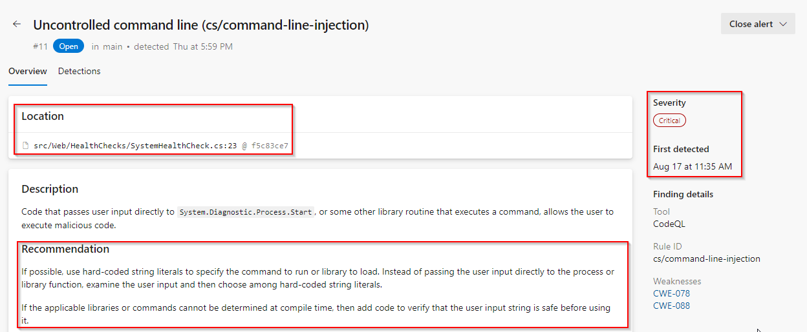

3.	You can also view the code that triggered the alert and what build detected it.
    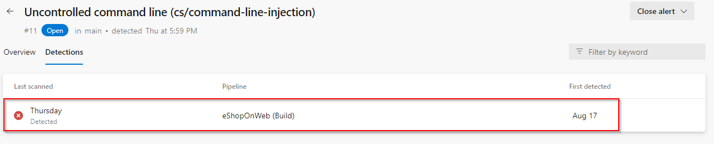

4.	Click on Detections to see the different builds that detected this alert.

    >**ProTip!** - When a vulnerable component is no longer detected in the latest build for pipelines with the dependency scanning task, the state of the associated alert is automatically changed to Closed. To see these resolved alerts, you can use the State filter in the main toolbar and select Closed.

### Fixing the Code to resolve the alert
1.	This is simple to fix using the method using parameters with dynamic SQL described in the Remediation steps.

1.	Click on Locations found to see the code that triggered the alert.

    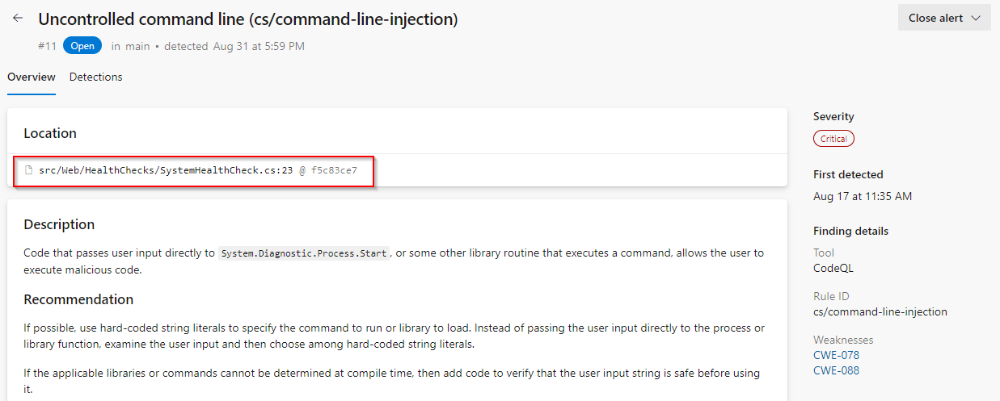

1.	Click on the Edit button to edit the file. Line number 23 is highlighted here. 

1. The value of __{drive}__ is getting red from the line number 20.

    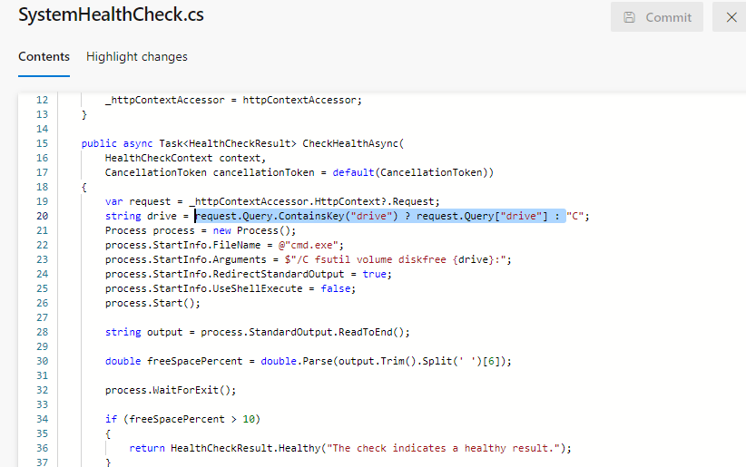

1. Instead of getting the value of 
__{drive}__ using a query, we can directly define it as __C__.
    ```C#
    string drive = "C";
    ```

    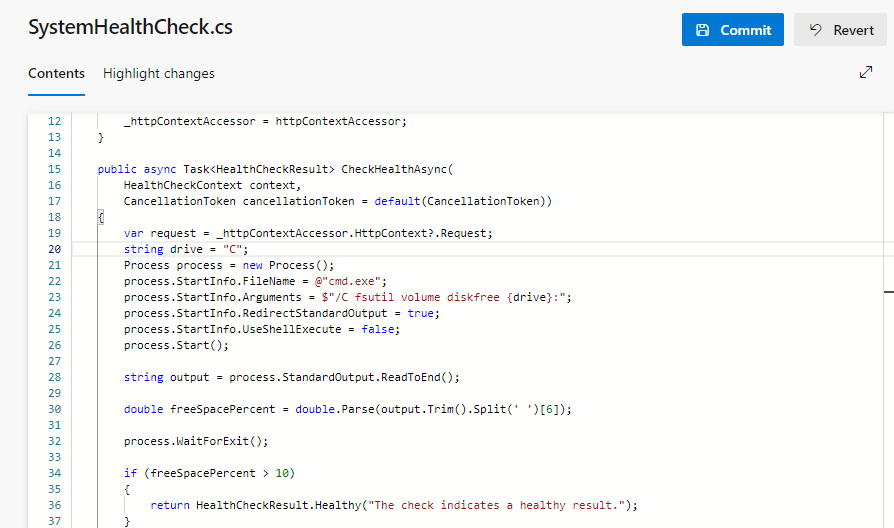

1. Click Commit to save changes. Enter *Fixalert* for branch name and check Create a pull request, then click Commit again.

    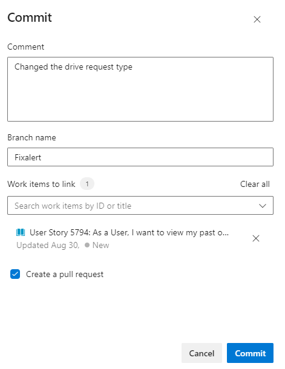

>**Note:** This step is necessary since the main branch is protected by a pull request pipeline.

1.	Click Create on the New pull request page to merge the changes into the main branch.

1. Make sure all the policies are followed and complete the pull request.

1.  This will run the **eShopOnWeb** pipeline.

>**Note:** The build will run automatically, initiating the code scanning task and publishing the results to Advanced Security.

1. Once after the completion of the build, if you navigate to the __Code scanning__ section of __Advanced Security__. You find the alert is closed automatically

    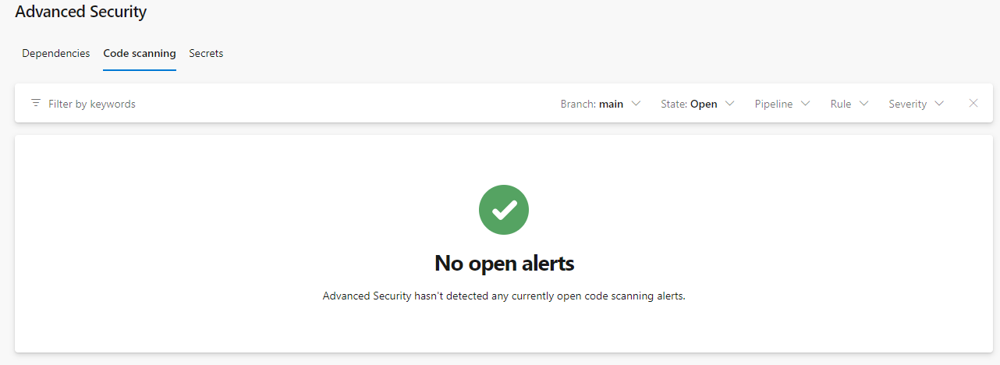
