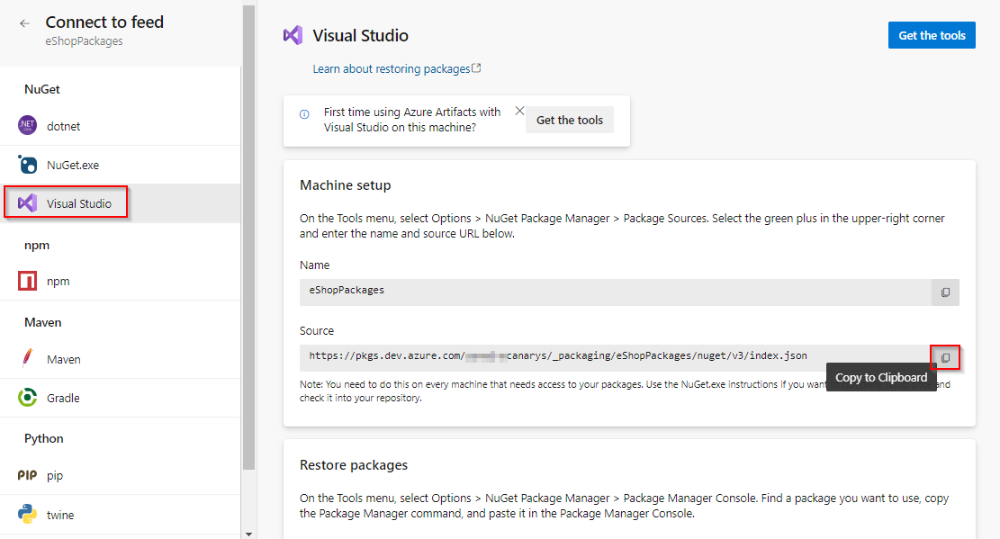
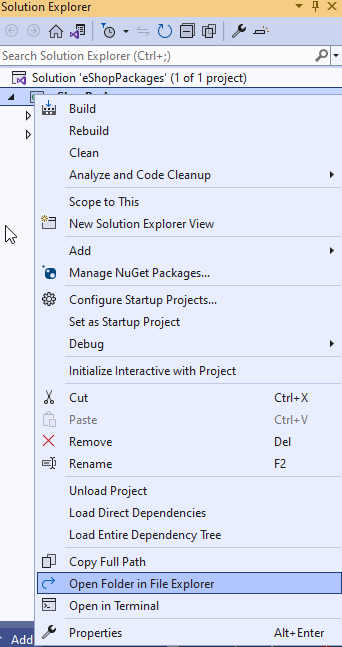
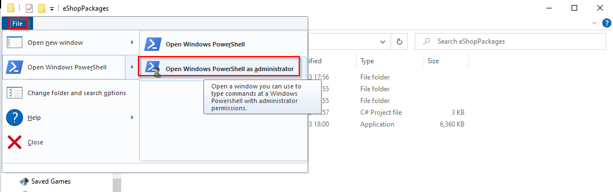

<div class="rw-ui-container"></div>

## Azure Artifacts

Azure Artifacts enable developers to consume and publish different types of packages to Artifacts feeds and public registries such as NuGet.org and npmjs.com. You can use Azure Artifacts in conjunction with Azure Pipelines to deploy packages, publish build artifacts, or integrate files between your pipeline stages to build, test, or deploy your application. To learn more about Azure Artifacts, see <a href="https://learn.microsoft.com/azure/devops/pipelines/artifacts/artifacts-overview?view=azure-devops"><u>Overview of Azure Artifacts</u></a>

<a href="https://www.azuredevopslabs.com/labs/azuredevops/packagemanagement/"><u>Package Management with Azure Artifacts</u></a>

### Task 1: Creating and connecting to a feed ###

1. Navigate to the **Artifacts** hub.

    

1. Click **Create feed**. This feed will be a collection of NuGet packages available to users within the organization and will sit alongside the public NuGet feed as a peer. The scenario in this lab will focus on the workflow for using Azure Artifacts, so the actual architectural and development decisions are purely illustrative.

    

1. This feed will include common functionality that can be shared across projects in this organization. Select the scope as **Organization** for this lab. Set the name to **"eShopPackages"** and click **Create**. Leave the default options.

     

1. Any user who wants to connect to this NuGet feed must configure their environment. Click **Connect to feed**.

    

    

1. In the **Connect to Feed** window, select **Visual Studio** and copy the **Source** URL. This is the only thing Visual Studio and NuGet need to start taking advantage of the new feed. Leave the dialog open in the browser.

   

1. Launch a **new** instance of **Visual Studio**. Do not use the instance open from cloning the primary **eShopOnWeb** solution.

1. Select **Tools | NuGet Package Manager | Package Manager Settings**.
     
     
1. Locate the **Package Sources** section and click the **Add** button to add a new package source.

    

1. Set the **Name** to **"eShopPackages"** and paste the **Source** URL copied earlier. Click **Update** followed by **OK**. Visual Studio is now connected to the new feed.

    

1. Close and Reopen the other Visual Studio instance used for cloning the eShopOnWeb repository.

<a name="Ex1Task2"></a>
### Task 2: Creating and publishing a NuGet package ###

1. From the main menu of **Visual Studio**, select **File | New | Project** ("Create a new project" in VS2022). We will now create a shared assembly that will be published as a NuGet package so that other teams can integrate it and stay up to date without having to work directly with the project source.

1. From the **Visual C#** section, select the **Class Library (.NET Framework)** template and set the **Name** to **"eShopOnWeb.Shared"**. Click **OK** to create the project.
(If VS2019 is used, look for "class" in the finder and select **Class** Library (.NET Framework)** and choose version 4.5.1)

    **VS2022**
    


1. In **Solution Explorer**, delete **Class1.cs**.

    

1. Press **Ctrl+Shift+B** to build the project. In the next task, we'll use **NuGet.exe** to generate a NuGet package directly from the built project, but it requires the project to be built first.

1. Return to the Azure DevOps browser tab. On the feed created before click **Connect to Feed** | **NuGet.exe** | **Get the tools**.

    

1. Click on **Download the latest Nuget**

    

1. On the opened window, select nuget.exe version **v5.5.1**. This will download the nuget.exe 


1. Return to **Visual Studio**. From **Solution Explorer**, right-click the **eShopOnWeb.Shared** project node and select **Open Folder in File Explorer**.

    

1. Move the downloaded **nuget.exe** file into the folder containing the **.csproj** file.

    

1. In the same **Windows Explorer** window, select **File | Open Windows PowerShell | Open Windows PowerShell as administrator**.

    

1. Execute the line below to create a **.nupkg** file from the project. Note that this is a quick shortcut to package the NuGet bits together for deployment. NuGet is very customizable and offers a lot of great flexibility for providing detailed information for consumers. You can learn more over on the [NuGet package creation page](https://docs.microsoft.com/en-us/nuget/create-packages/overview-and-workflowhttps:/docs.microsoft.com/en-us/nuget/create-packages/overview-and-workflow).

    ```
    ./nuget.exe pack ./eShopPackages.csproj
    ```
1. NuGet builds a minimal package based on the information it is able to pull from the project. For example, note that the name is **eShopOnWeb.Shared.1.0.0.nupkg**. That version number was pulled from the assembly.

    

1. Return to **Visual Studio**. From **Solution Explorer**, open **Properties\AssemblyInfo.cs**.

    

1. The **AssemblyVersion** attribute specifies the version number to build into the assembly. Each NuGet release requires a unique version number, so if we continue to use this method for creating packages, we will need to remember to increment this before building.

    

1. Return to the **PowerShell** window and execute the following command (it should be on one line). Note that you need to provide an "API Key", which can be any non-empty string. We're using **"Azure DevOps"** here. Log in using your Azure DevOps credentials when asked.

    ```
    ./nuget.exe push -source "eShopPackages" -ApiKey VSTS eShopPackages.1.0.0.nupkg
    ```
1. The command should succeed after a few seconds.

    

1. Return to the browser window, open Azure DevOps and **refresh** the window. You should now see the organization's NuGet package is published in the feed. Click it to view the details.

    

1. The details have been imported and are now ready for others to consume.

    

<a name="Ex1Task3"></a>
### Task 3: Importing a NuGet package ###

1. Switch to the instance of **Visual Studio** that has the full **eShoponWeb** solution open.

1. In **Solution Explorer**, right-click the **References** node under the **eShopOnWebWebsite** project and select **Manage NuGet Packages**.

    

1. Click the **Browse** tab and change the **Package source** to **eShopPackages**. We can find the one we just added, so click **Install** to add it to the project.

    

1. If asked, confirm the addition by clicking **OK**.


1. Press **Ctrl+Shift+B** to build the project. It should succeed. The NuGet package doesn't add any value yet, but at least we know it's there.

<a name="Ex1Task4"></a>
### Task 4: Updating a NuGet package ###

1. Switch to the instance of **Visual Studio** that has the **eShopPackages** project open (the NuGet source project).

1. In **Solution Explorer**, right-click the **eShopPackages** project node and select **Add \| Class**.

    

1. Select the **Class** template and enter the **Name "TaxService.cs"**. Click **Add** to add the class. We can pretend that tax calculation will be consolidated into this shared class and managed centrally so that other teams can simply work with the NuGet package.

    

1. Replace the code in the new file with the code below. For now, it will just hardcode a 10% rate.

    ```c#
    namespace eShopPackages
    {
        public class TaxService
        {
            static public decimal CalculateTax(decimal taxable, string postalCode)
            {
                return taxable * (decimal).1;
            }
        }
    }
    ```
1. Since we're updating the assembly (and package), return to **AssemblyInfo.cs** and update the **AssemblyVersion** to **1.1.0.0**.

    

1. Press **Ctrl+Shift+B** to build the project.

1. Return to the **PowerShell** window and execute the following line to repackage the NuGet package. Note that the new package will have the updated version number.

    ```
    ./nuget.exe pack eShopPackages.csproj
    ```
1. Execute the following line to publish the updated package. Note that the version number has changed to reflect the new package.

    ```
    ./nuget.exe push -source "eShopPackages" -ApiKey VSTS eShopOnWeb.Shared.1.1.0.nupkg
    ```
1. Return to the browser window open to Azure DevOps and refresh the page. You will still be looking at the 1.0.0 version of the package, but you can change that by selecting the **Versions** tab and selecting **1.1.0**.

    

