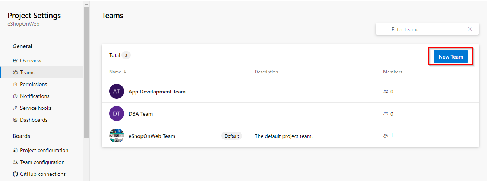
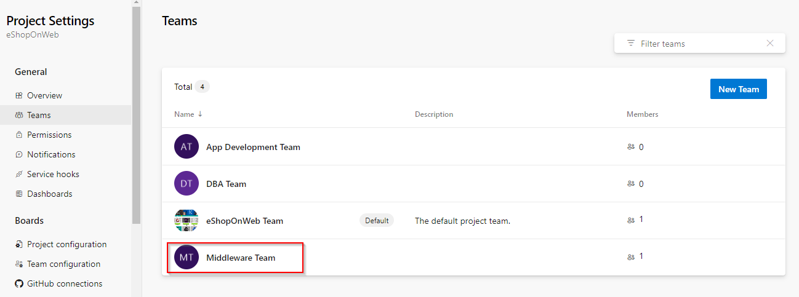
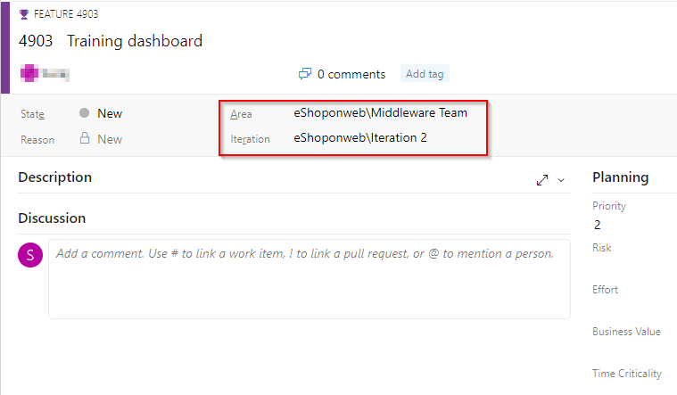
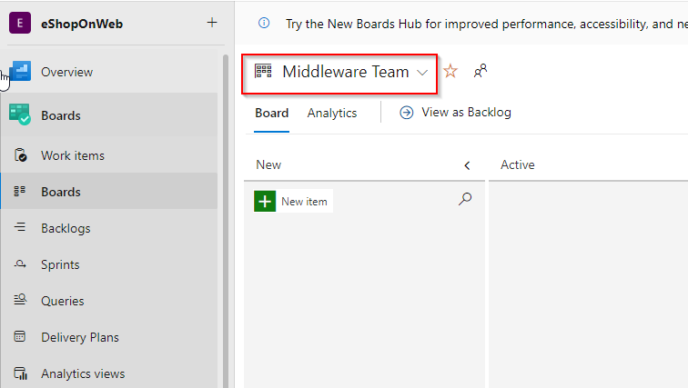
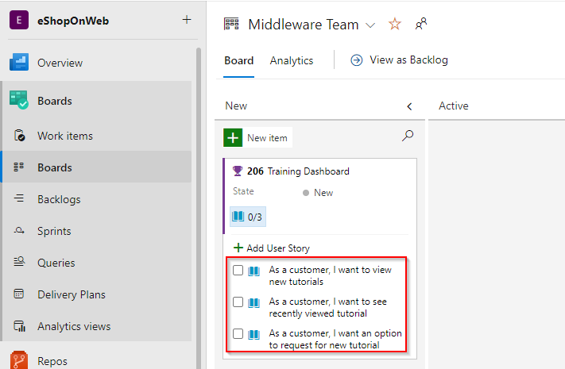
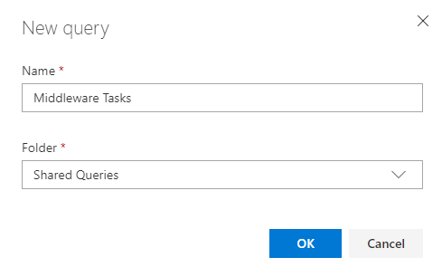
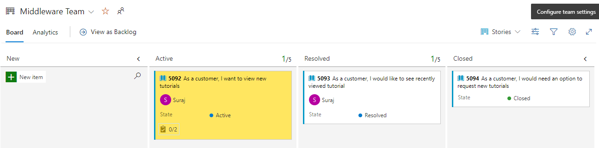
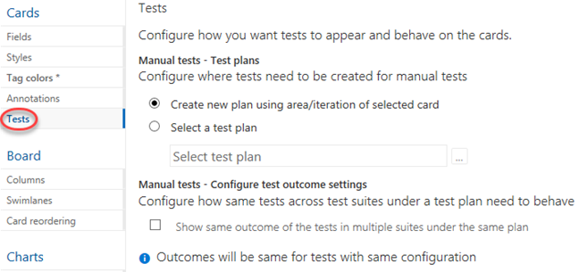
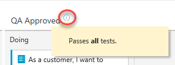

## Azure Boards
Delivers a suite of Agile tools to support planning and tracking work, code defects, and issues using Kanban and Scrum methods. For more information about Azure Boards, see<a href="https://learn.microsoft.com/en-us/azure/devops/boards/get-started/what-is-azure-boards?view=azure-devops"> <u>What is Azure Boards?</u></a>.

### Overview
In this lab, you will learn about the agile planning and portfolio management tools and processes provided by Azure Boards and how they can help you quickly plan, manage, and track work across your entire team. You will explore the product backlog, sprint backlog, and task boards which can be used to track the flow of work during the course of an iteration. We will also take a look at how the tools have been enhanced in this release to scale for larger teams and organizations.

### Task 1: Working with teams, areas, and iterations ####

1. Navigate to your eShopOnWeb project on Azure DevOps. It will be something like [https://dev.azure.com/yourorganization/eShopOnWeb]

1. Open the settings page using the **Project settings** navigation located at the bottom left of the page.

    

As your organization grows, you add teams to support that growth. You create a team in Azure DevOps that corresponds to a group of project members focused on specific products, services, or feature areas. You add teams to provide them the tools they need to manage their backlog, plan sprints, configure dashboards, define alerts, and set team favorites.

Each new project is configured with a default team with the project name. For example, the project named eShoponweb is configured with the default team eShoponweb Team. You can rename the default team and you can reassign a new team as the default. We will now create a new team and will name it Middleware Team. 

1. Select the **Teams** tab. There are already a few teams in this project, but you'll make a new one for this lab. Click **New Team**.

    

1. Use **"Middleware Team"** as the **Team name** and click **Create team** (Leave defaults).

    

1. Select the newly created team to view its details.

    

1. By default, the new team has only you as its member. You can use this view to manage membership, notifications, dashboards, and more. But first, you will want to define the schedule and scope of the team. Click **Iterations and Area Paths**.

    

Area paths allow you to group work items by team, product, or feature area. Iteration paths allow you to group work into sprints, milestones, or other event-specific or time-related period. Both these fields allow you to define a hierarchy of paths.

You define area and iteration paths for a project. Teams can then choose which paths are used to support their backlog and other Agile tools. To understand how Agile tools use area and iteration paths, see <a href="https://learn.microsoft.com/en-us/azure/devops/organizations/settings/about-teams-and-settings?view=azure-devops"><u> Agile tools that rely on areas and iterations</u></a>.

1. Select the **Iterations** tab and click **Select Iterations**. This team will use the same iteration schedule that's already in place for the other teams, although you can take a different route if that's better for your organization.

    

1. Select **eShopnonweb\Iteration 1** and click **Save and close**. Note that this first sprint has already passed. This is because the demo data generator is designed to build out project history so that this sprint occurs in the past.

1. Repeat the process to add **Iteration 2** and **Iteration 3** (add them as in the previous step).

    

1. Select the **Areas** tab, notice that by default, there is an area matching the name of the team.

    

1. From the area dropdown, select **Include sub-areas**. The default setting for all teams is to exclude sub-area paths. We will change it to include sub-areas so that the team gets visibility into all of the work items from all teams. Optionally, the management team could also choose to not include sub-areas, thereby removing work items from their view as soon as they are assigned to one of the teams.

    

### Task 2: Working with work items

Work items play a prominent role in Azure DevOps. You use work items to track features and requirements you're developing, code defects or bugs, and issues or risks to your project. Each work item is based on a work item type that determines the work item fields available for tracking information. The work item types available to you differ depending on the process used when your project was created: Agile, Basic, Scrum, or CMMI. In this task, you'll focus on using various work items to set up the plan to extend the eShopOnWeb site with a product training section. While it can be daunting to build out such a substantial part of a company's offering, Azure DevOps and the Scrum process make it very manageable.

This task is designed to illustrate a variety of ways you can create different types of work items, as well as to demonstrate the breadth of features available on the platform. As a result, these steps should not be viewed as prescriptive guidance for project management. The features are intended to be flexible enough to fit your process needs, so explore and experiment as you go.

1. There are many ways to create work items in Azure DevOps, and we'll explore a few of them. Click on '+' icon and choose **New Work Item** then click on **Epic** 
    

1. type **"Product training"** as a title.

1. Assign the new work item to yourself and set the **Area** to **eShoponweb\Middleware Team**. Set the **Iteration** to **eShoponweb\Iteration 2** and click **Save & Close**. Ordinarily, you would want to fill out as much information as possible, but you can run lean here for the purposes of this lab.

    

1. Navigate to **Boards \| Work Items**.

    

1. Locate the newly created epic for **Product training** and open it.

    

1. The work item form includes everything you could ever want to know about a work item. This includes details about who it's assigned to, its status across many parameters, and all the associated information and history of how it has been handled since its creation. One of the key areas to focus on is the **Related Work**. One of the ways to add a feature to this epic is to select **Add link \| New item**.

    

1. Set the **Link Type** to **Child**, **Work item type** to **Feature** and set the **Title** to **"Training dashboard"**. Click **OK**.

    

1. That **Assignment**, **Area**, and **Iteration** should already be set to the same as the epic, and it's even linked to the parent item it was created from. Click **Save & Close**.

    

1. Navigate to the **Boards** view.

    

1. Select **Middleware Team**. This will open the board for that particular team.

    

1. Switch the board from showing **Backlog items** to showing **Features**. This will make it easy to add tasks and other work items to the features.

    

1. From the **Training dashboard** dropdown, select **Add User Story**.

    

1. Name the first backlog item **"As a customer, I want to view new tutorials"** and press **Enter** to save. This creates a new **Product Backlog Item** (PBI) work item that is a child of the feature and shares its area and iteration.

    

1. Add two more User Stories designed to enable the customer to see their recently viewed tutorials and to request new tutorials.

    

1. Switch the task board view back to **Backlog items**.

    

1. Backlog items have a state that defines where they are relative to being completed. While you could open and edit the work item using the form, it's easier to just drag cards on the board. Drag the first work item to **Active**.

    

1. You can also expand work item cards to get conveniently editable details.

    

1. Assign the moved User Story to yourself. Ignore it if it is already assigned to you.

1. Drag the second work item to the **Resolved** stage.

    

1. Drag the final PBI to the **Closed** stage.

    

1. The task board is one view into the backlog. View the tabular form by clicking **View as Backlog**.

    

1. Click the **Expand** button, which allows you to view nested tasks under these work items. Another easy way to create work items is using the **Add** button on the backlog. Click it to add a new task to the first backlog item.

    

1. Set the **Title** to **"Add page for most recent tutorials"**. Set its **Original Estimate** and **Remaining** to **"5"** and **Completed** to **"0"**.  **Activity** value changes it to **"Development"**. Click **Save & Close**.

    

1. Add another task to **"Optimize data query for most recent tutorials"**. Set its **Original Estimate** and **Remaining** to **"3"** and **Completed** to **"0"**.  **Activity** value changes it to **"Design"**. Click **Save & Close**.

    

### Task 3: Working with queries ####

You can track your work by using managed queries in Azure Boards. Queries let you list bugs, user stories, or other work items based on field criteria you specify. You can then review these lists with your team, triage work, or bulk update work items. Along with managed queries, the semantic search tool provides some overlapping and different functionality worth exploring.

Use managed queries to support these operations:

* Bulk update of work items using the web portal
* Triage and update work items
* Review a hierarchy of work items
* Share a list of work items with a team member
  

1. To create charts based on work item queries that you can share on a dashboard, select **Boards** and then click on **Queries**.

     

1. Click **New query**.

    

1. Set the first term to **Work Item Type = Task** and the second term to **Area Path = eShopOnWeb\Middleware Team**.

    

1. Click **Save query**.

    

1. Set the **Name** to **"Web tasks"** and the **Folder** to **Shared Queries**. Click **OK**.

    

1. Select the **Charts** tab and click **New chart**.

    

1. Click **New chart**.

    

1. Set the **Name** of the chart to **"Web tasks - By assignment"** and **Group by** **Assigned To****. Click **OK** to save.

    

1. You can now add this chart to a dashboard so then it could be accessible from Dashboard section.

    

1. To visualize the project details by using widgets, we can access the **Dashboard** of the project. Choose **eShopOnWeb** to see the already existing widgets related to that team.

    

    

### Task 4: Managing sprints and capacity ####

Your team builds the sprint backlog during the sprint planning meeting, typically held on the first day of the sprint. Each sprint corresponds to a time-boxed interval which supports your team's ability to work using Agile processes and tools. During the planning meeting, your product owner works with your team to identify those stories or backlog items to complete in the sprint.

Planning meetings typically consist of two parts. In the first part, the team and product owner identify the backlog items that the team feels it can commit to completing in the sprint, based on experience with previous sprints. These items get added to the sprint backlog. In the second part, your team determines how it will develop and test each item. They then define and estimate the tasks required to complete each item. Finally, your team commits to implementing some or all the items based on these estimates.

1. Your sprint backlog should contain all the information your team needs to successfully plan and complete work within the time allotted without having to rush at the end. Before you start planning your sprint, you'll want to have created, prioritized, and estimated your backlog and defined your sprints. Navigate to the **Sprints** view using the navigation.

    

1. From the **View options** dropdown, select the **Work details** panel option.

    

1. The current sprint has a pretty limited scope. There are two tasks in the **To do** stage that combine for 8 hours of estimated work. At this point, neither task has been assigned.

    

1. Assign the **Add page** task to yourself. Note that this updates the capacity view.

    

1. Select the **Capacity** tab. This view enables you to define what activities a user can take on and at what level of capacity. Use **Add user** and search your username to add the user to define capacity

     

 1. In this case, set your capacity to allow **"1"** hour of **Development** per day. Note that you can add additional activities per user in case they do more than just development.

    

1. However, let's assume you're going to take some vacation. Click **0 days** under **Days off**.

    

1. Set your vacation to span five work days during the current sprint (within the next few weeks). Click **OK**.

    

1. Click **Save**.

    

1. Return to the **Taskboard**.

    

1. Note that the capacity view has been updated to reflect your available bandwidth. This exact number may vary, but for the screenshots here, that sprint capacity is 11 hours (1 hour per day over 11 working days).

    

1. One convenient feature of the boards is that you can easily update key data in-line. It's a good practice to regularly update the **Remaining Work** estimate to reflect the amount of time expected for each task. Let's say you've reviewed the work for the **Add page** task and found that it will actually take longer than originally expected. Set it to whatever your total capacity is for this sprint.

    

1. Note how this expands the **Development** and your personal capacities to their maximum. Since they're large enough to cover the assigned tasks, they stay green. However, the overall **Team** capacity is exceeded due to the additional 3 hours required by the other task.

    

1. One way to resolve this capacity issue would be to move the task to a future iteration. There are a few ways this could be done. First, you could open the task here and edit it in the dialog. The **Backlog** view, on the other hand, provides an in-line menu option to move it. Don't move it now.

    

1. Return to the **Taskboard** view.

    

1. Select **People** from the **View options** dropdown.

    

1. This adjusts your view such that you can review the progress of tasks by person instead of by backlog item.

    

1. There is also a lot of customization available. Click the **Configure team settings** button.

    

1. On the **Styles** tab, click **Add Styling rule** and set the **Name** to **"Development"**. Choose a green **Card color**. This will color all cards green if they meet the rule criteria set below.

    

1. Add a rule for **Activity = Development**. This will set all cards assigned to **Development** activities green.

    

1. The **Backlogs** tab allows you to set the levels available for navigation. Epics are not included by default, but you could change that here.

    

1. You can also specify the **Working days** the team follows. This applies to capacity and burndown calculations.

    

1. The **Working with bugs** tab allows you to specify how bugs are presented on the board.

    

1. Click **Save and close** to save the styling rule.

    

1. The task associated with **Development** is now green and very easy to identify.

    

### Task 5: Customizing Kanban boards ####

To maximize a team's ability to consistently deliver high-quality software, Kanban emphasizes two main practices. The first, visualizing the flow of work, requires you to map your team's workflow stages and configure your Kanban board to match. The second, constraining the amount of work in progress requires you to set work-in-progress (WIP) limits. You're then ready to track progress on your Kanban board and monitor key metrics to reduce lead or cycle time. Your Kanban board turns your backlog into an interactive signboard, providing a visual flow of work. As work progresses from idea to completion, you update the items on the board. Each column represents a work stage, and each card represents a user story (blue cards) or a bug (red cards) at that stage of work. However, every team develops its own process over time, so the ability to customize the Kanban board to match the way your team works is crucial.

1. Navigate to **Boards**.

    

1. Click the **Configure team settings** button.

    

1. You can apply style rules to change the color of cards on Kanban boards and task boards. Styling rules make the cards with important information stand out. Select the **Styles** tab. On the Styles tab, click Add Styling rule and set the Name to “High Priority”. Choose a Red Card color. This will color all cards red if they meet the rule criteria set below.
    
    

1. Add a rule for **Priority = 1**. This will set all cards with priority **1** to red. You can add more clauses in the query if required. Open the work item **As a customer, I want to view new tutorials** and change priority to **1**
    
    

1. Click **Save and close** to save the styling rule.

1. The backlogs with priority **1** are now red and very easy to identify.
   
    

1. Click the **Configure team settings** button.

    

1. The team is emphasizing work done with data, so there is special attention paid to any task associated with accessing or storing data. Select the **Tag colors** tab. Click **Add tag color** and enter a tag of **"data"**. Whenever a backlog item or bug is tagged with **data**, that tag will be highlighted.

    

1. You can also specify which **Annotations** you would like included on cards to make them easier to read and navigate. When an annotation is enabled, the child work items of that type are easily accessible by clicking the visualization on each card.

    

1. The **Tests** tab enables you to configure how tests appear and behave on the cards.

    

1. Click **Save and close**.

    

1. Open the **view new tutorials** backlog item.

    

1. Add tags for **"data"** and **"ux"**. Click **Save & Close**.

    

1. Note that the two tags are now visible on the card, although the **data** tag is highlighted yellow as configured.

    

1. Click the **Configure team settings** button.

    

1. Select the **Columns** tab. This section allows you to add new stages to the workflow. Click **Add Column** and set the **Name** to **"QA Approved"**. Set the **WIP limit** to **"1"**, which indicates that only one work item should be in this stage at a time. You would ordinarily set this higher, but there are only two work items to demonstrate the feature with here. Move the stage to occur between **Committed** and **Done**.

    

1. Click **Save and close**.

    

1. You will now see the new stage in the workflow.

    

1. Move the work items from **Committed** and **Done** into **QA Approved**.

    

1. The stage now exceeds its **WIP** limit and is colored red as a warning.

    

1. Move the **recently viewed** backlog item back to **Committed**.

    

1. Click the **Configure team settings** button.

    

1. Return to the **Columns** tab and select **QA Approved**. A lag often exists between when work gets moved into a column and when work starts. To counter that lag and reveal the actual state of work in progress, you can turn on split columns. When split, each column contains two sub-columns: **Doing** and **Done**. Split columns let your team implement a pull model. Without split columns, teams push work forward, to signal that they've completed their stage of work. However, pushing it to the next stage doesn't necessarily mean that a team member immediately starts work on that item. Check **Split column into doing and done** to create two separate columns for this.

    

1. As your team updates the status of work as it progresses from one stage to the next, it helps that they agree on what **done** means. By specifying the **Definition of done** criteria for each Kanban column, you help share the essential tasks to complete before moving an item into a downstream stage. Add a **Definition of done** using markdown, such as **"Passes \*\*all\*\* tests."**. Click **Save and close**.

    

1. Note that the **QA Approved** stage now has **Doing** and **Done** columns.

    

1. You can also click the icon next to the column header to read the **Definition of done**.

    

1. Click the **Configure team settings** button.

    

1. Your Kanban board supports your ability to visualize the flow of work as it moves from new to done. When you add **swimlanes**, you can also visualize the status of work that supports different service-level classes. You can create a swimlane to represent any other dimension that supports your tracking needs. From the **Swimlanes** tab, click **Add Swimlane** and set the **Name** to **"Expedite"**. Click **Save and close**.

    

1. Drag and drop the **Committed** work item onto **QA Approved \| Doing** so that it gets recognized as having priority when QA bandwidth becomes available.

    

1. If you would like to review a more sophisticated board with many more work items, select the **eShopOnWeb Team** from the team dropdown.

    

1. This board provides a playground for you to experiment with and review the results.

    

