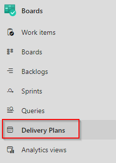
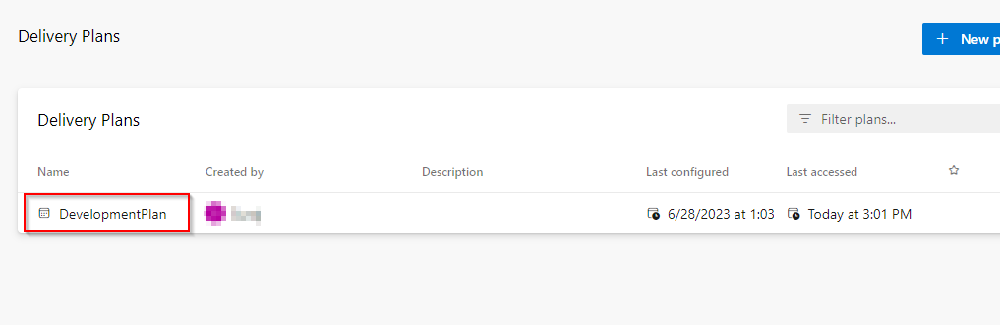
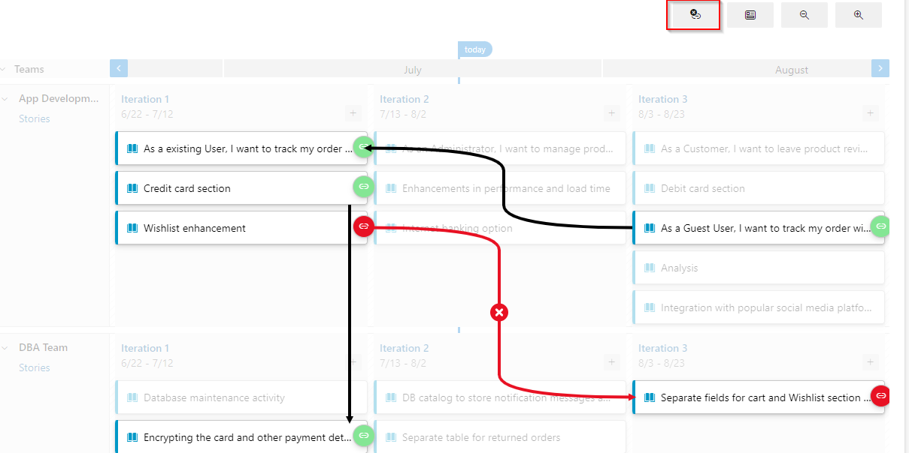
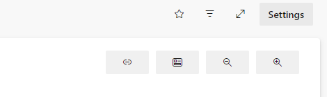
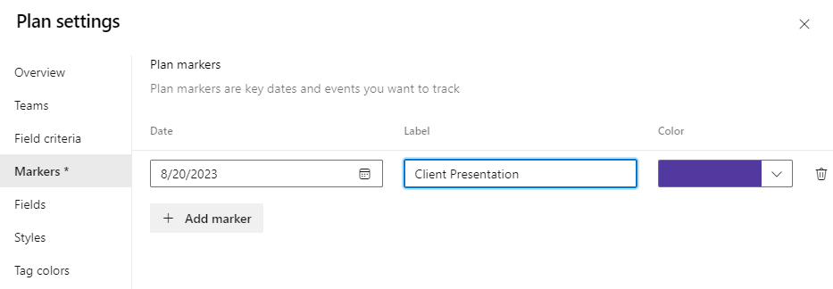
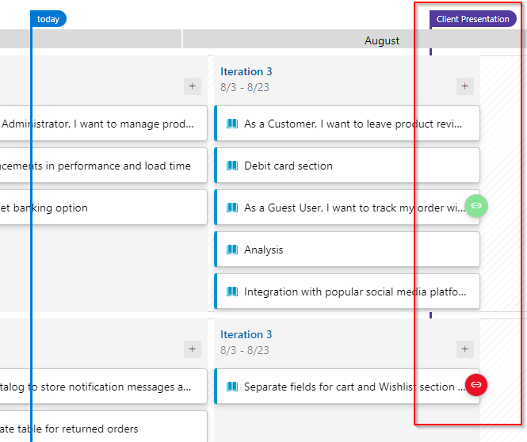

### Tracking dependency by using Delivery Plans

A delivery plan shows the scheduled work items by sprint (iteration path) of selected teams against a calendar view. Use the Delivery Plans feature to ensure that your teams are aligned with your organizational goals. You can view multiple backlogs and multiple teams across your whole account.

1. Navigate to the **Delivery Plans** section under Boards
   
    

1. Click on the **DevelopmentPlan**
   
    

1. This will show you the User Story against the Iteration view of both the App Development Team and DBA Team.

1. Click on the first icon on the top right which will show all the dependencies within the User Stories.
    

1. Click on **Settings**
   
    

1. Select the Markers option, choose a date exactly after a month and provide a name as Client Presentation **Save**
   
    

1. This will create a marker with the provided name in the board view, which will help to plan the delivery.
   
    

    **Note:** For learning Delivery Plans in detail you can <a href="https://www.azuredevopslabs.com/labs/azuredevops/deliveryplans/"><u>Access this separate detailed lab</u></a>
