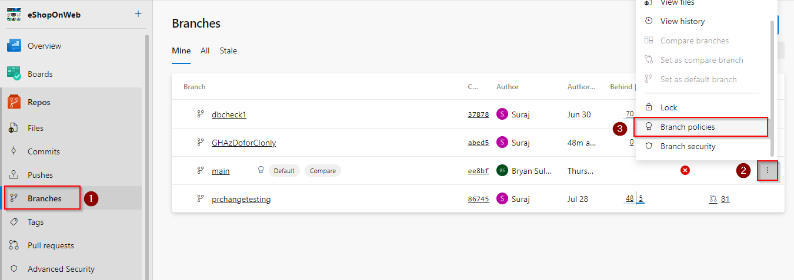
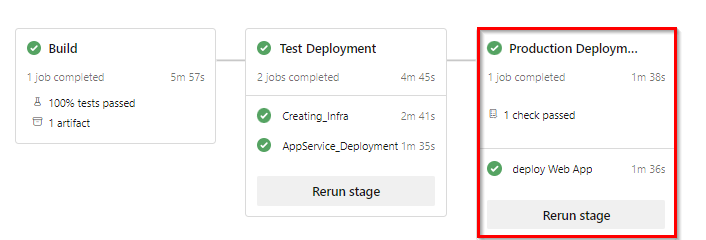

<div class="rw-ui-container"></div>


### Before you begin

- This requires an Azure subscription (free from https://azure.microsoft.com/free). Your live ID should be the owner or co-owner of the subscription. You should have enough credits to be able to create a database and a couple of web apps in the subscription.

### Task 1: Configure the approvals and checks in environments

Once you provision the project follow the below steps to configure the approvals and checks for production and test environments.

1. Navigate to **Pipelines** section and select **Environments**

    

1. Select **Production** environment

    

1. Navigate to **Approvals and checks** and select **Approvals**
    
    

1. Choose yourself as the approver and click on create

    

1. Click on the + button to add additional checks

    

1. Select **Required template** and click on Next

    

1. Click on the + button to add template

    

1. Input the values in the Required YAML template fields and click on **Add required template** button

    - Choose **Azure Repos** radio button
    - Repository: **eShoponweb**
    - Ref: **refs/heads/main**
    - Path to required YAML template: **template.yaml**

   

1. Click on **Create** button.

    

1. Choose the Kebab menu &#8942; and select **Security** option to configure the environment security.

    

1. On the **Pipeline permission** section choose **+** button and select the **eShopOnWeb** pipeline.

    

1. Navigate back to the list of environments, and now select the **Test** environment. Select **Security** option. In the **Pipeline permissions** section choose **+** button and select the **eShopOnWeb** pipeline.

### Task 2: Create an Azure Resource Manager service connection

To create an Azure Resource Manager service connection, you must be the owner or co-owner of the Azure Subscription

1. In Azure DevOps, navigate to **Project Settings** in the project you generated and select **Service connections**

1. Select **+ New service connection**, select the type of connection as **Azure Resource Manger**, and then select **Next**

1. Choose an authentication method, and then select **Next**

    

1. Choose the Authentication type as **Service principal (automatic)** and then select **Next**

    

1. Choose a Subscription Provide the service connection name as **eShopOnWeb** and select **Save**

    

> **Note:** 
    It is important that you name the service connection as **eShopOnWeb** (with that exact case). Otherwise, your pipeline will fail.

1. Choose the Security option on the Kebab menu &#8942; of the newly created service connection
    
    

1.  Under the **Pipelines permission** section, choose **+** button and select the pipeline **eShopOnWeb**. This grants permission to the YAML pipeline to use the service connection.

    

### Task 3: Run the pipeline

1. Navigate the **Pipelines** menu in the project. Select the **eShopOnWeb** pipeline and **Edit** it. In the YAML file, verify that the name of the service connection you created (**eShopOnWeb**) matches the name of the connection specified in the YAML file under various tasks. Look for:

    ```azureSubscription: 'eShopOnWeb'```

1. Start a new run of the pipeline. The pipeline has three stages. In the first stage, it builds the app and runs the tests. It also performs code scanning and dependency analysis. In the second stage, the pipeline sets up new infrastructure in your Azure subscription and deploys a test instance of the web application. In the third stage, the pipeline sets up and deploys a production instance.

1. The **Build** stage takes nearly 10-15 minutes and then proceeds to **Test** stage.

1. When the **Test** stage is completed, it waits for your approval in the **Production**** stage. Review and grant the approval so that the pipeline can be deployed to the production instance.

The whole pipeline takes about 20-30 minutes. So, you must run this pipeline once for you to have all the assets ready for your demo.

### Integrated suite - all in one

> Azure DevOps is a highly customizable integrated tool set that helps everyone in your development teams become more productive.

### Backlog management (Azure Boards)

> We will start with a rich set of backlog management tools that empower managers and leads plan each milestone for your products.

1. Navigate to your **eShoponweb** project on Azure DevOps. It will be something like [https://dev.azure.com/YOURACCOUNT/eShopOnWeb]

1. Navigate to **Boards** and select **Backlog** for **eShopOnWeb Team**. 

1. Select **Epics** view for the backlog.

1. Add **Area Path** to the Column options.

    > Backlogs are organized into epics for a large organization. Epics are broken down into features and user stories for individual teams. Here we have various epics that the teams are working on. You can see that the epics are broken down into features, and the features into user stories. Some features are assigned to the App Development Team while others are assigned to the DBA team. This is a great view if you want to see the backlog across all of your development teams.

1. Switch the team to **App Development Team**. Select **Features** as the backlog view.

    > Now, let us switch the view of this backlog to a specific team. Here I can get a view for my App Development Team. Once again, I can view the various stories organized into features.

    > This method of organizing work into epics, features, and stories is based on the Agile methodology. These work item types are fully customizable and you can choose other ways of working such as Scrum.

1. Select **View as Board** on the team's backlog. Switch back to **Stories** in the view selector.

    > This particular team is using Kanban for their development process. The Kanban board and columns are fully customizable as well. Rules can be used to configure how the story cards are displayed.

1. Select **Dashboards** from the main menu.

    > This is another view if you want a high level overview across all of your teams. Azure DevOps supports a number of dashboard widgets that you can organize to create your own dashboard. Here you can see the progress of all epics and features across all of your teams. You can get a sense of the quality by looking at the state of bugs across the board.

1. Switch the team in the dashboard to **App Development Team** by selecting **All Dashboards**.

    > Here is the dashboard for the App Development team in particular. Note how each team can create its own dashboard. Here the team is able to get an overview of their own stories and bugs. We have widgets that will help you visualize the velocity and burn down. This will help your teams continuously improve their development process and reduce waste in the cycle.

### Git experience with pull requests (Azure Repos)

Let us see the experience of a developer in a team that wants to work on a new user story. Azure DevOps comes with a fully featured Git server that powers some of the largest repositories in the world.

1. Go back to the Kanban board for the **App Development Team**

    > I can start right from the user story and create a new branch to work on it.

1. Hover over the work item, `Change the background color of the [ADD TO BASKET] button`. From the work item **...** Actions menu, select **New Branch**

    

1.  Name the branch and select the repository on which it's based. The branches you create are automatically linked to the work item.
    
    

1. The system opens to the repository and branch that you created. You can edit a file within the web portal or you can clone the repo in your favorite IDE. For the purpose of this demo, we recommend doing this in the web portal. For more information on doing this from Visual Studio, see [Clone an existing Git repo](https://learn.microsoft.com/en-us/azure/devops/repos/git/clone?view=azure-devops&tabs=visual-studio-2022).

    > I can use my favourite IDE to clone this repo and edit the code. Or else, there is a fully integrated web-based code editor in Azure DevOps.

1. Navigate to the `path=/src/Web/Pages/Shared/_product.cshtml` to change the color of the ADD TO BASKET button. Append `style="background-color: blue;"` snippet as shown below. Then **Commit & Push** changes. 

   

1. Once changes are Committed, [Create Pull Request](https://learn.microsoft.com/en-us/azure/devops/repos/git/pull-requests?view=azure-devops&tabs=browser). 

    

    > Azure DevOps features a rich set of pull request experiences, which we will talk about now.

1. Upon creating a pull request, a PR Build is initiated. 
   
   

    > You can configure protection policies on your branches in Azure DevOps. In this case, we have two policies configured on the main branch. One is a build validation policy. This policy will automatically run a build on the PR before it is merged. This will allow you to run unit tests and make sure that all of them pass before the code is merged into main branch. The second policy that is configured here is the work item policy. Every PR that is being merged into main requires a work item to be linked to it. Those are just two examples of policies you can enable for protecting branches. There are other examples here such as code reviewer policies and so on.

1. Navigate to **Branches** menu, and select **Branch policies** for the main branch.

    
    
    


    > Coming back to the PR in progress, we see that it is already linked to the work item that we started with. The build validation is in progress, and once it is completed, we will be ready to merge this into main. While the build is in progress, let us jump into it and see what is going on in the build.

1. Select the in-progress pipeline and navigate to it. Show the live logs. Show the unit tests that are running.

    
    
    

    > Everything in Azure DevOps is tied up to each other. Note how I was able to validate to the build from the PR. And here, I can view the PR from the build. I can also see what work items are being built as part of this pipeline run.

1. On the build summary page show details about the PR and the work item.
    

    > Let us jump into the unit tests that are being run as part of this validation build. Azure DevOps features a great experience for reviewing your test results and to debug test failures. Here we have all tests passing in this PR build. Similarly, you can also integrate code coverage as part of your build. And, the best thing is that you can prevent code from a PR to be merged into main if any of these do not pass your criteria.

1. Navigate to the Test results page. Show Code coverage.
    

    > Let us now go back all the way to the PR that we started. We see that all the policies have passed. So, we are going to complete this PR.

1. You may proceed with merging the changes after the successful completion of the PR Build. 

    
### Build and Deploy to Test Environment

1. Once the merge is completed to `main` branch a CI build will trigger and this build process will include deploying the application to the `Test Environment`.

1. Once the application is deployed to **Test Environment**, navigate to the web app created to view the deployed application.

   

1. Following the deployment to the Test Environment, the Deployment trigger for the Production environment will be initiated. To commence the deployment in the Production environment, we have implemented Approvals and Checks as part of the process. However, before proceeding, it is recommended to conduct testing on the application that has been deployed to the Test environment to verify the changes done.


### Manual Testing (UAT)

 During the ongoing development process, the Testing team will concurrently create a suite of tests designed to evaluate the functional modifications.

1. Navigate to **Test Plans** and select the Tests created to verify the changes done.
   

1. Run the manual test. For more information see [here](https://learn.microsoft.com/en-us/azure/devops/test/run-manual-tests?view=azure-devops)
    
    

1. Use Test Runner to record which test steps pass or fail while you manually run a test. 

   

   Mark each test step as either passed or failed based on the expected results. If a test step fails, you can enter a comment on why it failed

1. When you've run all your tests, select **Save and close**. 

### Deploy to Prod Environment

Once we are content with the Test Results, we can move forward with the deployment to production.

1. Navigate to the pipeline and select the checks configured for Prod

   

1. The Deployment Approval is set up as a check. Please grant approval for the changes to initiate the deployment to the Production environment.

   

1. Once the application is deployed to **Test Environment**, navigate to the the web app created to view the deployed application with changes.

   
    

With the power of Azure DevOps, an idea has undergone a transformative journey, seamlessly navigating through all stages of the DevOps process.
