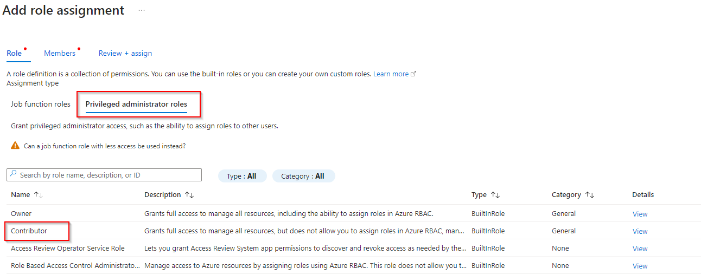
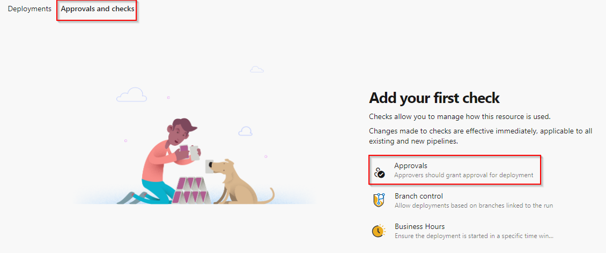
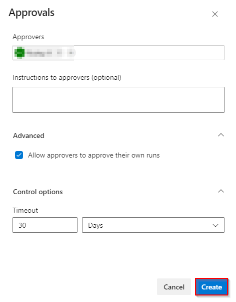
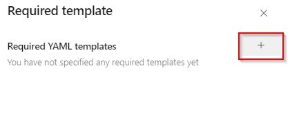
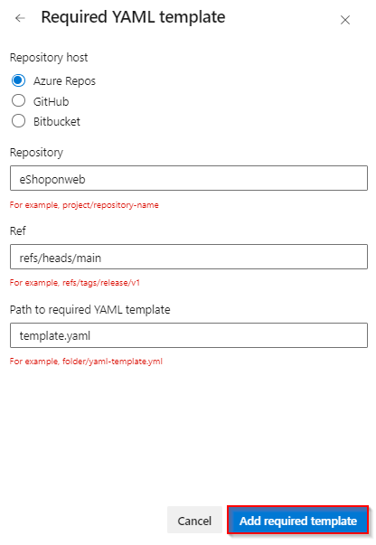
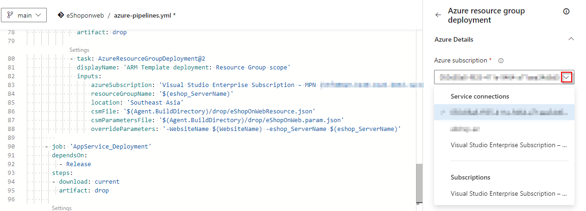

## Azure Pipelines

Azure Pipelines automatically builds and tests code projects. It supports all major languages and project types and combines continuous integration, continuous delivery, and continuous testing to build, test, and deliver your code to any destination.

To learn more about Azure Pipelines, see <a href="https://learn.microsoft.com/en-us/azure/devops/pipelines/get-started/what-is-azure-pipelines?view=azure-devops"><u> What is Azure Pipelines?</u></a> and <a href="https://www.azuredevopslabs.com/labs/azuredevops/yaml/"><u>Configuring CI/CD Pipelines as Code with YAML in Azure DevOps</u></a>

### Task 1: Creating a service connection to Azure

1. Open the Azure cloud shell. Select Bash when prompted to choose shell. Create storage in your subscription if it is not present

    
    
    

1. Enter the following command by replacing ServicePrincipalName with your desired value.

    `az ad sp create-for-rbac -n ServicePrincipalName`

1. It will give you a JSON output as shown in the image. Copy the output to a notepad or text file. You will need them later.

    

1. Now, we need to grant contributor permission to the service principal. For that, go to the Subscriptions section in the Azure portal

    

1. In the left pane, select **Access control(IAM)** and then click on **Add role assignment** option that is available under Grant access to this resource section.

    

1. Choose **Contributor** role under the **Privileged administrator roles** and click on Next

    

1. Now, using + Select Members select the service principal that has been created and click on Next. Review + assign now to finish role assignment.

    

1. Enter the following command to get Azure SubscriptionID and copy the subscription ID and name to Notepad.

    `az account show`

1. Now, open Azure DevOps and open your project.

    

1. Open Project settings

    

1. Navigate to **Service connections**

    

1. Click on New Service connection -> Azure Resource Manager -> Service Principal (manual).

    Fill the information from the previously created service principal:

- Subscription ID and name: can be found in the keyvault resource overview page.

- Service Principal Id = AppId in the copied notes.

- Service Principal key = Password in the copied notes.
TenantId, copy from the notes.

- Provide a name to the service connection and a description is optional

Click on Verify to check it works, give the connection a name and click **Verify and Save**.

### Task 2: Configure the approvals and checks using Environments

1. Navigate to **Pipelines** section and select **Environments**

    

1. Select **Production** environment

    

1. Navigate to **Approvals and checks** and select **Approvals**
    
    

1. Choose an approver and click on create

    

1. To select additional checks, click on **+** button

    

1. Select **Required tempalte** and click on Next

    

1. Click on + button to add tempalte

    

1. Input the values in the Required YAML template fields and click on **Add required template** button

    - Choose **Azure Repos** radio button
    - Repository: **eShoponweb**
    - Ref: **refs/heads/main**
    - Path to required YAML template: **template.yaml**

   

1. Repository will be pointing to the main branch, click on **Create** button

    

### Task 3: Updating details in the pipeline

1. Navigate to the **Pipelines** section

    

1. Go to All and click on **eShopOnWeb**
   
    

1. Click on Edit option available at the right-top
   
    

1. Collapse the Build stage as we have to change some configurations in the DEV stage
   
    

1. Now click on **Settings** option available on the top of AzureResourceDeployment Task
   
   

1. On the right pane, for **Azure subscription** field choose the service connection name that you created earlier from the drop-down.
   
    

1. Do the same thing for **AzureWebApp** task
   
    

#### For your information:
  - **Resource group:** Value we are passing in the variable section
  - **Location: Southeast Asia** is selected. You can change it as per your preference.

    

- Also, as we are using ARM template here to create resources we need to pass both **template file** and **parameter file** location  

    
    

### Task 4: Queuing the pipeline

Once the details are updated you can continue running the pipeline. This will run both build and deployment.

1. Save the modified pipeline.
    

1. Click on Run
   
    

1. Leave the default branch as main and Run
   
    

1. You will be able to see Build stage will run first and deployment to DEV will happen after that.
   
    

1. Once after build and release get succeeded. Navigate to Azure portal and Browse the application
   
    

1. This will open the application in the new tab
   
    

