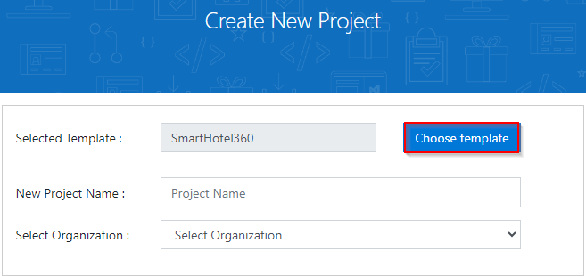
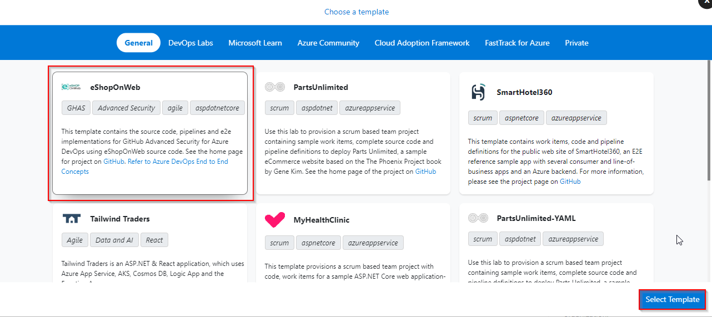

### Prerequisites

- An Azure subscription (free from https://azure.microsoft.com/free). Your live ID should be the owner or co-owner of the subscription. You should have enough credits to be able to create a database and a couple of web apps in the subscription.

- An Azure DevOps organization (free from https://azure.microsoft.com/services/devops). You should have created this organization with your live id and not your Microsoft account. It does not matter if you created some projects in this organization since we will be creating a new one anyway in this script.

### Task 1: Configuring the eShopOnWeb team project

1. Navigate to [https://azuredevopsdemogenerator.azurewebsites.net](https://azuredevopsdemogenerator.azurewebsites.net/). This utility site will automate the process of creating a new Azure DevOps project within your account that is prepopulated with content (work items, repos, etc.) required for the demo. For more information on the site, please see [https://docs.microsoft.com/en-us/azure/devops/demo-gen](https://docs.microsoft.com/en-us/azure/devops/demo-gen).

1. Sign in using the Microsoft account associated with your Azure DevOps subscription.

    

1. **Accept** the permission requests for accessing your subscription.

1. Select your Azure DevOps organization and enter the project name **"eShopOnWeb"**. Click **Choose Template**.

    

1. Select the **eShopOnWeb** template and click **Select Template**.

    
    

1. Provide a project name and choose your Organization.

1. Click **Create Project** and wait for the process to complete.

    

1. Navigate to your eShopOnWeb project on Azure DevOps. It will be something like [https://dev.azure.com/yourorganization/eShopOnWeb]()