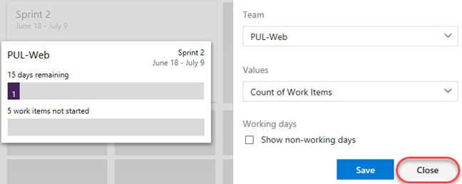
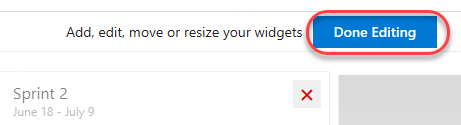
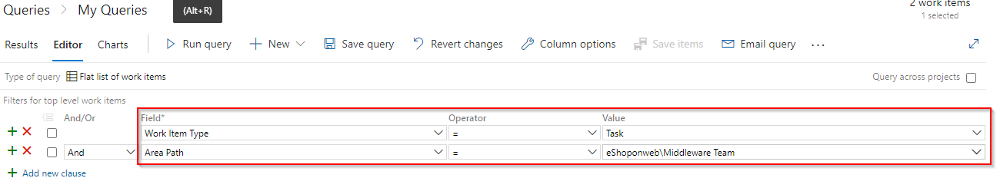

## Azure Analytics and Reporting

Reporting in Azure DevOps enables software development teams to make data-driven decisions and deliver value to their customers faster. For more information about Azure Analytics and Reporting, see<a href="https://learn.microsoft.com/en-us/azure/devops/report/?view=azure-devops"> <u> What is Azure Analytics and Reporting?</u></a>

### Task 1: Defining dashboards ###

1. Select **Overview | Dashboards**.

    

1. From the dashboard dropdown, select **eShopOnWeb Team Overview**. Dashboards allow teams to visualize the status and monitor progress across the project. At a glance, you can make informed decisions without having to drill down into other parts of your team project site. The Overview page provides access to a default team dashboard which you can customize by adding, removing, or rearranging the tiles. Each tile corresponds to a widget that provides access to one or more features or functions.

    

1. From the dashboard dropdown, select **New dashboard**.

    

1. Set the **Name** to **"Product training"** and select the **PUL-Web** team. Click **Create**.

    

1. Click **Add a widget**.

    

1. In the **Add Widget** panel, search for **"sprint"** to find existing widgets that focus on sprints. Select **Sprint Overview** and click **Add**.

    

1. Many widgets have options you can configure. Click the **Settings** button.

    

1. The quantity and depth of settings will vary by widget. Click **Close** to dismiss.

    

1. Search the widgets again for **"sprint"** and add the **Sprint Capacity** widget.

    

1. Click **Done Editing**.

    

1. You can now review two important aspects of your current sprint on your custom dashboard.

    

1. Another way of customizing dashboards is to generate charts based on work item queries, which you can share with a dashboard. Select **Boards | Queries**.

    

1. Click **New query**.

    

1. Set the first term to **Work Item Type = Task** and the second term to **Area Path = eShopOnWeb\Middleware Team**.

    

1. Click **Save query**.

    

1. Set the **Name** to **"Web tasks"** and the **Folder** to **Shared Queries**. Click **OK**.

    

1. Select the **Charts** tab and click **New chart**.

    

1. Click **New chart**.

    

1. Set the **Name** of the chart to **"Web tasks - By assignment"** and **Group by** to **Assigned To**. Click **OK** to save.

    

1. You can now add this chart to a dashboard.

    
