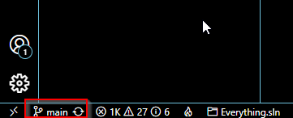
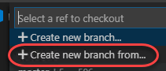

## Azure Repos

Azure Repos is a set of version control tools that you can use to manage your code. Whether your software project is large or small, using version control as soon as possible is a good idea. Azure Repos provides two types of version control: Git and Team Foundation Version Control (TFVC). For more information about Azure Repos, see <a href ="https://learn.microsoft.com/azure/devops/repos/get-started/what-is-repos?view=azure-devops"> <u>What is Azure Repos?</u></a>. 

<a href="https://www.azuredevopslabs.com/labs/azuredevops/git/"><u>Version Controlling with Azure Repos</u></a>

### Task 1: Cloning an existing repository ###

1. In a browser tab, navigate to your team project on Azure DevOps.

1. Getting a local copy of a Git repo is called "cloning". Every mainstream development tool supports this and will be able to connect to Azure Repos to pull down the latest source to work with. Navigate to the **Repos** hub.

    

1. Click **Clone**.

    

1. Click the **Copy to clipboard** button next to the repo clone URL. You can plug this URL into any Git-compatible tool to get a copy of the codebase.

    

1. Open an instance of **Visual Studio Code**.

1. Press **Ctrl+Shift+P** to show the **Command Palette**. The Command Palette provides an easy and convenient way to access a wide variety of tasks, including those provided by 3rd party extensions.

1. Execute the **Git: Clone** command. It may help to type **"Git"** to bring it to the shortlist.

    

1. Paste in the URL to your repo and press **Enter**.

    

1. Select a local path to clone the repo to.

1. When prompted, log in to your Azure DevOps account.

1. Once the cloning has been completed, click **Open** to open the cloned repository. You can ignore any warnings raised about opening the projects. The solution may not be in a buildable state, but that's okay since we're going to focus on working with Git and building the project itself is not necessary.

    

### Task 2: Create a new branch

You can manage the work in your Azure DevOps Git repo from the **Branches** view on the web. You can also customize the view to track the branches you care most about so you can stay on top of changes made by your team.

Committing changes to a branch will not affect other branches and you can share branches with others without having to merge the changes into the main project. You can also create new branches to isolate changes for a feature or a bug fix from your master branch and other work. Since the branches are lightweight, switching between branches is quick and easy. Git does not create multiple copies of your source when working with branches but rather uses the history information stored in commits to recreate the files on a branch when you start working on it. Your Git workflow should create and use branches for managing features and bug fixes. The rest of the Git workflow, such as sharing code and reviewing code with pull requests, all work through branches. Isolating work in branches makes it very simple to change what you are working on by simply changing your current branch.

1. Return to **Visual Studio Code**.

1. Click the **main** branch from the bottom left.

    

1. Select **Create a new branch from...**.

    

1. Select the **"origin/main"** for the ref to create the new branch and press **Enter**.

    

1. Type the name as **dev** for the new branch.

    

1. You are now working on that branch.

    

### Task 4: Commit changes

1. From the **Explorer** tab, open **/eShoponWeb/src/Web/appsettings.json**.

    

1. Add a comment to the file as shown in the image. It doesn't really matter what the comment is since the goal is just to make a change. Press **Ctrl+S** to save the file.

    

1. Select the **Source Control** tab to see the one change to the solution.

    

1. Enter a commit message of **"My commit"** and press **Ctrl+Enter** to commit it locally.

    

1. If asked whether you would like to automatically stage your changes and commit them directly, click **Always**. We will discuss **staging** later in the lab.

    

1. Click the **Publish Branch** button to push your changes to the remote. Confirm the sync if prompted.

    

### Task 2: Reviewing commits ###

1. Switch to the Azure DevOps browser tab. You can review the latest commits on Azure DevOps under the **Commits** tab of the **Repos** hub.

    

1. The recent commit should be right at the top.

    

### Task 3: Staging changes ###

Staging changes allows you to selectively add certain files to a commit while passing over the changes made in other files.

1. Return to **Visual Studio Code**.

1. Update the open **appsettings.json** class by adding another comment and saving the file.

    

1. Open **appsettings.Docker.json** as well. Add a new comment here so there will be two files with changes. Save the file.

    

1. From the **Source Control** tab, click the **Stage Changes** button for **appsettings.json**.

    

1. This will prepare **appsettings.json** for committing without **appsettings.Docker.json**.

    

1. Enter a comment of **"Added comments"**. From the **More Actions** dropdown, select **Commit Staged**.

    

1. Click the **Synchronize Changes** button to synchronize the committed changes with the server. Note that since only the staged changes were committed, the other changes are still pending locally.

    

