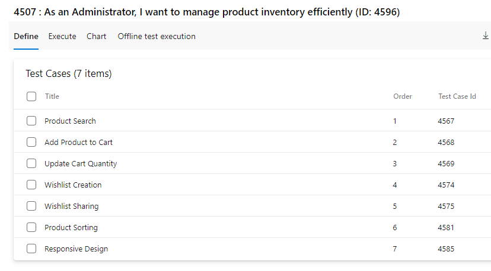
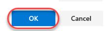
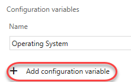
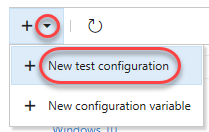
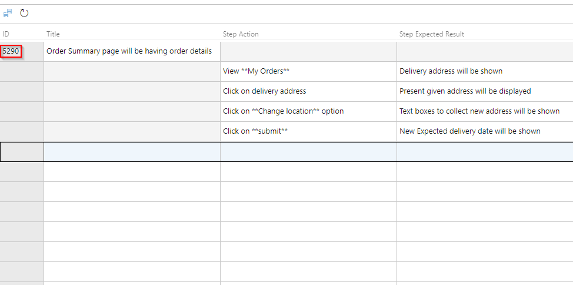

## Azure Test Plans

Azure Test Plans provides rich and powerful tools everyone in the team can use to drive quality and collaboration throughout the development process. The easy-to-use, browser-based test management solution provides all the capabilities required for planned manual testing, user acceptance testing, exploratory testing, and gathering feedback from stakeholders.

To learn more about Azure Test Plans, see <a href="https://learn.microsoft.com/azure/devops/test/overview?view=azure-devops"><u> What is Azure Test Plans?</u></a> and <a href="https://www.azuredevopslabs.com/labs/azuredevops/testmanagement/"><u>Test Planning and Management with Azure Test Plans</u></a>.

## Exercise 1: Managing Test Plans, Suites and Cases

In this exercise, you will learn how to create and manage test plans, test suites and test cases

### Task 1: Understanding Test Plans, Suites and Cases ###

1. Navigate to your team project on Azure DevOps.

1. Select **Test Plans** to navigate to the **Test Hub**. The test hub provides a central place for all test planning, execution, and analysis.

    

1. In general, every major milestone in a project should have its own **test plan**. Within each test plan are **test suites**, which are collections of **test cases** (and optionally other test suites) designed to validate a work item, such as a feature implementation or bug fix. Each test case is designed to confirm a specific behavior and may belong to one or more test suites. The eShopOnWeb project has one test plan, which is under the **App Development Team** and called **eShopOnWeb_Testplan**. Select the **eShopOnWeb_TestPlan1** test plan.

    

1. Select the suite of tests for the story **As a customer, I want to manage product inventory efficiently**. This suite of tests focuses on that work item, which happens to be a feature. Note that the work item numbers will vary every time you generate demo data for a lab.

    

1. On the right side, you can see that this test suite has six test cases designed to confirm the expected behavior of the feature implementation. Double-click the **Wishlist Creation** test case.

    

1. This dialog provides all the info you need on this test case. Locate the **Related Work** panel and note that this test case is linked to the suite it belongs to. Right-click on the work item and click on **View requirement**.

    

1. In the test suite, we can see all of the linked work items, which happen to be the test cases.

    

1. However, it's not yet associated with the feature it's designed to test, which we can link now. Click **Add link \| Existing item**.

    

1. Set the **Link type** to **Parent** and search for **"product inventory"**.

    

1. Select the **Feature** for **manage product inventory efficiently**.

    

1. Click **OK**.

    

1. The parent feature is now associated with the suite that tests it and anyone can navigate between them to view their relationship relative to the other work items involved.

    

1. Click **Save & Close**.

    

1. Dismiss the original test case dialog.

### Task 2: Managing Tests ###

1. Sometimes a set of test cases should be run in a specific order to maximize efficiency. This could be done using by Dragging and dropping the test cases. Notice the current order

    

    
1. While these test cases could be run separately to confirm the behavior, it probably makes more sense to have a product search test case first and then add the product to the cart. Then, the tester can confirm that the search functions working, followed by adding product to the cart. Drag and drop the second test case above the first.

    

1. You can now see that the **Order** has been updated and that the list is now sorted by it.

    

1. Another significant aspect of testing has to do with the environment each test is run in. For this web app, the browser and operating system are key considerations. Select the **Configurations** tab.

    

1. Note that there is one existing configuration for **Windows 10**. Each test configuration includes a name and a description, as well as a set of customizable **Configuration variables**. This project has one configuration variable set for **Operating System**. You can easily add more and/or edit the available entries for each. Click **Add configuration variable**.

    

1. Select the **Browser** variable and set it to **Microsoft Edge**.

    

1. Click **Save** to save the configuration.

    

1. Now let's suppose the test team has acquired an iPhone 14 and wants to add it into the test matrix. It's really easy to register this environment as a new configuration so that test cases can specify it. However, before adding it, we'll need an **Operating System** option for **iOS 16**. Click the **Operating System** configuration variable.

    

1. Click **Add new value** and add an entry for **iOS 16**.

    

1. Click **Save**.

    

1. Now we have everything we need to add the iPhone 14. Click the **Add** dropdown and select **New test configuration**.

    

1. Set the **Name** to **"iPhone 14"**.

    

1. Click **Add configuration variable** twice and set the **Browser** to **Safari** and **Operating System** to **iOS 16**. Click **Save** to save the new configuration.

    

1. Return to the **Test Plans** tab.

    

1. Rught Click on the test suite we've been working with so far and select **Assign configurations**.

    

1. Check the **iPhone 14** option and click **Save**.

    

1. Notice that each test case has been duplicated with a configuration for **iPhone 14**. Now each environment can be tested and tracked separately.

    

### Task 3: Authoring Tests ###

1. Expand the dropdown next to the test plan and select **New static suite.** A **static suite** of test cases is a suite where the cases have been manually assigned. You can also create suites based on common requirements (**requirement-based suite**) or a query of test cases and/or work items (**query-based suite**).

    

1. Set the name of the new suite to **"Shipping tests"**. These tests will all focus on functionality related to shipping. Remember that you can easily share test cases across suites, so there's minimal redundancy when having a lot of overlapping suites.

    

1. Expand the dropdown next to the newly created suite and select **New requirement-based suite**.

    

1. You could customize the query used to specify which requirements are retrieved, add the Area Path = eShopoweb\App Development Team and click **Run query**. Locate and select the two product backlog items related to shipping. Click **Create suites** to create a test suite for each.

    

1. Select one of the newly created suites, such as the one associated with tracking package status.

    

1. While you can create test cases one at a time, it's sometimes easier to use a grid layout to quickly add many test cases. In the test cases panel, select **New \| New test case using grid**.

    

1. Enter a few test cases and click the **Save All** button. The **Title** will be the eventual title of the test case. **Step Action** will be the first (and possibly only) step of the test. If that step has an expected result, you can specify it as **Step Expected Result**.

    

1. You can optionally continue to add and edit work items in the grid view. When satisfied, return back to the list view by clicking the **View: Grid** toggle.

    

1. We can use the toggle and click on **Open test case** to view the test case as a work item.

    

1. Another option to create suites is via work item query. Expand the dropdown next to the **Shipping tests** suite and select **new query-based suite**.

    

1. Let's say you wanted to create a test suite out of test cases related to shipping in the project. Change the **Work Item Type** to **Microsoft.TestCaseCategory** to search for test cases and click **Run query**. You now have a list of test cases that you can select to create suites from, if you choose.

    

1. Press **Esc** to close the dialog.

## Exercise 2: Authoring, Running and Analyzing Manual Tests ##

In this exercise, you will learn how to create a manual test plan and populate it with steps. The plan can later be run to confirm the expected behavior of your software. In this lab, we're going to focus on creating a new manual test case and running it.

### Task 1: Installing the Test & Feedback Extension ###

1. Install **Google Chrome** from [http://google.com/chrome](http://google.com/chrome). The rest of this exercise will use Chrome as its browser. If you're already using Chrome, just open a new instance for the next set of steps.

1. Navigate to the **Azure DevOps Marketplace** at [http://marketplace.visualstudio.com](http://marketplace.visualstudio.com/).

1. Select the **Azure DevOps** tab. Search for "**feedback**" and click the **Test & Feedback** extension.

    

1. Click on **Install** button on the details page.

    

1. Click **Install** for the Chrome extension.

    

1. In the **Chrome Web Store**, click **Add to Chrome**.

    

1. Confirm the installation when asked.

    

1. To open the extension, click the extension icon that will appear on the right of the address bar. Select the **Connection Settings** tab. Enter the URL of your Azure DevOps instance, such as "**https://dev.azure.com/YOUR-ORG**", as the **Server URL** and click **Next**.

    

1. The extension can be used in two modes: **Connected** and **Standalone** mode. If you have Azure DevOps or Team Foundation Server (TFS), select Connected mode. Standalone mode is for users who don't have Azure DevOps or TFS and want to use the extension to file bugs and share the report with their team.

1. After connecting to Azure DevOps, you will need to select the team you want these efforts associated with. Select the **eShopOnWeb Team** under the **eShopOnWeb** project and click **Save** to continue.

    

### Task 2: Authoring a Manual Test Plan ###

1. In Chrome, navigate to your **eShopOnWeb** project.

1. As before, navigate to the **Test Plans** hub.

    

1. Expand the dropdown next to the test plan and select **New static suite**.

    

1. Name the new suite **"End-to-end tests"** and press **Enter**.

    

1. From the **Tests** tab, select **New** and use **New test case** option to create a new test case.

    

1. In the **Title** box, type "**Confirm that order number appears after successful order**" as the name of the new test case.

    

1. At this point, we're ready to add steps to this manual test. Each step includes an **Action**, which describes the action the tester needs to perform. Optionally, a step can include an **Expected Result**, which describes the expected result of the given action. In the **Steps** panel, create a step for each of the following **Actions**, only one of which has an **Expected Result**.

    |Action|Expected Result|
    --- | ---
    |Open project site||
    |Click on Brands drop-down||
    |Choose .NET||
    |Click on TYPE drop-down||
    |Choose T-Shirt and Click on Search icon||
    |click on Add to Basket option below a T-Shirt||
    |Enter @Email, @Password||
    |Click Checkout||
    |Confirm order page has order #|Order # should appear on order confirmation page|
    |Log out||
    |Close browser||

    >**Note:** If you end up with an extra empty step, delete it.

1. At this point, the **Steps** panel should look similar to the following:

    

1. Note the "Enter @Email, @Password". In these steps, we used the **@** sign to indicate that there were iteration-specific variables to be used during the manual test pass. We can define which variables to use by scrolling down to the **Parameter Values** section of this form and entering them for each iteration. Note that you may need to use the scroll bar on the far right side of the test case dialog to view this section.

    

1. Use the following table to set up values.

   - Email:  admin@test.com
   - Password: P@ssw0rd

1. The **Parameter Values** section should now look like this. Note that you can enter as many iterations as you need to fully test the breadth of the scenario.

    

1. Click **Save & Close** to save the test case.

    

### Task 3: Running a Manual Test Plan ###

1. In this task, you will learn how to run the manual test plan that we created earlier. Note that the process for triggering an automated test run follows a similar workflow. You can learn more about that in the [documentation](https://docs.microsoft.com/en-us/vsts/build-release/test/run-automated-tests-from-test-hub).

1. Right-click the test case created earlier and select **Run with options** to begin a manual test run.

    

1. There are a few options that you can use to customize each test run. The first option is to select a **Runner**, which will be the browser in this scenario. Next, you may have the option to specify which kinds of **data to collect**. Finally, you may optionally specify which build is being tested to make it easier to associate the results with the build they were from. Click **Run** to continue.

    

1. If the **Test Runner** window does not appear, check to see if it was blocked by the pop-up blocker. If so, click the **Pop-up blocker** button, select **Always allow pop-ups...**, and then click **Done**. You can then launch the test run again with success.

1. The first step in the test is to open the project site. To do this,

    - If application is hosted in IIS - switch to the **Visual Studio** instance that has the **eShopOnWeb** solution loaded. From the **IIS Express** target dropdown, select **Browse With...**.

    > **Note:** If application is hosted in Azure - open the respective URL  and move to **Step 8**

    

1. Select **Google Chrome** and click **Browse**.

    

1. If you're working on a large screen, it may be easier to resize the new window to fit next to the **Test Runner** window. Otherwise you can just switch back and forth.

    

1. Once the site loads, return to the **Test Runner** and click the **Pass test step** button. As you complete the next steps of this test, be sure to check the **Pass test step** buttons for them as well.

    

1. The next step is to choose .NET as a **Brand** and T-Shirt as **TYPE** and search

    

1. Then click the **Add to Basket** option available under a T-Shirt.

    

1. The next step is to click **[Checkout]**.

    

1. Log in using the credentials specified in the next step.

    

1. Unfortunately, this will fail because there isn't an [admin@test.com](mailto:admin@test.com) account.

    

1. The **Test Runner** provides three valuable ways to record media from a test run. The first option is to take screenshots. The second is to capture each user action in an image action log. The final is to record the screen as a video. Click the **Capture screenshot** button to take a screenshot.

    

1. Crop the screen down to show the login form and error message. Specify the name **"No admin account"** and click the **Confirm** button.

    

1. Right-click the failed step and select **Add comment**.

    

1. Enter a comment of **"Admin account does not exist by default"** and fail the test using the **Fail test step** button.

    

1. Click **Create bug** to log a new bug.

    

1. Enter the bug title of **"Admin account does not exist by default"** and click **Save & Close** to log the bug.

    

1. Since the test cannot be completed due to a bug not directly related to the functionality being tested, expand the **Mark test case result** dropdown and select **Block test**. Click **Save and close** to save the test run.

    

1. Close the test browser windows.

### Task 4: Analyzing Manual Test Results ###

1. In this task, you will learn how to review the results of a manual test run.

1. Return to the browser window hosting the **Test Hub**. Select the **Runs** tab.

    

1. Double-click the most recent test run to open it. You may need to refresh the data to see it.

    

1. The **Run summary** tab provides an overview of the test run, as well as high-level details on the results of all tests included as part of the run.

    

1. Select the **Test results** tab. This tab lists the results of each individual test case included in the run along with their results. Since there was only one test case included here, double-click it to open.

    

1. You can review all details for this particular test case run from here.

    

1. Review the results of each step in this iteration, as well as the failed login step, which shows the screenshot attached during the test run.

    

### Task 5: Creating Shared Steps ###

1. In this task, you will learn how to create shared steps. A shared step combines multiple steps that are commonly performed in sequence into a single logical step, which can be shared across tests. If the process defined by the shared steps ever changes in the future, you can update the shared step in one place and it will be reflected in all tests that reference it.

1. Click the test case link in the **Summary** section.

    

1. Double-click the case to open it in the test case editor.

    

1. Select steps 1-4 (use **Shift+Click**) and click the **Create shared steps** button.

    

1. Set the name of these shared steps to **"Add Disk and Pad Combo to cart"** and click **Create**.

    

1. Now you can see the previous steps replaced with the shared steps. Double-click the shared steps to open.

    

1. You can use these steps later while writing the new test cases using **Insert shared steps** button.

    

1. Click **Run Query** and choose the saved shared steps and Insert shared step

    

1. New test case with the shared step added will be seen as below

    
