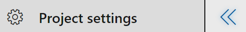
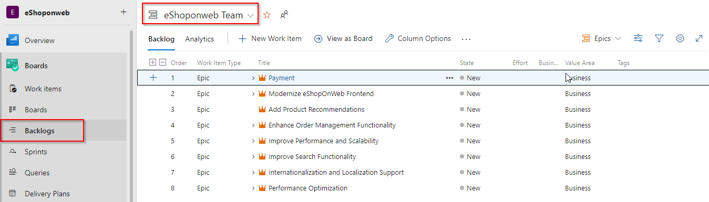

## Overview ##

In this lab, you will learn about the usage of Advanced security features like preventing security leaks, scanning for the vulnerabilities and dependency scanning in software development process.

### Prerequisites ###

### Task 1: Configuring the eShopOnWeb team project ###

1. Navigate to [https://azuredevopsdemogenerator.azurewebsites.net](https://azuredevopsdemogenerator.azurewebsites.net/). This utility site will automate the process of creating a new Azure DevOps project within your account that is prepopulated with content (work items, repos, etc.) required for the lab. For more information on the site, please see [https://docs.microsoft.com/en-us/azure/devops/demo-gen](https://docs.microsoft.com/en-us/azure/devops/demo-gen).

1. Sign in using the Microsoft account associated with your Azure DevOps subscription.

    

1. **Accept** the permission requests for accessing your subscription.

1. Select your Azure DevOps organization and enter the project name **"eShopOnWeb"**. Click **Choose Template**.

    #Need to update image

1. Select the **eShopOnWeb** template and click **Select Template**.

    #Need to update image

1. Click **Create Project** and wait for the process to complete.

    #Need to update an image

1. Navigate to your eShopOnWeb project on Azure DevOps. It will be something like [https://dev.azure.com/YOURACCOUNT/eShopOnWeb]

1. Open the settings page using the **Project settings** navigation located at the bottom left of the page.

    

1. Go to Repositories and click on eShopOnWeb and enable **Advanced Security**. Also enable the **Block secrets on push** check box

    

## Exercise 1: Agile Project Management ##

### Task 1: Working with teams and iterations ###

1. Select the **Teams** tab. There are already three teams in this project.

    

1. Select **"App Development Team"** and navigate to Iterations and Area Paths

    

1. Currently this team is working on three iterations and we can add additional **iteration** by navigating to the Iterations section and by clicking on **Select iteration(s)**.

    

1. **Save and Close** to finish the iteration assignment to DBA team

1. We can check all the work that is assigned to the team by navigating to the **Backlogs** section under the Boards.

     

1. By clicking on '+' icon we can check the child level of workitems. Click on this icon for three times, this should display the child workitems type upto task.

     

1. Navigate to the **Sprints** section under the Boards. Change the team to DBA Team using the drop-down

    

1. Click on task that says to update the database password  in a specific file
    
    

1. Assign the task to yourself by choosing your ID in the drop-down and read the description of the task
    
    

1. Drag and drop the task to **Active** field, since we are starting the work.
     
     

### Task 2: Updating the source code in Azure Repos ###

1. As per the task description we have to create a new branch before updating the credentials. So, use the ellipsis (**...**) icon and click on **New branch**

    

1.  Create a new branch with a name **dbactivity** based on main

    

1.  Now, navigate to **src | web | appsettings.json** and start editing the file by clicking on **Edit** option

     

1. Update the password in both line number 7 and 8.

    

1. Click on **Commit**. Provide a commit message and choose the assigned work item by using the drop-down and **Commit**

    

1. Use the Create a pull request option to create the pull request from **dbactivity** branch to the **main**
    
    

    

### Task 3: Navigation's in **Advanced Security** section ###

1. Once you click on **Advanced Security** you will observe alerts regarding the open-source package vulnerabilities present in your code- through both direct and transitive dependencies – and provides straightforward guidance from the GitHub Advisory Database on how to upgrade your packages to mitigate the vulnerabilities. 

    

1. Click on **Code scanning** to check alerts on code security vulnerabilities such as SQL injection and authorization bypass. This uses industry leading CodeQL static analysis engine

    

1. Click on **Secrets** where you can find alerts related to the secrets that have already been exposed in Azure Repos

    

1. Clicking on any of the alert will provide detailed description and recommendation to fix that particular case.
   
     

### Task 4: Creating the build and deployment ###
1. Select **Pipelines \| Pipelines** from the left navigation bar.

1. To trigger a build, choose the **eShoponweb-ASP.NET Core-CI** definition and then **Run Pipeline** to manually queue it.

    

   

1. Go to **Releases** under **Pipelines** and then select and **Edit** the **eShoponwebapp-Deployment** definition.

1. Click on **3 jobs, 4 tasks** option present just below the stage name **AzureAppService** to start configuring the stage

1. Under **Creating the Infra**, notice the task definition for **ARM Template deployment** task settings need attention. Click on that task.

1. You need to authorize the pipeline to deploy to Azure. Azure pipelines can automatically create a service connection with a new service principal, but we want to use the one we created earlier. Click **Manage**, this will redirect to the Service connections page. 
    
    

   Click on **New Service connection** -> **Azure Resource Manager** -> **Service Principal (manual)**.
   Fill the information from previously created service principal:

    -  Subscription Id and name: can be found in the keyvault resource overview page.
    -  Service Principal Id = AppId in the copied notes.
    -  Service Principal key = Password in the copied notes.
    -  TenantId , copy from the notes.

    Click on **Verify** to check it works, give the connection a name and click **Verify and Save**.

    
   

1. Route back to the pipeline definition and choose the created service connection in the Azure subscription drop-down.

    
 
1. Provide the location value as **Southeast Asia** where we deploy an ARM template.

    

   Notice the **Override template parameters** field has the database user name as a string but the password value is passed as a variable.

   `-WebsiteName $(WebsiteName) -eshop_ServerName $(eshop_ServerName)`

    
   You may want to complete the pipeline definition by specifying the subscription and location for the task. Repeat the same for the other task in the pipeline **Azure App Service Deploy** and **Azure SQL SqlTask**. Finally, save and create a new release to start the deployment.
