## DevOps Journey from Idea (Work Item) to Deployment : Azure DevOps

### Preparation

Ensure you have completed [Prerequisites](https://github.com/gloridelmorales/azuredevopslab/blob/main/services/Prerequisite.md) before proceeding further

### Drive Git development from a work item in Azure Boards 

#### Create Branch from work item
1. Navigate to your **eShoponweb** project on Azure DevOps. It will be something like [https://dev.azure.com/YOURACCOUNT/eShopOnWeb]

1. Navigate to **Boards** and select default team board. 

   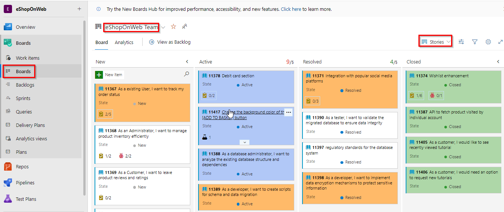

1. Hover on the work item, `Change the background color of the [ADD TO BASKET] button`. From the work item **...** Actions menu, select **New Branch**

    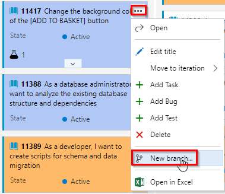

1.  Name the branch and select the repository on which it's based. Branches you create are automatically linked to the work item.
    
    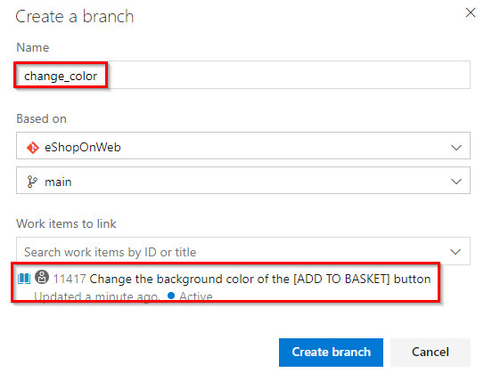

1. The system opens to the repository and branch that you created. You can edit a file within the web portal or you can clone the repo in your favorite IDE. For more information, see  [Clone an existing Git repo](https://learn.microsoft.com/en-us/azure/devops/repos/git/clone?view=azure-devops&tabs=visual-studio-2022) .

1. Navigate to the `path=/src/Web/Pages/Shared/_product.cshtml` to change the color of ADD TO BASKET button. Append `style="background-color: blue;"` snippet as shown below. Then **Commit & Push** changes. 

   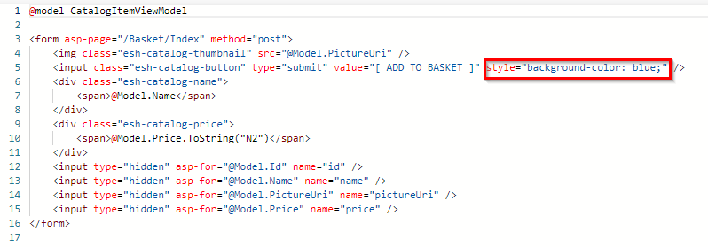

1. Once changes are Committed, [Create Pull Request](https://learn.microsoft.com/en-us/azure/devops/repos/git/pull-requests?view=azure-devops&tabs=browser). 

    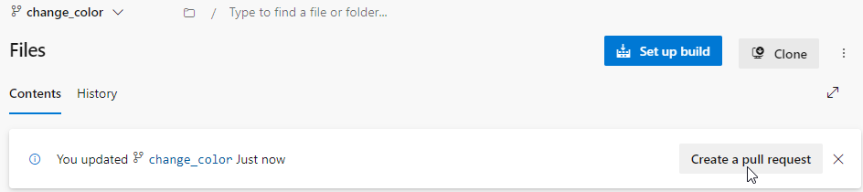

1. Upon creating a pull request, a PR Build is initiated. 
   
   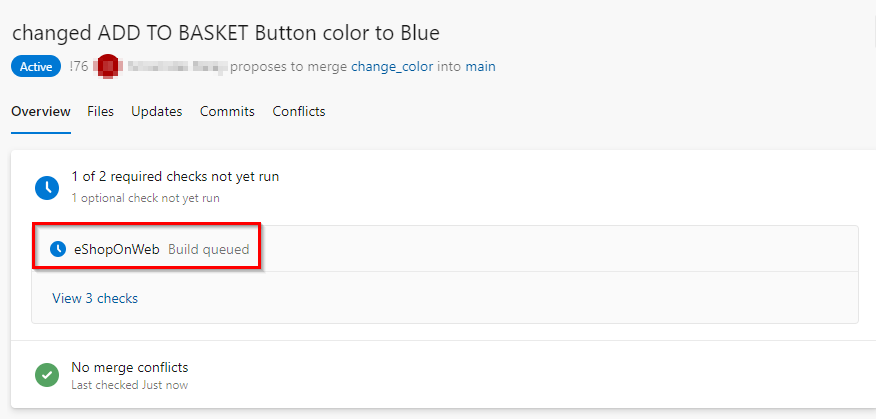

1. You may proceed with merging the changes after the successful completion of the PR Build. 

   >**Note:** The PR Build specifically focuses on executing build and test tasks to validate the integration modifications. It will not trigger the deployment tasks

### Build and Deploy to Test Environment

1. Once the merge is completed to `main` branch a CI build will trigger and this build process will include deploying the application to the `Test Environment` .

1. Once the application is deployed to **Test Environment**, navigate to the the web app created to view the deployed application.

   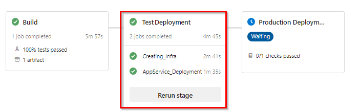

1. Following the deployment to the Test Environment, the Deployment trigger for the Production environment will be initiated. To commence the deployment in the Production environment, we have implemented Approvals and Checks as part of the process. However, prior to proceeding, it is recommended to conduct  testing on the application that has been deployed to the Test environment to verify the changes done.

### Manual Testing (UAT)

 During the ongoing development process, the Testing team will concurrently create a suite of tests designed to evaluate the functional modifications.

1. Navigate to **Test Plans** and select the Tests created to verify the changes done.
   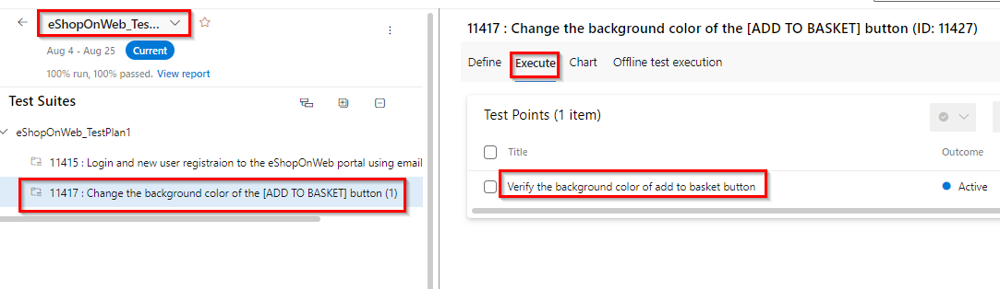

1. Run manual test. For more information see [here](https://learn.microsoft.com/en-us/azure/devops/test/run-manual-tests?view=azure-devops)
    
    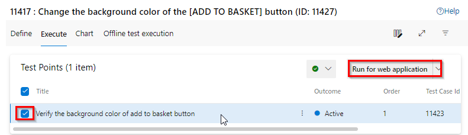

1. Use Test Runner to record which test steps pass or fail while you manually run a test. 

   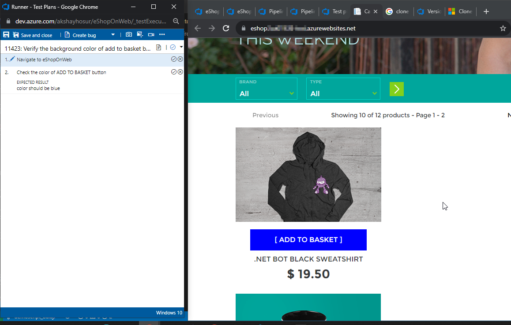

   Mark each test step as either passed or failed based on the expected results. If a test step fails, you can enter a comment on why it failed

1. When you've run all your tests, select **Save and close**. 

### Deploy to Prod Environment

Once we are content with the Test Results, we can move forward with the deployment to production.

1. Navigate to the pipeline and select the checks configured for Prod

   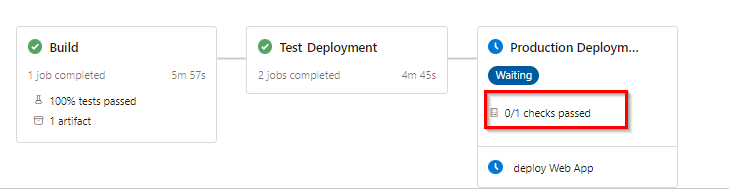

1. The Deployment Approval is set up as a check. Please grant approval for the changes to initiate the deployment to the Production environment.

   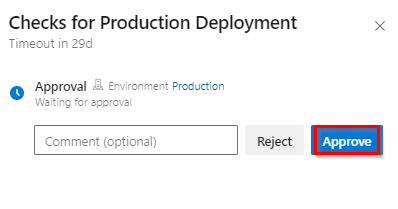

1. Once the application is deployed to **Test Environment**, navigate to the the web app created to view the deployed application with changes.

   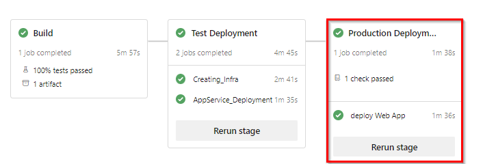
    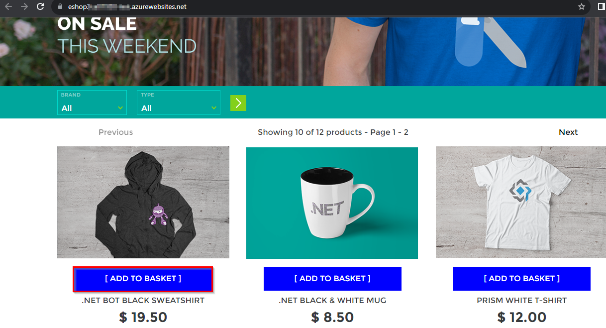

With the power of Azure DevOps, an idea has undergone a transformative journey, seamlessly navigating through all stages of the DevOps process.