

## Overview ##

Application Insights is an extensible Application Performance Management (APM) service for web developers on multiple platforms. You can use it to monitor your live web applications and other services. It automatically detects performance anomalies, includes powerful analytics tools to help you diagnose issues, and helps you continuously improve performance and usability. It works for apps on a wide variety of platforms including .NET, Node.js and Java EE, hosted on-premises, hybrid, or any public cloud. It even integrates with your DevOps process with connection points available in a variety of development tools. It can even monitor and analyze telemetry from mobile apps by integrating with Visual Studio App Center.

In this lab, you'll learn about how you can add Application Insights to an existing web application, as well as how to monitor the application via the Azure portal.

### Prerequisites ###

- This lab requires you to complete task 1 from the [prerequisite instructions](../prereq).

## Exercise 1: Monitoring Application Performance with Application Insights ##

### Task 1: Creating Azure resources ###
1. This lab requires a deployment of the Parts Unlimited project out to an Azure app service. To do this, you will need to spin up the necessary infrastructure. Log in to your Azure account at [https://portal.azure.com](https://portal.azure.com/).

1. Click **Create a resource** and search for **"Web App + SQL"**.

1. Select the **Web App + SQL** option published by Microsoft.

    

1. Click **Create**.

    

1. Enter a globally unique name for the app service. You may find it easiest to incorporate your name, such as **"pul-ai-johndoe"**. Select the option to **create a new** resource group named **"partsunlimited"**.

    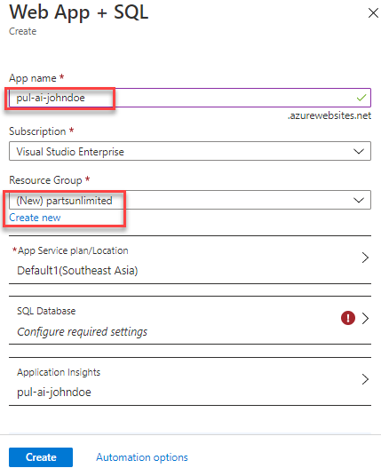

1. Select the option to configure the **SQL Database**. Click **Create a new database** and enter the name **"partsunlimited"**.

    

1. Select the option to configure the **Target server** and click **Create a new server**. Enter a globally unique server name, such as **"pul-ai-johndoe"** and provide admin credentials. Click **Select** to confirm the server settings.

    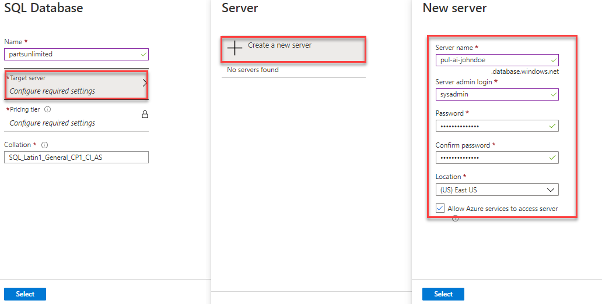

1. Click **Select** to confirm the database settings.

    

1. By default, the template will generate an Application Insights resource and attach it to the app service.
     
     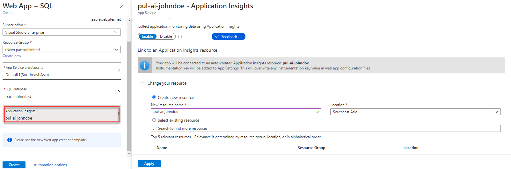

1. Click **Create** to create the resources. Note that you may need to create an app service plan first, if you do not yet have one.

    

1. It will take a few minutes for the resources to provision, so you can move on to the next task.

### Task 2: Deploying a web app to Azure ###

1. Open a new browser tab to your team project on Azure DevOps. The default demo project includes a continuous integration build that we can use as-is. There is also a continuous delivery release pipeline that will require a bit of configuration before it is ready to deploy to the infrastructure created earlier.

1. Use the navigation to navigate to **Pipelines \| Releases**.

    

1. There is an existing release pipeline in the project, which we will use for our deployment. Click **Edit**.

    

1. Select the **Dev** stage and click **Delete** to remove this stage. **Confirm** the delete.

    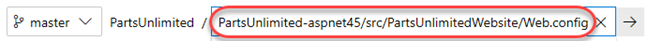

1. Repeat the process to remove the **QA** stage. **Confirm** the delete.

    

1. From the remaining **Production** stage, click **1 job, 1 task**.

    

1. Select the **Azure App Service Deploy** stage.

    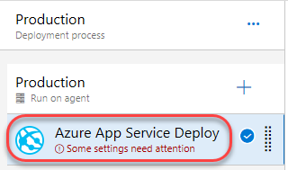

1. Select the Azure subscription you used to create the Azure resources earlier and click **Authorize**. Complete the authorization process. This is all you need to do for Azure DevOps to be allowed to deploy to your Azure resources.

    

1. Return to the **Pipeline**.

    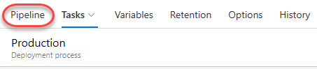

1. Click the **Pre-deployment conditions** button for the **Production** stage and select **After release**. This will invoke the release pipeline after the project's build pipeline succeeds.

    

1. From the **Variables** tab, update the **WebsiteName** variable to reflect the app service name used to create the Azure app service.

    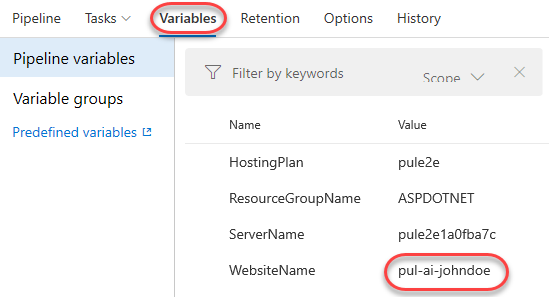

1. Click **Save** and confirm it.

    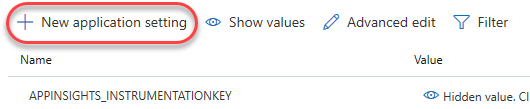

1. Now that the release pipeline is in place, we can expect any commits to the master branch to be built and released to production. Navigate to the **Repos** view.

    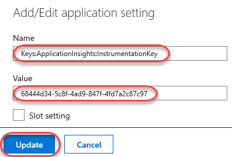

1. Use the navigation to open the **PartsUnlimited-aspnet45/src/PartsUnlimitedWebsite/Web.config**.

    

1. This application already has configuration settings for the Application Insights key and for a SQL connection. Make a note of these values so we can instruct the Azure portal to supply them with the settings generated for the app service created earlier.

    

1. Click **Edit**.

    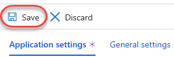

1. Make a cosmetic change to the file (like adding an empty line) and click **Commit**. Confirm the commit.

    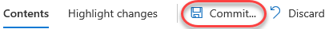

1. A new build will begin and ultimately result in a deployment to Azure. You can continue to the next step while this happens in the background.

1. Switch to the Azure portal and navigate to the app service created earlier.

    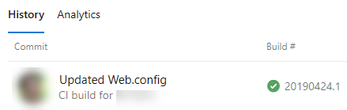

1. Select the **Configuration** tab.

    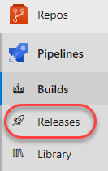

1. Click the **Edit** button for the **APPINSIGHTS_INSTRUMENTATIONKEY**. This is the default setting added during the app service creation and already contains the Application Insights ID. We will need to add a new setting for the one expected by our app, so we can copy the value from here. Note that this is a specific case for our sample app because the source has the Application Insights SDK added. The app doesn't do anything with the SDK at this time, but it does expect the key, so we have to supply it.

    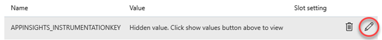

1. Copy the **Value** and click **Cancel**.

    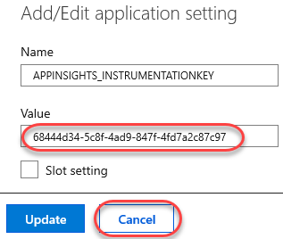

1. Click **New application setting**.

    

1. Set the **Name** to **"Keys:ApplicationInsights:InstrumentationKey"** and paste the **Value** from earlier. Click **OK**.

    

1. As with the Application Insights key, we also need to update the name of the SQL connection string. Click its **Edit** button.

    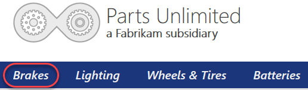

1. Update the **Name** of the setting to **"DefaultConnectionString"** and click **OK**.

    

1. Click **Save** to save the configuration settings.

    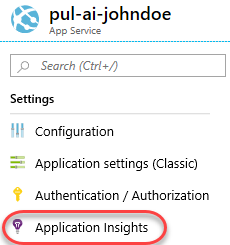

1. Return to the Azure DevOps tab.

1. Navigate to the **Pipelines** view.

    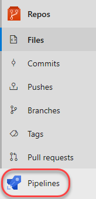

1. If the build has not yet completed, track it through until it does.

    

1. Navigate to the **Releases** view.

    

1. Follow the release pipeline through to completion.

    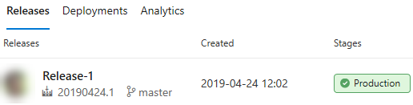

1. Return to the Azure portal tab and navigate to the **Overview** tab.

    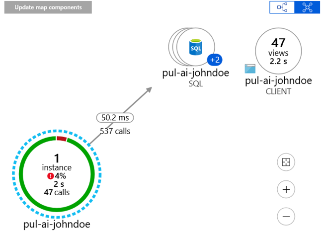

1. Click the **URL** to open the site in a new tab.

    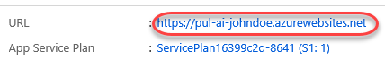

1. The site should load as expected. If it's not ready yet, refresh the site tab every minute or so until it loads.

    

### Task 3: Generating and reviewing application traffic ###

1. Navigate around the site to produce some traffic.

1. After generating some traffic, click the **Brakes** menu item.

    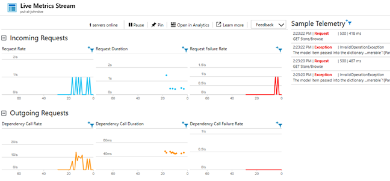

1. Manually append a **"1"** to the URL and press **Enter**. This will produce a site error since that category does not exist. Refresh the page a few times to generate more errors.

    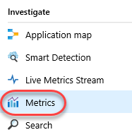

1. Return to the Azure portal browser tab.

1. Select the **Application Insights** tab.

    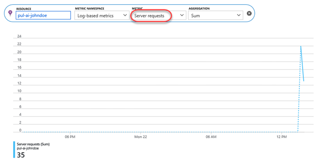

1. This tab includes instructions for how you can deeply integrate Application Insights into your apps. While the default experience produces a wealth of data for tracking and monitoring apps, the API provides everything else you need to support specialized scenarios and custom event tracking.

    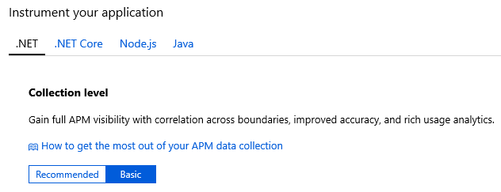

1. Click **View Application Insights data**.

    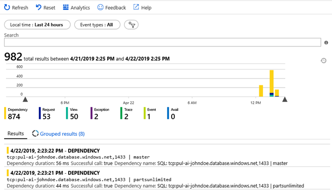

1. The dashboard view should already have the traffic you generated earlier. If not, refresh the data every minute or so until you see some activity in the charts.

    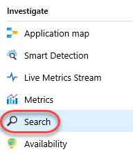

### Task 4: Investigating application performance ###

1. Select the **Application map** tab.

    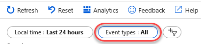

1. Application Map helps you spot performance bottlenecks or failure hotspots across all components of your distributed application. Each node on the map represents an application component or its dependencies, as well as health KPI and alerts status. You can click through from any component to more detailed diagnostics, such as Application Insights events. If your app uses Azure services, you can also click through to Azure diagnostics, such as SQL Database Advisor recommendations.

    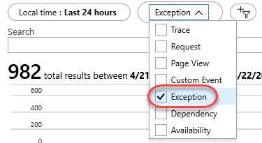

1. Select the **Smart Detection** tab. Smart Detection automatically warns you of potential performance problems in your web application. It performs proactive analysis of the telemetry that your app sends to Application Insights. If there is a sudden rise in failure rates, or abnormal patterns in client or server performance, you get an alert. This feature needs no configuration. It operates if your application sends enough telemetry. However, there won't be any data in there yet since our app has just deployed.

    

1. Select the **Live Metrics Stream**.

    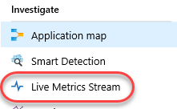

1. Return to the site browser tab and perform some navigation to produce live traffic. Generate some successful traffic with a few errors as well.

1. Return to the Azure portal tab to see the live traffic as it arrives. Live Metrics Stream enables you to probe the beating heart of your live, in-production web application. You can select and filter metrics and performance counters to watch in real time, without any disturbance to your service. You can also inspect stack traces from sample failed requests and exceptions.

    

1. Close the current blade.

    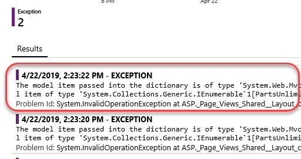

1. Select the **Search** tab.

    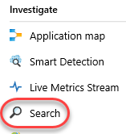

1. Search provides a flexible interface to locate the exact telemetry you need to answer questions. Click **Click here** to see data from the past 24 hours.

    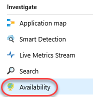

1. The results will include all telemetry data, which can be filtered down by multiple properties.

    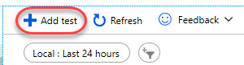

1. Click **Grouped results**. These results are generated based on how they share common properties.

    

1. Expand the **Event types** dropdown.

    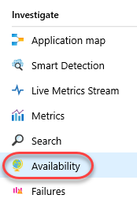

1. Deselect everything except **Exception**.

    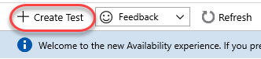

1. There should be some exceptions available from the errors generated earlier. Click one of them.

    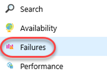

1. This will provide a full timeline view of the exception within the context of its request. Click **View all telemetry**.

    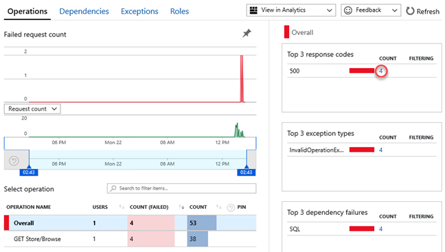

1. The **Telemetry** view provides the same data in a flat view.

    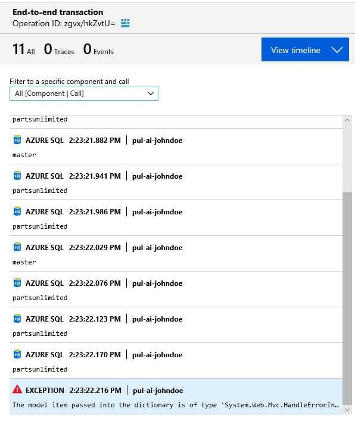

1. You can also review the details of the exception itself, such as its properties and call stack.

    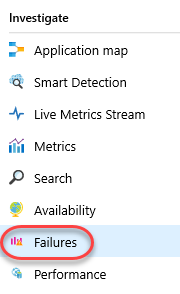

1. Close the current blade.

    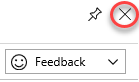

1. Select the **Availability** tab.

    

1. After you've deployed your web app or web site to any server, you can set up tests to monitor its availability and responsiveness. Application Insights sends web requests to your application at regular intervals from points around the world. It alerts you if your application doesn't respond or responds slowly. Click **Add test**.

    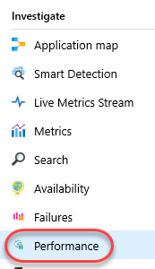

1. Enter a **Test name** of **"Home page"** and set the **URL** to the root of your site. Click **Create**.

    

1. The test will not run immediately, so there won't be any data.

    

1. If you check back later, you should see the availability data updated to reflect the tests against your live site. Don't wait for this now.

    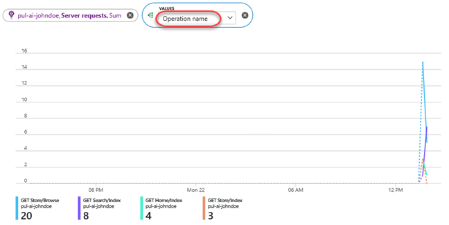

1. Select the **Failures** tab.

    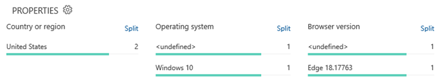

1. The Failures view aggregates all exception reports into a single dashboard. From here you can easily zero in on dependencies, exceptions, and other filters. From the **Top 3 response codes** list, click the link for the **500** errors.

    

1. This will present a list of exceptions from this HTTP response code. Selecting the suggested exception will lead to the exception view covered earlier.

    

1. Close the current blade.

    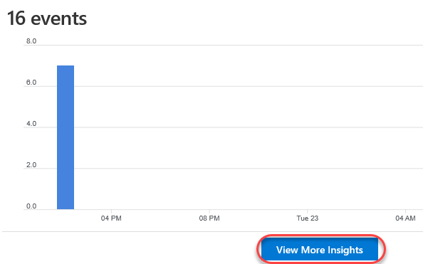

1. Select the **Performance** tab.

    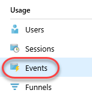

1. The Performance view provides a dashboard that simplifies the details of application performance based on the collected telemetry.

    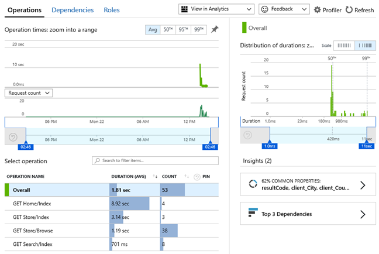

1. Select the **Metrics** tab.

    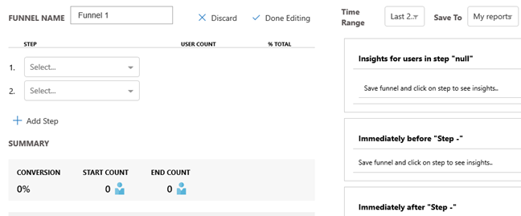

1. Metrics in Application Insights are measured values and counts of events that are sent in telemetry from your application. They help you detect performance issues and watch trends in how your application is being used. There's a wide range of standard metrics, and you can also create your own custom metrics and events. Set the **Metric** to **Server requests**.

    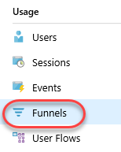

1. You can also segment your data using splitting. Click **Apply splitting**.

    

1. Set **Values** to **Operation name**. This will split the server requests by what pages they're requesting, which you can see from the different colors in the chart.

    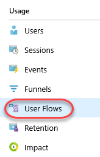

### Task 5: Tracking application usage ###

1. Application Insights provides a broad set of features to track application usage. Select the **Users** tab.

    

1. There aren't many users for our application yet, but we can still learn about them. Click **View More Insights**.

    

1. Scroll down to review details about the geographies, operating systems, and browsers.

    

1. You can also drill into specific users to get a better understanding of their usage.

    

1. Select the **Events** tab.

    

1. Click **View More Insights**.

    

1. There will be a variety of built-in events raised so far for site navigation. You can programmatically add custom events with custom data to meet your needs.

    

1. Select the **Funnels** tab.

    

1. Understanding the customer experience is of the utmost importance to your business. If your application involves multiple stages, you need to know if most customers are progressing through the entire process, or if they are ending the process at some point. The progression through a series of steps in a web application is known as a funnel. You can use Azure Application Insights Funnels to gain insights into your users, and monitor step-by-step conversion rates.

    

1. Select the **User Flows** tab.

    

1. The User Flows tool starts from an initial page view, custom event, or exception that you specify. Given this initial event, User Flows shows the events that happened before and afterwards during user sessions. Lines of varying thickness show how many times each path was followed by users. Special Session Started nodes show where the subsequent nodes began a session. Session Ended nodes show how many users sent no page views or custom events after the preceding node, highlighting where users probably left your site.

    

1. Select the **Retention** tab.

    

1. The retention feature in Application Insights helps you analyze how many users return to your app, and how often they perform particular tasks or achieve goals. For example, if you run a game site, you could compare the numbers of users who return to the site after losing a game with the number who return after winning. This knowledge can help you improve both your user experience and your business strategy.

    

1. Select the **Impact** tab.

    

1. Impact analyzes how load times and other properties influence conversion rates for various parts of your app. To put it more precisely, it discovers how any dimension of a page view, custom event, or request affects the usage of a different page view or custom event.

    

1. Select the **Cohorts** tab.

    

1. A cohort is a set of users, sessions, events, or operations that have something in common. In Application Insights, cohorts are defined by an analytics query. In cases where you have to analyze a specific set of users or events repeatedly, cohorts can give you more flexibility to express exactly the set you're interested in. Cohorts are used in ways similar to filters. But cohort definitions are built from custom analytics queries, so they're much more adaptable and complex. Unlike filters, you can save cohorts so other members of your team can reuse them.

    

1. Select the **More** tab. This view includes a variety of reports and templates for review.

    

1. From the **Usage** category, select **Analysis of Page Views**.

    

1. This particular report offers insight regarding the page views. There are many other reports available by default, and you can customize and save new ones.

    

### Task 6: Creating application alerts ###

1. Select the **Alerts** tab. Alerts enable you to set triggers that perform actions when Application Insights measurements reach specified conditions.

    

1. Click **New alert rule**.

    

1. The current Application Insights resource will be selected by default. Click **Select conditon** under **Condition**.

    

1. Search for **"failed"**and select the **Failed requests** metric.

    

1. Set the **Threshold value** to **"1"**. This will trigger the alert once a second failed request is reported.

    

1. By default, the conditions will be evaluated every minute and based on the aggregation of measurements over the past 5 minutes. Click **Done**.

    

1. Now that the condition is created, we need to define an **Action Group** for it to execute. Click **Select action group** then **Create action group**.

    

1. Set the **Action group name** and **Short name** to **"Admin alert"**. Set the **Action name** to **Alert** and **Action type** to **Email/SMS/Push/Voice**. Click **Edit details**.

    

1. Check the **Email** box and enter your email address.

    

1. Click **OK** to save the action group.

    

1. Now that the action group has been created, it may still need to be selected If not already. Click **Select action group**.

    

1. Check the newly created action group and click **Select**.

    

1. Set the **Alert rule name** to **"Any failure"** and click **Create alert rule**.

    

1. Once the rule has been created, return to the web site browser tab and invoke some errors using the method from earlier.

1. Around five minutes later, you should receive an email indicating that your alert was triggered.

    

