

## Overview ##

It takes several teams to develop large software projects. Very large projects require multiple autonomous teams that can manage their own backlog and priority while contributing to a unified direction for that project. Regular reviews of the project schedule with these teams help ensure that the teams are working toward common goals. Delivery Plans provide the needed multi-team view of your project schedule.

**Delivery plans** provide visibility into features under development by several teams across several sprints. With Delivery Plans, portfolio managers can review the schedule of stories or features their teams plan to deliver. Delivery Plans show the scheduled work items by sprint (iteration path) of selected teams against a calendar view.

Want additional learning? Check out the <a href="https://docs.microsoft.com/en-us/learn/modules/manage-delivery-plans/" target="_blank"><b><u> Manage Agile software delivery plans across teams </u></b></a> module on Microsoft Learn.

### Prerequisites ###

- This lab requires you to complete task 1 from the <a href="../prereq/">prerequisite</a> instructions

## Exercise 1: Managing Delivery Plans with Azure DevOps ##

### Task 1: Creating a delivery plan ###

1. From the **Boards** dropdown, select **Delivery Plans**.

    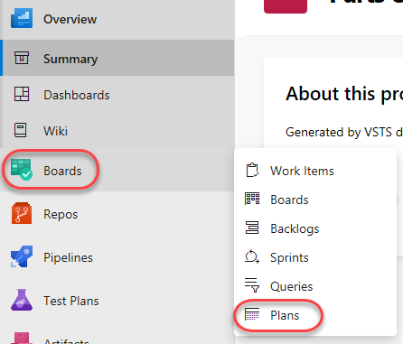

1. Click **New plan**.

    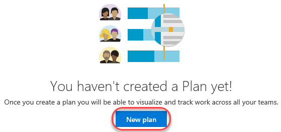

1. Since you may want to have multiple delivery plans for different aspects of your project, provide the specific name **"Web delivery"**. It should default to the **Parts Unlimited Team**, so select **Features** and click **Create**. Note that you could also organize your deliveries by **Stories** if you used that model instead. There is also the option to add additional teams and criteria to filter stories/features by, but we'll revisit those later.

    

1. Due to the iteration reconfiguration performed earlier, the "Today" marker is right at the beginning of **Sprint 2**. We have a number of stories listed for delivery in the previous sprint, and we can also see an empty **Sprint 3**. Note that some of the stories shown are **Done**. Although it's useful to see the progress of work, we'll use that as an example by which to filter items out in a moment.

    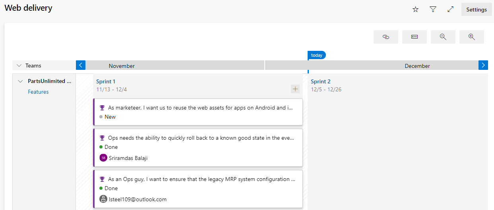

1. Click the **Settings** button.

    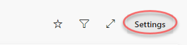

1. Select the **Field criteria** tab and click **Add criteria**.

    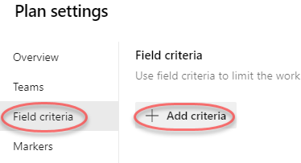

1. Set the new criteria to filter down to items where **State** does not equal (**<>**) **Done**.

    

1. We can also add a custom marker to keep track of significant dates. Select the **Markers** tab and click **Add marker**.

    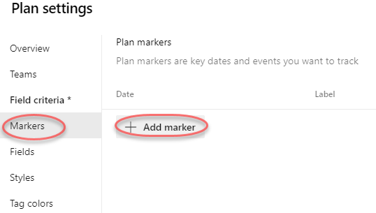

1. Select the fourth Friday from today (it will be the Friday in the middle of **Sprint 3**) and set the **Label** to **"Team offsite"**. Select magenta as the **Color** and click **Save**.

    

1. The first thing to notice is that the "Closed" story is no longer visible on the delivery plan due to the criteria set in the configuration. In addition, there is now a magenta marker in the middle of **Iteration 3** that says **"Team offsite"** when clicked.

    

1. Another neat feature of the delivery plan extension is the ability to easily scale the calendar. You can use **Zoom out** to view multiple months at once. And **Zoom in** to a much more precise view.

    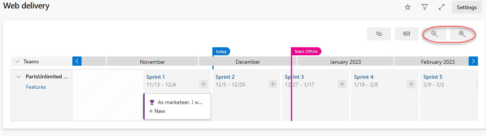

### Task 2: Adding an external team to the project ###

1. Our delivery plan has been pretty simple so far because we only have the one team. However, the real power of delivery planning comes into play when orchestrating multiple autonomous teams across their efforts. Open the settings page using the **Project Settings** navigation located at the bottom left of the page.

    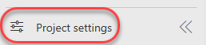

1. From the **Teams** tab, click **New team**.

    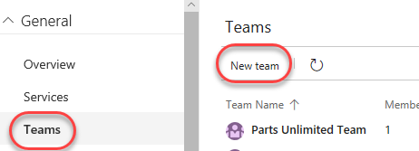

1. This new team will be responsible for the efforts that involve integrating with external services, such as 3rd party services for things like weather forecasts and payment processing. Set the **Team name** to **"External integration team"** and click **Create team**.

    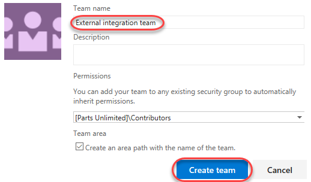

1. Select the **Project configuration** tab under **Boards**.

    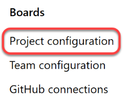

1. Note the dates of **Sprint 2** and **Sprint 3**, which will vary for your account based on when you generated the project data. We're going to add two new iterations for the external services team that do not align exactly with the main team's schedule.

    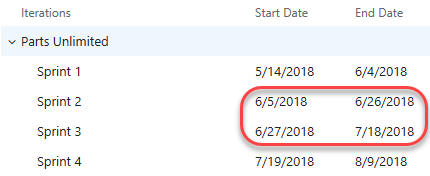

1. With the root **PartsUnlimited** node select, click **New child**.

    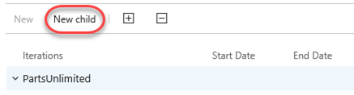

1. Set the **Iteration name** to **"Iteration 50"**. Use today as the **Start date** and set the **End date** to three Fridays from today. This will also happen to be the day of the team offsite. Click **Save and close**.

    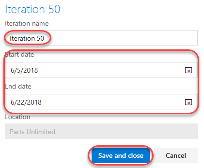

1. Use the same process to add an **Iteration 51** that starts the Monday after **Iteration 50** ends and has an end date three Fridays later.

    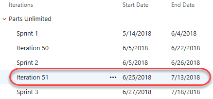

1. Now we need to configure the new team to use those new project sprints as its iterations. Select the **Teams** tab and click **External integration team**.

    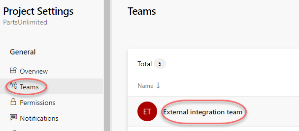

1. Click **Iterations and Area Paths**.

    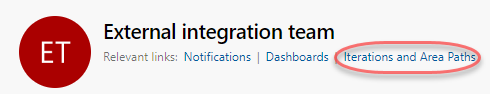

1. Select the **Iterations** tab.

    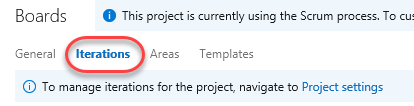

1. Click **Select iterations** and use the **+ Iteration** button to select **Iteration 50** and **Iteration 51**. Click **Save and close**.

    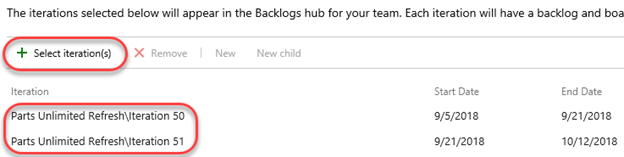

### Task 3: Making delivery decisions ###

1. From the **Boards** dropdown, select **Delivery Plans**.

    

1. Select the **Web Delivery** plan.
1. Click the **Settings** button.

    

1. Select the **Teams** tab and click **Add team**.

    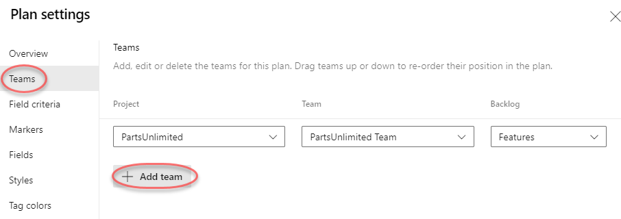

1. Select the **External integration team** and **Features**. Click **Save**.

    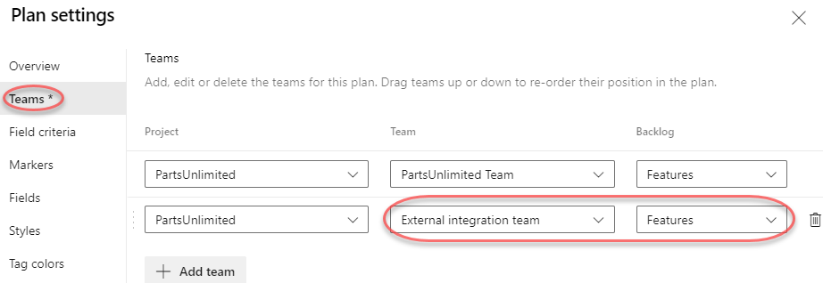

1. Use the **Zoom out** to fit the width of **Iteration 50** and **Iteration 51**.

    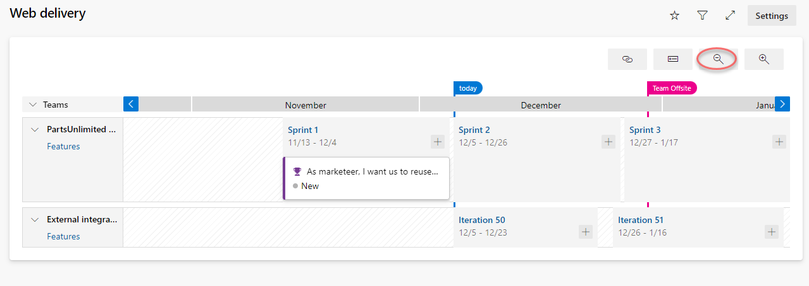

1. The new team doesn't have any stories added yet. Fortunately, you can add them directly to their team and iteration using the inline functionality. Select the **Iteration 50** iteration. Click the **New item** button that appears.

    

1. Enter **"Integrate with weather service"** and press **Enter**. That item is now in the backlog with its area and iteration configured.

    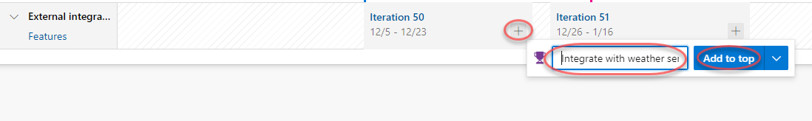

1. Follow the same process to add an item for integrating with corporate branding assets to **Iteration 51**.

    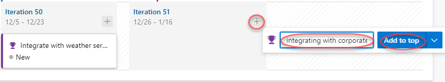

1. Now we can step back to see how these two teams are working toward our common goals. Upon closer examination, it appears that the main team is planning to reuse some corporate branding assets during the current sprint that will not be available until well after it's over. It's a good thing we have this view to catch these sort of potential problems early on.

    

1. The first thing we should do is to move the branding integration work to an earlier iteration. Drag and drop the corporate branding story onto **Iteration 50**. In order to free up the bandwidth, drag the weather service story onto **Iteration 51**.

    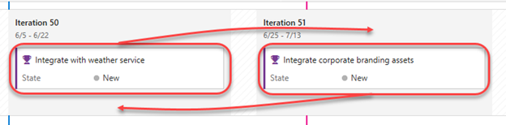

1. Next, drag the branding work item from **Sprint 1** to **Sprint 3** so that there's a chance the dependencies will be available in time for this team to be unblocked.

    

1. Now we can review the delivery plan again. It should be more feasible now.

    

1. There are a lot of ways to quickly customize the view of the delivery plan. For example, you can collapse all teams (or specific teams) using the toggle buttons next to their names.

    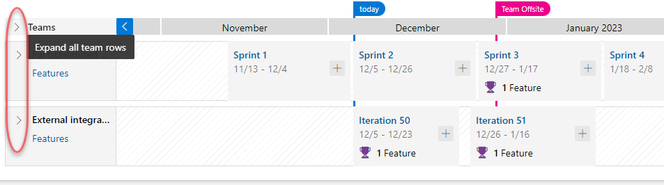

### Task 4 : Track dependencies by using Delivery Plans
With Delivery Plans, you can track dependencies that have been added to work items. Dependency tracking supports the **Predecessor/Successor** link type between work items. 

1. Navigate to **Web Delivery** Plan.
1. Move branding feature to **Sprint 1**

    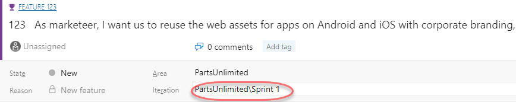

1. And click on **Links** tab and add **Integrate with weather service** and **integrating with corporate branding assets** features as **Successors** and **Save & Close**

    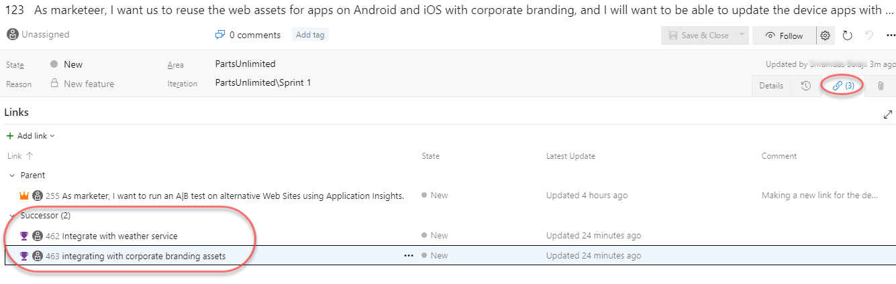

1. Now your delivery plan looks like below. Click on  to view the dependency summary
    
    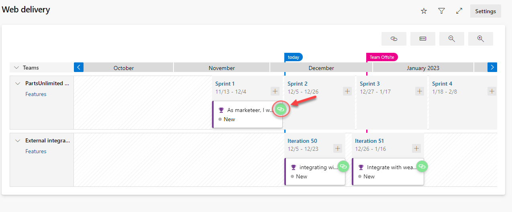

1. You can see the Dependencies detailed view. This  indicates that the work item has two successors and no issues with delivery dates.

   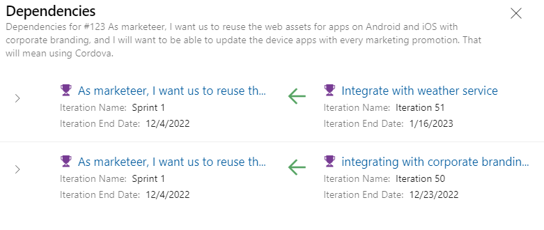

1. Now move the branding feature to **sprint 2** and refresh the page.

1. Now you can see red icon  on feature. Click to see the details. Here we can see one feature has delivery issue. With this information we can plan the delivery of the dependent feature.

   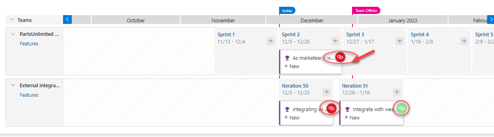

   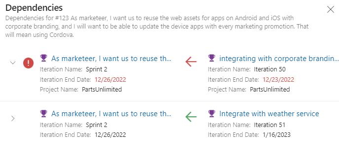

1. Click on **Show all dependencies** icon. Dependency lines that have no issues show up as black lines. Dependency lines that have issues, show up with red lines. To view the issue or details you can click on those lines.

   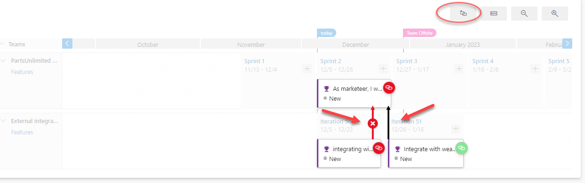
  
## Reference

Thanks to **Nagaraj Bhairaji** for making a video on this lab. You can watch the following video that walks you through all the steps explained in this lab

<figure class="video_container">
  <iframe width="560" height="315" src="https://www.youtube.com/embed/WlWVJyxY-l8" frameborder="0" allowfullscreen="true"> </iframe>
</figure>