<div class="rw-ui-container"></div>

## Overview

The Azure DevOps Project simplifies the initial configuration of a continuous integration (CI) and continuous delivery (CD) pipeline for your Java app in Visual Studio Team Services (VSTS).


## What's covered in this lab?

 In this lab, you will
* Create new VSTS account with Java project sample using **Azure DevOps Project** feature in Azure
* Examine the CI/CD pipelines configured by **Azure DevOps Project**
* Commit the code changes and execute CI/CD


## Pre-requisites for the lab

 1. **Microsoft Azure Account**: You will need a valid and active Azure account for the Azure labs. If you do not have one, you can sign up for a [free trial](https://azure.microsoft.com/en-us/free/){:target="_blank"}

   * If you are a Visual Studio Active Subscriber, you are entitled for a $50-$150 credit per month. You can refer to this [link](https://azure.microsoft.com/en-us/pricing/member-offers/msdn-benefits-details/) to find out more including how to activate and start using your monthly Azure credit.

   * If you are not a Visual Studio Subscriber, you can sign up for the FREE [Visual Studio Dev Essentials](https://www.visualstudio.com/dev-essentials/)program to create **Azure free account** (includes 1 year of free services, $200 for 1st month).

## Exercise 1: Setting up Sample Java project using Azure DevOps Project

1. Sign into the [Microsoft Azure portal](https://portal.azure.com).

2. Choose the **+ Create a resource** icon in the left navigation bar, then search for **devops**. Then choose **DevOps Project** in the list and click on **Create**

    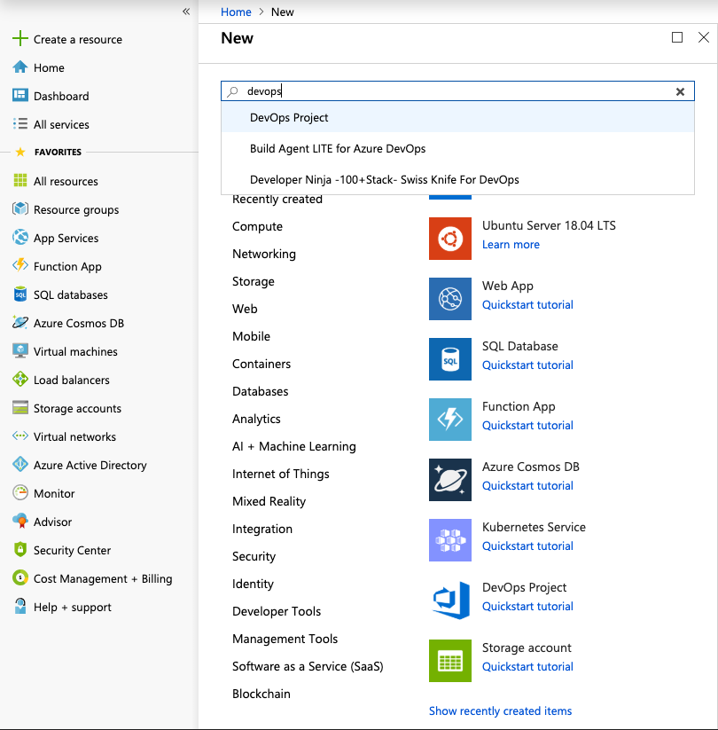

    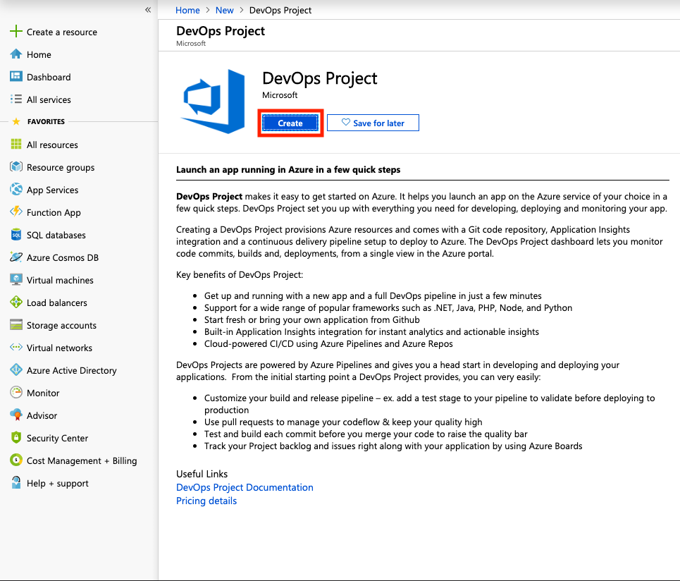

3. Select the **Java** sample application and click on **Next**. The Java samples include a choice of several application frameworks.

   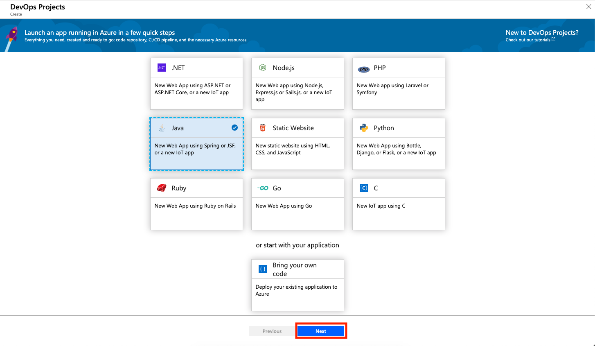

4. The default sample framework is **Spring**. Select a framework or leave the default setting. When you're done, choose **Next**.

   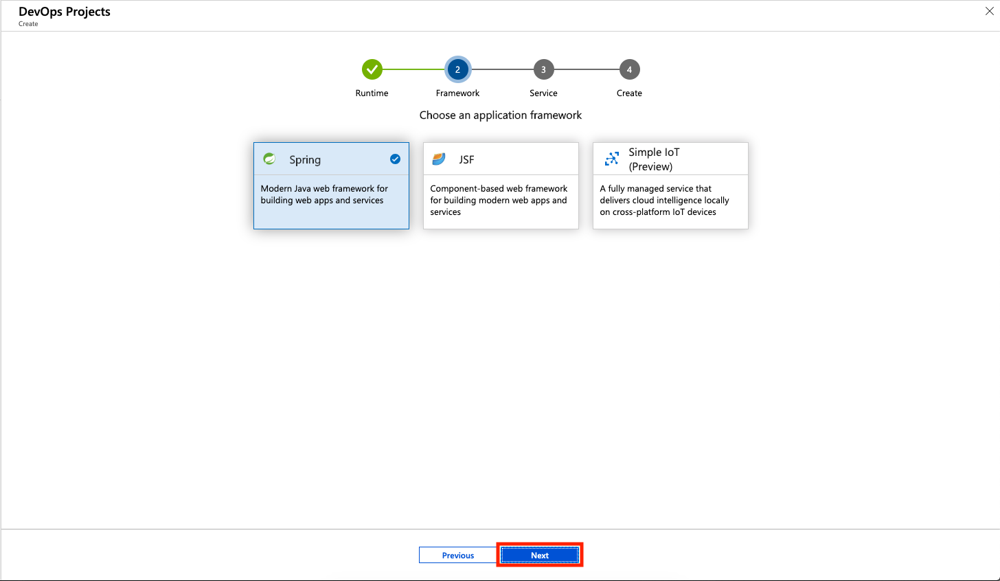

5. **Windows Web App** is the default deployment target. The application framework, which you chose on the previous steps, dictates the type of Azure service deployment target available here. When you're done, choose **Next**.

    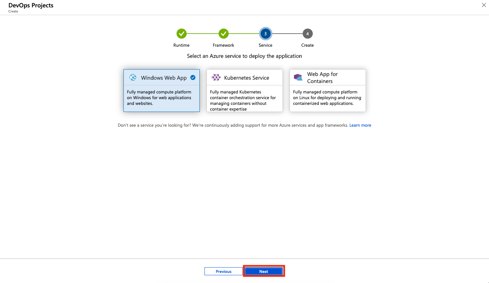

6. Choose a **Project name**, **Subscription**, **Web app name**, and **Location**. Then Click **Additional Settings**. In this lab, we will create a new **Azure DevOps Organization**, even though you may use an existing organization. Choose a name for your **Azure DevOps Organization**, **Location** and **Resource group**. To avoid charges, select the *F1 Free* option for the **Pricing tier**. Click **OK** and **Done**.

    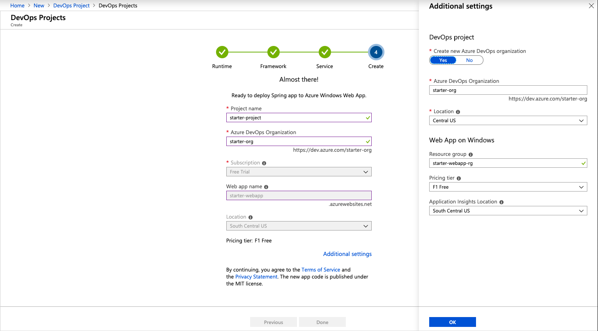

7. In a few minutes, the deployment will complete, providing a link to the new resource. Click **Go to resource**.

	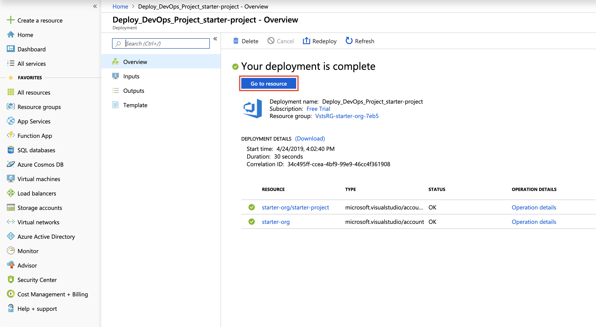

7. In a few minutes, the **project dashboard** loads in the Azure portal. A sample java application is set up in a repository in your Azure DevOps account, a build executes, and your application deploys to Azure. This dashboard provides visibility into your **code repository**, **Azure DevOps CI/CD pipeline**, and your **application in Azure**. 

   

8.  On the right side of the dashboard, select **Browse** to view your running application.
    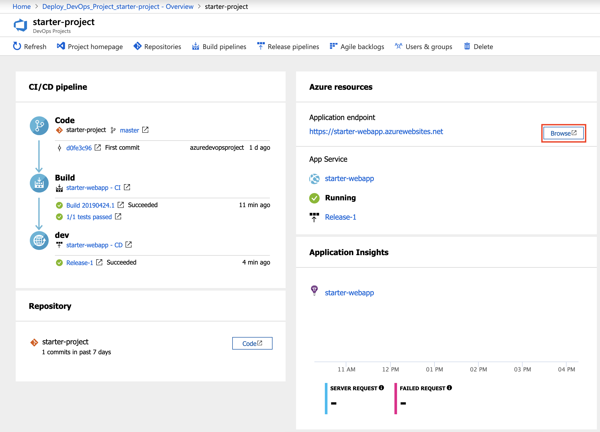

    The web app look like as shown in below figure
    
    

   The **Azure DevOps project** automatically configures a CI build and release trigger. You're now ready to collaborate with a team on a Java app with a CI/CD process that automatically deploys your latest work to your web site.


## Exercise 2: Explore the Azure DevOps CI/CD pipelines configured by the Azure DevOps Project

  The Azure DevOps project automatically configured a full CI/CD pipeline in your Azure DevOps account. Explore and customize the pipeline as needed. Follow the steps below to familiarize yourself with the Azure DevOps build and release definitions.

1. Select **Build Pipelines** from the top of the Azure DevOps project dashboard. This link opens a browser tab and opens the Azure DevOps build definition for your new project.

    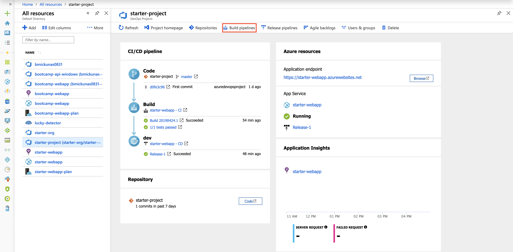

2. From the build definition view, you can see the **History** and **Analytics** of builds. You can also **Edit** and **Queue** new builds. **Queue** is a way to manually trigger a new build, but remember this project is already configured for CI/CD. Select **Edit** to explore the build configuration.

    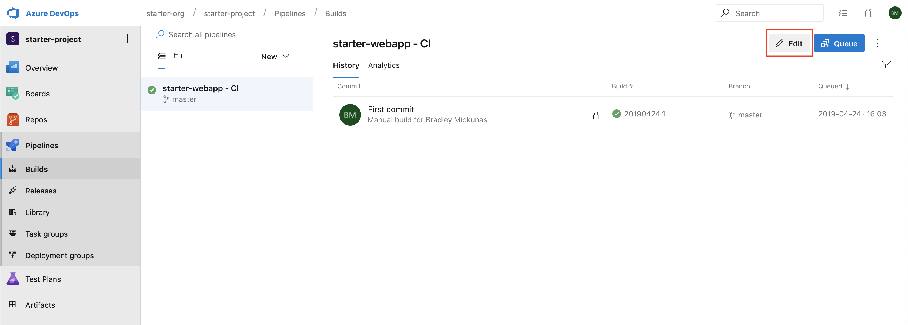

3. From this view, examine the various tasks for your build definition. The build pipeline fetches sources from the Git repository, restores dependencies, and publishes outputs used for deployments.

     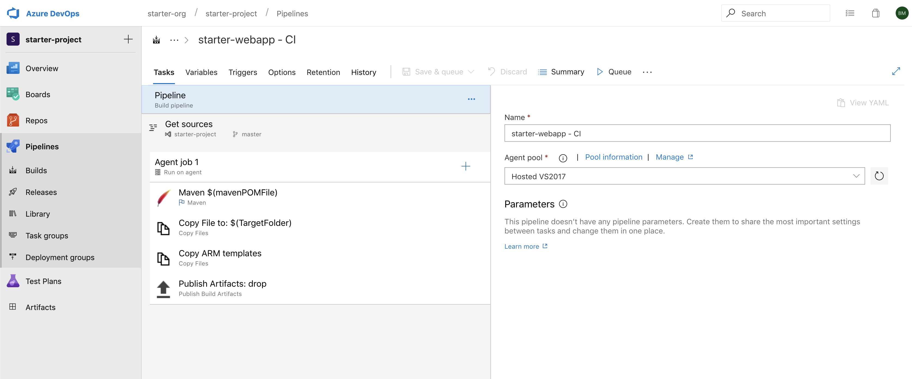

4. Under your build definition name, select **History**. You see an audit trail of your recent changes for the build. Azure DevOps tracks changes made to the build definition and allows you to compare versions.

      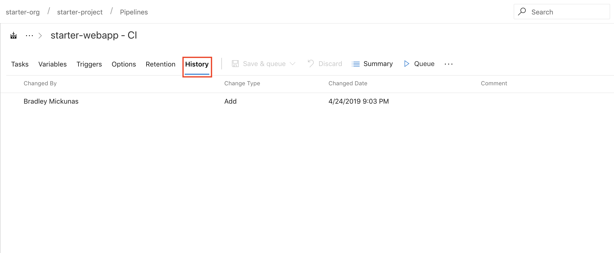

5. Select **Triggers**. The Azure DevOps project automatically created a CI trigger, and every commit to the repository initiates a new build. You can optionally choose to include or exclude branches from the CI process.

     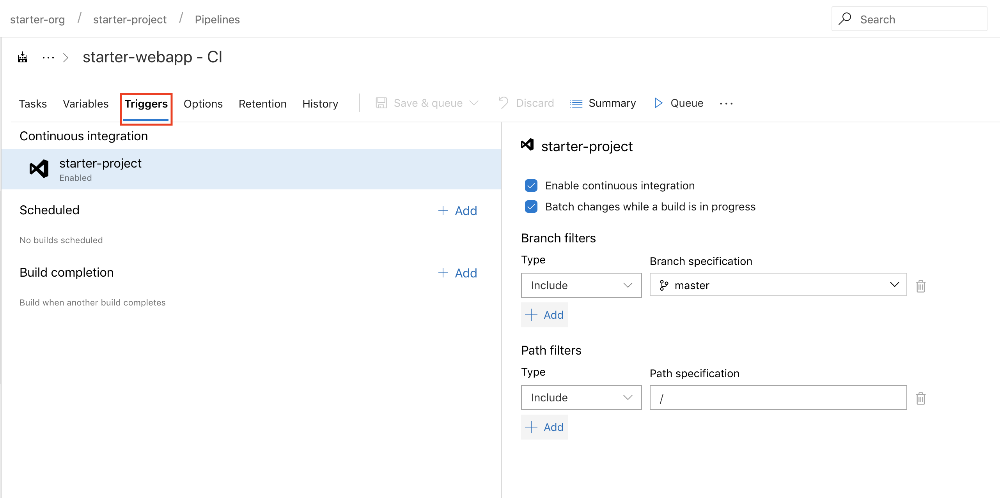

6. Select **Retention**. Based on your scenario, you can specify policies to keep or remove a certain number of builds.
  
      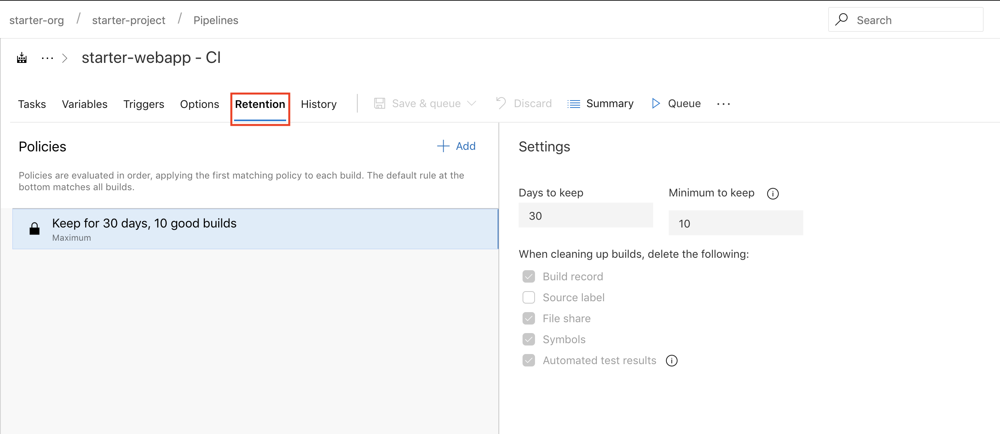

7. In the leftmost pane under **Pipelines**, click **Releases**. The Azure DevOps project created a release definition to manage deployments to Azure.
     
      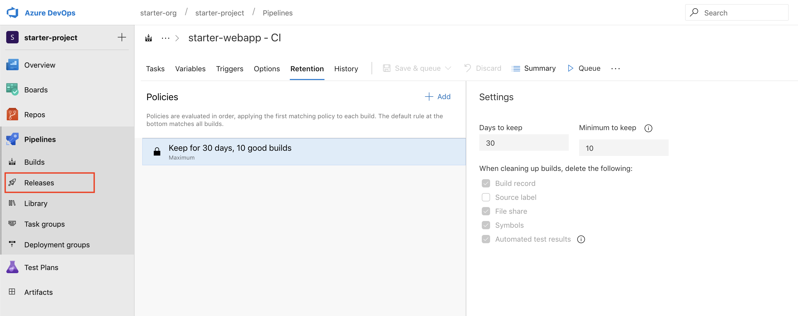

8. From the release definition view, you can see the history and analysis of the releases with the **Releases**, **Deployments** and **Analytics** tabs. Select **Edit** to explore the release configuration.

     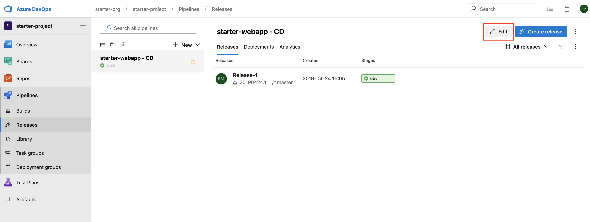

9. The release definition contains a pipeline, which defines the release process. Under **Artifacts**, select **Drop**. The build definition you examined in the previous steps produces the output used for the artifact.

    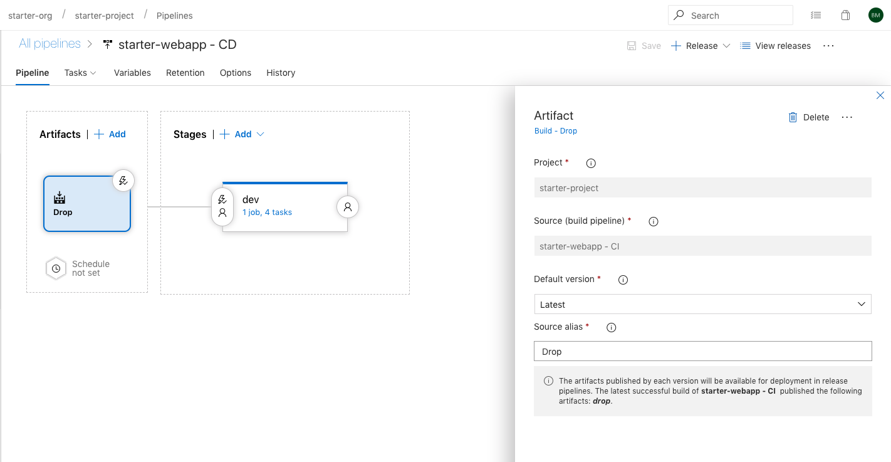

10. To the right-hand side of the **Drop** icon, select the **Continuous deployment trigger**. This release definition has an enabled CD trigger, which executes a deployment every time there is a new build artifact available. Optionally, you can disable the trigger, when your deployments require manual execution.

    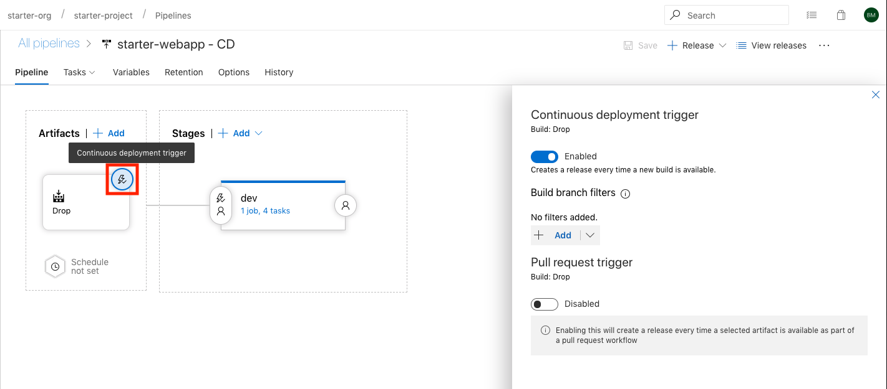

11. On the left-hand side of the browser, select **Tasks**. The tasks are the activities your deployment process performs. In this example, a task was created to deploy to Azure App service.

    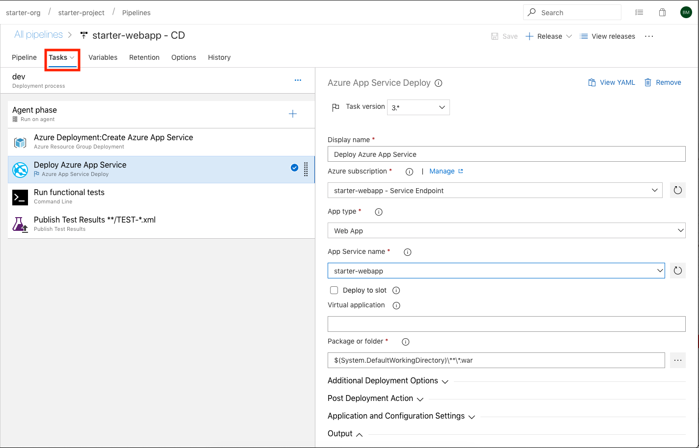

12. On the right-hand side of the browser, select **View releases**. This returns you to the previous screen to view a history of releases.

    

13. Select **Release-1** to view a graphical representation of the release pipeline.
	
	

   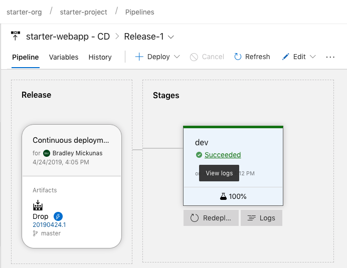

14. Click **Succeeded** in the **dev** stage to view the logs of the deployment. 

   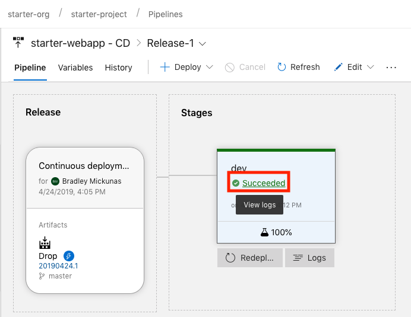
   

You now have an overview of the CI/CD pipeline. The next part of the lab will give you experience using the pipeline. Your familiarity will help you confirm, troubleshoot and fix the application as you commit changes to the repository and the deployments are automatically triggered.

## Exercise 3: Commit the code changes and experience CI/CD

The Azure DevOps Project created a Git repository in your Azure DevOps account. Follow the steps below to view the repository and make code changes to your application.

1. In the project dashboard of the Azure portal, click **Code** to view the created Git repository by Azure DevOps Project.

     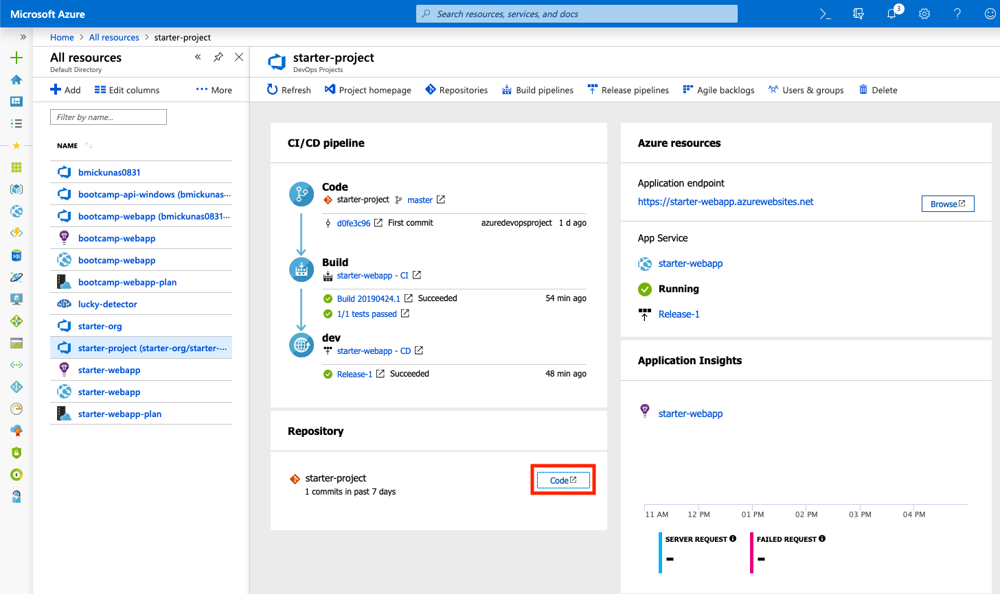

2. To view the repository clone URL, select **Clone** from the top right of the browser. You can clone your Git repository in your favorite IDE. In this lab, you can use the web browser to make and commit code changes directly to the master branch.

     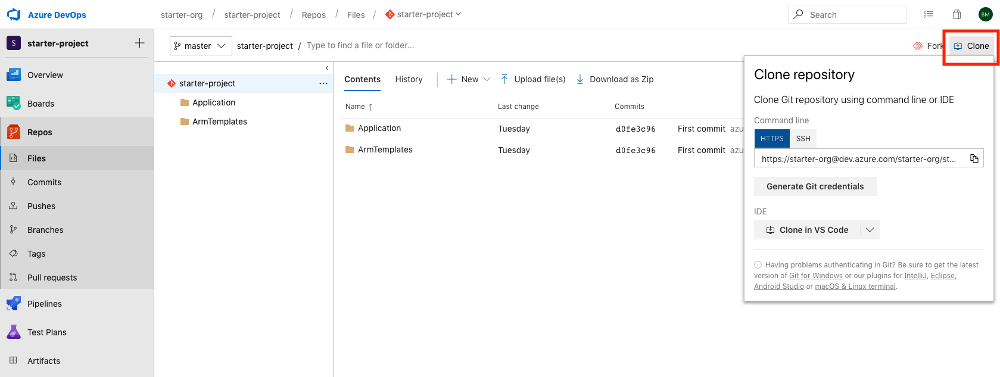

3. On the left-hand side of the browser, navigate to the *Application/sampleWebApp/src/main/resources/static/index.html* file. Select **Edit**, and make a change. For example, add a new description line as shown in below figure.
         
    

    ```csharp
         <div class="description line-3"> Get started right away with the Azure DevOps Project </div>
    ```
4. Choose **Commit**, to save and checkin your changes.

      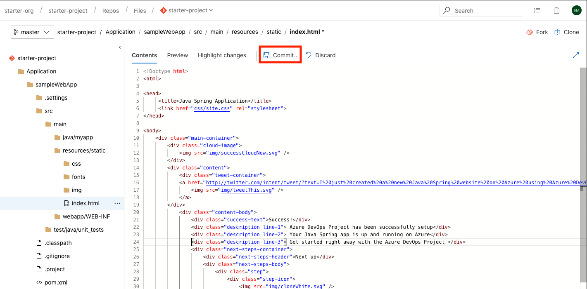

5. In your browser, navigate to the **Builds**. You should now see a build is in progress. The changes you just made are automatically built and deployed via a CI/CD pipeline.

    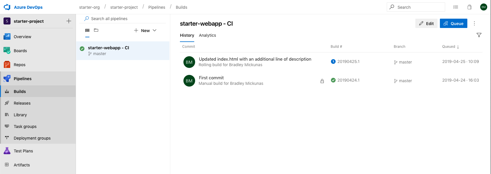

6. In the project dashboard of the Azure portal, click **Refresh** to update the status of the CI/CD Pipeline.

    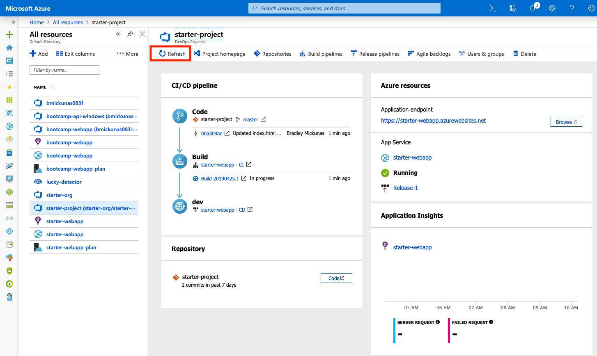

7. When the release is completed, select **Browse** to view your updated running application. You will see the updated decription line in the web page.

   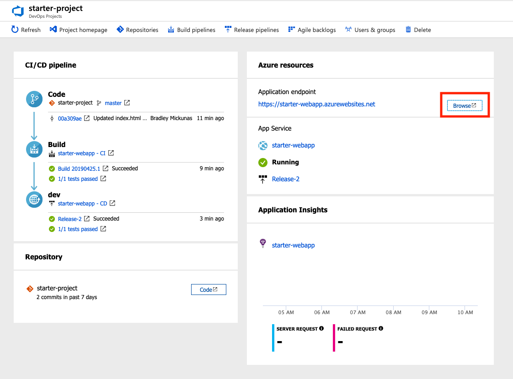

   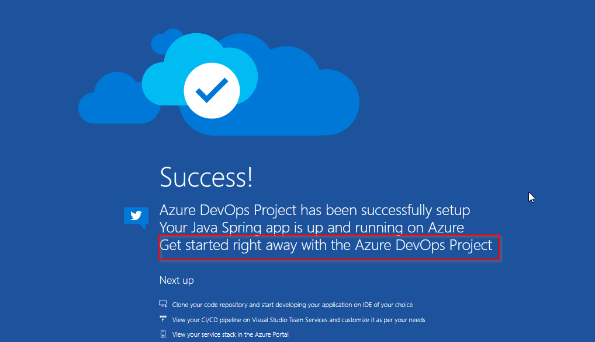
   
Congratulations! You've experience CI/CD in Microsoft Azure. Below are some additional changes you can make to gain a few more repetitions with committing code changes. You will need to troubleshoot broken builds and releases in the process.

* Clone the repository, open it in your IDE, then add a .gitignore file with entries specific to your IDE
* Remove “Sample” references in multiple commits from the *pom.xml*, parent directory names, and the functional test startup command

	