

## Overview ##

In this lab, you will learn about the exploratory testing and feedback management capabilities provided in the Test & Feedback extension. You will learn about how exploratory testing (also called XT, or agile testing) has become a first-class experience in the toolset. This allows a tester to more flexibly test the underlying software without relying solely on formal test cases. You'll also learn about how you can manage the process of eliciting and managing the customer feedback lifecycle.

### Prerequisites ###

- This lab requires you to complete tasks 1 and 2 from the <a href="../prereq/">prerequisite</a> instructions.

## Exercise 1: Exploratory Testing ##

### Task 1: Installing the Chrome Extension ###

1. Install **Google Chrome** from [http://google.com/chrome](http://google.com/chrome). The rest of this exercise will use Chrome as its browser. If you're already using Chrome, just open a new instance for the next set of steps.

1. Navigate to the **Azure DevOps Marketplace** at [http://marketplace.visualstudio.com](http://marketplace.visualstudio.com/).

1. Select the **Azure DevOps** tab. Search for "**feedback**" and click the **Test & Feedback** extension.

    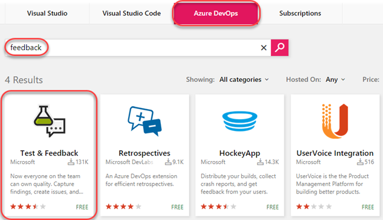

1. Click on **Install** button on the details page.

    

1. Click **Install** for the Chrome extension.

    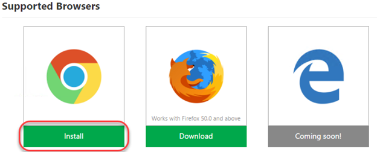

1. In the **Chrome Web Store**, click **Add to Chrome**.

    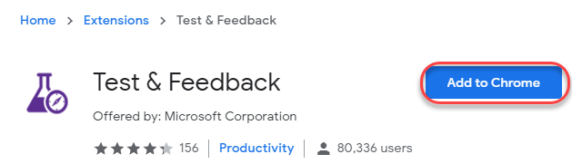

1. Confirm the installation when asked.

    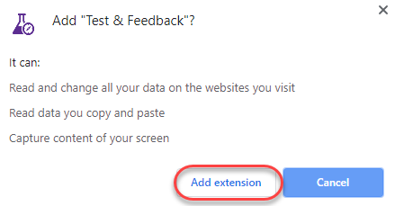

1. To open the extension, click the extension icon that will appear on the right of the address bar. Select the **Connection Settings** tab. Enter the URL of your Azure DevOps instance, such as "**https://dev.azure.com/MYTEAM**", as the **Server URL** and click **Next**.

    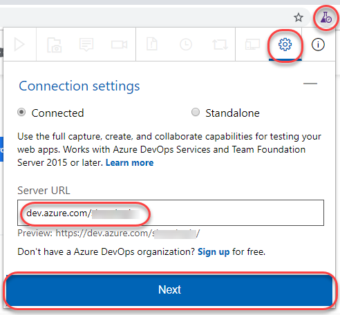

1. The extension can be used in two modes: **Connected** and **Standalone** mode. If you have Azure DevOps or Azure DevOps Server, select Connected mode. Standalone mode is for users who don't have either and want to use the extension to file bugs and share the report with their team.

1. After connecting to Azure DevOps, you will need to select the team you want these efforts associated with. Select the **Parts Unlimited Team** under the **Parts Unlimited** project and click **Save** to continue.

    

### Task 2: Exploratory Testing with the Chrome Extension ###

1. In **Visual Studio**, press **F5** to build and run the **Parts Unlimited** project locally.

1. To start an exploratory testing session, click the **Start session** button from the extension toolbar.

    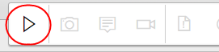

1. Navigate to [http://localhost:5001](http://localhost:5001/).

1. In search box enter **"jumper lead"** and press **Enter**.

    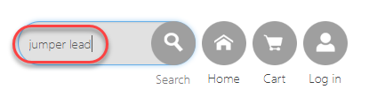

1. You will see the search results as shown below.

    

1. Now in the search box enter **"jumper leads"** and press **Enter**.

    

1. You can see there are no search results. When you search for **jumper lead** it showed the results. But when you search for **jumper leads** it showed no results. This seems to be a bug.

    

1. Click the **Exploratory Testing** icon button and select **Capture screenshot | Browser**.

    

1. Select a section of the screen and change the name of the screenshot to something more descriptive. Note that there are a variety of drawing tools available to really help you get your point across. Click the **Blur area** button.

    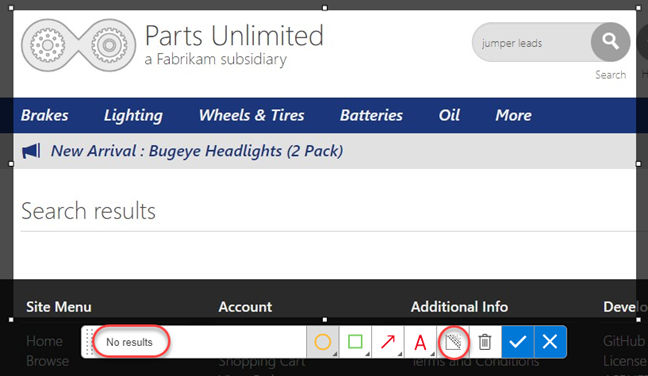

1. Highlight a section of the screenshot, which will be blurred out to become illegible. This makes it easy to report bugs and create other work items without risking sensitive information. Click the **Save screenshot** button to add it to the current session's timeline.

    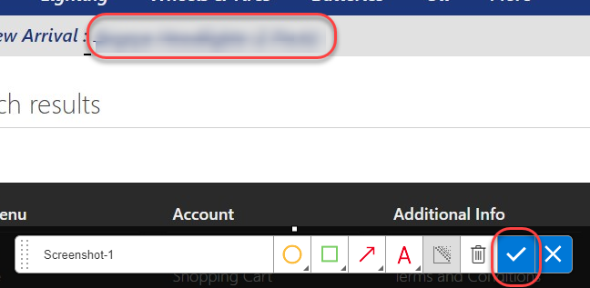

1. Click the **Add note** button to start a note. Type in something insightful and click **Save** to save the note to the session's timeline.

    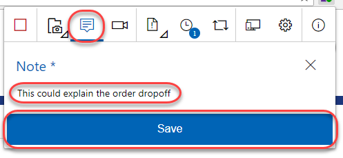

1. You can also record screen video to capture flaky issues like flickering, abnormal behavior of the web application etc. that are difficult to capture using screenshots alone. To record your screen click the **Record screen** button and click **Start recording**.

    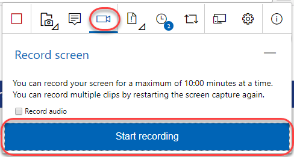

1. Select the appropriate screen you want to record from the **Application Window** tab. In this case, select the 404 page and click **Share**. The recording for the screen selected has started.

    

1. Search for **"jumper lead"** and show the results. Then search for **"jumper leads"** and show the lack of results.

    

1. Click the **Stop recording** button on the extension to stop recording the screen. The screen recording gets saved.

    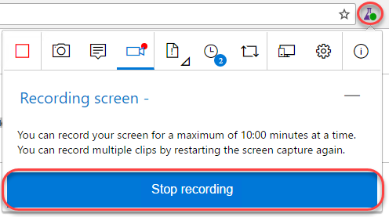

1. Click on the **View session timeline** button. You can see that all the content - screenshots, notes and videos you've captured are available in the current session's timeline. You can open the screenshots, read your notes or play the video from here.

    

### Task 3: Creating Bugs with the Chrome Extension ###

1. Click the **Create bug** icon button followed by the expanded **Create bug** text button.

    

1. Enter **"Search for jumper leads fails"** as the name of the bug. All the screenshots and videos captured earlier are already a part of the bug. In addition to this the image action log (user actions) has also been inserted for you so that it's easy for others to easily reproduce the issue. Click **Save** to save the bug to Azure DevOps.

    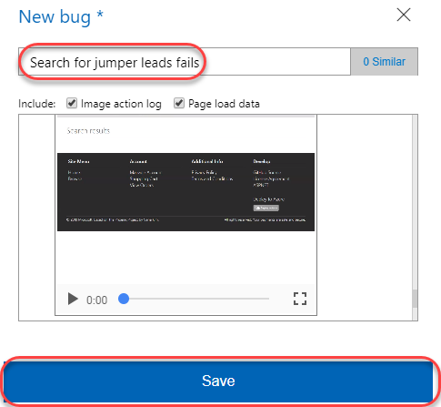

1. Another great feature of this extension is its ability to view similar bugs and thus reduce redundant issues. Let's say you were another tester who happened to find this same bug and weren't aware that it was already logged. Click the **Create bug** icon button followed by the expended **Create bug** text button again to start a new bug form.

    

1. As you type the title **"jumper leads**" for the bug you will notice that the extension has detected that there is already another bug in the backlog with a similar title. Click **1 similar** to view the similar bug.

    

1. This bug appears to be the same as the one we were about to file, so select it and click **Edit** to edit the existing bug rather than to file a new bug.

    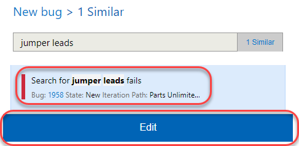

1. At this time the current repro steps are added to the image action log. In practice, you would now review the existing repro steps to determine if you located this bug using a different method, in which case you would update the contents to indicate that your method is an alternative repro. Click **Save** to save the bug.

    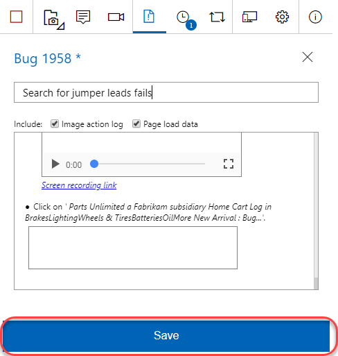

1. Click the **View session timeline** icon button and click the last created **Bug** link to open it.

    

1. Now back on the Azure DevOps site, you can update the bug as needed, such as by assigning it to someone or adjusting the severity.

    

1. In Chrome, end the testing session by clicking the **Stop Session** button.

    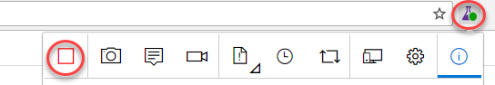

