<div class="rw-ui-container"></div>

<a name="Overview"></a>
## Overview ##

Git is a distributed version control system. Git repositories can live locally (such as on a developer's machine). Each developer has a copy of the source repository on their dev machine. Developers can commit each set of changes on their dev machine and perform version control operations such as history and compare without a network connection.

In this lab, you will learn how to clone an existing Git repository from GitHub. In addition, you will learn about Git branching and merging support. You will use Visual Studio Code, but the same processes apply for using any Git-compatible client with GitHub.

<a name="Prerequisites"></a>
### Prerequisites ###

- [Visual Studio Code](https://code.visualstudio.com/) with the C# extension installed.

- [Git for Windows](https://gitforwindows.org/) 2.21.0 or later.

<a name="Exercise1"></a>
## Exercise 1: Configuring the lab environment ##

<a name="Ex1Task1"></a>
### Task 1: Configuring Visual Studio Code ###

1. Open **Visual Studio Code**. In this task, you will configure a Git credential helper to securely store the Git credentials used to communicate with GitHub. If you have already configured a credential helper and Git identity, you can skip to the next task.

1. From the main menu, select **Terminal | New Terminal** to open a terminal window.

1. Execute the command below to configure a credential helper.

    ```
    git config --global credential.helper wincred
    ```
1. The commands below will configure your user name and email for Git commits. Replace the parameters with your preferred user name and email and execute them.

    ```
    git config --global user.name "John Doe"
    git config --global user.email johndoe@example.com
    ```
<a name="Ex1Task2"></a>
### Task 2: Forking an existing repository ###

1. In a browser tab, navigate to the GitHub project at [https://github.com/Microsoft/PartsUnlimitedE2E](https://github.com/Microsoft/PartsUnlimitedE2E).

1. Click **Fork**. This will copy the entire repository into the account you specify so that you can work on it without impacting the original repo.

    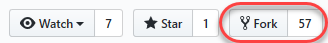

1. Select the GitHub account to fork into. The fork should complete quickly.

<a name="Ex1Task3"></a>
### Task 3: Cloning an existing repository ###

1. Your GitHub browser tab should now be open to your forked version of the repo.

1. Getting a local copy of a Git repo is called "cloning". Every mainstream development tool supports this and will be able to connect to GitHub to pull down the latest source to work with. From the **Clone or download** dropdown, click the **Copy to clipboard** button**.**

    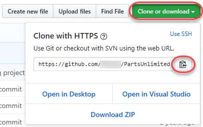

1. Open an instance of **Visual Studio Code**.

1. Press **Ctrl+Shift+P** to show the **Command Palette**. The Command Palette provides an easy and convenient way to access a wide variety of tasks, including those provided by 3rd party extensions.

1. Execute the **Git: Clone** command. It may help to type **"Git"** to bring it to the shortlist.

    

1. Paste in the URL to your repo and press **Enter**.

    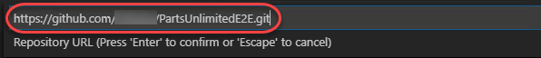

1. Select a local path to clone the repo to.

1. When prompted, log in to your GitHub account.

1. Once the cloning has completed, click **Open**. You can ignore any warnings raised about opening the projects. The solution may not be in a buildable state, but that's okay since we're going to focus on working with Git and building the project itself is not necessary.

    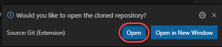

<a name="Exercise2"></a>
## Exercise 2: Saving work with commits ##

When you make changes to your files, Git will record the changes in the local repository. You can select the changes that you want to commit by staging the changes. Commits are always made against your local Git repository, so you don't have to worry about the commit being perfect or ready to share with others. You can make more commits as you continue to work, and push the changes to others when they are ready to be shared.

What's in a commit?

Git commits consists of the following:

- The file(s) changed in the commit. Git keeps the contents of all file changes in your repo in the commits. This keeps it fast and allows intelligent merging.

- A reference to the parent commit(s). Git manages your code history using these references.

- A message describing a commit. You give this message to Git when you create the commit. It's a good idea to keep this message descriptive, but to the point.

<a name="Ex2Task1"></a>
### Task 1: Committing changes ###

1. From the **Explorer** tab, open **/PartsUnlimited-aspnet45/src/PartsUnlimitedWebsite/Models/CartItem.cs**.

    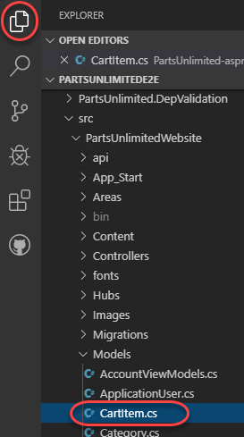

1. Add a comment to the file. It doesn't really matter what the comment is since the goal is just to make a change. Press **Ctrl+S** to save the file.

    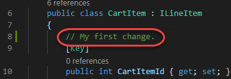

1. Select the **Source Control** tab to see the one change to the solution.

    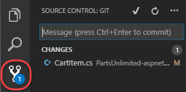

1. Enter a commit message of **"My commit"** and press **Ctrl+Enter** to commit it locally.

    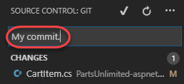

1. If asked whether you would like to automatically stage your changes and commit them directly, click **Always**. We will discuss **staging** later in the lab.

    

1. Click the **Synchronize Changes** button to synchronize your changes with the server. Confirm the sync if prompted.

    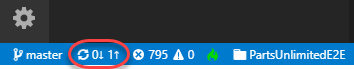

1. If prompted, log in to your GitHub account.

    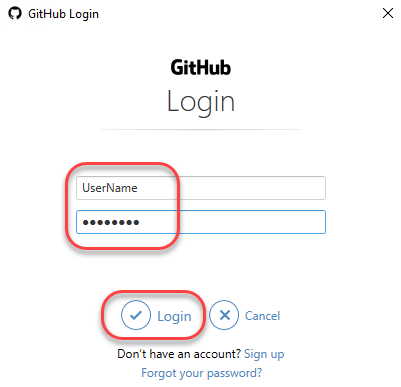

<a name="Ex2Task2"></a>
### Task 2: Staging changes ###

Staging changes allows you to selectively add certain files to a commit while passing over the changes made in other files.

1. Return to **Visual Studio Code**.

1. Update the open **CartItem.cs** class by editing the comment you made earlier and saving the file.

    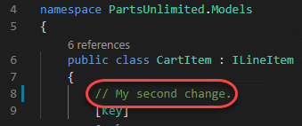

1. Open **Category.cs** as well.

    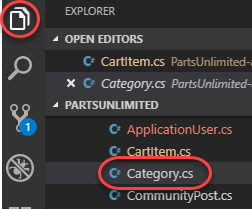

1. Add a new comment to **Category.cs** so there will be two files with changes. Save the file.

    

1. From the **Source Control** tab, click the **Stage Changes** button for **CartItem.cs**.

    

1. This will prepare **CartItem.cs** for committing without **Category.cs**.

    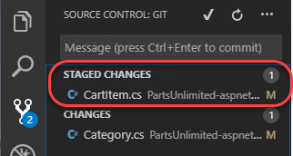

1. Enter a comment of **"Added comments"**. From the **More Actions** dropdown, select **Commit Staged**.

    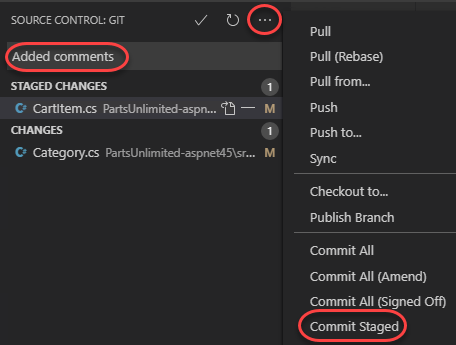

1. Click the **Synchronize Changes** button to synchronize the committed changes with the server. Note that since only the staged changes were committed, the other changes are still pending locally.

    

<a name="Exercise3"></a>
## Exercise 3: Reviewing history ##

Git uses the parent reference information stored in each commit to manage a full history of your development. You can easily review this commit history to find out when file changes were made and determine differences between versions of your code using the terminal or from one of the many Visual Studio Code extensions available. You can also review changes using the GitHub portal.

Git's use of the **Branches and Merges** feature works through pull requests, so the commit history of your development doesn't necessarily form a straight, chronological line. When you use history to compare versions, think in terms of file changes between two commits instead of file changes between two points in time. A recent change to a file in the master branch may have come from a commit created two weeks ago in a feature branch but was only merged yesterday.

<a name="Ex3Task1"></a>
### Task 1: Comparing files ###

1. In the **Source Control** tab, select **Category.cs**.

    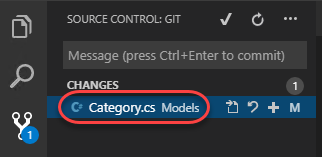

1. A comparison view is opened to enable you to easily locate the changes you've made. In this case, it's just the one comment.

    

1. Return to the GitHub browser tab.

<a name="Ex3Task3"></a>
### Task 3: Reviewing commits ###

1. Switch to the GitHub browser tab. You can review the latest commits on GitHub under the **Commits** tab.

    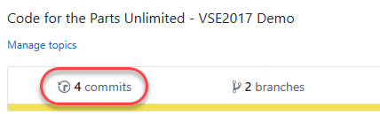

1. The recent commits should be right at the top. Click the most recent one.

    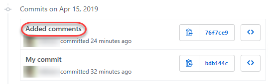

1. This view enables you to review the changes applied by this commit. Click **View file**.

    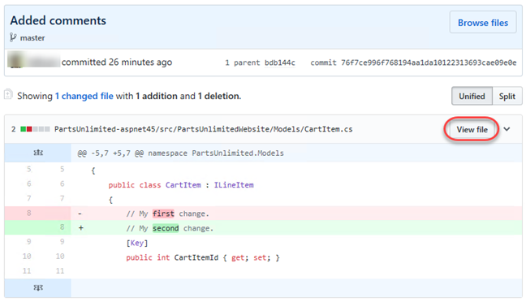

1. Click **History** to track the commits made to this file over time.

    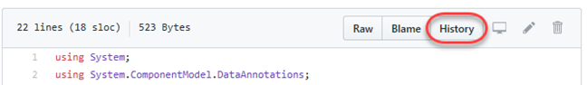

1. Click the **Browse repository at this point in the history** button for the second commit. This was the first commit pushed from this lab.

    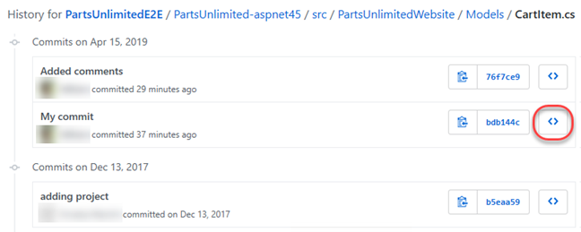

1. You can now review the state of the repo at the time this commit was pushed. The dropdown at the top provides a convenient way to switch between branches as well.

    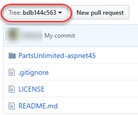

<a name="Exercise4"></a>
## Exercise 4: Working with branches ##

You can manage the work in your GitHub repo from the **Branches** tab. You can also customize the view to track the branches you care most about so you can stay on top of changes made by your team.

Committing changes to a branch will not affect other branches, and you can share branches with others without having to merge the changes into the main project. You can also create new branches to isolate changes for a feature or a bug fix from your master branch and other work. Since the branches are lightweight, switching between branches is quick and easy. Git does not create multiple copies of your source when working with branches, but rather uses the history information stored in commits to recreate the files on a branch when you start working on it. Your Git workflow should create and use branches for managing features and bugfixes. The rest of the Git workflow, such as sharing code and reviewing code with pull requests, all work through branches. Isolating work in branches makes it very simple to change what you are working on by simply changing your current branch.

<a name="Ex4Task1"></a>
### Task 1: Creating a new branch in your local repository ###

1. Return to **Visual Studio Code**.

1. Click the **master** branch from the bottom left.

    

1. Select **Create new branch**.

    

1. Enter the name **"dev"** for the new branch and press **Enter**.

    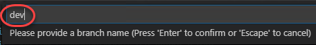

1. If prompted, select **master** as the reference branch.

    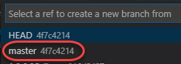

1. You are now working on that branch.

    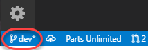

<a name="Ex4Task2"></a>
### Task 2: Working with branches ###

Git keeps track of which branch you are working on and makes sure that when you checkout a branch your files match the most recent commit on the branch. Branches let you work with multiple versions of the source code in the same local Git repository at the same time. You can use Visual Studio Code to publish, check out, and delete branches.

1. Click the **Publish changes** button next to the branch.

    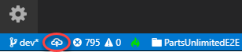

1. From the GitHub browser tab, select the **Branches** tab.

    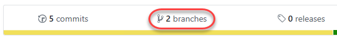

1. You should see the newly pushed **dev** branch. Click the **Delete this branch** button to delete it.

    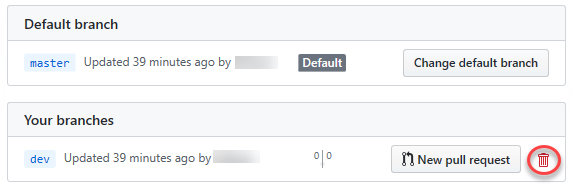

1. Return to **Visual Studio Code**.

1. Click the **dev** branch.

    

1. Note that there are two **dev** branches listed. The local (**dev**) branch is there because it's not deleted when the server branch is deleted. The server (**origin/dev**) is there because it hasn't been pruned. Select the **master** branch to check it out.

    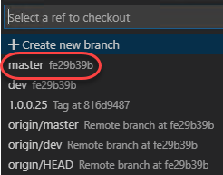

1. Press **Ctrl+Shift+P** to open the **Command Palette**.

1. Start typing **"Git: Delete"** and select **Git: Delete Branch** when it becomes visible.

    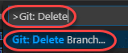

1. There is only one local branch to delete, so select it.

    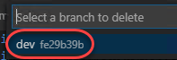

1. Click the **master** branch.

    

1. Note that the local **dev** branch is gone, but the remote **origin/dev** is still showing.

    

1. Press **Ctrl+Shift+P** to open the **Command Palette**.

1. Start typing **"Git: Fetch"** and select **Git: Fetch (Prune)** when it becomes visible. This command will update the origin branches in the local snapshot and delete those that are no longer there.

    

1. You can check in on exactly what these tasks are doing by selecting the **Output** window at the bottom of the screen. If this window isn't visible, you can restore it with the **View | Output** menu.

    

1. Note that if you don't see the Git logs in the output console, you may need to select **Git** as the source.

    

1. Click the **master** branch.

    

1. The **origin/dev** branch should no longer be in the list.

    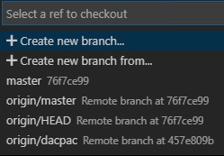

<a name="Exercise5"></a>
## Exercise 5: Managing branches from GitHub ##

In addition to all the functionality available in Visual Studio Code, you can also manage your repo branches from the GitHub portal.

<a name="Ex5Task1"></a>
### Task 1: Creating a new branch ###

1. Switch to the GitHub browser tab.

1. Return to the **Code** tab root.

    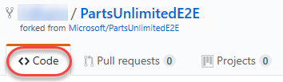

1. From the branches dropdown, enter a branch name of **"release"**. Click **Create branch: release**. This will create a new branch and switch to it.

    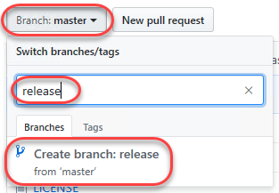

1. You can confirm that the newly created release branch is selected.

    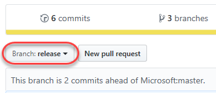

1. Return to **Visual Studio Code**.

1. Press **Ctrl+Shift+P** to open the **Command Palette**.

1. Start typing **"Git: Fetch"** and select **Git: Fetch** when it becomes visible. This command will update the origin branches in the local snapshot.

    

1. Click the **master** branch.

    

1. Select **origin/release**. This will create a new local branch called **"release"** and check it out.

    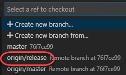

<a name="Ex5Task2"></a>
### Task 2: Deleting a branch ###

1. Return to the GitHub browser tab and navigate to the **Branches** tab.

    

1. Click the **Delete** button for the **release** branch.

    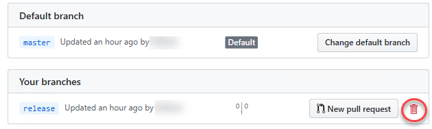

1. However, maybe we should keep it around for a little longer. Click **Restore** to undo the delete.

    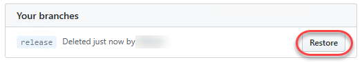

<a name="Ex5Task3"></a>
### Task 3: Tagging a release ###

1. While it may not seem like much, the product team has decided that this version of the site is exactly what's needed for v1.1. In order to mark it as such, return to the **Code** tab and select **Releases**.

    

1. Click **Create a new release**.

    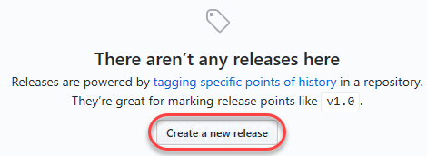

1. Enter **tag and release names** of **"v1.1"** and a **Description** of **"Great release!"**. Click **Publish release**.

    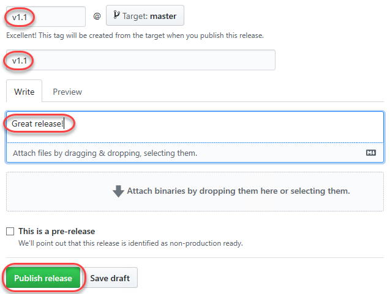

1. You have now tagged the project at this release. You could tag commits for a variety of reasons, and GitHub offers the flexibility to edit and delete them, as well as manage their permissions.

    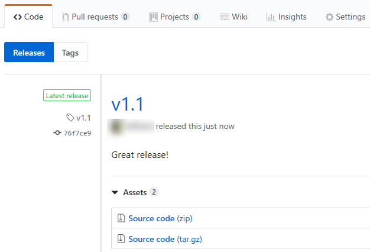

1. Select the **Tags** option to review tags by name.

    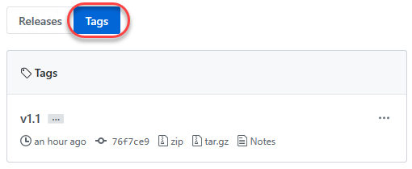

<a name="Exercise6"></a>
## Exercise 6: Managing repositories ##

You can create Git repos in team projects to manage your project's source code. Each Git repo has its own set of permissions and branches to isolate itself from other work in your project.

<a name="Ex6Task1"></a>
### Task 1: Creating a new repo ###

1. From the **New** dropdown, select **New repository**.

    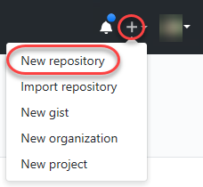

1. Set the **Repository name** to **"New Repo"**.  Note that you also have the option to create a file named **README.md**. This would be the default markdown file that is rendered when someone navigates to the repo root in a browser. Additionally, you can preconfigure the repo with a **.gitignore** file. This file specifies which files, based on naming pattern and/or path, to ignore from source control. There are multiple templates available that include the common patterns and paths to ignore based on the project type you are creating. Click **Create repository**.

    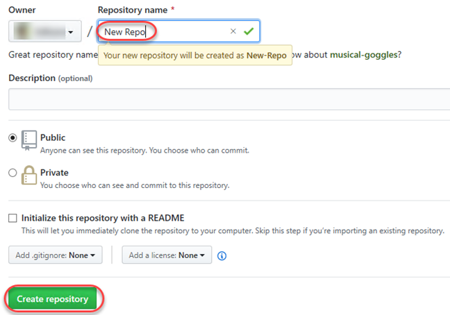

1. That's it. Your repo is ready. You now have the ability to clone it with Visual Studio or your tools of choice.

    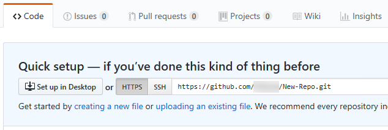

<a name="Ex6Task2"></a>
### Task 2: Renaming and deleting Git repos ###

1. Sometimes you'll have a need to rename or delete a repo, which is just as easy. Navigate to **Settings**.

    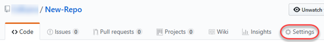

1. You can update the name of the repository here.

    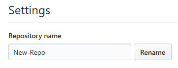

1. From the **Danger Zone** section of the settings view, click **Delete this repository**.

    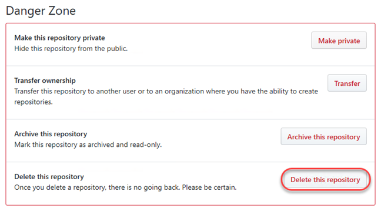

1. Enter the full repo name and click the option to delete the repository.

    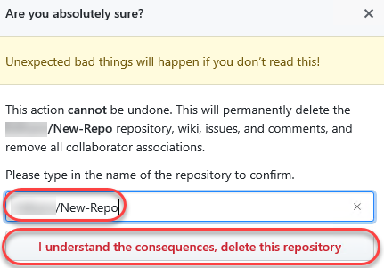

