

## Overview ##

Pull requests let your team give feedback on changes in feature branches before merging the code into the master branch. Reviewers can step through the proposed changes, leave comments, and vote to approve or reject the code. GitHub and its Visual Studio Code extension provide a rich experience for creating, reviewing, and approving pull requests.

### Prerequisites ###

- The [Git with GitHub lab](../github) is required to be completed as a prerequisite for this lab.

## Exercise 1: Working with pull requests ##

When the Git with GitHub lab ended, we had created a new branch and made a change to some of the code. Now we need to commit that change to the new branch and push it to the server. Once there, we can create a pull request so that the branch can be merged with the master.

### Task 1: Creating a new work item ###

1. Return to the GitHub browser tab and navigate to your forked repo.

1. Navigate to the **Settings** tab. This lab will involve creating a pull request designed to address an issue documented in the project, which we will define before getting started.

    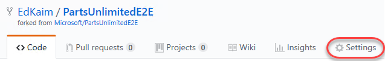

1. Enable the **Issues** feature.

    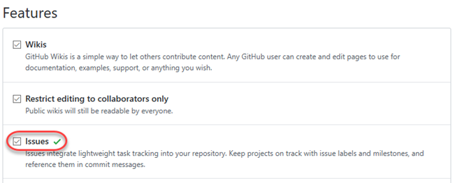

1. Navigate to the **Issues** tab.

    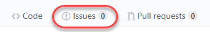

1. Click **New issue**.

    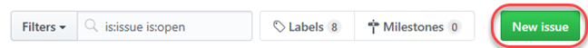

1. Create a new issue for **"Change Category.cs"** and click **Submit new issue**.

    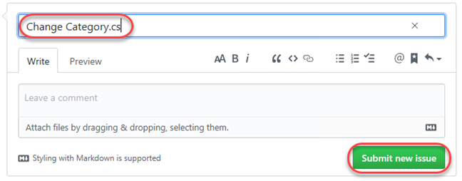

1. The new issue should be created with ID 1, but make a note of the ID in case it's different.

    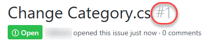

### Task 2: Creating a new pull request ###

1. Return to **Visual Studio Code**.

1. Select the **Extensions** tab and search for **"github"**. Click **Install** for **GitHub Pull Requests**.

    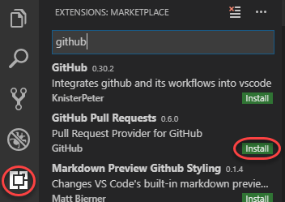

1. Press **Ctrl+Shift+P** to open the **Command Palette**.

1. Search for **"sign in"** and click the option to sign in to GitHub for the pull requests extension.

    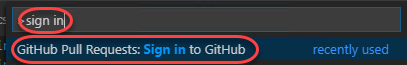

1. Follow the process to complete the authorization for the extension to integrate with GitHub.

1. Select the **Source Control** tab. It should recognize that you have uncommitted changes to **Category.cs**. Enter a comment of **"Category change. Fixes #1."** (update the ID if needed to match the issue you created earlier) and press **Ctrl+Enter** to commit to the local **release** branch.

    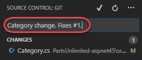

1. Click the **Synchronize Changes** button to push the commit to the server branch.

    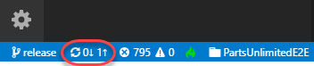

1. Select the **GitHub Pull Requests** tab and click the **Create Pull Request** button.

    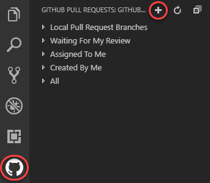

1. Select the remote associated with your account. Be sure to select yours and not the original Microsoft repo.

    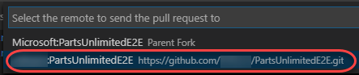

1. Press **Enter** to confirm the default **master** branch.

    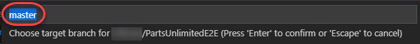

1. Once the pull request has been created, it will be checked out to you for review.

    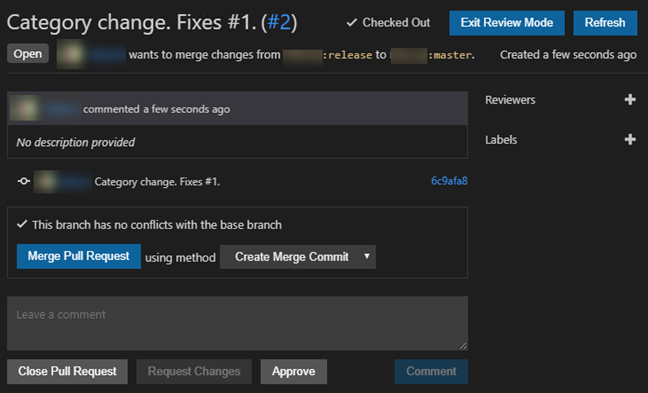

### Task 3: Managing pull requests ###

1. Although the current pull request is already open, you could easily navigate to it (or others) using the options available in the GitHub Pull Requests panel. Once a pull request is selected, you can navigate through the changes in the pull request. Use this process to open the **Category.cs** file from the commit.

    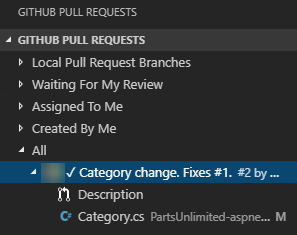

1. The diff viewer is used to show the difference between the code in the **master** and **release** branches.

    

1. Click the **Add comment** button next to the added line, enter a comment, and click **Start Review**.

    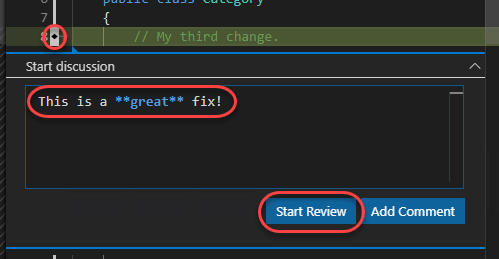

1. From the **Toggle Reaction** dropdown, select the thumbs up option to indicate approval.

    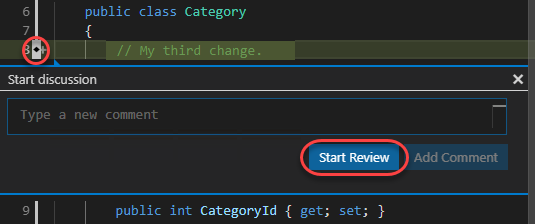

1. Click the **Add comment** button again, enter another comment, and click **Finish Review** to complete your review.

    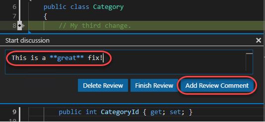

1. Besides the pull request navigation view, you can also use the shortcut at the bottom of the window to return to the current pull request.

    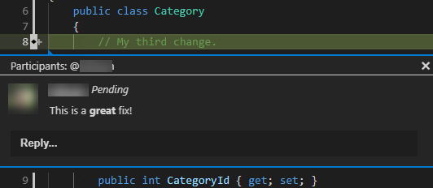

1. Click **Merge Pull Request**.

    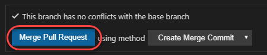

1. When prompted, click **Create Merge Commit** to complete the process.

    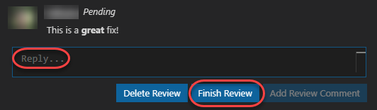

1. Return to the GitHub browser tab. Navigate to the repo's **Pull Requests** tab. Select the **Closed** pull requests option and click the closed pull request to open it.

    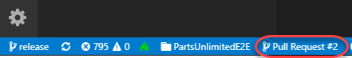

1. You can review all of the pull request details from this merged pull request, including the commits and conversations. Click the work item identified in the commit to see that it was automatically closed when the pull request was merged.

    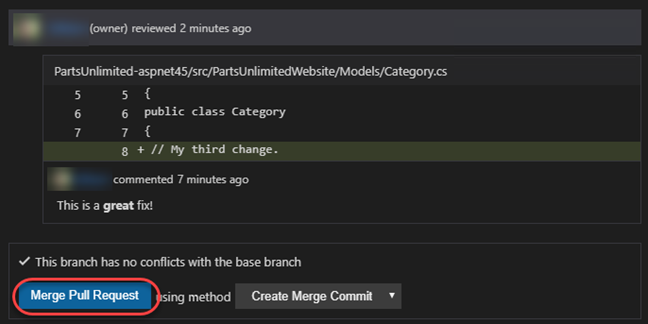

1. As expected, the issue is now marked **Closed**.

    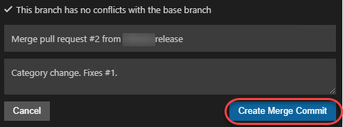

### Task 4: Managing Git repo and pull request policies ###

As projects and teams scale in complexity, it becomes help to automate more of the processes put in place to ensure quality.

1. Navigate to the repo's **Settings**.

    

1. Select **Branches**.

    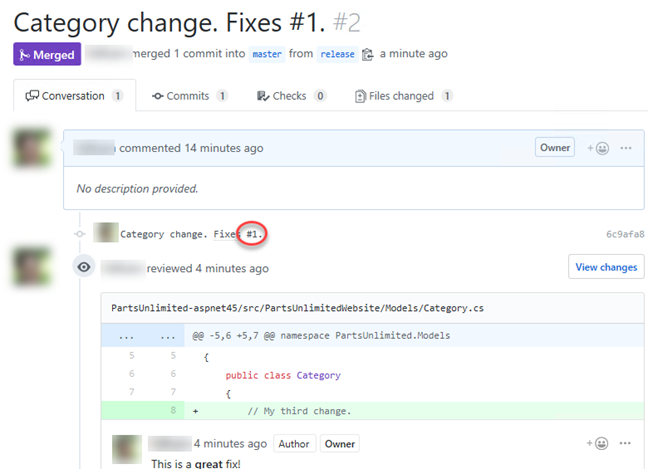

1. Policies are enforced by following rules that match the target branch. Click **Add rule** to create a new one.

    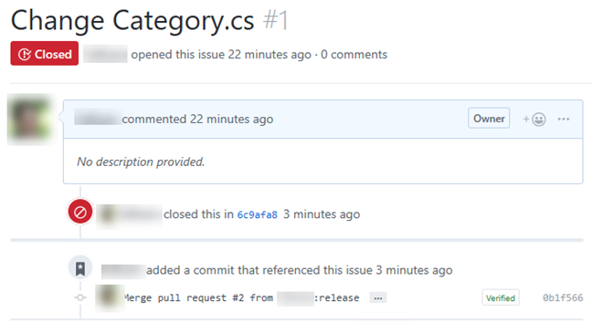

1. Set the **Branch name pattern** to **"master"**.

    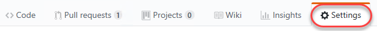

1. Enable the option to **Require pull request reviews before merging**. This option ensures that the merge request has been reviewed and comes from a branch that is not protected. Note that you can also specify special behavior for stale pull request approvals and require reviews from specific code owners.

    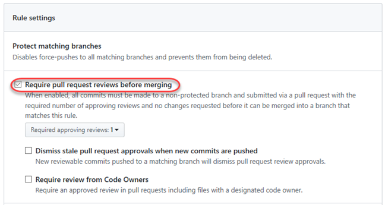

1. Enable the option to **Require status checks to pass before merging**. This ensures that specified status checks are passed before a pull request can be created. For example, you can require that the source branch builds successfully before becoming eligible for a merge.

    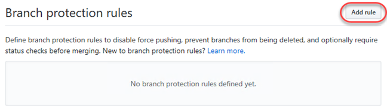

1. There are additional options for requiring signed commits and also for requiring that administrators follow these pull request restrictions. Click **Create** to create the rule.

    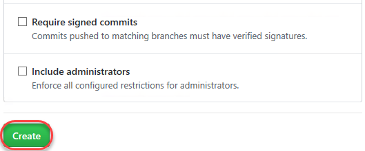

