 
### Task 1: Configuring the eShopOnWeb team project

1. Navigate to [https://azuredevopsdemogenerator.azurewebsites.net](https://azuredevopsdemogenerator.azurewebsites.net/). This utility site will automate the process of creating a new Azure DevOps project within your account that is prepopulated with content (work items, repos, etc.) required for the lab. For more information on the site, please see [https://docs.microsoft.com/en-us/azure/devops/demo-gen](https://docs.microsoft.com/en-us/azure/devops/demo-gen).

1. Sign in using the Microsoft account associated with your Azure DevOps subscription.

    

1. **Accept** the permission requests for accessing your subscription.

1. Select your Azure DevOps organization and enter the project name **"eShopOnWeb"**. Click **Choose Template**.

    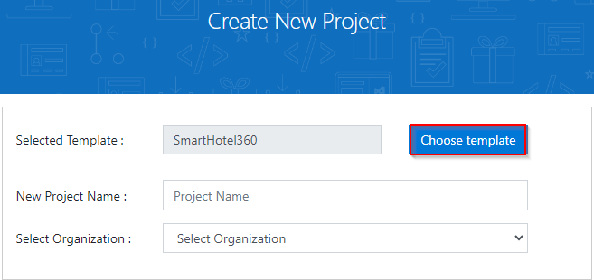

1. Select the **eShopOnWeb** template and click **Select Template**.

    #Need to update image
    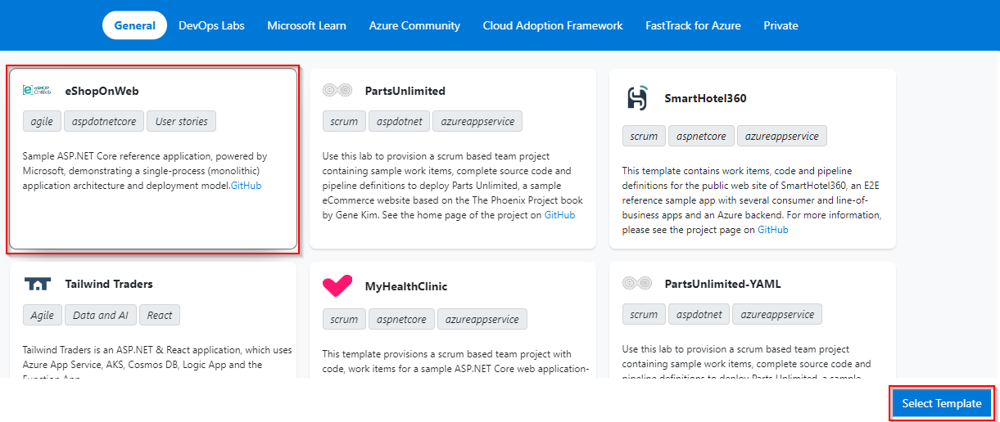
1. Provide a project name and choose your Organization.

1. Click **Create Project** and wait for the process to complete.

    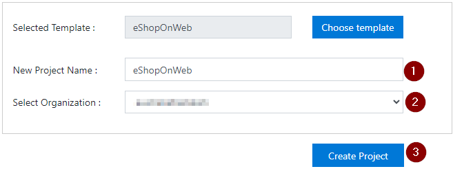

1. Navigate to your eShopOnWeb project on Azure DevOps. It will be something like [https://dev.azure.com/YOURACCOUNT/eShopOnWeb]()

### Task 2: Configure the approvals and checks in environments

Once you provision the project follow the below steps to configure the approvals and checks

1. Navigate to **Pipelines** section and select **Environments**

    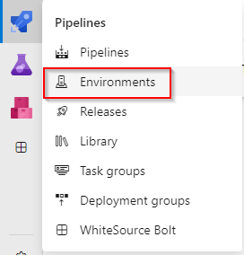

1. Select **Production** environment

    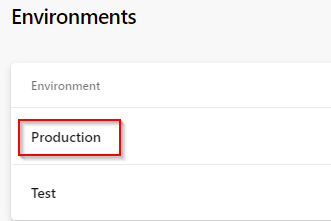

1. Navigate to **Approvals and checks** and select **Approvals**
    
    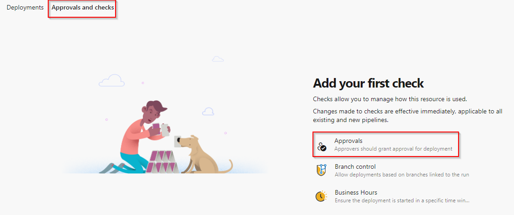

1. Choose an approver and click on create

    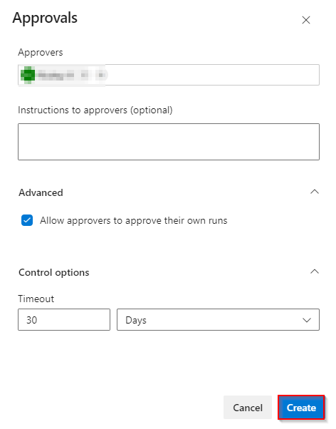

1. To select additional checks, click on + button

    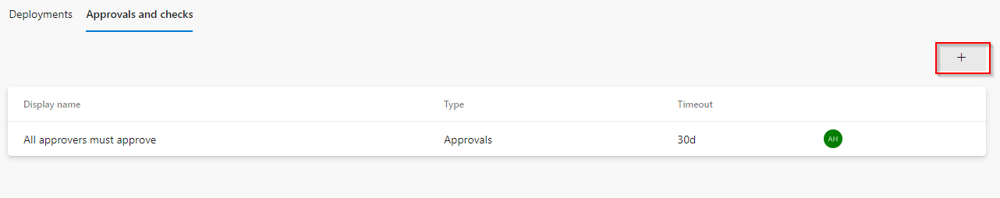

1. Select **Required tempalte** and click on Next

    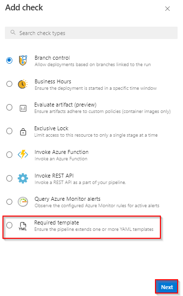

1. Click on + button to add tempalte

    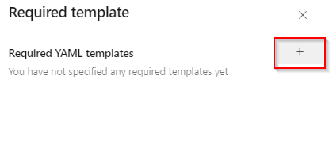

1. Input the values in the Required YAML template fields and click on **Add required template** button

    - Choose **Azure Repos** radio button
    - Repository: **eShoponweb**
    - Ref: **refs/heads/main**
    - Path to required YAML template: **template.yaml**

   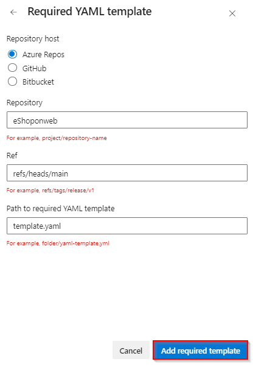

1. Repository will be pointing to the main branch, click on **Create** button.

    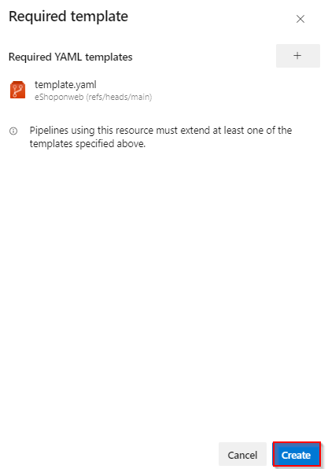

1. Choose the Kebab menu &#8942; and select **Security** option to configure the environment security.

    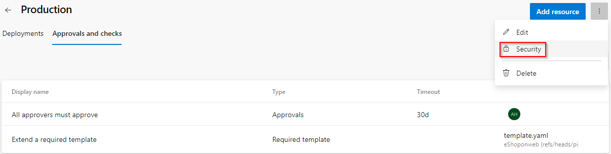

1. On the **Pipeline permission** section choose **+** button and select the pipeline.
Repeat the same for **Test** environment.

    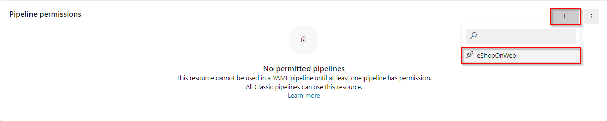

### Task 3: Create Azure Resource Manager service connection
> To create Azure Resource Manager service connection, you must be the owner or co-owner of the Azure Subscription

1. Sign in to your organization your organization and select your project

1. Navigate to **Project Settings** and select **Service connections**

1. Select **+ New service connection**, select the type of service as **Azure Resource Manger**, and then select **Next**

1. Choose an authentication method, and then select **Next**

    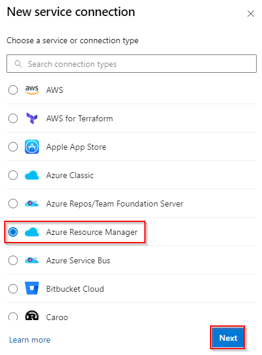

1. Choose the Authentication type as **Service principal (automatic)** and then select **Next**

    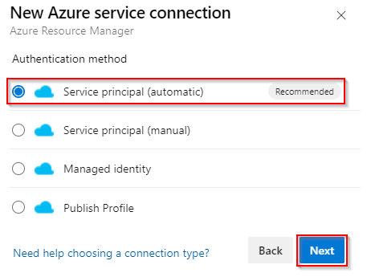

1. Choose a Subscription and Provide the service connection name as **eShopOnWeb** and select **Save**

    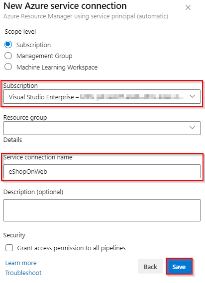

> Service connection with the same name is already present in the YAML pipeline, no need to modify the pipeline.

### Task 4: Grant Permission to Pipeline

1. Open **eShopOnWeb** service connection created in the previous task

    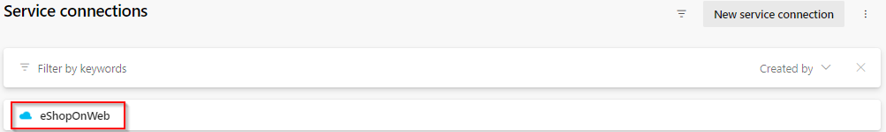

1. Choose Security option on the Kebab menu &#8942;
    
    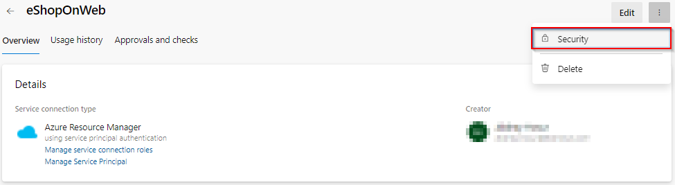

1.  Under the **Pipelines permission** section, choose **+** button and select the pipeline **eShopOnWeb**. This grants the permission to the YAML pipeline to use the service connection.

    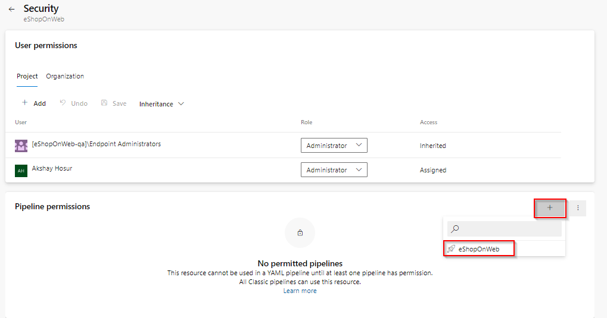

1. Edit the YAML pipeline and make sure that the subscription has been configured correctly.

1. Trigger the pipeline to see the Build and Deployment in action.

> As part of the deployment, Azure Resource Manager template will provision the resource group and the resources in your Azure Subscription.