

## Overview ##

Pull requests let your team give feedback on changes in feature branches before merging the code into the master branch. Reviewers can step through the proposed changes, leave comments, and vote to approve or reject the code. Azure DevOps provides a rich experience for creating, reviewing, and approving pull requests.

It is required that you complete the [Git lab](../git) prior to taking this lab.

### Prerequisites ###

- [Visual Studio Code](https://code.visualstudio.com/) with the C# extension installed.

- [Azure Repos Extension](https://marketplace.visualstudio.com/items?itemName=argutec.argutec-azure-repos) for Visual Studio Code

- This lab requires you to complete task 1 from the [prerequisite instructions](../prereq).

- The [Git lab](../git) is required to be completed as a prerequisite for this lab.

## Exercise 1: Working with pull requests ##

When the Git lab ended, we had created a new branch and made a change to some of the code. Now we need to commit that change to the new branch and push it to the server. Once there, we can create a pull request so that the branch can be merged with the master.

### Task 1: Creating a new pull request ###

1. Return to **Visual Studio Code**.

1. Select the **Source Control** tab. It should recognize that you have uncommitted changes to **Category.cs**. Enter a comment of **"Category change"** and press **Ctrl+Enter** to commit to the local **release** branch.

    

1. Click the **Synchronize Changes** button to push the commit to the server branch.

    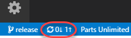

1. Press **Ctrl\|Shift+P** to open the **Command Palette**.

1. Start typing **"Team"** and select **Team: Create Pull Request** when it becomes available. This will open a new pull request for the current branch in a new browser tab.

    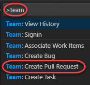

1. The **New Pull Request** form should already contain the key information reviewers will need, as well as who those reviewers should be (if any). If not, select **release** as the branch to merge into **master**.

    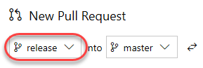

1. You can customize any of this, and some of it may be required based on policy. Also note that the work item associated with the branch when created is referenced. Click **Create**.

    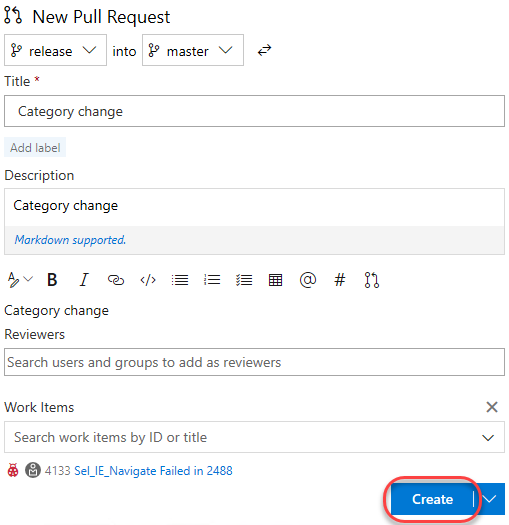

### Task 2: Managing pull requests ###

1. Return to **Visual Studio Code**.

1. Click the **Browse your pull requests** button at the bottom of the screen.

    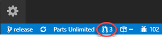

1. Select the pull request you just created. This will open it a new browser tab.

    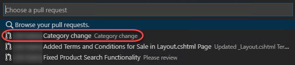

1. The **Overview** tab contains all of the key information specified in the creation form, as well as options to approve and complete the request.

    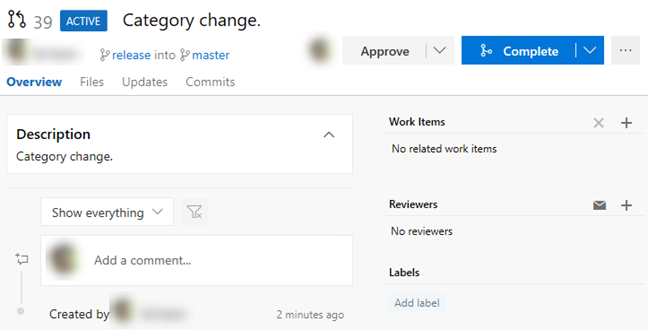

1. Select the **Files** tab to review the files involved in the commit.

    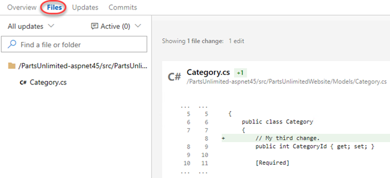

1. Note that you can select a specific update from the dropdown if you like.

    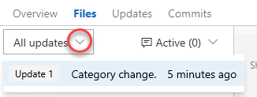

1. Click the **Add comment** button next to the source file. Enter a comment using markdown and click **Comment** to save it. Note that there is a live preview of your comment before you commit to it.

    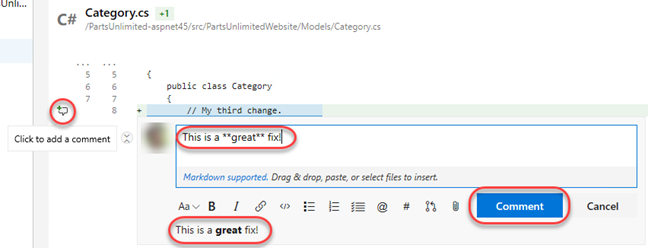

1. The new comment is placed in line with the code. This makes it very easy to have discussions about lines and sections of code within their proper context.

    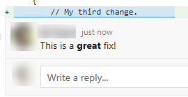

1. The new comment is also tracked as part of the pull request. It's expected that every comment will be resolved before a pull request will be completed, so this convenient marker lets you know if there's anything else that needs to be reviewed.

    

1. Update the comment to mark it as **Resolved**.

    

1. Note that this now updates the tracking as well.

    

1. Select the **Updates** tab. This contains details on the updates in the branch.

    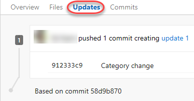

1. Select the **Commits** tab, where you can review the commits made to the branch.

    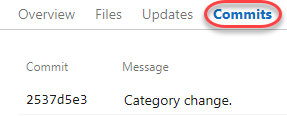

1. Since everything seems to be in order, **Approve** the pull request.

    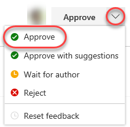

1. Since the approvers have signed off, **Complete** the pull request.

    

1. You can accept the default messages in the pull request dialog. The first option is to complete the work items linked to the branch being merged. Note that you also have the option to delete the target branch after merging, as well as the ability to **squash changes** during the merge. Squash merging is a merge option that allows you to condense the Git history of topic branches when you complete a pull request. Instead of each commit on the topic branch being added to the history of the default branch, a squash merge takes all the file changes and adds them to a single new commit on the default branch. Squash merging keeps your default branch histories clean and easy to follow without demanding any workflow changes on your team. Click **Complete merge**.

    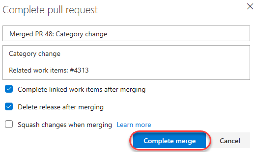

1. When the merge completes, the pull request should be marked as **Completed**.

    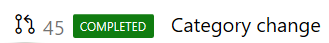

1. Return to the **Pull Requests** home.

    

1. Select the **Completed** tab and click the pull request as though you were visiting it fresh.

    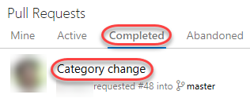

1. You can review the pull request, as well as **Cherry-pick** or **Revert** it if needed. Cherry-picking is the process of selecting specific commits from one branch to apply to another, conceptually similar to a copy/paste operation.

    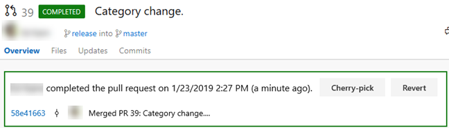

1. Under **Work Items**, click one of the linked work items.

    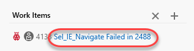

1. Note that the work item has now been marked as **Done**.

    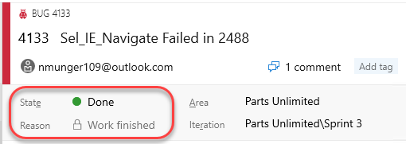

1. Under the **Development** tab, you can see the commit and pull request have been associated with the work item.

    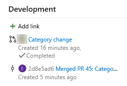

### Task 3: Managing Git branch and pull request policies ###

As projects and teams scale in complexity, it becomes help to automate more of the processes put in place to ensure quality.

1. Open **Project settings**.

    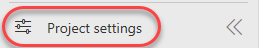

1. Select **Repositories** under **Repos**.

    

1. Select the **PartsUnlimited** repo. Like everything else in Azure DevOps, you can manage security to a great level of detail. Select the **Options** tab. This allows you to set some useful policies, such as whether or not you want to allow users to fork the repo, whether discussed work items are automatically linked, and so on.

    

1. Select the **master** branch. Like the repo, you have a great deal of control over its security settings. You can also define a wide variety of policies for the branch to enforce. Click **Branch Policies**.

    

1. Azure DevOps branch policies are very effective in enforcing a level of quality control in the repo. For example, you can control pull requests by requiring a minimum number of reviewers, checking for linked work items, requiring that all comments have been resolved, and more. You can even require validation through a successful build and configure external approval services. If there are certain sections of code that require their own approvers to be included, you can include them here as well.

    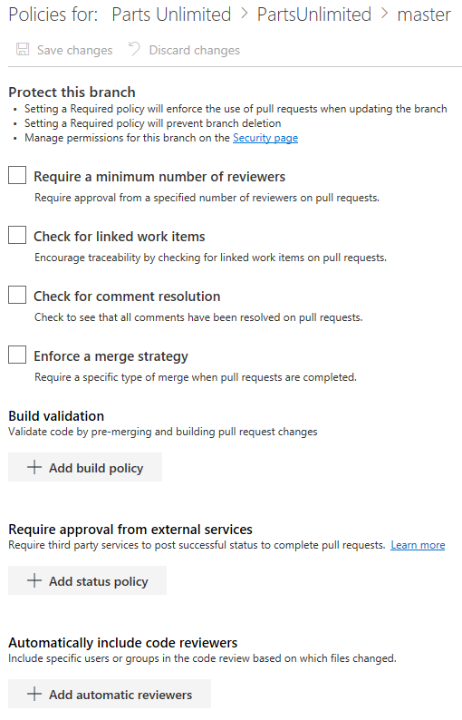

1. Check **Require a minimum number of reviewers**. By default, this requires at least two reviewers to approve a pull request, and also requires (by default) that the original author is not one of them.

    

1. Click **Add automatic reviewers**.

    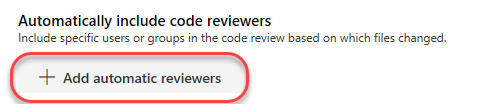

1. Add yourself as a **Reviewer** and set the **Path filter** to **"/PartsUnlimited-aspnet45/src/PartsUnlimitedWebsite/Controllers/*"**. Having the requirement of **Required** ensures that you will be required to sign off on any changes proposed to the controllers code in the web app. Click **Save**.

    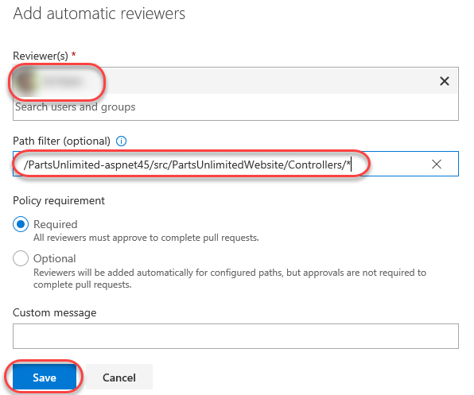

1. Click **Save changes** to save the changes to the policy.

    


