

## Overview ##

In this lab, you will be introduced to technical debt, how to configure your Azure Build definitions to use SonarCloud, how to understand the analysis results, and finally how to configure quality profile to control the rule set used by SonarCloud for analyzing your project.

Technical debt is the set of problems in a development effort that make forward progress on customer value inefficient. Technical debt saps productivity by making code hard to understand, fragile, time-consuming to change, difficult to validate, and creates unplanned work that blocks progress. Technical debt saps an org's strength due to high costs in customer support, and, eventually, some combination of these issues creates a larger problem that someone runs into. Technical debt is insidious. It starts small and grows over time through rushed changes, lack of context and lack of discipline. It can materialize out of nowhere even for a project regarded as clean at some point in time, due to a change in project circumstances: prototype code may be promoted to serve as the basis for a feature; code produced for the U.S. market may be proposed for international, instantly creating debt related to localizability; technologies evolve, but the app doesn't keep up.

### Prerequisites ###

- A SonarCloud account from [https://sonarcloud.io](https://sonarcloud.io/).

- This lab requires you to complete task 1 from the <a href="../prereq/">prerequisite</a> instructions.

## Exercise 1: Managing Technical Debt with Azure DevOps and SonarCloud ##

### Task 1: Install and configure the SonarCloud extension ###

1. Navigate to your team project on Azure DevOps.

1. SonarCloud is provided as a marketplace extension. From the **Marketplace** navigation dropdown, select **Browse Marketplace**.

    

1. Search for **"SonarCloud"**.

    

1. Select the **SonarCloud** option.

    

1. Click **Get it free**.

    

1. Select the organization to install **SonarCloud** into. This should be the organization that contains your **Parts Unlimited** project. Click **Install**.

    

1. Click **Proceed to organization**.

    

1. Navigate to your **Parts Unlimited** team project.

### Task 2: Integrating a build with SonarCloud ###

1. Navigate to **Pipelines \| Pipelines**.

    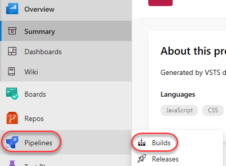

1. Select **New pipeline** to create a new build pipeline.

    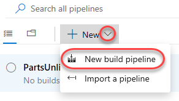

1. Click **use the classic editor**.

    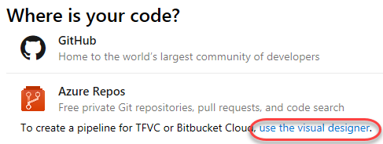

1. Accept the default options and click **Continue**.

    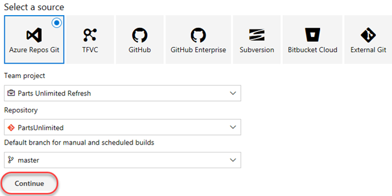

1. Select the **.NET Desktop with SonarCloud** template and click **Apply**.

    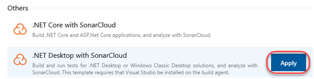

1. This build definition is pretty standard for a .NET project, except that it also includes three additional tasks for **SonarCloud**. Note that you could easily integrate these specific tasks with your existing build definitions. There's no need to start from scratch like we are in this lab.

    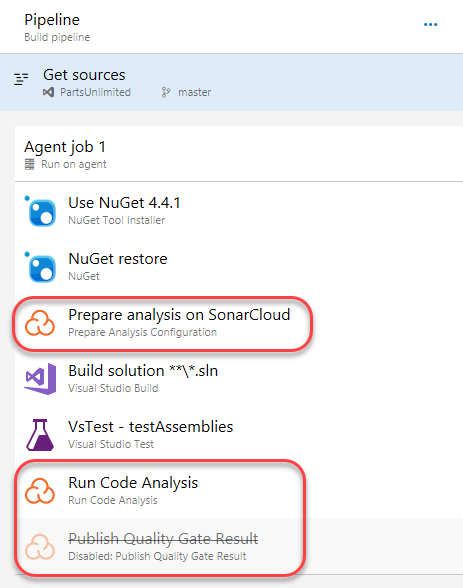

1. Set the **Agent pool** to **Hosted**. It should be the first option and have the **Visual Studio** logo.

    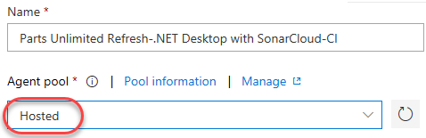

1. Select the **Prepare analysis on SonarCloud** task. This task defines the connection configuration for any later tasks.

    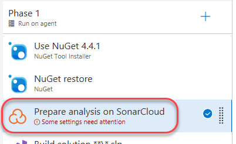

1. Click **New** to configure a new **SonarCloud Service Endpoint**.

    

1. Click **your SonarCloud account security page** to open the account page in a new tab.

    

1. Navigate to [https://sonarcloud.io](https://sonarcloud.io/) and sign in to your SonarCloud account.

1. Click "My account link" and move to "Security" tab

    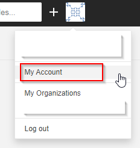

1. To generate a token, enter a name like **"azuredevops"** and click **Generate**.

    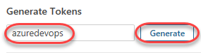

1. When the token is generated, click **Copy** to copy it to your clipboard. This token is tied to your account and the only thing necessary to access the service on your behalf.

    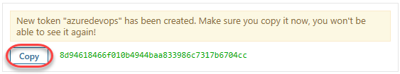

1. Enter a **Service connection name** of **"SonarCloud"** and paste the token as the **SonarCloud Token**. Click **Verify and save**.

    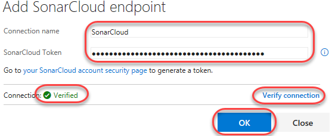

1. Select **SonarCloud** as the **SonarCloud Service Endpoint** and select an **Organization** associated with the account. You'll also need to provide a globally unique **Project Key**, such as **"partsunlimited.YOURNAME"**.

    

1. Select **Save & queue \| Save & queue** to kick off a new build.

    

1. Click the new build link to follow its progress through to completion.

    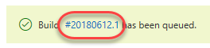

### Task 3: Reviewing SonarCloud results ###

1. From the left panel, select the **Run Code Analysis** task. This contains the processes where SonarCloud analyzes the code.

    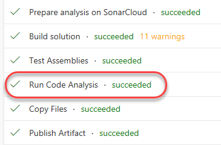

1. Near the end of the log, locate the URL to the results viewer and open it.

    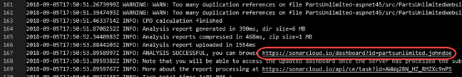

1. The SonarCloud results are organized for easy access to the key results you're looking for.

    

1. Select the **Issues** tab. This provides a convenient way to filter and sort the results so that you can attack the section you feel needs immediate attention. Select the first result.

    

1. The code view provides an in-depth review of each issue, along with suggestions and configuration options. For this issue, select **Open \| Resolve as won't fix**.

    

1. Select the **Measures** tab. This provides a visualization of issues as selected by the available filters.

    

1. Filter down to see the **Reliability \| Overview**. This enables you to hover over the various assets to see the amount of effort required to fix and/or maintain various components for reliability.

    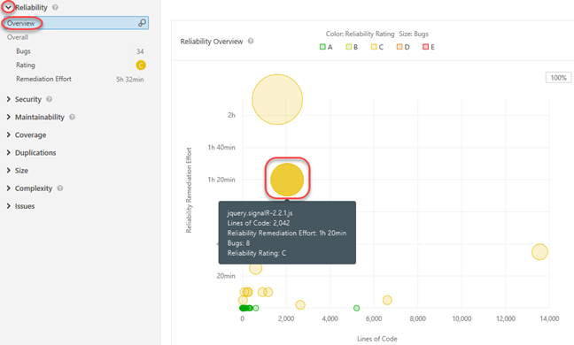

1. Select the **Code** tab and drill into the **PartsUnlimitedWebsite** project. This provides a way to review project issues at a file level.

    

1. Open **Bootstrapper.cs**.

    

1. Locate the first issue related to having commented code. Expand it using the **chevron** and click the **ellipses** to see a detailed explanation and references as to the relevance and importance of this rule.

    

1. Expand the **Administration** option. Note that there is an incredible amount of flexibility available here for customizing your SonarCloud analysis.

    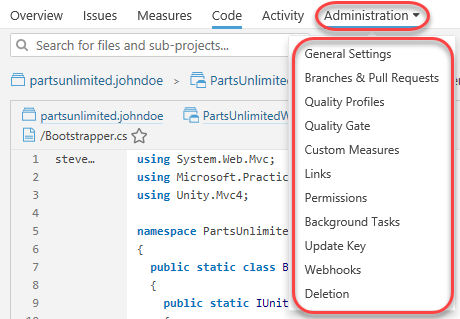

