

## Overview ##

In this lab, you'll learn about the wiki feature of Azure DevOps that enables easier collaboration experiences for development teams. Each project in Azure DevOps now supports its own wiki, which enables you to conveniently write pages that help your team members and other users understand, use, and contribute to your project.

### Prerequisites ###

- Visual Studio 2017

- This lab requires you to complete task 1 from the <a href="../prereq/">prerequisite</a> instructions

## Exercise 1: Wiki collaboration with Azure DevOps ##

### Task 1: Creating and editing a project wiki ###

1. Navigate to your team project on Azure DevOps.

1. Use the navigation to get to the **Wiki** hub.

    

1. Since this project does not yet have its wiki configured, click **Create Wiki** to set one up. When you create your first wiki, Azure DevOps will provision a git repository that will store all your pages and artifacts.

    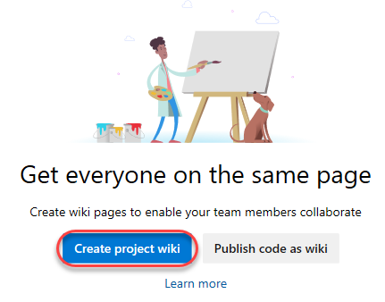

1. Enter **"Home"** as the title of the first wiki page. Enter some body content, such as **"Welcome to *our* project!"**. Azure DevOps wikis support Markdown, and you can learn more [here](https://docs.microsoft.com/en-us/vsts/collaborate/markdown-guidance). Click **Save**.

    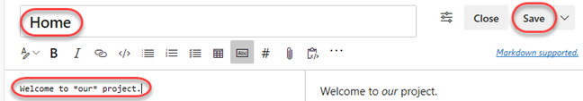

1. Click **Close** to exit the edit experience.

    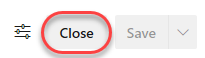

1. Your first wiki page is now available for everyone to see.

    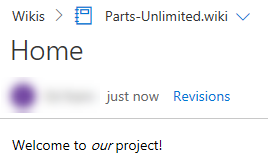

1. By default, all members of the **Contributors** group can edit README files and wiki pages. **Stakeholders** can read files and revisions, but cannot edit anything. Select **More \| Wiki security** to review permissions.

    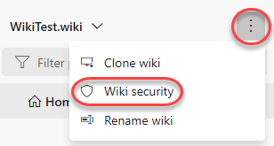

1. Since the wiki is stored as a Git repo, the permissions are set against the repo and passed through the user experience. Close the dialog when satisfied.

    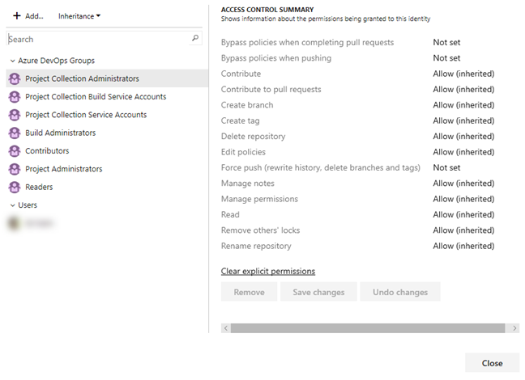

1. Locate the **Pages** panel on the right side of the window. It lists all of your wiki pages, which is just the one at this time. You can easily add and manage pages here. From the dropdown menu for the **Home** page, select **Add sub-page**.

    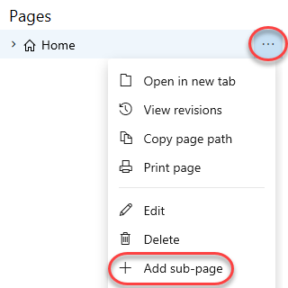

1. Set the title of this new page to **"Getting started"** and type some body content.

    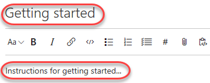

1. This time, click the **Save** dropdown button to specify a comment. Enter **"Added stub for instructions"** and click **Save**.

    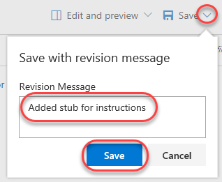

1. Close the editor view.

    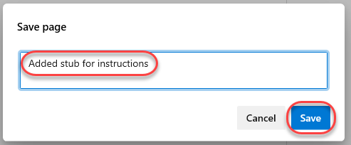

1. Now add a sub-page to the **Getting started** page.

    

1. Set the title for this page to be **"Development environment"**. Add a list of system requirements that includes **Windows Server 2016**, **Team Foundation Server 2018**, and **Visual Studio 2017** using the markdown list format as shown below. Click **Save** and then **Close** the edit view.

    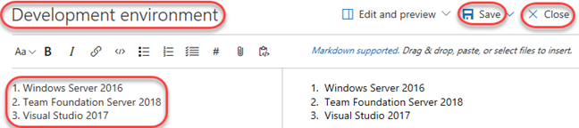

1. Click **Edit page** to make a quick update.

    

1. Change the reference from TFS 2018 to **Azure DevOps**.

    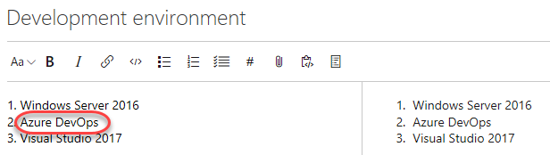

1. Use the **Save** dropdown to provide a more descriptive commit message explaining the change and click **Save**. Then **Close** the edit view.

    

1. Click **Revisions** to see a list of changes committed for this page.

    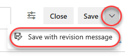

1. Click the most recent revision.

    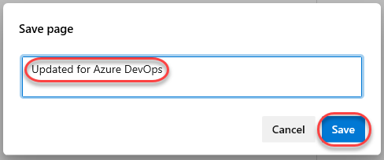

1. Azure DevOps provides a diff view so that you can easily see what was changed. You also have the option to revert to this version with a single button click.

    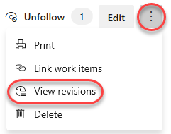

1. Return to this wiki's home using the breadcrumb navigation at the top.

    

1. You can easily rearrange the order of the pages using the tree view on the right. Drag the **Getting started** page slightly up until a green line appears under the **Home** page. This indicates that you want to make these pages peers.

    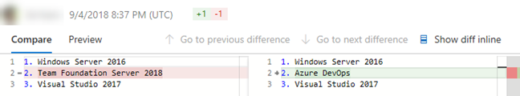

1. Since the page is being re-parented, you'll need to confirm the move. This kind of move will break links you will have manually added to other pages (none at this point), so you'll need to decide if you want to check for affected links by clicking **Check affected links**.

    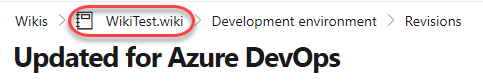

1. In this case there are no links, so click **Move**.

    

1. Sometimes wikis can get pretty big, so it's important to be able to find specific pages. Type **"env"** to filter the pages down to just those whose titles include that text.

    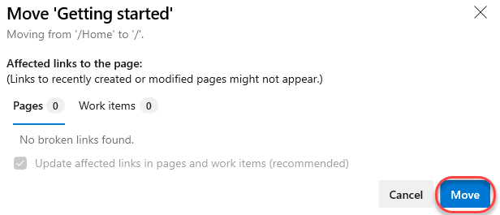

### Task 2: Working with the wiki offline ###

1. Sometimes you may want to work against the wiki without being connected via browser. Fortunately, your Azure DevOps wiki is backed by a Git repo, so you could clone it and edit it just like any other Git project whether you're online or not.

1. Select **More \| Clone wiki** to view the clone URL.

    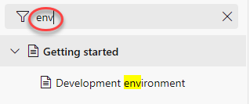

1. Click the **Copy** button to copy the URL to the clipboard.

    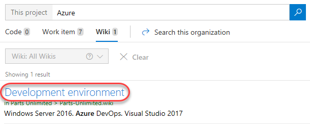

1. Launch a new instance of Visual Studio.

1. From **Team Explorer**, click the **Manage Connections** button.

    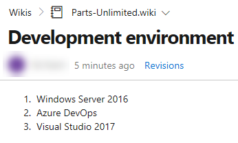

1. Locate the **Local Git Repositories** section and click the **Clone** link. Paste the remote URL and note the local path the repo will be cloned to. Click **Clone**.

    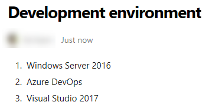

1. Select **File \| Open \| Folder** and open the path the repo was cloned to. You could alternatively do your editing in any other environment or even Notepad. It's all Markdown and Git at this point.

1. Open **Solution Explorer**. The wiki file structure is pretty straightforward. Markdown files (.md) contain content for each page at that path. If you want sub-pages, then create a folder with the same name of that file (without the .md), such as **Getting-started** as shown in the screenshot below. Every folder also requires a **.order** file to specify the order of the pages. If you have any attachments for your wiki, they are stored in a **.attachments** folder in the root directory.

    

1. Start off by adding a new file. To keep things simple, just copy and paste **Home.md**.

    

1. Rename the copied file to **Team-bios.md**.

    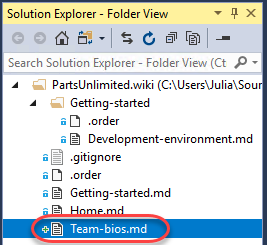

1. Add some content to the file using your favorite Markdown syntax.

    

1. Open the **.order** file from the root of the repo. This is the top-level order.

    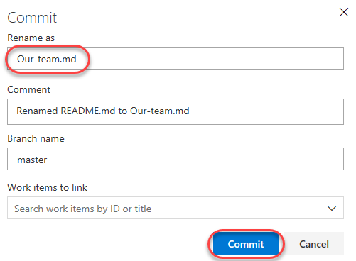

1. Note that the format of this file is straightforward-just put the file names (without .md) in the order you want them to appear in the wiki. Add **Team-bios** as the second line.

    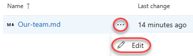

1. There is also a **.order** file in **Getting-started**, but that's just for .md files in that folder. We won't change that here.

    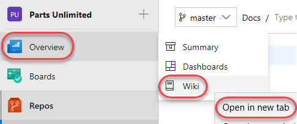

1. Right-click the folder root and select **Go To Git Changes**.

    

1. Visual Studio will have added some additional files to the folder, so right-click the **.vs** folder and select **Ignore these local items**. This will update **.gitignore** for you.

    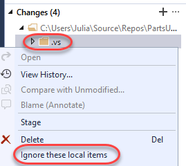

1. Set a message of "**Added team bios"** and select **Commit All \| Commit All and Sync**. Choose to save all files when prompted.

    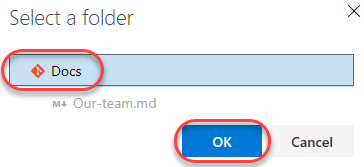

1. Once the sync has completed, return to the browser and refresh the page. Your new team bios page will appear in the navigation, so select it to view the content.

    

