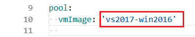
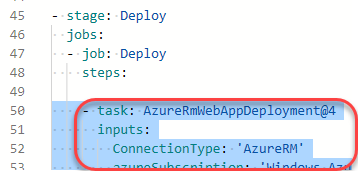
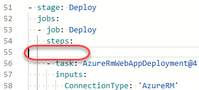

## Overview ##

Many teams prefer to define their build and release pipelines using YAML (Yet Another Markup Language). This allows them to access the same pipeline features as those using the visual designer, but with a markup file that can be managed like any other source file. YAML build definitions can be added to a project by simply adding their source file to the root of the repository. Azure DevOps also provides default templates for popular project types, as well as a YAML designer to simplify the process of defining build and release tasks.

### Prerequisites ###

- This lab requires you to complete task 1 from the [prerequisite instructions](../prereq).

## Exercise 1: Configuring CI/CD Pipelines as Code with YAML in Azure DevOps ##

### Task 1: Creating Azure resources ###

1. This lab requires a deployment of the Parts Unlimited project out to an Azure app service. To do this, you will need to spin up the necessary infrastructure. Log in to your Azure account at [https://portal.azure.com](https://portal.azure.com/).

1. Click **Create a resource** and search for **"web sql"**.

    

1. Select the **Web App + SQL** option published by Microsoft.

    

1. Click **Create**.

    

1. Enter a globally unique name for the app service. You may find it easiest to incorporate your name, such as **"pul-yaml-johndoe"**. Select the option to **create a new** resource group named **"partsunlimited"**.

    

1. Select the option to configure the **SQL Database**. Click **Create a new database** and enter the name **"partsunlimited"**.

    

1. Select the option to configure the **Target server** and click **Create a new server**. Enter a globally unique server name, such as **"pul-yaml-johndoe"** and provide admin credentials. Click **Select** to confirm the server settings.

    

1. Click **Select** to confirm the database settings.

    

1. Click **Create** to create the resources. Note that you may need to create an app service plan first, if you do not yet have one.

    

1. It will take a few minutes for the resources to provision, so you can move on to the next task.

### Task 2: Configuring the Parts Unlimited project ###

1. Navigate to your team project on Azure DevOps in a new browser tab. Before digging into the YAML pipelines, you will want to disable the existing build pipeline.

1. Navigate to **Pipelines**.

    

1. Select the existing **PartsUnlimitedE2E** pipeline.

    

1. From the dropdown, select **Pause pipeline**.

    

### Task 3: Adding a YAML build definition ###

1. Navigate to the **Pipelines** hub.

    

1. Click **New pipeline**. We will use the wizard to automatically create the YAML definition based on our project.

    

1. Select the **Azure Repos Git** as the source hosting platform. Note the others supported.

    

1. Select the **PartsUnlimited** repo.

    

1. Select the **ASP.NET** template as the starting point for your pipeline.

    

1. As this lab was initially built for VS2017, and the latest released VM Image is currently VS2019, the VMImage the build will run on needs to be updated to the older version of the hosted build agent.  Update the vmImage attribute in the pool section of the YAML to 'vs2017-win2016'.  A complete list of available hosted agent VM's can be found on the [Microsoft Docs Website](https://docs.microsoft.com/en-us/azure/devops/pipelines/agents/hosted?view=azure-devops).

    

1. Review the contents of the YAML definition. It will be saved as a new file called **"azure-pipelines.yml"** in the root of the repository and contain everything needed to build and test a typical ASP.NET solution. Click **Save and run**.

    

1. Click **Save and run** to confirm the commit.

    

1. Track the build until it completes. Click **Job** to see the logs.

    

1. Each task from the YAML file is available for review, including any warnings and errors.

    

1. Close the tasks view.

    

1. Select the **Tests** tab.

    

1. The tests should now succeed as expected.

    

### Task 4: Adding continuous delivery to the YAML definition ###

1. Now that the build and test processes are successful, we can now add delivery to the YAML definition. From the options dropdown, select **Edit pipeline**.

    

1. Set the cursor on a new line at the end of the YAML definition. This will be the location where new tasks are added.

    

1. Select the **Azure App Service Deploy** task.

    

1. Select the Azure subscription where you created the app service earlier. Click **Authorize** and follow the path to complete authorization.

    

1. Enter the **App Service name** you used to create the app service earlier. Update the **Package or folder** to **"$(build.artifactstagingdirectory)/*.zip"**. Click **Add**.

    

1. The YAML that defines the task will be added to the cursor location in the file.

    

1. Click **Save** to commit the changes.

    

1. Confirm the **Save**. This will begin a new build.

    

1. Return to the **Pipelines** view.

    

1. From the **Runs** tab, open the new build.

    

1. Click **Job** to follow each task.

    

1. Expand the **AzureRmWebAppDeployment** task to review the steps performed during the Azure deployment. Once the task completes, your app will be live on Azure.

    

### Task 5: Reviewing the deployed site ###

1. Return to the Azure portal browser tab.

1. Navigate to the app service created earlier.

1. Select the **Configuration** tab.

    

1. Click the **defaultConnection** setting.

    

1. Update the **Name** to **"DefaultConnectionString"**, which is the key expected by the application. This will enable it to connect to the database created for the app service. Click **Update**.

    

1. Click **Save** to apply the changes.

    

1. Return to the **Overview** tab.

    

1. Click the **URL** to open your site in a new tab.

    

1. The deployed site should load expected.

    

