Lab version: 15.8.2

Last updated: 9/4/2018

<a name="Overview"></a>
## Overview ##

Many teams prefer to define their builds using YAML (Yet Another Markup Language). This allows them to access the same build pipeline features as those using the visual designer, but with a markup file that can be managed like any other source file. YAML build definitions can be added to a project by simply adding their source file to the root of the repository.

<a name="Prerequisites"></a>
### Prerequisites ###

- This lab requires you to complete task 1 from the <a href="../prereq/">prerequisite</a>  instructions.

<a name="Exercise1"></a>
## Exercise 1: Configuring Builds as Code with YAML in Azure DevOps ##

<a name="Ex1Task1"></a>
### Task 1: Configuring the Parts Unlimited project ###

1. Navigate to your team project on Azure DevOps. Before digging into the YAML builds, you will want to disable the continuous integration trigger for the default build definition.

1. Navigate to **Pipelines \| Builds**.

    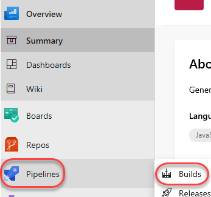

1. This project includes a default build definition, **PartsUnlimitedE2E**. Click **Edit** to edit the definition.

    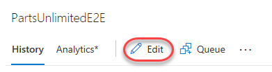

1. This build is scheduled to run whenever a change is committed. We don't want to wait for this build every time there's a change, so select the **Triggers** tab and uncheck **Enable continuous integration**. From the **Save & queue** dropdown, select **Save**.

    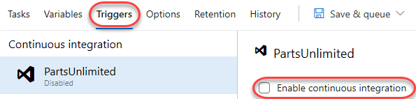

<a name="Ex1Task2"></a>
### Task 2: Adding a YAML build definition ###

1. Navigate to the project files using **Repos \| Files**.

    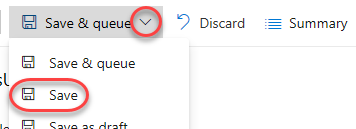

1. Add a new file to the root of the repository using **New \| File**. YAML build definition are simply code files you add to your project. They offer all the benefits of other source files.

    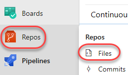

1. Name the new file **".vsts-ci.yml"** and click **Create**. To make it more convenient to create YAML build definitions, Azure DevOps automatically creates a definition when you add this file to the root of your repository. The build definition is created in a folder that has the same name as the repository.

    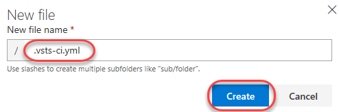

1. Add the YAML markup below to the file and click **Commit**. This simply instructs the build to execute the echo at the command line so we can confirm it's all working. Once the commit has completed, it will queue a new build for this definition.

    ```
    steps:
    - script: echo hello world
    ```
    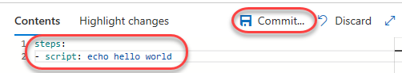

1. Select **Pipelines \| Builds** to navigate to the build hub.

    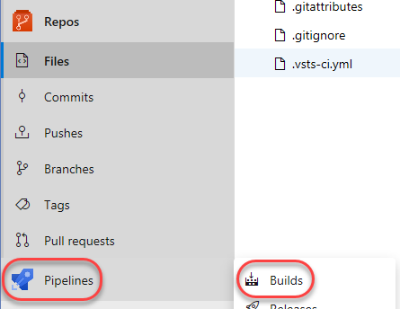

1. The newly created **PartsUnlimited CI** will run using the YAML settings. Click the build to follow its progress.

    

1. Track the build until it completes. Select the **Logs** tab and open the **CmdLine** task.

    

1. You can see where the script you defined earlier was generated and executed.

    

1. Close the task viewer.

<a name="Ex1Task3"></a>
### Task 3: Crafting sophisticated YAML definitions ###

1. You can do virtually anything with YAML that you would do with the web experience. In fact, you can even export existing build definitions as YAML if you would prefer to manage them in code. Select **Builds** to return to the hub.

    

1. Switch to the folder view and select the **PartsUnlimitedE2E** build definition. Click **Edit**.

    

1. Click **View YAML** to see the YAML export of this definition.

    

1. Click **Copy to clipboard**. We'll take this as-is and use it for a YAML definition.

    

1. Navigate to the project files using **Repos \| Files**.

    

1. Open **.vsts-ci.yaml** in the **Editor**.

    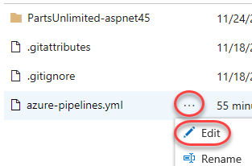

1. Replace the contents of the file with those on your clipboard.

1. Note that there is a comment block early in the file that reminds us that this definition is expecting some variables. The **SymbolPath** reference is coincidental (it's a literal needed for the build), but the **BuildPlatform** and **BuildConfguration** variables will play a role later.

    

1. **Commit** the change back to the repo. This will queue a build.

    

1. Select **Pipelines \| Builds** to return to the build hub.

    

1. Click the new build to follow its progress.

    

1. The build should succeed, but note that it reports that there were no tests. There should have been, so now we'll need to figure out why they weren't picked up.

    

1. From the **Logs** tab, select the **Test Assemblies** task.

    

1. Note that there is a warning that the test assembly pattern didn't find any matches. Upon closer inspection, it appears that it was expecting a build variable for **BuildConfiguration** to be available, but since it wasn't, the platform simply used the text as-is. This was something we probably should have expected given the warnings in the YAML.

    

1. Close the task view.

1. Click **Edit**.

    

1. Select the **Variables** tab. Although the definition itself is in YAML, we can still manage things like variables and triggers externally.

    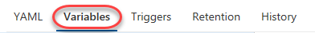

1. Use the **Add** button to add two new variables. **"BuildPlatform"** should be **"any cpu"** and **"BuildConfiguration"** should be **"release"**. Check the **Settable at queue time** options for each.

    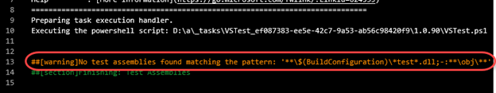

1. Select the **Triggers** tab. Note that you can override the YAML settings and configure continuous integration like web-based builds.

    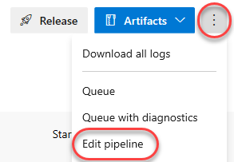

1. Select **Save & queue \| Save & queue** to save the definition and queue a build.

    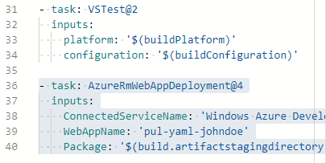

1. Click the new build to follow its progress.

    

1. When the build completes, select the **Tests** tab to confirm that everything has succeeded as expected, including the tests.

    

