<div class="rw-ui-container"></div>
<a name="Overview"></a>

## Overview ##

Many teams prefer to define their build and release pipelines using YAML (YAML Ain’t Markup Language). This allows them to access the same pipeline features as those using the visual designer, but with a markup file that can be managed like any other source file. YAML build definitions can be added to a project by simply adding their source file to the root of the repository. Azure DevOps also provides default templates for popular project types, as well as a YAML designer to simplify the process of defining build and release tasks.

<a name="Prerequisites"></a>
### Prerequisites ###

- This lab requires you to complete task 1 from the [prerequisite instructions](../prereq).

The following image will walk you through all the steps explained in this lab

 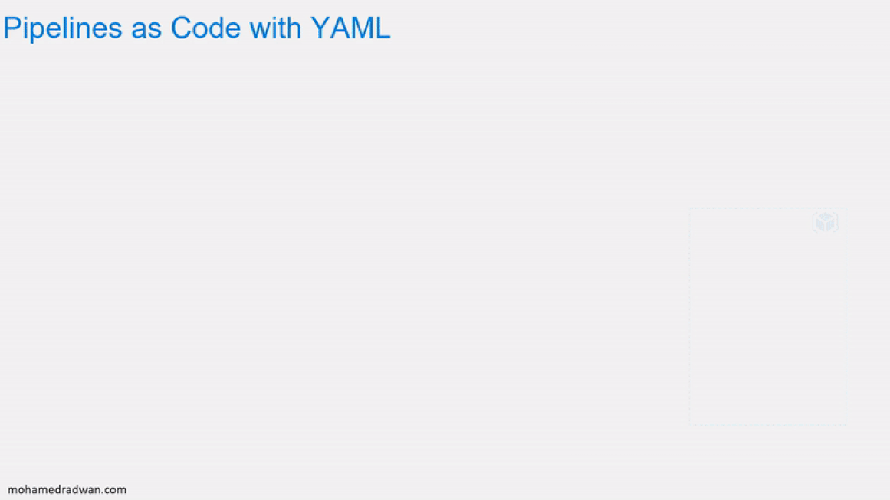
 
<a name="Exercise1"></a>
## Exercise 1: Configuring CI/CD Pipelines as Code with YAML in Azure DevOps ##

<a name="Ex1Task1"></a>
### Task 1: Creating Azure resources ###

1. This lab requires a deployment of the Parts Unlimited project out to an Azure app service. To do this, you will need to spin up the necessary infrastructure. Log in to your Azure account at [https://portal.azure.com](https://portal.azure.com/).

1. In the home page search for **"SQL"** and select **SQL Databases**
   
      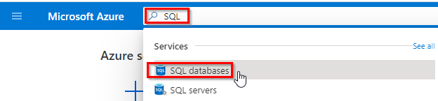
1. Click on **Create** in SQL data bases page

    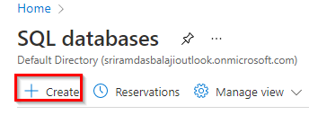

1. Under **Resource group**, click **Create new**. Enter a Name of **“partsunlimited”** and click **OK**.
     
     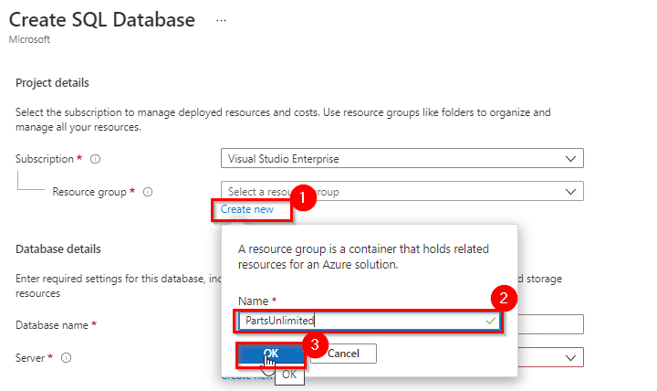

1. In Database details Enter a Database name of **“partsunlimited-yaml”** and click **Create new** to create a new SQL server.
     
    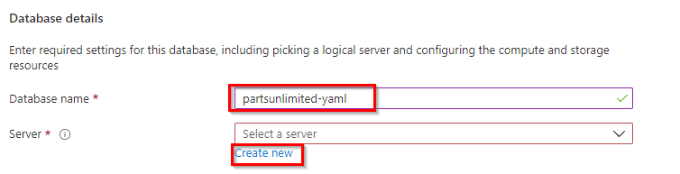

1. Enter a globally unique server name, such as **“pul-yaml-johndoe”** and provide admin credentials, then click **OK**.
    
    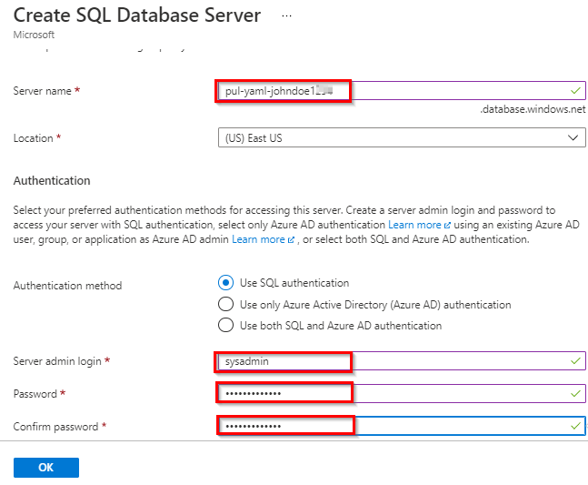

1. In Database details  under **Compute + storage**, click on **Configure database**. Then select **Basic** Service tier and click **Apply**

   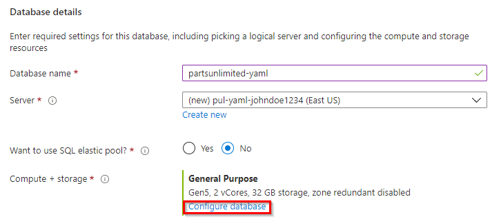

   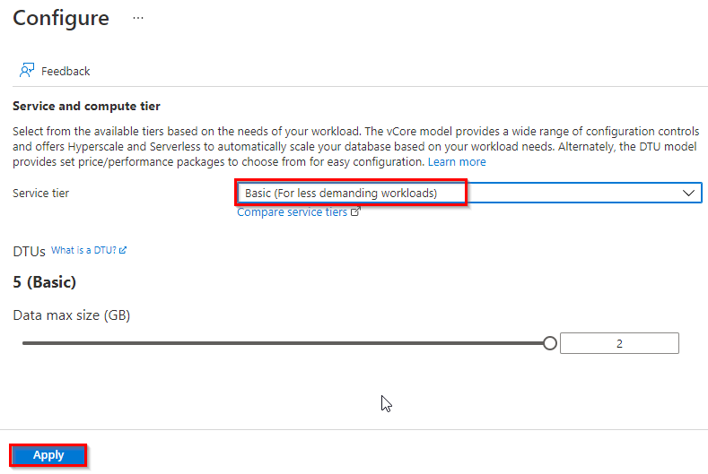

1. In Create SQL database page, click **Review + create**. Then click **Create**. It’ll take some time to complete, but you can move on to the next step while it works in the background.
    
    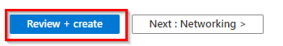

1. In the home page search for **App Services** and select **App Services**
    
    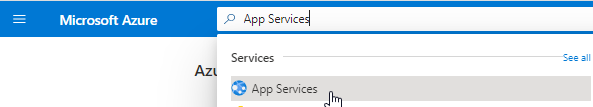

1. Click **Create** in App Services page 

    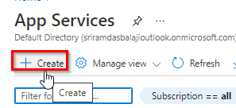

1. Under Project Details, select the same Subscription and Resource Group used for the database. For Name, enter a unique name, such as by using your name as part. Select the **ASP.NET 4.8 Runtime** stack. Click **Review + Create** and then **Create**
    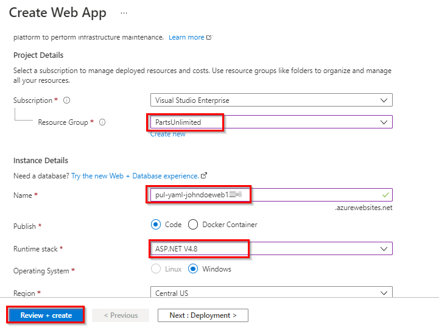

<a name="Ex1Task2"></a>
### Task 2: Configuring the Azure App Service ###

1. Navigate to the **PartsUnlimited** resource group created in previous task and select SQL server created

     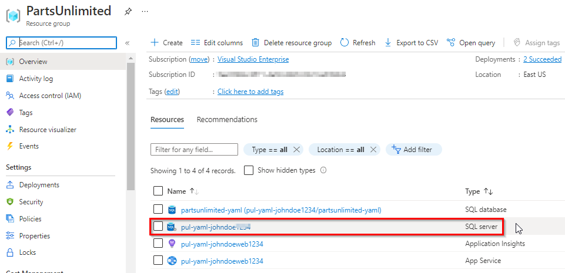

1. In Security select **Firewalls and virtual networks**. Set **Allow Azure services and resources to access this server** flag to **Yes** and click **Save**

    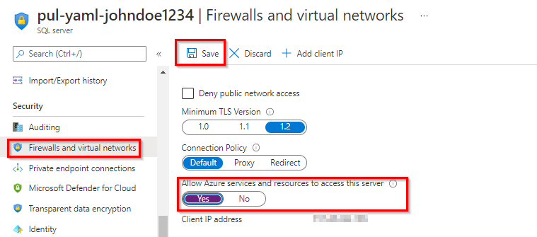

1. Now select Database created from the resource group
     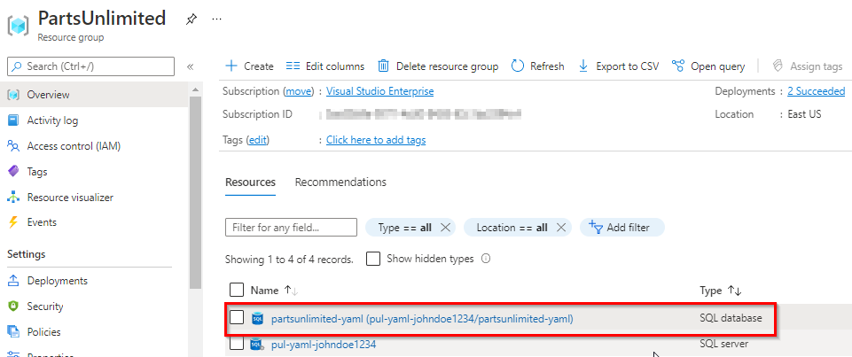
1. Select **Connection strings** and Copy the **ADO.NET** string to your clipboard and Notepad so that you can configure your new web site to use it. Close this blade.
     
      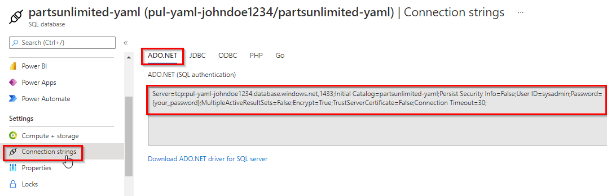

1. Select app service created earlier.
     
    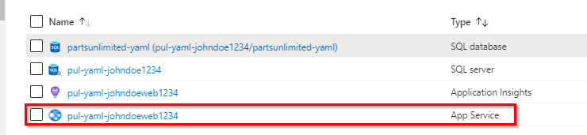

1. Select the **Configuration** tab from the **Settings** section. Click **New connection string**
    
    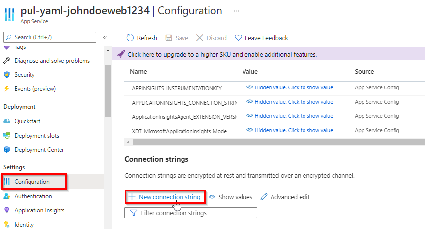

1. Add name as **“DefaultConnectionString”** and paste the ADO.Net connection string value copied.
You’ll need to locate the **“{your_username}”** and **“{your_password}”** sections and replace them (including braces) with the actual SQL credentials entered earlier. Be sure the **Type** is set to **SQLAzure** and click **OK**. 

     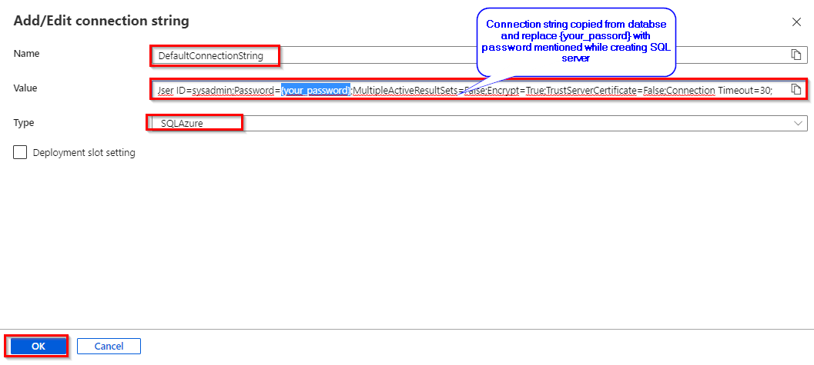

1. Click **Save** to commit.

<a name="Ex1Task3"></a>
### Task 3: Configuring the Parts Unlimited project ###

1. Navigate to your team project on Azure DevOps in a new browser tab. Before digging into the YAML pipelines, you will want to disable the existing build pipeline.

1. Navigate to **Pipelines**.

    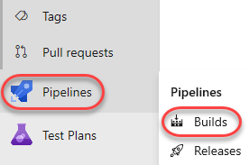

1. Select the existing **PartsUnlimitedE2E** pipeline.

    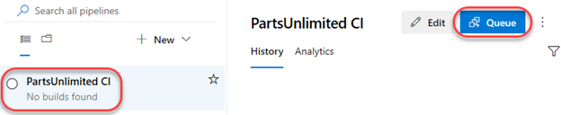

1. From the dropdown, select **Pause pipeline**.

    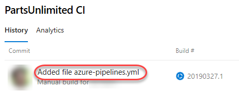

<a name="Ex1Task4"></a>
### Task 4: Adding a YAML build definition ###

1. Navigate to the **Pipelines** hub.

    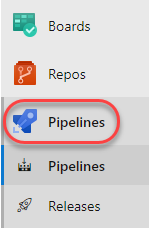

1. Click **New pipeline**. We will use the wizard to automatically create the YAML definition based on our project.

    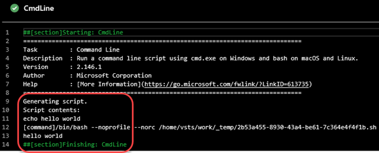

1. Select the **Azure Repos Git** as the source hosting platform. Note the others supported.

    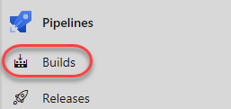

1. Select the **PartsUnlimited** repo.

    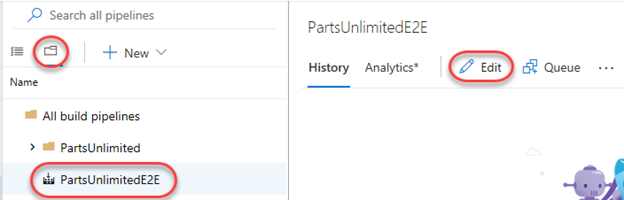

1. Select the **ASP.NET** template as the starting point for your pipeline.

    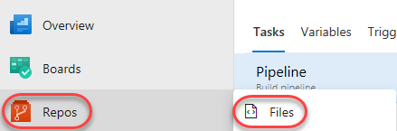

1. Review the contents of the YAML definition. It will be saved as a new file called **"azure-pipelines.yml"** in the root of the repository and contain everything needed to build and test a typical ASP.NET solution. You can also customize the build as needed. In this case, update the **pool** to specify the build should use a Visual Studio 2017 build VM.

    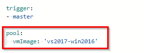

1. Review trigger and point to **master** if you repo does not have **main** (new repos will have "main" instead of "master").

1. Click **Save and run**.

    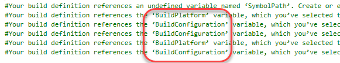

1. Click **Save and run** to confirm the commit.

    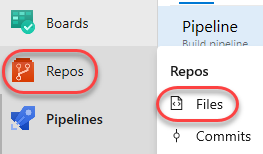

1. Track the build until it completes. Click **Job** to see the logs.

    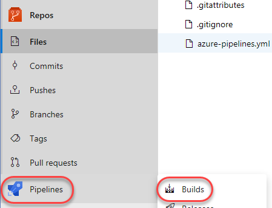

1. Each task from the YAML file is available for review, including any warnings and errors.

    

1. Close the tasks view.

    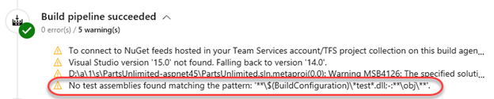

1. Select the **Tests** tab.

    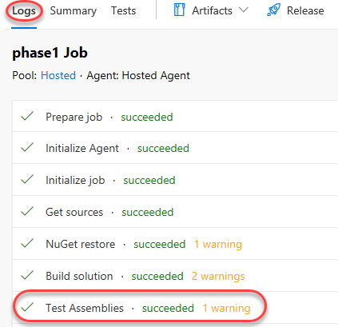

1. The tests should now succeed as expected.

    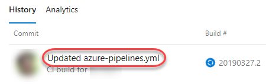

<a name="Ex1Task5"></a>
### Task 5: Adding continuous delivery to the YAML definition ###

1. Now that the build and test processes are successful, we can now add delivery to the YAML definition. From the options dropdown, select **Edit pipeline**.

    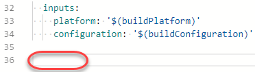

1. Add the configuration lines below after the **trigger** section to define a **Build** stage in the YAML pipeline. You can define whatever stages you need to better organize and track pipeline progress.

    ```yaml
    stages:
    - stage: Build
      jobs:
      - job: Build
    ```
    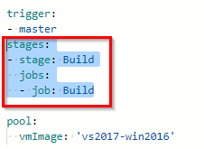

1. Highlight(select) the remainder of the YAML file and indent it four spaces (two tabs). Everything after "pool" (included) should fall under "job: Build". This will simply take the existing build definition and relocate it as a child of the **jobs** node.

    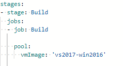

1. At the bottom of the file, add the configuration below to define a second stage.

    ```
    - stage: Deploy
      jobs:
      - job: Deploy
        pool:
          vmImage: 'vs2017-win2016'
        steps:
    ```
    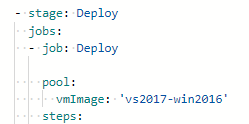

1. Set the cursor on a new line at the end of the YAML definition. This will be the location where new tasks are added.

    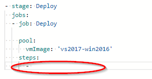

1. Select the **Azure App Service Deploy** task.

    

1. Select the Azure subscription where you created the app service earlier. Click **Authorize** and follow the path to complete authorization.

    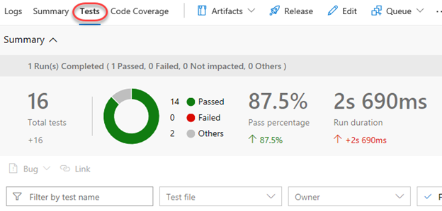

1. Enter the **App Service name** you used to create the app service earlier. Update the **Package or folder** to **"$(System.ArtifactsDirectory)/drop/*.zip"**. Not **$(System.DefaultWorkingDirectory)!** . Click **Add**.

    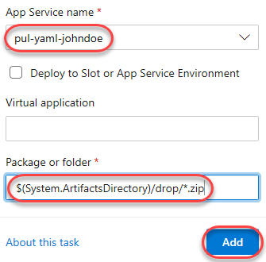

1. The YAML that defines the task will be added to the cursor location in the file.

    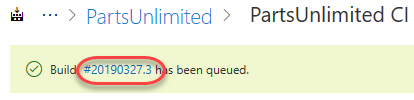

1. With the added task still selected in the editor, indent it four spaces (two tabs) so that it is a child of the **steps** task.

    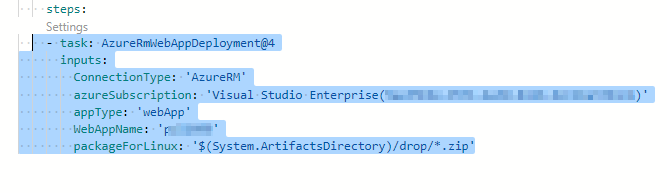

   >Note: The **packageForLinux** parameter is a bit misleading in the example but is valid for Windows or Linux. It's an alias of **Package**, so it could be shortened to that

1. It's important to note that these two stages will be run independently. As a result, the build output from the first stage will not be available to the second stage without special consideration. For this, we will use one task to publish the build output at the end of the build stage and another to download it in the beginning of the deploy stage. Place the cursor on a blank line at the end of the build stage.

    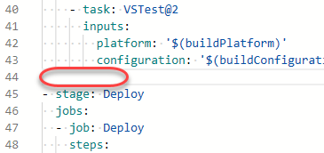

1. Search the tasks for **"publish build"** and select the **Publish Build Artifacts** task. There may be more than one available, so be sure to select the one that is not deprecated.

    

1. Accept the defaults and click **Add**. This will publish the build artifacts to a location that will be downloadable under the alias **drop**.

    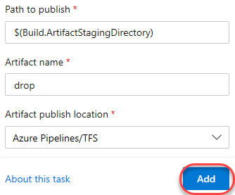

1. Indent the publish task four spaces (two tabs). You may also want to add an empty line before and after to make it easier to read.

    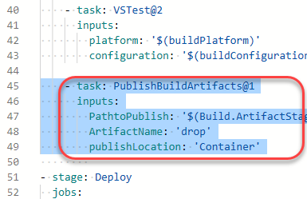

1. Place the cursor on the first line under the **steps** node of the deployment stage.

    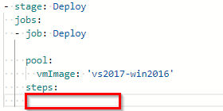

1. Search the tasks for **"download build"** and select the **Download Build Artifacts** task.

    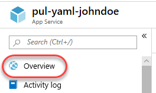

1. Click **Add**.

    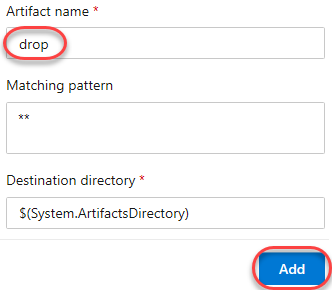

1. Indent the publish task four spaces (two tabs). You may also want to add an empty line before and after to make it easier to read.

    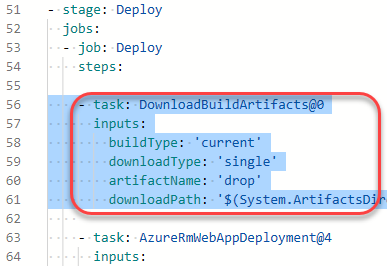

1. Add a property to the download task specifying the **artifactName** of **"drop"**. Be sure to match the spacing.

    ```
    artifactName: 'drop'
    ```
    

1. Click **Save** to commit the changes.

    

1. Confirm the **Save**. This will begin a new build.

    

1. Return to the **Pipelines** view.

    

1. From the **Runs** tab, click the new build run to open it. Note that there are now multiple stages shown based on the YAML definition edits from earlier.

    

1. If you see an error message requiring you need permission , click the **view** button to do so. Then click **Permit** twice.

    

    

1. Click the **Deploy** stage to follow each task.

    

1. Expand the **AzureRmWebAppDeployment** task to review the steps performed during the Azure deployment. Once the task completes, your app will be live on Azure.

    

<a name="Ex1Task6"></a>
### Task 6: Reviewing the deployed site ###

1. Return to the Azure portal browser tab.

1. Navigate to the app service created earlier.

1. Go to the **Overview** tab.

    

1. Click **Browse** to open your site in a new tab.

    

1. The deployed site should load expected.

    


## Reference

You can watch the following video that walks you through all the steps explained in this lab

<figure class="video_container">
  <iframe width="560" height="315" src="https://www.youtube.com/embed/i77vEEVAfB8" frameborder="0" allowfullscreen="true"> </iframe>
</figure>
