<div class="rw-ui-container"></div>
<a name="Overview"></a>
## Overview ##

[Azure Web Apps](https://docs.microsoft.com/en-us/azure/app-service/app-service-web-overview) provides a highly scalable, self-patching web hosting service. This lab walks guides you through the process of deploying a data-driven ASP.NET web app in Azure and connecting it to [Azure SQL Database](https://docs.microsoft.com/en-us/azure/sql-database/sql-database-technical-overview).

<a name="Prerequisites"></a>
## Prerequisites ##

In order to complete this lab you will need the Azure DevOps Server 2019 virtual machine provided by Microsoft. Click the button below to launch the virtual machine on the Microsoft Hands-on-Labs portal.

<a href="https://www.microsoft.com/handsonlabs/selfpacedlabs/details/DT00155" class="launch-hol" role="button" target="_blank"><span class="lab-details">Launch the virtual machine</span></a>

Alternatively, you can download the virtual machine from [here](../devopsvmdownload).

You also need an [Azure account](https://azure.microsoft.com/) ([Get a $25 monthly Azure credit by joining Visual Studio Dev Essentials](https://www.visualstudio.com/dev-essentials/)).

<a name="Exercise1"></a>
## Exercise 1: Building ASP.NET apps in Azure with SQL Database ##

<a name="Ex1Task1"></a>
### Task 1: Building and running the sample app locally ###

1. Log in as **Sachin Raj (VSALM\Sachin)**. All user passwords are **P2ssw0rd**.

1. Launch **Visual Studio** from the taskbar.

1. Open **C:\Samples\DotNetAppSqlDb\DotNetAppSqlDb.sln**.

1. Once the project has finished loading, press **F5** to build and run it. The sample is a simple TODO application that stores TODO items in a SQL database specified via the connection string in **Web.config**.

1. Use the application to add, edit, and delete a TODO item. It should be a straightforward experience. Close the browser when satisfied.

    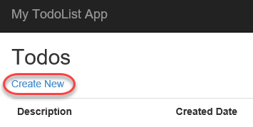

<a name="Ex1Task2"></a>
### Task 2: Setting up an initial deployment to Azure ###

1. In **Solution Explorer**, right-click the **DotNetAppSqlDb** project node and select **Publish**.

    

1. Click **Publish**.

    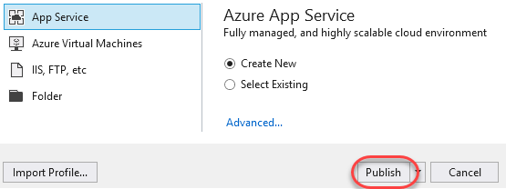

1. Select **Add an account \| Add an account** and log in using the Microsoft account associated with your Azure subscription.

    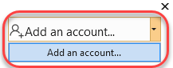

1. Set **App Name** to a globally unique name. One way to do this is to append your name after the name of the project.

    

1. Click **New** to create a new **Resource Group**. A resource group is a collection of all resources associated with a deployed solution.

    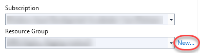

1. Set the **New resource group name** to **MyResourceGroup** and click **OK**.

    

1. Click **New** to create a new **Hosting Plan**. An app service plan defines the location, features, and other properties of your deployment.

    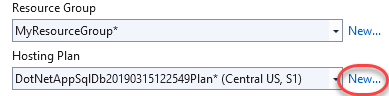

1. Set the **Hosting Plan** name to **"MyHostingPlan"**. Select a **Location** and **Size** and click **OK**.

    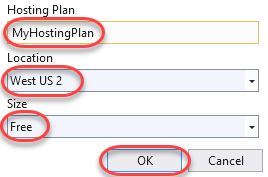

1. Since this application relies on a SQL database, you will need to configure one for deployment. Click **Create a SQL Database**.

    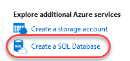

1. You have the option of using an existing database (if you have one). Alternatively, click **New** to create one for this lab.

    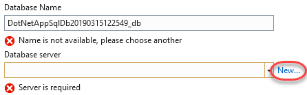

1. Configure the server with a unique name and administrator credentials. Click **OK**.

    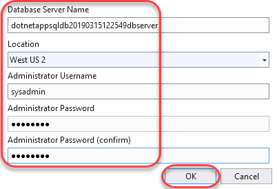

1. After configuring the server, you will also need to define a database to create on that server. In the application we are using **MyDbConnection** as Connection String Name. So, please make sure to change the Connection String Name to **MyDbConnection** as shown in below image. Click **OK** to accept the defaults.

    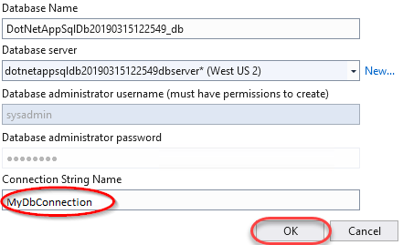

1. Now that all of the required resources have been configured, click **Create** to perform he initial deployment.

    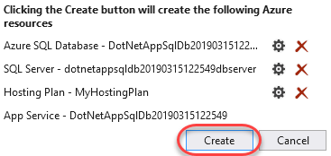

1. The first deployment may take a few minutes since there is a lot to provision. Future deployments for code changes are much faster. You can follow the progress at the bottom.

    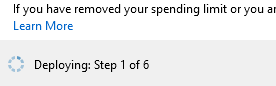

1. After deployment has succeeded, a browser window will open to the public URL. Test out the site by adding a new TODO item.

    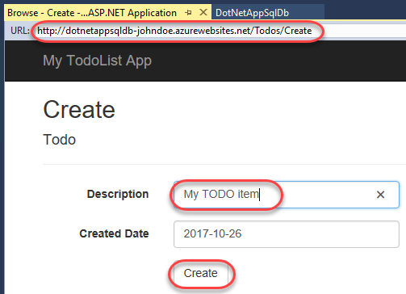

1. The new data is stored in SQL on Azure.

    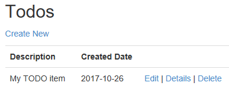

<a name="Ex1Task3"></a>
### Task 3: Accessing the Azure SQL database locally ###

1. Select **View \| SQL Server Object Explorer**.

1. Click the **Add SQL Server** button.

    

1. Expand the **Azure** node and select the database you just created as part of the deployment. Enter the admin password and click **Connect**.

    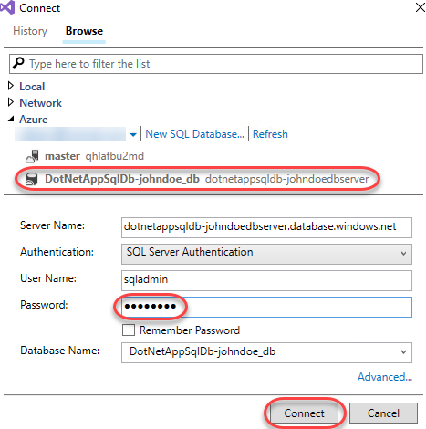

1. By default, a SQL server in Azure may only be accessed by services deployed within Azure. However, you can specify a firewall rule to allow access from your public endpoint. Select **Add my client IP** (or subnet range, if applicable) and click **OK**. This will allow you to connect to the database from your current connection.

    

1. Once Visual Studio finishes creating the firewall setting for your SQL Database instance, your connection will show up in **SQL Server Object Explorer**. Here you can perform common database operations, such as running queries, creating views & stored procedures, and more.

1. Expand the tree down to the **Todoes** table. Right-click it and select **View Data**.

    

1. You can now work with the data stored in your SQL instance in Azure directly from Visual Studio.

    

<a name="Ex1Task4"></a>
### Task 4: Updating the app with Code First Migrations ###

1. This application uses the Entity Framework Code First model to infer the database schema from the application's model classes. In this case, the **Todo** class contains the schema information used for the one data table in the database. As a result, typical changes to the schema can be made by simply updating the class itself and using Code First Migrations to migrate the database forward. From **Solution Explorer**, open **Models/Todo.cs**.

    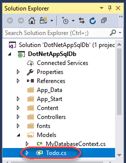

1. While Code First Migrations supports sophisticated migration scenarios, this lab will use a simple one: adding a field. Add the field below to the **Todo** class.

    ```c#
    public bool Done { get; set; }
    ```
1. Select **Tools \| NuGet Package Manager \| Package Manager Console**.

1. Execute the command below to enable Code First Migrations for the project. This will also create an initial schema class based on the current database.

    ```
    # PowerShell
    Enable-Migrations
    ```
1. Execute the command below to add a new migration. This will create a second schema class that provides instructions for how to get from the previous (initial) state to the current one (that includes the **Done** property).

    ```
    # PowerShell
    Add-Migration AddProperty
    ```
1. Execute the command below to apply the new migration to the local database.

    ```
    # PowerShell
    Update-Database
    ```
1. Press **F5** to build and run the application. Try adding, editing, and deleting an item. Note that the functionality should not have changed because the new property hasn't been integrated into the user experience yet. Close the browser when satisfied.

1. From **Solution Explorer**, open **Controllers/TodosController.cs**.

    

1. Replace the existing **Create** method definition (the one with the **HttpPost** attribute) with the line below. Note that it just adds the **Done** property to the parameter binding.

    ```c#
    public ActionResult Create(
                          [Bind(Include = "Description,CreatedDate,Done")] Todo todo)
    ```
1. Now it's time to edit some views so that the new property will be accessible to the user. For simplicity, only the **Create** and **Index** (list) views will be updated here. Open **Views/Todos/Create.cshtml**.

    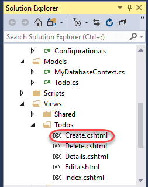

1. Insert the snippet below before the **form-group** div containing the **submit** button.

    ```
    <!-- ASP.NET -->
    <div class="form-group">
        @Html.LabelFor(model => model.Done,
                           htmlAttributes: new { @class = "control-label col-md-2" })
        <div class="col-md-10">
            <div class="checkbox">
                @Html.EditorFor(model => model.Done)
                @Html.ValidationMessageFor(model => model.Done, "",
                                                      new { @class = "text-danger" })
            </div>
        </div>
    </div>
    ```
1. The final code should look like this.

    

1. Open **Views/Todos/Index.cshtml**.

    

1. Insert the snippet below as the third table header column on the page.

    ```
    <!-- ASP.NET -->
    <th>
        @Html.DisplayNameFor(model => model.Done)
    </th>
    ```
1. The code should look like this.

    

1. Insert the code below as the third column template in the same table as above.

    ```
    <!-- ASP.NET -->
    <td>
        @Html.DisplayFor(modelItem => item.Done)
    </td>
    ```
1. The final code should look like this.

    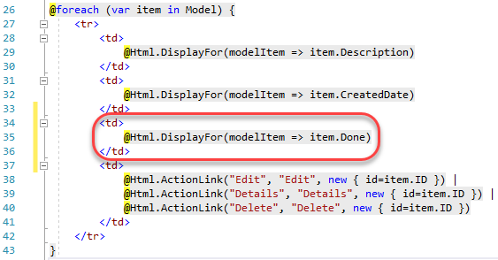

1. Press **F5** to build and run the application. You should now see a **Done** option on the pages for creating and listing TODO items. Close the browser window when satisfied.

    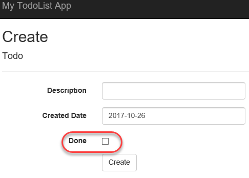

<a name="Ex1Task5"></a>
### Task 5: Enabling Code First Migrations in Azure ###

1. Now that the changes have been developed and tested locally, it's time to apply them to Azure. In **Solution Explorer**, right-click the **DotNetAppSqlDb** project node and select **Publish**.

    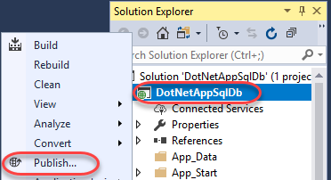

1. Click **Edit**.

    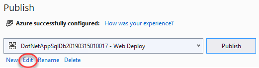

1. Click **Next**.

    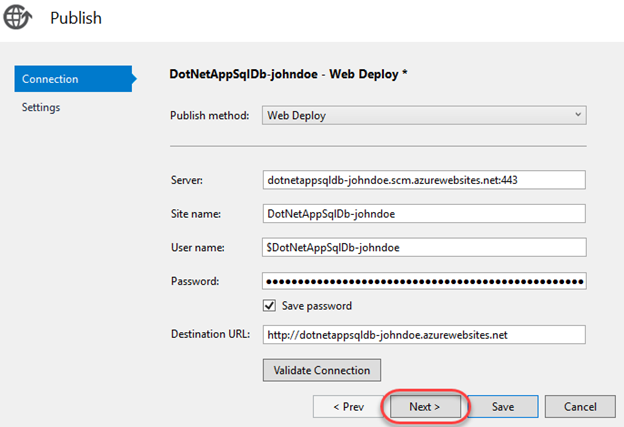

1. Wait for the connection string to load and then check **Execute Code First Migrations**. Click **Save**.

    

1. Click **Publish** to push out the new changes.

    

1. The browser will load the site after deployment. You can explore the site to see that the new field is now available.

    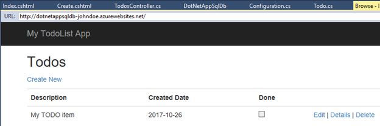

<a name="Ex1Task6"></a>
### Task 6: Streaming application logs from Azure ###

1. You can stream application tracing messages directly from your Azure web app to Visual Studio. This application uses this tracing to track and share diagnostic info. Open **Controllers/TodosController.cs**.

    

1. Note that there is a **Trace.WriteLine()** call at the beginning of each request method.

    

1. Select **View \| Cloud Explorer**.

1. Locate the application under its resource group. Right-click it and select **View Streaming Logs**.

    

1. The streaming logs will now begin to appear in the **Output** window. However, you won't see any trace messages because the default trace level is **Error**. As a result, only traces logged with **Trace.TraceError()** are shown.

    

1. Right-click the application again and select **Open in Portal**. This will open a new browser window.

    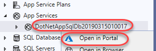

   > When you click on **Open in Portal** you may prompted to a screen which will be having two options. **Download the Azure Portal app** or **Continue to Azure Portal website**. Please select **Continue to Azure Portal website** and log in to the Azure Portal if necessary.

1. Select the **App Service logs** tab. Set the application logging **Level** to **Verbose**. This will include all traces. Other settings include anything as severe as the specified traces. For example, **Warning** will include **TraceWarning()** and **TraceError()**, but not **TraceInformation()** or **WriteLine()**. Click **Save**.

    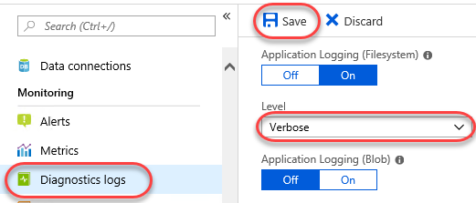

1. Refresh the web app in its browser window by right-clicking the body and selecting **Refresh**.

    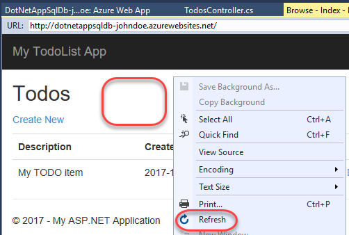

1. There will now be a trace message displayed in the **Output** window.

    

<a name="Ex1Task6_1"></a>
### Task 7: Managing your Azure web app ###


1. If you want to delete this web app, you can click **Delete** and follow the confirmation instructions. However, that would only delete the web app component of your deployment. If you would like to delete everything created as part of this lab at once, you can do so by navigating to the **MyResourceGroup** resource group that contains all of the resources created in this lab.
     
     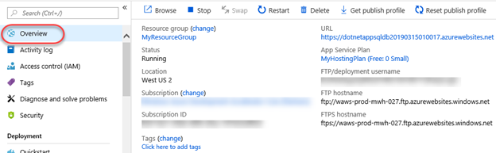
    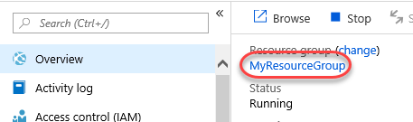

1. You can then follow the **Delete resource group** workflow to remove them all.

    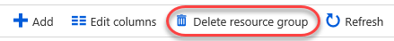

