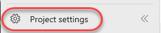
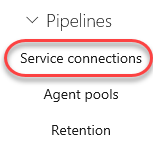
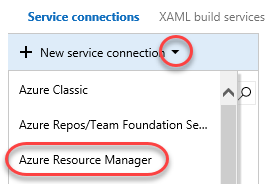
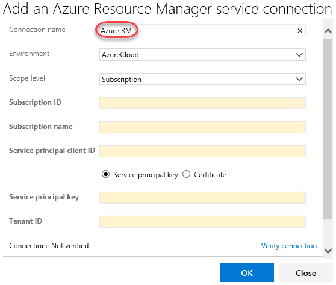
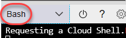
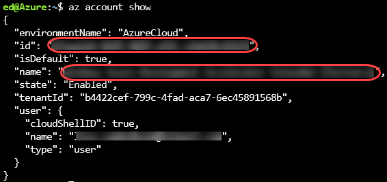
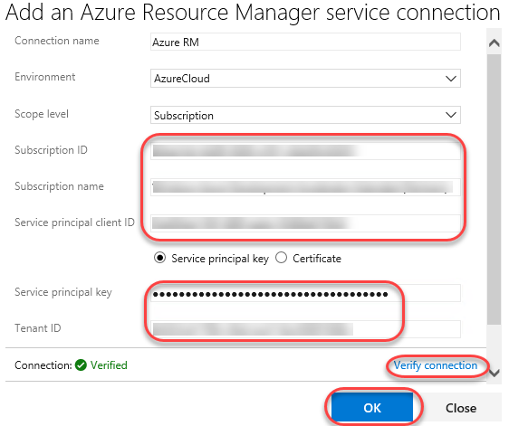

<div class="rw-ui-container"></div>

<a name="Overview"></a>
## Overview ##

In this lab, you will learn about how to create an Azure service principal that can be used to integrate Azure DevOps Server with Azure services hosted in the cloud.

<a name="Exercise1"></a>
## Exercise 1: Creating an Azure Service Principal for use as an Azure Resource Manager service connection ##

<a name="Ex1Task1"></a>
### Task 1: Creating an Azure Resource Manager service connection ###

1. Open a browser window to your Azure DevOps Server 2019.

1. Navigate to **Project settings**.

    

1. Navigate to **Pipelines \| Service connections**.

    

1. From the **New service connection** dropdown, select **Azure Resource Manager**.

    

1. Set the **Connection name** to something descriptive. You will need to create a service principal in Azure in the next task to fill out the remaining fields.

    

<a name="Ex1Task2"></a>
### Task 2: Creating an Azure service principal ###

1. Log in to your Azure account at [https://portal.azure.com](https://portal.azure.com/) in a new browser tab.

1. Click the **Cloud Shell** button to launch the Cloud Shell.

    

1. Make sure the **Environment** is set to **Bash**.

    

1. The command below will create a service principal with the name "ServicePrincipalName". Replace the value and execute the command in the cloud shell.

    ```
    az ad sp create-for-rbac --name ServicePrincipalName
    ```
1. Azure will generate an **appID**, which is the **Service principal client ID** used by Azure DevOps Server. It will also generate a strong **password**, which is the **Service principal key**. The final value of interest is the **tenant**, which is the **Tenant ID**. Copy these values to the service connection form in the other tab.

    

1. Execute the command below to retrieve details about your Azure subscription.

    ```
    az account show
    ```
1. The **id** is the **Subscription ID** you need to create the service connection. The **name** is the **Subscription name** you need. Copy these values as well.

    

1. The form should now be complete. Click **Verify connection** to make sure the values work as expected. Click **OK** when verified. You will now be able to reference this connection from release pipeline tasks.

    

