<div class="rw-ui-container"></div>

<a name="Overview"></a>
## Overview ##

In this lab, you will learn how to use Azure Pipelines to setup a continuous integration (CI) pipeline to build and test your applications. This scriptable build system is both web-based and cross-platform, while also providing a modern interface for visualizing sophisticated workflows. Although we won’t demonstrate all of the cross-platform possibilities in this lab, it is important to note that you can also build for iOS, Android, Java (using Ant, Maven, or Gradle), and Linux.

<a name="Prerequisites"></a>
## Prerequisites ##

In order to complete this lab you will need the Azure DevOps Server 2019 virtual machine provided by Microsoft. Click the button below to launch the virtual machine on the Microsoft Hands-on-Labs portal.

<a href="https://labondemand.com/AuthenticatedLaunch/54150?providerId=4" class="launch-hol" role="button" target="_blank"><span class="lab-details">Launch the virtual machine</span></a>

Alternatively, you can download the virtual machine from [here](../devopsvmdownload).

<a name="Exercise1"></a>
## Exercise 1: Build Agent Pools and Queues ##

In this exercise, you will learn how to create and configure build agent pools and queues in order to support the new agents in Azure DevOps Server 2019. This new scriptable build system is web-based and cross-platform, and is recommended for all new and existing builds going forward.

<a name="Ex1Task1"></a>
### Task 1: Getting to build pipelines in Azure DevOps ###

1. Log in as **Sachin (VSALM\Sachin)**. All user passwords are **P2ssw0rd**.

1. Let's get started by touring the **Build** hub in the web portal. Launch **Internet Explorer** from the taskbar and click **PU DevOps Portal** from the favorites bar at the top.

    

1. Navigate to the **Pipelines** hub.

    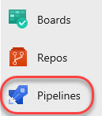

1. The default view lists build pipelines with the first pipeline selected. The VM ships with a default pipeline, although there are no builds in the history.

    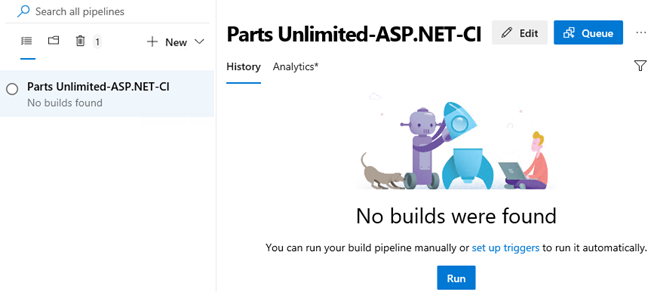

1. From the build pipeline dropdown, select **Delete** and confirm the delete. This lab will focusing on rebuilding this pipeline.

    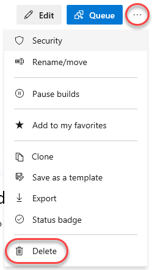

<a name="Ex1Task2"></a>
### Task 2: Creating an agent pool ###

1. The first thing that we need to do is to set up an agent pool for the project. This pool can contain both Windows and cross-platform agents. Right-click **Project settings** and select **Open in new tab**.

    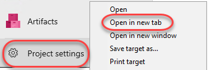

1. Navigate to **Agent pools** under **Pipelines**.

    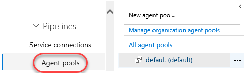

1. There is already an agent pool named **"default"** with a single agent as shown here. For the purposes of this lab, we will delete this pool and add it back in with a new agent. **Delete** the agent.

    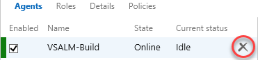

1. **Delete** the pool and confirm.

    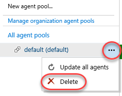

<a name="Ex1Task3"></a>
### Task 3: Creating a build queue ###

1. Before we continue with the installation of an agent, let's also ensure that we set up our team project collection with a build **queue** that points to the default agent pool. Since queues are scoped to your team project collection, you can share them across build definitions and team projects.

1. This diagram from the MSDN documentation helps to illustrate the relationship between pools, queues, team project collections, and build definitions. Note that you can also install multiple agents on a single machine.

    

1. Click **Download agent**.

    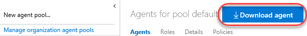

1. Click **Download** and save the target to disk in a convenient place. This download may take a few minutes, so you can close the **Download agent** dialog and continue to the next step.

    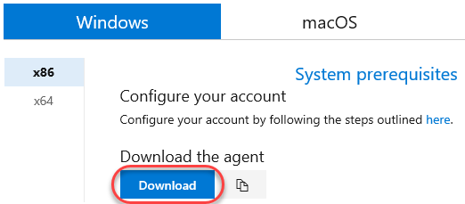

1. Click **New agent pool** to create a new pool.

    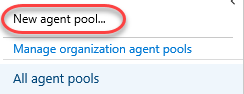

1. Enter a **New pool name** of "**default**" and click **OK**.

    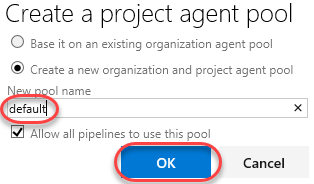

1. Select the **Release retention** tab. From here, you can specify the default and maximum settings for how long the system retains completed builds. The default retention policy is set at 30 days, with the maximum at 365 days. This means that regardless of what is set on the individual build definition all builds that have not been marked to "Retain indefinitely" will be deleted 30 days after they complete.

    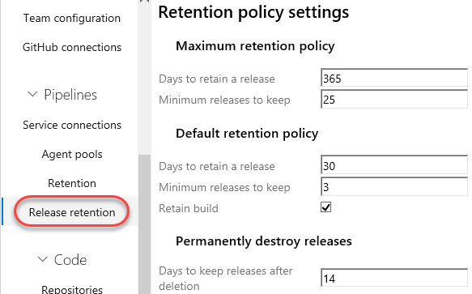

<a name="Ex1Task4"></a>
### Task 4: Installing and configuring an agent ###

1. Wait for the agent download to finish if it has not already. Unzip it to **c:\agent** when complete.

    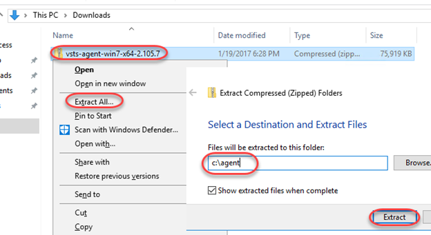

1. Launch an instance of **Command Prompt** as **Administrator** from the taskbar.

1. Change to the unzipped agent directory.

    ```
    cd c:\agent
    ```
1. Execute the agent configuration script.

    ```
    config.cmd
    ```
1. Enter the server URL "[http://vsalm:8080/tfs](http://vsalm:8080/tfs)".

1. Press **Enter** for **Integrated** authentication.

1. Press **Enter** to use the default agent pool of "default".

1. Set the agent name to **"VSALM-Build"** and press **Enter**.

1. Press **Enter** to use the default path proposed for the agent work folder "c:\agent\_work".

1. When asked if you want to install as a Windows Service, type **"Y"** and then press **Enter**. Note that you could also configure the agent to run in interactive mode, which you may want to do if you were planning to execute coded UI tests.

1. Press **Enter** to run as network service, rather than providing a specific user account.

1. After a few moments, the script should complete with the successful installation and configuration of the new agent.

    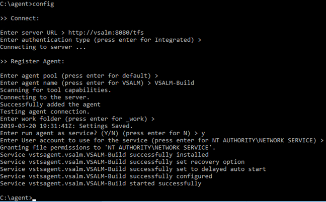

    > **Note:** You weren't prompted for credentials in this case, but under normal circumstances when installing on a remote machine you would be asked to sign in as an agent pool administrator. These credentials are only used once during the configuration process.

1. Return to **Internet Explorer** and navigate to the **Agent pools** tab. The newly created agent will now be in the pool.

    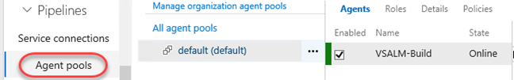

1. Select the **Capabilities** tab to take note of the System Capabilities list shown for the agent. System capabilities are name/value pairs that you can use to ensure that your build definition is only run by build agents that meet specified criteria. Environment variables automatically appear in the list. Some additional capabilities (such as .NET Frameworks) are also added automatically. You can also add your own capabilities to the list based on additional requirements for your builds. Later, when a build is queued, the system sends the job only to agents that have the capabilities demanded by the build definition.

    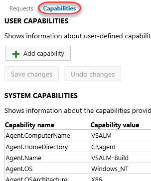

1. Close the browser tab to return to the build pipeline page.

<a name="Exercise2"></a>
## Exercise 2: Working with build pipelines ##

In this exercise, you will learn how to create a basic build definition from one of the provided templates and then queue the build for execution.

<a name="Ex2Task1"></a>
### Task 1: Creating a basic build definition from a template ###

1. Click **New pipeline** to create a new build pipeline.

    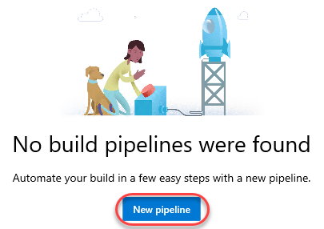

1. There are a lot of options for selecting the build source, team project, and repo. Accept the defaults and click **Continue**. This will build the master branch of the PartsUnlimited project.

    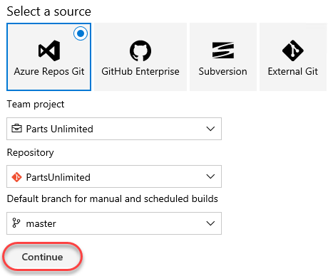

1. There are many templates available to build common project types. Everything is customizable, and you can even start with an empty pipeline. Locate the **ASP.NET** template and click **Apply**.

    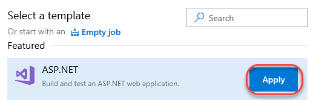

1. For **Agent pool**, select **default** to use the pool created earlier.

    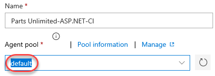

1. Click the **Add task** button. You can find a wide variety of tasks to cover common scenarios from build through deploy and everything in between. Do not add another task at this time.

    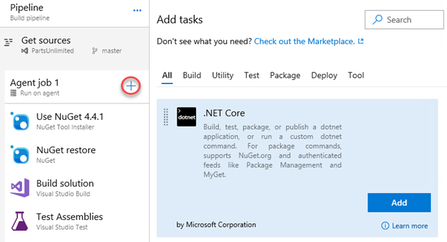

1. Select the **Use NuGet** task. This will ensure the specified version of NuGet is installed.

    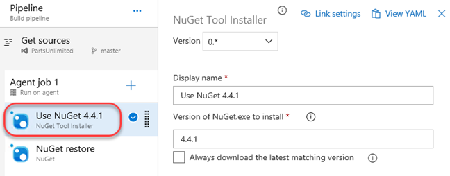

1. Select **NuGet restore**. This task restores all NuGet packages required by the solution.

    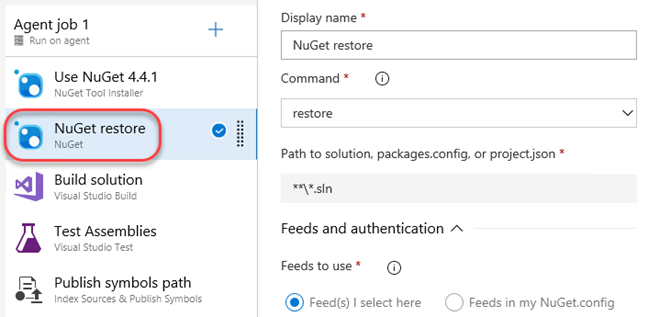

1. Select **Build solution**. This will build the solution using the default parameters specified by the ASP.NET template selected earlier.

    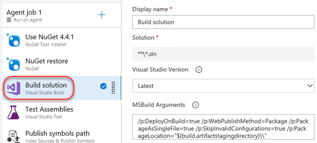

1. Select **Test Assemblies**. This task runs project tests based on the configuration. By default, they are detected in the assemblies based on the pattern shown.

    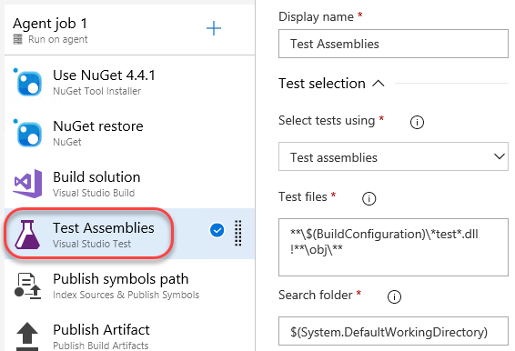

1. From the **Test platform version**, check for the version of Visual Studio installed. If it is available, select it.

    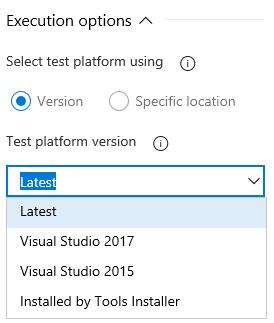

1. If the installed version of Visual Studio is not available, select **Specific location** and enter the path to **vstest.console.exe**. It should be something like **"C:\Program Files (x86)\Microsoft Visual Studio\2019\Enterprise\Common7\IDE\Extensions\TestPlatform\vstest.console.exe"**.

    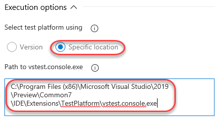

1. Select **Publish symbols path**. This task specifies where and how symbols are pushed.

    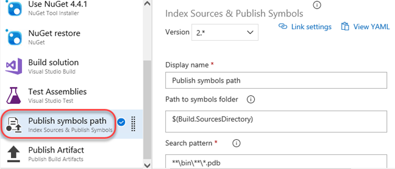

1. Select **Publish Artifact**. This task specifies where and how the project artifact is published.

    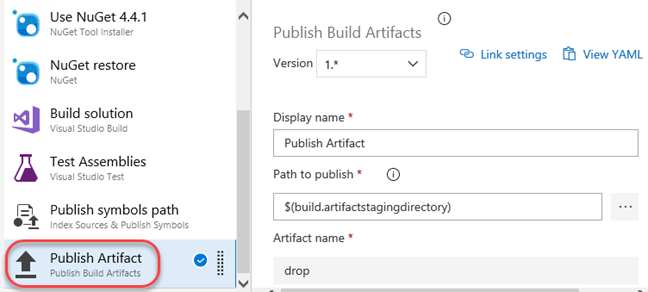

1. Select the **Variables** tab. This enables you to specify centralized variables to share with the tasks of the pipeline.

    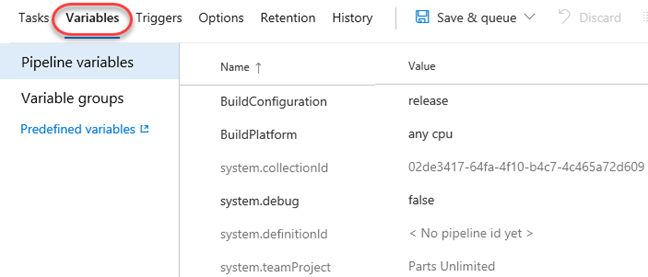

1. The **Triggers** tab enables you to define if and when builds are automatically invoked. Check **Enable continuous integration**, which will invoke a build when a change is committed to the master branch. You can also schedule builds, such as if your team runs nightly builds.

    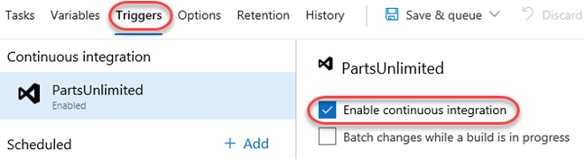

1. Select the **Options** tab. This provides a place to set build properties and limits.

    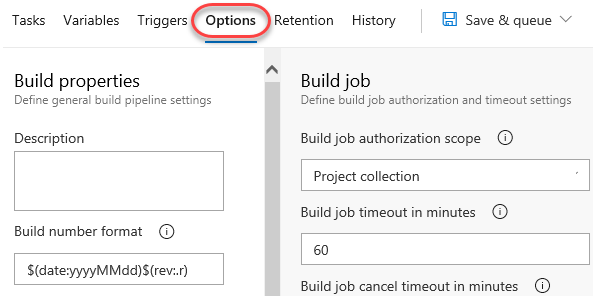

1. The **Retention** tab provides a place to set policies and settings for builds.

    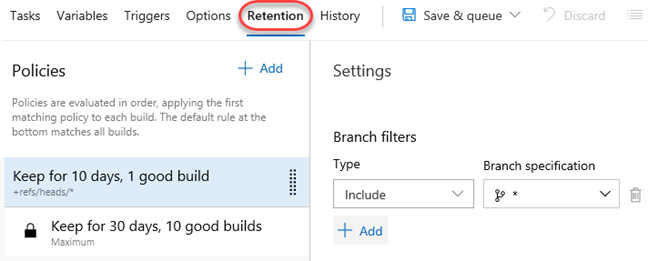

1. Select the **History** tab to view build history.

    

1. From the **Save & queue** dropdown, select **Save**.

    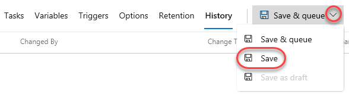

<a name="Ex2Task2"></a>
### Task 2: Triggering and tracking a continuous integration build ###

1. Since the continuous integration trigger was enabled, you can invoke a build by committing a change to the master branch. Select **Repos**.

    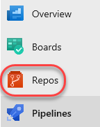

1. Navigate to **PartsUnlimited-aspnet45/src/PartsUnlimitedWebsite/Views/Shared/_Layout.cshtml**.

    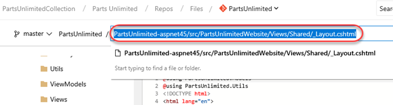

1. Click **Edit**.

    

1. Make a cosmetic change by appending **"v1.0"** to the **h1** tag. Click **Commit** and confirm.

    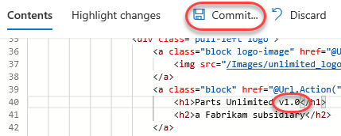

1. Select **Pipelines**.

    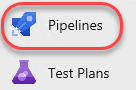

1. There should now be a build running. Select it.

    

1. Follow the build through to completion. Each task is logged for easy tracking.

    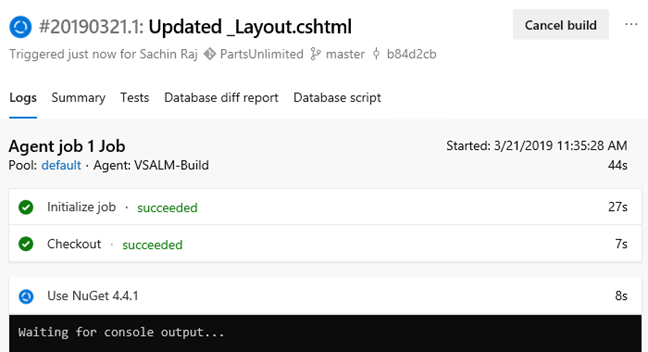

1. The build should succeed. If there are any errors, retrace earlier steps.

    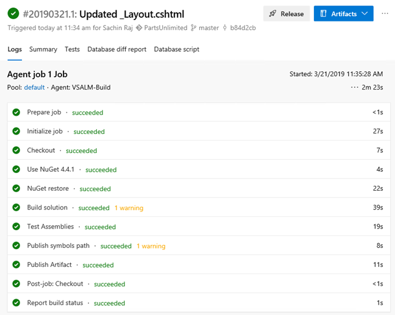

1. Select the **Summary** tab to review the progression of the lab.

    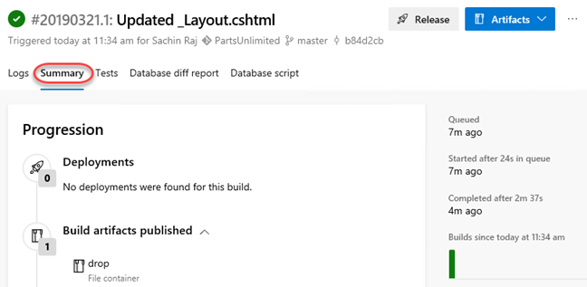

1. The **Tests** tab provides a summary of the tests run during the build.

    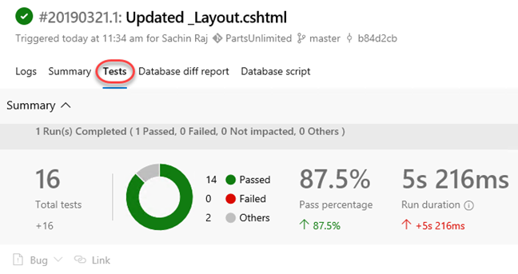

1. You can also review the build drop itself from the **Artifacts** dropdown.

    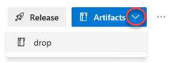

