

## Overview ##

The Code Analysis feature of Visual Studio performs static code analysis to help developers identify potential design, globalization, interoperability, performance, security, and a host of other categories of potential problems. Code Analysis can be run manually at any time from within the Visual Studio IDE, or even setup to automatically run as part of a Team Build or check-in policy for Azure DevOps Server.

In this lab, you will be introduced to Code Analysis, how to configure rules sets to use, and finally how to suppress specific rules at a project and source code level.

## Prerequisites ##

In order to complete this lab you will need the Azure DevOps Server 2019 virtual machine provided by Microsoft. Click the button below to launch the virtual machine on the Microsoft Hands-on-Labs portal.

<a href="https://labondemand.com/AuthenticatedLaunch/38316?providerId=4" class="launch-hol" role="button" target="_blank">Launch the virtual machine</a>

Alternatively, you can download the virtual machine from [here](../devopsvmdownload).

### About the Fabrikam Fiber Scenario ###

This set of hands-on-labs uses a fictional company, Fabrikam Fiber, as a backdrop to the scenarios you are learning about. Fabrikam Fiber provides cable television and related services to the United States. They are growing rapidly and have embraced Windows Azure to scale their customer-facing web site directly to end-users to allow them to self-service tickets and track technicians. They also use an on-premises ASP.NET MVC application for their customer service representatives to administer customer orders.

In this set of hands-on labs, you will take part in a number of scenarios that involve the development and testing team at Fabrikam Fiber. The team, which consists of 8-10 people has decided to use Visual Studio application lifecycle management tools to manage their source code, run their builds, test their web sites, and plan and track the project.

## Exercise 1: Introduction to Code Analysis ##

In this exercise, you will learn about the code analysis features in Visual Studio 2019 by configuring the rule set used, performing code analysis on a sample project, and **addressing** some of the warnings that are raised.

### Task 1: Working with Code Analysis ###

1. Log in as **Sachin Raj (VSALM\Sachin)**. All user passwords are **P2ssw0rd**.

1. Launch **Visual Studio** from the taskbar.

1. From the **Start Page**, click **FabrikamFiber.CallCenter.sln** to open it.

    

1. Select **Build \| Rebuild Solution** from the main menu to build the solution.

1. In **Solution Explorer**, right-click the **FabrikamFiber.Web** project node and select **Properties**.

    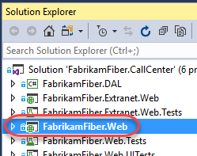

1. Select the **Code Analysis** tab in the project properties window.

    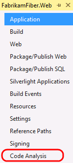

    > **Note:** The Code Analysis tab allows you to choose from sets of rules rather than picking and choosing from one flat list of rules.

1. The currently selected Rule Set is **Microsoft All Rules**, which provides a comprehensive set of rules. As you can see, there are other rule sets to choose from based upon your needs.

    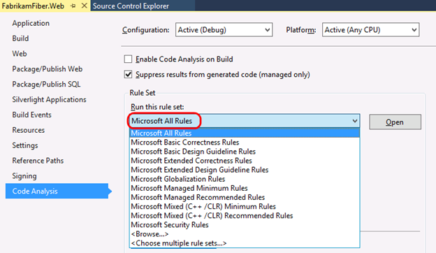

    > **Note:** If you are interested in learning how to create custom rule sets, please see [this](http://msdn.microsoft.com/en-us/library/dd264974.aspx) MSDN documentation.

1. In **Solution Explorer**, right-click the **FabrikamFiber.Web** project node and select **Analyze** \| **Run Code Analysis**.

    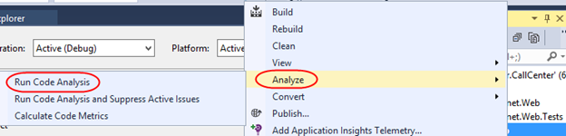

1. The Code Analysis feature runs through static code analysis rules as defined by Microsoft and displays the results in the Code Analysis window. Scroll through the list of results and read a few of them.

    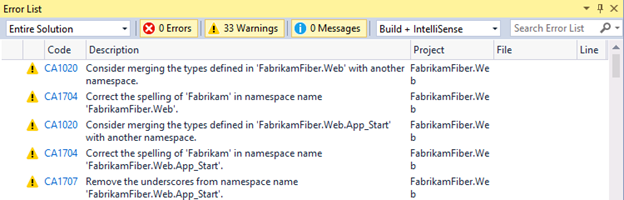

    > **Note:** Depending on the version of FabrikamFiber that you are running, you may see more or less results than depicted in screenshots.

1. Code Analysis rules can also be configured to show up as errors if desired. The warnings produced by Code Analysis provide a wealth of information including a unique ID (such as **CA1020** in the screenshot above), a description of the problem or suggested fix, and the file location of the offending code.

1. The **Error List** window contains a search box where you can filter code analysis results on warning number, text in the title or message of the warning, as well as filename or function name.

1. Enter **"CA1804"** into the search box.

    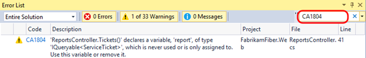

1. **Double-click** the result shown in the **Error List** window to load the specified location in the code editor.

    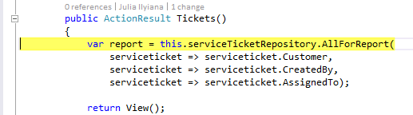

1. Now we will perform the code fix necessary to resolve the warning. For **CA1804**, we are told that we should remove unused locals. Resolve the warning by removing the declaration of the **"var report ="** variable.

    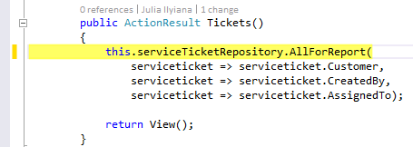

1. Run the code analysis once again to verify that the warning disappears as expected. There should be one less warning than before.

### Task 2: Suppressing Code Analysis warnings ###

1. In this exercise, you will learn how to suppress Code Analysis warnings at the project and source level.

1. Clear the search box in the **Error List** window.

    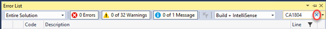

1. In the **Error List** window, select the first three warnings by clicking the first, holding the **Shift** key, and clicking the third. Imagine that we do not want to address the selected issues and no longer want them to appear when Code Analysis executes.

1. **Right-click** the selected warnings and select **Suppress \| In Suppression File** from the context menu. This will add assembly level metadata to a project level **GlobalSuppressions.cs** file.

    

1. Open the newly created **GlobalSuppressions.cs** file from the **FabrikamFiber.Web** project in **Solution Explorer** to view the added code.

    

1. Return to the **Error List** window and locate the first **CA1704** warning (use the search) that suggests correcting the parameter name **"serviceticket"** for the method **Create**. Double-click it to load the associated source.

    

1. **Right-click** the **"serviceticket"** parameter and select **Rename...** from the context menu.

    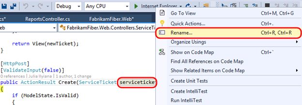

1. Change **"serviceticket"** to **"serviceTicket"** (capital "T") and select the **Apply** button. The code analysis engine will now parse this as two correctly spelled words using camel casing.

    

1. In the **Error List**, double-click the **CA1704** warning for **Edit** to view the source. Suppose that we want to suppress this specific rule, but this time we only want it applied to the associated source file. **Right-click** the warning in the **Error List** and select **Suppress \| In Source**.

    

1. This applies a **SuppressMessage** attribute to the method.

    

1. Run the code analysis once again for **FabrikamFiber.Web** and note that there are fewer warnings listed.

1. At this point, there are additional Code Analysis warnings that we could address, but imagine that we simply want to relax the rules for now. Return to the **Properties** page for **FabrikamFiber.Web**. Switch the active **Rule Set** to **Microsoft Managed Minimum Rules**.

    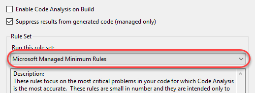

1. Run the code analysis once again for **FabrikamFiber.Web** and note that there are even fewer warnings listed. The warnings (if any) that appear as the result of using this rule set are more likely to be problematic during runtime.

### Task 3: Using Live Code Analysis ###

1. In addition to discovering rule violations in the **Error List**, Visual Studio also offers **Live Code Analysis** that helps you find and address code issues as you develop. For example, locate the **Edit** method in **ServiceTicketsController.cs**. Mouse over the first instance of the **this** keyword to see that there is a code analysis suggestion to simplify the name.

    

1. Click the **Quick Fix** dropdown to see that the suggestion involves removing the **this** keyword in order to simplify the line of code. Also note that the **this** keyword is used several times in this method (and many more elsewhere in the file). Select the **Document** option to apply this fix across the entire file.

    

1. Review the change preview that outlines each change to be made and click **Apply** when satisfied.

    

1. Note that the **this** keyword has been removed everywhere in the file.

    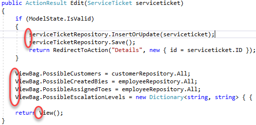

1. There are many different rules that can be easily detected and fixed using Live Code Analysis. From **Solution Explorer**, open **FabrikamFiber.DAL\Models\ServiceTicket.cs**.

    

1. Locate and select the **TimeOpen** property. Notice how this property is a little deeper that a typical getter, although it doesn't do anything too resource-intensive. However, suppose it was deemed that this property did actually perform some heavy lifting that might not provide the immediate return expected from a property. In that case, the code guidelines suggest that it should be declared as a method instead so that consumers would understand that there is a potential performance concern.

    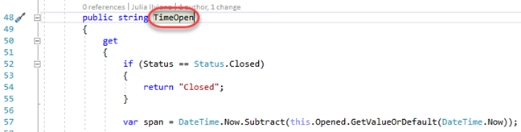

1. To make this change quickly, select the **Quick Action** to review the suggested code changes. Press **Enter** to apply.

    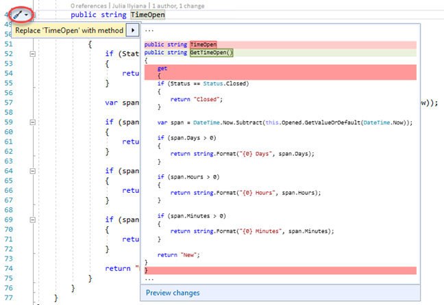

1. Within the method, there are multiple old-school **string.Format** lines. Thanks to the availability of **C# string interpolation**, this code could be made cleaner.

    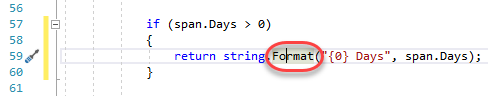

1. To make this change quickly, select the **Quick Action** to review the suggested code changes. Press **Enter** to apply.

    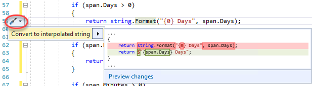

1. Note how much easier this code is to follow and maintain.

    

1. From **Solution Explorer**, open **FabrikamFiber.DAL\Data\AlertRepository.cs**.

    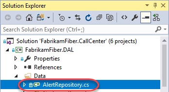

1. This file contains the **AlertRepository** class it's named for, but it also contains an **IAlertRepository** interface. It's a good practice (and often required by development teams) to separate types into their own files.

    

1. To make this change quickly, select the **Quick Action** to review the suggested code changes. Press **Enter** to apply.

    

1. You can now see the new **IAlertRepository.cs** file in **Solution Explorer**. You could also easily update the name of a file to reflect the name (and casing) of its type after a refactoring (or vice versa).

    

1. You can customize the behavior of Live Code Analysis as you like, such as by having it proactively flag specific violations. In the **Visual Studio** search bar, search for **"c# code style"**. Select the result matching the screenshot below.

    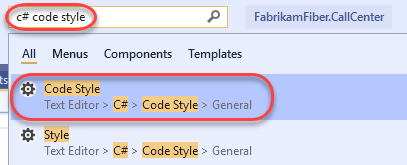

1. Update the **Qualify field access with 'this'** to **Warning**. This will treat all violations of this rule (referencing a member field with the **this** keyword) as a warning. Click **OK** to close the dialog.

    

1. Locate the **All** property of the **AlertsRepository** class. It uses **this** to access a member field, which is now flagged as a warning (you may need to close and reopen the file to see the green squiggle). You may need to reopen the file to see the warning.

    

1. Expand the **Error List** to see all the other instances of this rule violation that have now been flagged as compiler warnings. You may need to clear the search box to see the results.

    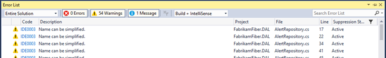

