<div class="rw-ui-container"></div>

<a name="Overview"></a>
## Overview ##

Many developers still rely on traditional or live debugging techniques. These are limited in that they only account for your application's current state with limited data about past events. This forces the developer to either guess what happened based on current state or to attempt to recreate these events by re-running the app. Developers then rely on breakpoints to try to capture some of the errors that might appear because of unknown events, but sometimes even a breakpoint won't be able to expose the issue.

IntelliTrace expands this traditional debugging experience by recording specific events and data at these points in time. This lets you see what happened in your application without restarting it, especially if you step past where the bug is. IntelliTrace enables you to seek to a large number of execution points-that occurred in the past-and drill into any of them by comparing variables, call stacks, etc. This makes it much easier to pinpoint the causes of issues without having to restart the application in an attempt to reproduce the problem. IntelliTrace automatically collects various events in your application (e.g. ASP.NET, ADO.NET, etc), which enables you to view the historical state of the application at those points in time.

<a name="Prerequisites"></a>
## Prerequisites ##

In order to complete this lab you will need the Azure DevOps Server 2019 virtual machine provided by Microsoft. Click the button below to launch the virtual machine on the Microsoft Hands-on-Labs portal.

<a href="https://labondemand.com/AuthenticatedLaunch/38297?providerId=4" class="launch-hol" role="button" target="_blank"><span class="lab-details">Launch the virtual machine</span></a>

Alternatively, you can download the virtual machine from [here](../devopsvmdownload).

<a name="Exercise1"></a>
## Exercise 1: Debugging with IntelliTrace ##

In this scenario the business owner has asked us to determine why we are seeing a drop in the sales of particular items from the past few days. We know that the last deployment extended the functionality of the search capabilities of this site. With that hunch in place, we'll start the investigation there.

<a name="Ex1Task1"></a>
### Task 1: Using IntelliTrace to collect data from production ###

1. Log in as **Sachin Raj (VSALM\Sachin)**. All user passwords are **P2ssw0rd**.

1. Launch **PowerShell** from the taskbar.

1. Enter the following command to change to the IntelliTrace directory.

    ```
    cd \intellitrace
    ```
1. Enter the following command to import the IntelliTrace cmdlets.

    ```
    Import-Module .\Microsoft.VisualStudio.IntelliTrace.PowerShell.dll
    ```
1. Enter the following command to begin the collection. Note that it should all be one line.

    ```
    Start-IntelliTraceCollection -ApplicationPool PartsUnlimited -CollectionPlan .\collection_plan.ASP.NET.trace.xml -OutputPath C:\LogFileLocation
    ```
1. Confirm the action by entering **"Y"**. This will start IntelliTrace, which gathers diagnostic logs on the **PartsUnlimited**. We specified the **trace.xml** collection plan which will give us a verbose log and have a slightly heavier impact on performance (hence we only want to run this for short periods). For a lighter log, we could have used the **default.xml** collection plan.

1. Leave PowerShell open and launch **Internet Explorer** from the taskbar. Use the **Parts Unlimited** shortcut to navigate to the site we're debugging. Note that it's hosted locally in IIS on this VM, even though the URL is "www.partsunlimited.com".

    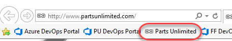

1. Now we're going to simulate some activity on the website ourselves. Often, you can just let normal usage drive the IntelliTrace collection, but we're going to have to simulate it here. By the way, attaching the IntelliTrace collector to the app pool recycles it, which is why the first load takes a bit longer than usual. Start off by searching for the singular **"battery"**. There should be some results.

    

1. Search again for the plural **"batteries"**. There should be some results.

1. Search again for the singular **"jumper lead"**. There should be at least one result.

1. Search again for the plural **"jumper leads"**. Note that there are no results, which seems to be a bug.

    

1. Close the browser.

1. Return to PowerShell and enter the following command to stop the collection. Confirm the stop when requested.

    ```
    Stop-IntelliTraceCollection -ApplicationPool PartsUnlimited
    ```
<a name="Ex1Task2"></a>
### Task 2: Historical debugging ###

1. Open **Windows Explorer** and navigate to **C:\LogFileLocation**. Double-click the **iTrace** file to open it in **Visual Studio 2019**. This file contains all of the IntelliTrace recordings from our session.

    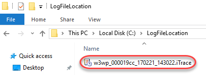

1. Since this IntelliTrace session isn't associated with an active solution, you'll need to temporarily disable the **Just My Code** feature to get the full experience. From the main menu select **Tools \| Options**.

1. In the left tree view, locate **Debugging \| General** and uncheck the **Enable Just My Code** option in the right panel. Click **OK** to apply.

    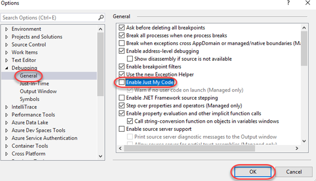

1. Minimize **Exception Data** and expand **Web Requests**.

    

1. Select the search request for "jumper leads" and click **Request Details**.

    

1. We can see there are some exceptions being thrown, even though the site didn't report an error. This is a really hard scenario to debug if we don't have IntelliTrace since it's an intermittent issue (the search worked for **"batteries"** but not for **"jumper leads"**). We can see that the exception is a **System.ArgumentOutOfRangeException**. Select the first instance of this exception in the list and click **Debug This Event**.

    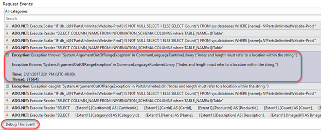

1. At this point it may look like we're debugging, but we're actually looking at historical data captured in production. By clicking **Debug**, we are taken to the exact line of code that caused the exception. We can view the **Call Stack** and **Locals**, and even see what value variables had at this point in the log.

    

1. Mouse over the **query** parameter to get the full debugging experience, including insight as to the value of the variable at the time of the exception.

    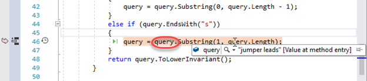

1. In order to better visualize the path that led to this exception, right-click the line of code and select **Code Map \| Show Call Stack on Code Map**.

    

1. Locate the **Depluralize** method, which is highlighted as the location of the call stack, as well as the location of the exception.

    

1. We can now tell that the issue here is that we're indexing past the end of the query in our call to **Substring**. This could have been a lot harder to find without IntelliTrace.

1. Select **Debug \| Stop Debugging** to end the debug session.

1. Select **File \| Close Solution** to close all files. Do not save any.

<a name="Ex1Task3"></a>
### Task 3: IntelliTrace inside Visual Studio 2019 ("F5" IntelliTrace) ###

1. Select **File \| Start Page** to open the **Visual Studio Start Page**.

1. Open the **PartsUnlimited** project.

    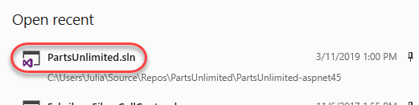

1. Press **F5** to start debugging.

1. Once the site loads, search for **"jumper leads"** as before. As expected, there should be no results.

    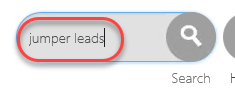

1. Switch to **Visual Studio**.

1. Locate the **Diagnostic Tools** window. Note that in the **Summary** tab, there are some exceptions that occurred in the application. You can review the corresponding red diamonds in the **Events** track if you locate the relative time at which they occurred. Click **Show Events**.

    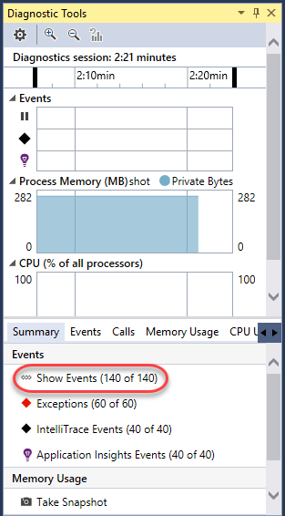

1. There are many events collected, but we're primarily interested in the **ArgumentOutOfRangeExceptions**, so search to filter down to those.

    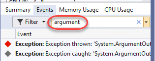

1. Double-click the first **ArgumentOutOfRangeException**. This should be the same exception we were working with earlier.

    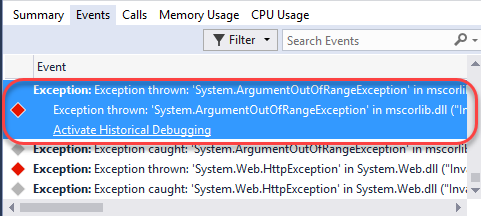

1. If so, it will bring us to the same line. At this point you could optionally export an **iTrace** file for this session that you could share with others via **Debug \| IntelliTrace \| Save IntelliTrace Session**. This makes it very easy to share the exact circumstances under which an issue occurred so that the developer can easily track it down.

    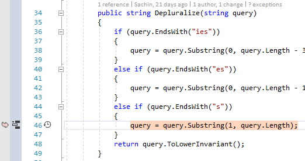

1. Select **Debug \| Stop Debugging** to end the debug session.

1. Update the offending line of code by adding **"- 1"** to the end of **query.Length** and **save** the file.

    ```
    query = query.Substring(1, query.Length - 1);
    ```
1. Press **F5** to build and run the project to confirm the fix.

1. Search for **"jumper leads"** and confirm there is at least one result.

1. Keep the browser window open to continue the debugging session in the next task.

<a name="Ex1Task4"></a>
### Task 4: Step-back debugging ###

Step-back debugging enables you to retrace your steps during a debugging session. As you move back and forth in this historical debugging mode, the variables, events, and diagnostic data are kept in sync with the state of the application at the time of that step. It's available for Windows Forms, WPF, and managed console apps, as well as managed class libraries. Support for debugging ASP.NET applications with IIS Express will be available in an upcoming release of Visual Studio.

1. From **Solution Explorer**, open **Controllers/HomeController.cs**.

1. Set a breakpoint on the first line of the **Index** method that sets the **topSellingProducts** variable.

    

1. Click the **Home** link in the top right corner.

    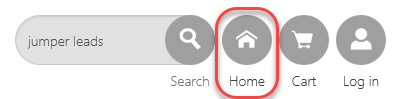

1. When the breakpoint hits, mouse over the **topSellingProducts** member to confirm that it is null.

    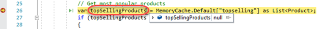

1. Mouse over **topSellingProducts** again to confirm it has been set.

    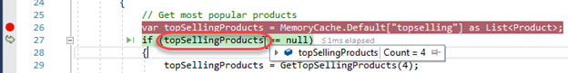

1. On the **Debug** toolbar, click the **Step Backward** button. This allows you to retrace to the previous line of execution.

    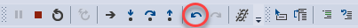

1. Press **F10** to step over the current statement. If you see the option to enable IntelliTrace with Snapshots, click **Enable** and restart the debugging session after a rebuild.

    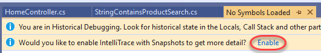

1. You are now in a historical debugging session where you can review the variables just as they were before the step was taken. Mouse over **topSellingProducts** to confirm that it is "currently" null. You may need to manually switch back to this source file. If you do not see this view, you may need to enable snapshots and restart the debugging session using the provided link.

    

1. There is also a **Step Forward** button that you can use to step forward to the next historically executed line of code.

    

1. Press **F5** to return to live debugging.

1. Select **Debug \| Stop Debugging** to end the session.

