

## Overview ##

It takes several teams to develop large software projects. Very large projects require multiple autonomous teams that can manage their own backlog and priority while contributing to a unified direction for that project. Regular reviews of the project schedule with these teams help ensure that the teams are working toward common goals. Delivery Plans provide the needed multi-team view of your project schedule.

## Prerequisites ##

In order to complete this lab you will need the Azure DevOps Server 2019 virtual machine provided by Microsoft. Click the button below to launch the virtual machine on the Microsoft Hands-on-Labs portal.

<a href="https://labondemand.com/AuthenticatedLaunch/38311?providerId=4" class="launch-hol" role="button" target="_blank">Launch the virtual machine</a>

Alternatively, you can download the virtual machine from [here](../devopsvmdownload).

## Exercise 1: Managing Delivery Plans with Azure DevOps Server 2019 ##

### Task 1: Demo setup ###

1. Log in as **Sachin Raj (VSALM\Sachin)**. All user passwords are **P2ssw0rd**.

1. Launch **Internet Explorer** from the taskbar.

1. Click the **PU DevOps Portal** shortcut to navigate to the PartsUnlimited DevOps portal.

    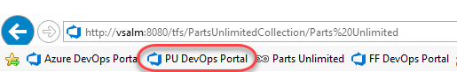

1. Open the **Project settings**.

    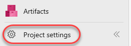

1. Select **Project configuration** under **Boards**.

    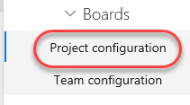

1. This lab requires a specific iteration/sprint configuration in order to illustrate functionality. **Delete** **Sprints 4-6** and reassign their items to **Sprint 3**.

    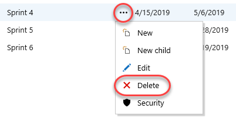

    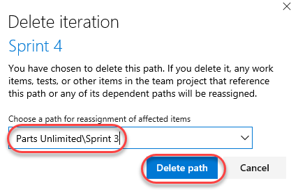

1. From the **Sprint 2** context menu, select **Edit**.

    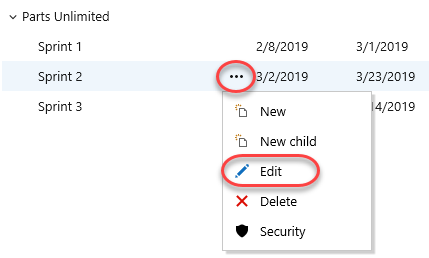

1. Change the **Start date** to today's date. For the purposes of this lab, we'll assume that we are at the very beginning of **Sprint 2**. Set the **End date** to the third Friday from now (less than three weeks). Click **Save and close**.

    

1. Edit **Sprint 3** in the same manner, but set its start date to the Monday after **Sprint 2's End Date**. **Sprint 3** should end three Fridays later.

    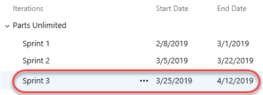

### Task 2: Installing the Delivery Plans extension ###

1. Delivery Plans is provided as an optional extension to Azure DevOps Server. From the **Marketplace** navigation dropdown, select **Manage extensions**.

    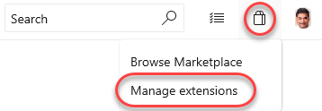

1. Click **Browse local extensions**.

    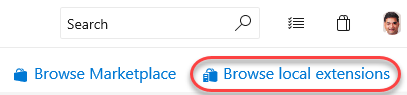

1. Select the **Delivery Plans** extension.

    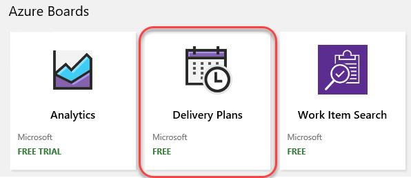

1. Click **Get it free**.

    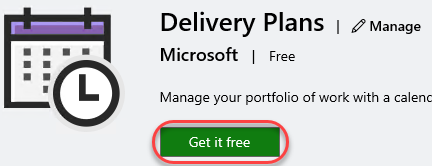

1. Select the **PartsUnlimitedCollection** and click **Continue**.

    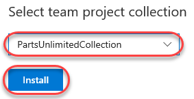

1. Close the browser tab.

### Task 3: Creating a delivery plan ###

1. Click the **PU DevOps Portal** shortcut to navigate to the PartsUnlimited DevOps portal.

    

1. Navigate to **Boards \| Plans**.

    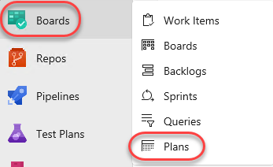

1. Click **New plan**.

    

1. Since you may want to have multiple delivery plans for different aspects of your project, provide the specific name **"Web delivery"**. It should default to the only team in the project at this time (**PartsUnlimited Team**), so select **Features** and click **Create**. Note that you could also organize your deliveries by **Stories** if you used that model instead. There is also the option to add additional teams and criteria to filter stories/features by, but we'll revisit those later.

    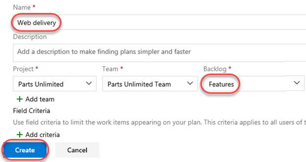

1. Due to the iteration reconfiguration performed earlier, the "Today" marker is right at the beginning of **Sprint 2**. We have a number of stories listed for delivery in the previous sprint, and we can also see an empty **Sprint 3**. Note that some of the stories shown are **Done**. Although it's useful to see the progress of work, we'll use that as an example by which to filter items out in a moment.

    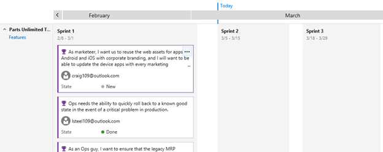

1. Click the **Configure plan settings** button.

    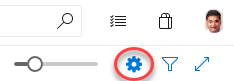

1. Select the **Field criteria** tab and click **Add criteria**.

    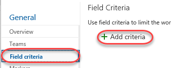

1. Set the new criteria to filter down to items where **State** does not equal (**<>**) **Done**.

    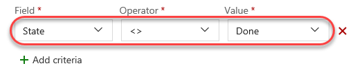

1. We can also add a custom marker to keep track of significant dates. Select the **Markers** tab and click **Add marker**.

    

1. Select the fourth Friday from today (it will be the first Friday in **Sprint 3**) and set the **Label** to **"Team offsite"**. Select magenta as the **Color** and click **Save**.

    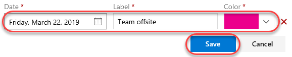

1. The first thing to notice is that the "Done" story is no longer visible on the delivery plan due to the criteria set in the configuration. In addition, there is now a magenta marker in the middle of **Sprint 3** that says **"Team offsite"** when clicked.

    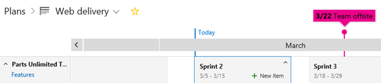

1. Another neat feature of the delivery plan extension is the ability to easily scale the calendar. Drag the **Scale** slider all the way to the left to view multiple months at once.

    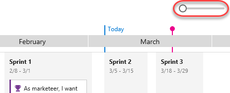

1. Slide it all the way to the right to zoom in to a much more precise view.

    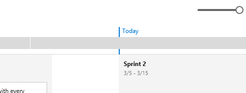

### Task 4: Adding an external team to the project ###

1. Our delivery plan has been pretty simple so far because we only have the one team. However, the real power of delivery planning comes into play when orchestrating multiple autonomous teams across their efforts. Click **Project Settings**.

    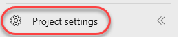

1. From the **Teams** tab, click **New team**.

    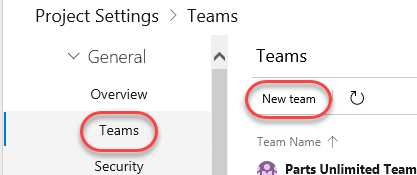

1. This new team will be responsible for the efforts that involve integrating with external services, such as 3rd party services for things like weather forecasts and payment processing. Set the **Team name** to **"External integration team"** and click **Create team**.

    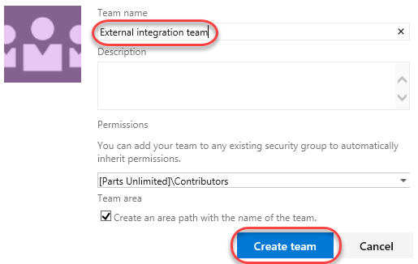

1. Select **Project configuration** under **Boards**.

    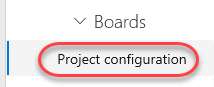

1. Note the dates of **Sprint 2** and **Sprint 3**, which will vary based on what you changed them to earlier. We're going to add two new iterations for the external services team that do not align exactly with the main team's schedule.

    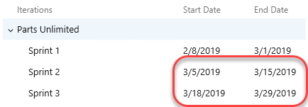

1. With the root **PartsUnlimited** node selected, click **New child**.

    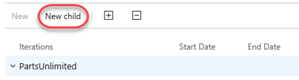

1. Set the **Iteration name** to **"Iteration 50"**. Use today as the **Start date** and set the **End date** to three Fridays from today. This will also happen to be the day of the team offsite. Click **Save and close**.

    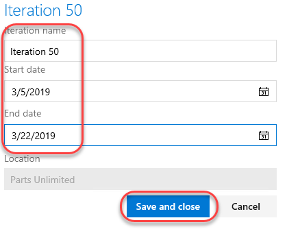

1. Use the same process to add an **Iteration 51** that starts the Monday after **Iteration 50** ends and has an end date three Fridays later.

    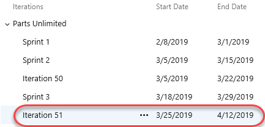

1. Now we need to configure the new team to use those new project sprints as its iterations. Select **Teams** under **General** and click **External integration team**.

    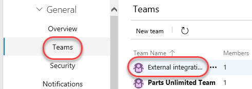

1. Click **Iterations and areas**.

    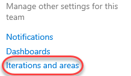

1. Select the **Iterations** tab.

    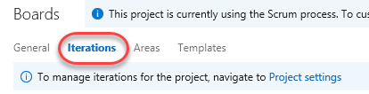

1. Click **Select iterations** and use the **+ Iteration** button to select **Iteration 50** and **Iteration 51**. Click **Save and close**.

    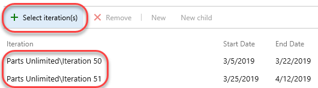

### Task 5: Making delivery decisions ###

1. Navigate to **Boards \| Plans**.

    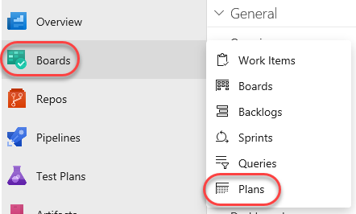

1. Click the **Configure plan settings** button.

    

1. Select the **Teams** tab and click **Add team**.

    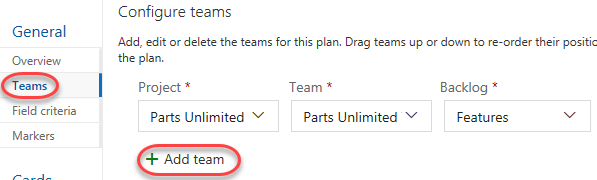

1. Select the **External integration team** and **Features**. Click **Save**.

    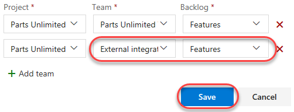

1. Use the **Scale** slider to fit the width of **Iteration 50** and **Iteration 51**.

    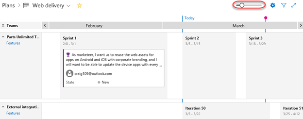

1. The new team doesn't have any stories added yet. Fortunately, you can add them directly to their team and iteration using the inline functionality. Select the **Iteration 50** iteration. Click the **New item** button that appears.

    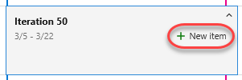

1. Enter **"Integrate with weather service"** and press **Enter**. That item is now in the backlog with its area and iteration configured.

    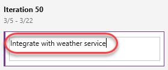

1. Follow the same process to add an item for integrating with corporate branding assets to **Iteration 51**.

    

1. Now we can step back to see how these two teams are working toward our common goals. Upon closer examination, it appears that the main team is planning to reuse some corporate branding assets during the current sprint that will not be available until well after it's over. It's a good thing we have this view to catch these sort of potential problems early on.

    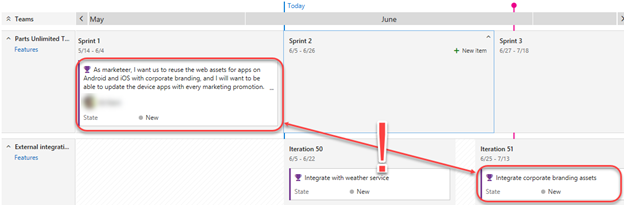

1. The first thing we should do is to move the branding integration work to an earlier iteration. Drag and drop the corporate branding story onto **Iteration 50**. In order to free up the bandwidth, drag the weather service story onto **Iteration 51**.

    

1. Next, drag the branding work item from **Sprint 1** to **Sprint 3** so that there's a chance the dependencies will be available in time for this team to be unblocked.

    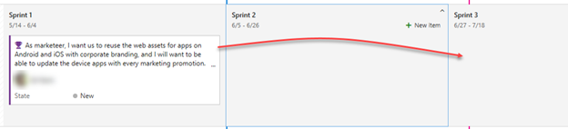

1. Now we can review the delivery plan again. It should be more feasible now.

    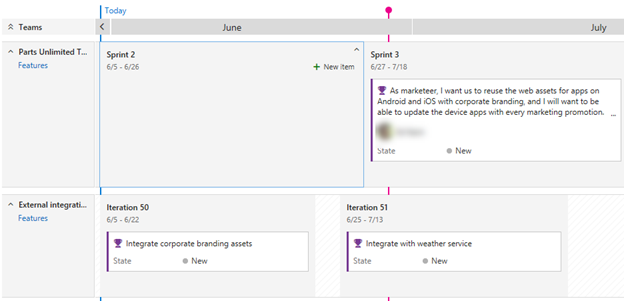

1. There are a lot of ways to quickly customize the view of the delivery plan. For example, pressing the **'t'** key will toggle between showing all configured fields and showing just the title. Try that now.

    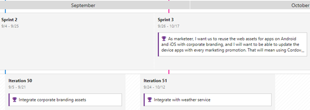

1. You can also collapse all teams (or specific teams) using the toggle buttons next to their names.

    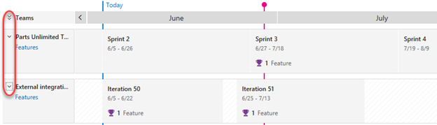

