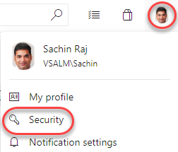
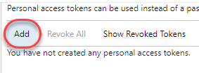
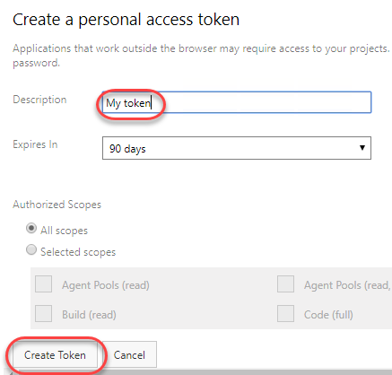
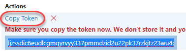
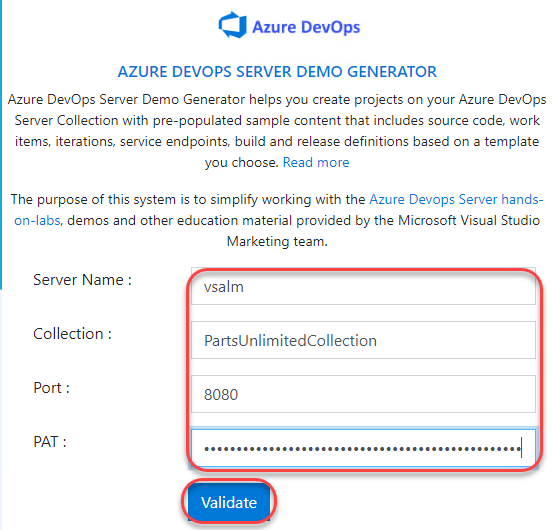
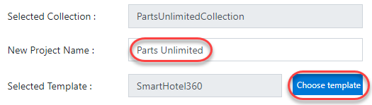
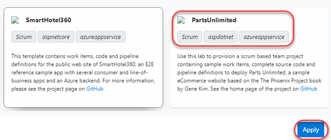
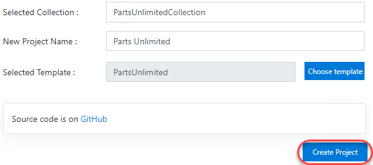
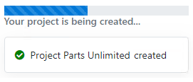
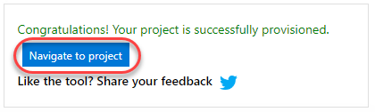

## Overview ##

In this lab, you will learn about how to generate demo data using the built-in demo generator for use with the Azure DevOps Server 2019 virtual machine. The demo generator is a web utility that uses the Azure DevOps Server API to populate the data, so it will require a personal access token.

## Exercise 1: Generating Demo Data in the Azure DevOps Server 2019 Virtual Machine ##

### Task 1: Generating demo data in the Azure DevOps Server 2019 virtual machine ###

1. Log in as **Sachin Raj (VSALM\Sachin)**. All user passwords are **P2ssw0rd**.

1. Install Google Chrome. The demo generator site does not support Internet Explorer.

1. Use Chrome to navigate to [http://vsalm:8080/tfs](http://vsalm:8080/tfs). This is the root of your Azure DevOps site.

1. From Sachin's profile dropdown, select **Security**.

    

1. Click **Add** to create a new personal access token.

    

1. Enter a **Description** for the token and click **Create Token**.

    

1. Copy the token for use in the demo generator.

    

1. Navigate to [http://vsalm:7676](http://vsalm:7676/). This is the locally hosted demo generator.

1. Enter a **Server Name** of **"vsalm"**, a **Port** of **"8080"**, and paste your token for the **PAT**. Enter the name of an existing **Collection**, such as **"PartsUnlimitedCollection"**. Click **Validate** to confirm.

    

1. Enter a **New Project Name**. If you're replacing the existing **Parts Unlimited** project, be sure to delete it from the collection before continuing. Click **Choose template**.

    

1. Select the **PartsUnlimited** template and click **Apply**.

    

1. Click **Create Project**.

    

1. It will take a minute or two for the project to finish creating.

    

1. When the project is ready, click **Navigate to project** to visit the portal.

    

