

## Overview ##

In this lab, you'll learn about Git support in Azure DevOps Server 2019 and Visual Studio 2019. Git is a distributed version control system with repositories that live both locally (such as on a developer's machine) and hosted on Azure DevOps Server. And if you have any doubt about the scalability of Git, rest assured that Azure DevOps Server support for Git Virtual File System ([GVFS](http://www.gvfs.io/)) empowers you to virtually unlimited scale. Just ask the Windows team-they use it to manage over 300GB across 3.5 million files.

## Prerequisites ##

In order to complete this lab you will need the Azure DevOps Server 2019 virtual machine provided by Microsoft. Click the button below to launch the virtual machine on the Microsoft Hands-on-Labs portal.

<a href="https://labondemand.com/AuthenticatedLaunch/38303?providerId=4" class="launch-hol" role="button" target="_blank">Launch the virtual machine</a>

Alternatively, you can download the virtual machine from [here](../devopsvmdownload).

## Exercise 1: Getting started with Git ##

In this exercise, you will learn how to create, clone, and push commits to a Git repository in Azure DevOps Server.

### Task 1: Removing the existing source clone ###

1. Log in as **Sachin Raj (VSALM\Sachin)**. All user passwords are **P2ssw0rd**.

1. In **Explorer**, navigate to **C:\Users\Julia\Source\Repos** and delete the **PartsUnlimited** folder. This will remove the existing clone of the repo so you can start fresh.

    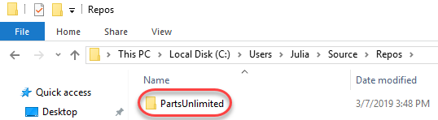

### Task 2: Cloning an existing repository ###

1. Open a browser window and navigate to the **PU DevOps Portal**.

    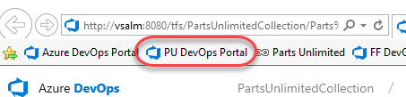

1. Navigate to the **Repos** hub.

    

1. Click **Clone** and click the **Copy to Clipboard** button to copy the Git clone path.

    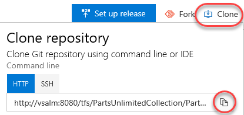

1. Open **Visual Studio** from the taskbar.

1. Click **Clone or check out code**.

    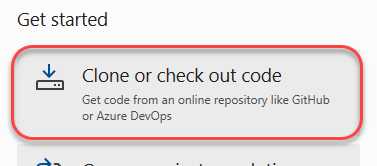

1. Paste the **Repository location** and click **Clone**.

    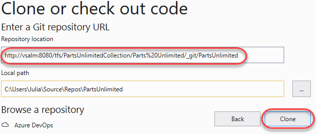

1. After the project has cloned, use **Solution Explorer** to double-click **PartsUnlimited.sln** to open the solution. You can ignore warnings about unsupported project types.

    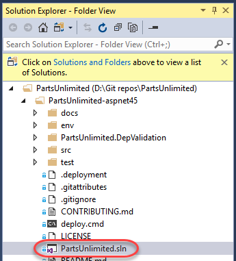

1. Select **Build \| Build Solution** to build the solution.

## Exercise 2: Saving work with commits ##

When you make changes to your files, Git will record the changes in the local repository. You can select the changes that you want to commit by staging the changes. Commits are always made against your local Git repository, so you don't have to worry about the commit being perfect or ready to share with others. You can make more commits as you continue to work, and push the changes to others when they are ready to be shared.

What's in a commit?

Git commits consists of the following:

- The file(s) changed in the commit. Git keeps the contents of all file changes in your repo in the commits. This keeps it fast and allows intelligent merging.

- A reference to the parent commit(s). Git manages your code history using these references.

- A message describing a commit. You give this message to Git when you create the commit. It's a good idea to keep this message descriptive, but to the point.

### Task 1: Committing changes ###

1. Open **Controllers/AccountController.cs** from the **PartsUnlimitedWebsite** project.

    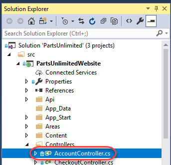

1. Add a comment to the file and save it. It doesn't really matter what the comment is since the goal is just to make a change.

    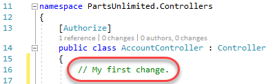

1. From **Team Explorer**, navigate to the **Changes** view.

    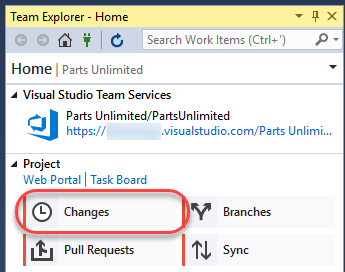

1. Enter a **Comment** of **"My commit"** and click **Commit All**. This will create a new commit to the local repo with all of the included changes.

    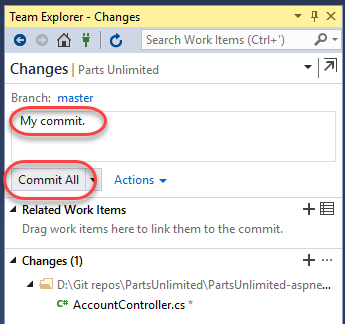

1. When the local commit has succeeded, click Sync to share changes with the server.

    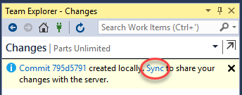

1. As you make changes to your code, you will want to be sure to incorporate the changes others have committed to the codebase to be sure there are no issues. All of the pushing, pulling, and syncing features are available from the Synchronization view.

    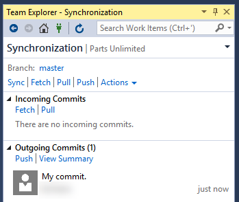

### Task 2: Syncing changes ###

1. Before syncing, fetch the commits to view changes that your team has made. Fetching changes does not merge the commits into your local repository, it just enumerates them. If there were any changes, you would need to pull them in to merge them with your local repository.

    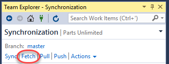

1. Since there are no changes, click Sync to pull the latest commits locally (none in this case) and then push your commits out.

    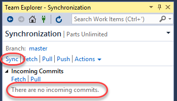

1. The synchronization should succeed quickly since there's only one commit to push.

    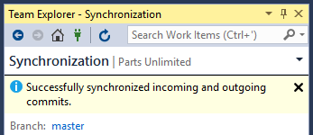

1. You can review the latest commits on Azure DevOps under the **Commits** tab of the **Repos** hub.

    

1. The recent commit should be right at the top.

    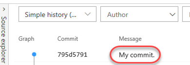

### Task 3: Staging changes ###

Staging changes allows you to selectively add certain files to a commit while passing over the changes made in other files. Ignore temp files, logs, and other files that might change but you do not want to stage in a commit.

1. Return to **Visual Studio**.

1. Update the open **AccountController.cs** class by editing the comment you made earlier.

    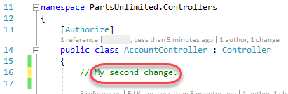

1. Open **CheckoutController.cs** as well.

    

1. Add a new comment to **CheckoutController.cs** so there will be two files with changes. Press **Ctrl+Shift+S** to save all files.

    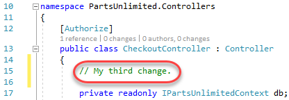

1. From the **Team Explorer** dropdown, select **Changes**.

    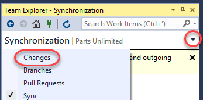

1. Right-click **AccountController.cs** and select Stage.

    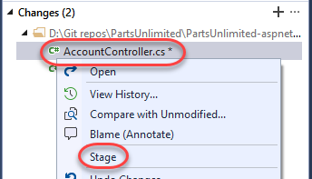

1. This will prepare **AccountController.cs** for committing without **CheckoutController.cs**.

    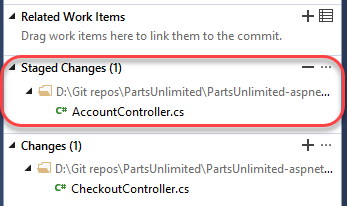

1. Enter a comment of **"Added comments"** and select **Commit Staged \| Commit Staged and Sync**. This will commit the staged file and sync it with the server in one process.

    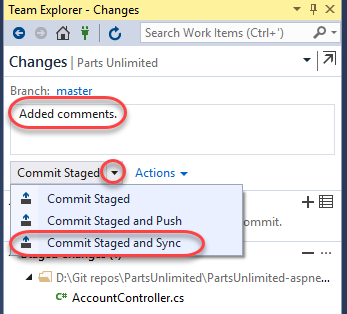

## Exercise 3: Reviewing history ##

Git uses the parent reference information stored in each commit to manage a full history of your development. You can easily review this commit history to find out when file changes were made and determine differences between versions of your code.

Git's use of the Branches and Merges feature works through pull requests, so the commit history of your development doesn't necessarily form a straight, chronological line. When you use history to compare versions, think in terms of file changes between two commits instead of file changes between two points in time. A recent change to a file in the master branch may have come from a commit created two weeks ago in a feature branch but was only merged yesterday.

### Task 1: Comparing files ###

1. In **Solution Explorer**, right-click **AccountController.cs** and select **View History**.

    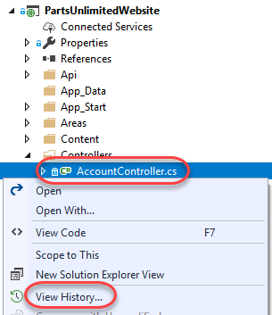

1. In the **History** view for **AccountController.cs**, right-click the most recent commit (at the top) and select **Compare with Previous**.

    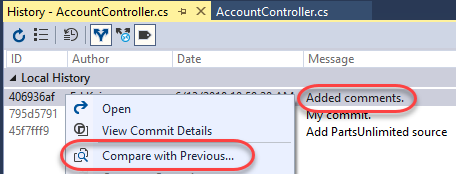

1. This will open a **Diff** view in a temporary file that highlights what exactly changed during that commit.

    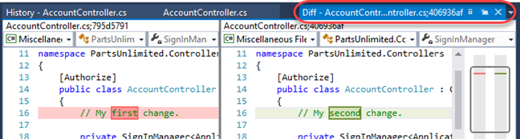

### Task 2: Retrieving files ###

1. You can also use the **History** view to open specific versions of a file. Right-click the second commit and select **View Commit Details**.

    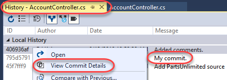

1. This was the first commit performed in this lab and contained only one change. In **Team Explorer**, right-click **AccountController.cs** and select **Open**.

    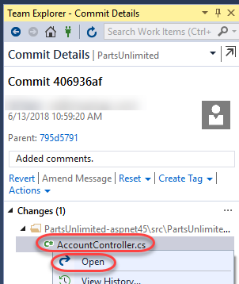

1. The version of the file associated with that specific commit is opened in a temporary file. You can review its contents now, such as the comment from the first commit.

    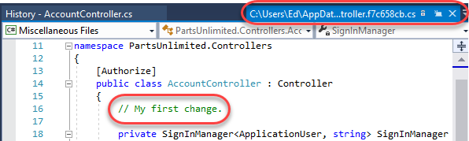

## Exercise 4: Managing branches from Visual Studio ##

You can manage the work in your Azure DevOps Git repo from the **Branches** view on the web. You can also customize the view to track the branches you care most about so you can stay on top of changes made by your team.

Committing changes to a branch will not affect other branches, and you can share branches with others without having to merge the changes into the main project. You can also create new branches to isolate changes for a feature or a bug fix from your master branch and other work. Since the branches are lightweight, switching between branches is quick and easy. Git does not create multiple copies of your source when working with branches, but rather uses the history information stored in commits to recreate the files on a branch when you start working on it. Your Git workflow should create and use branches for managing features and bugfixes. The rest of the Git workflow, such as sharing code and reviewing code with pull requests, all work through branches. Isolating work in branches makes it very simple to change what you are working on by simply changing your current branch.

### Task 1: Creating a new branch in your local repository ###

1. From the **Team Explorer** dropdown, select **Branches**.

    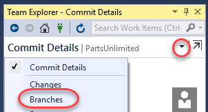

1. There is only one local branch at this time, which is master. Right-click it and select **New Local Branch From** to create a new one.

    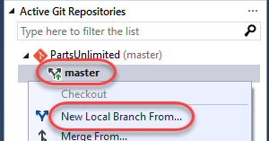

1. Name the new branch **"dev"** and click **Create Branch**.

    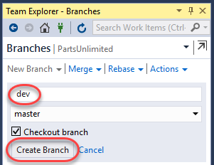

1. Note that you can always see what branch you're working on in the bottom right corner of Visual Studio. You can also easily switch between branches, create new ones, and manage them all.

    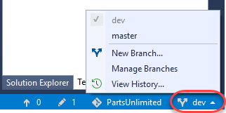

### Task 2: Checking out and publishing branches ###

Git keeps track of which branch you are working on and makes sure that when you checkout a branch your files match the most recent commit on the branch. Branches let you work with multiple versions of the source code in the same local Git repository at the same time.

1. In **Team Explorer**, right-click the **master** branch and select **Checkout** to switch to it.

    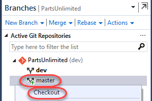

1. Right-click the **dev** branch and select **Push Branch**. This will share it with the server.

    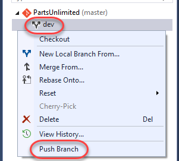

1. It may take a moment for the branch push to succeed.

    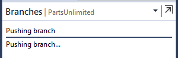

1. On Azure DevOps, switch to the **Branches** tab.

    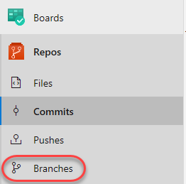

1. You should see the newly pushed **dev** branch.

    

1. Back in **Visual Studio**, expand **remotes/origin**. Here you can see all of the remote branches, including those that haven't been pulled down locally.

    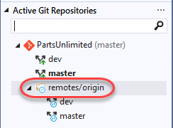

### Task 3: Deleting branches locally and remotely ###

1. When you created the **dev** branch earlier, Visual Studio switched you to it. You then manually switched back to **master**. Since you are not working on **dev** and no longer need it, right-click it and select **Delete**.

    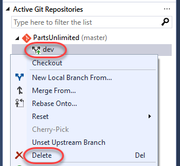

1. Note that while you have deleted the local **dev** branch, the remote branch still exists.

    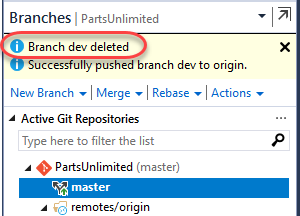

1. To delete the remote branch, right-click it under remotes/origin and select **Delete Branch From Remote**.

    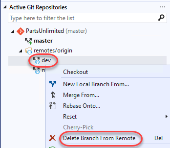

1. The remote branch should delete pretty quickly.

    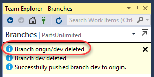

1. You can confirm that it's gone by refreshing the **Branches** page on Azure DevOps.

    

## Exercise 5: Managing branches from Azure DevOps ##

### Task 1: Creating a new branch ###

1. On Azure DevOps, click **New branch**.

    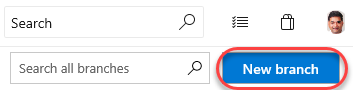

1. Enter a name of **"release"** for the new branch. Use the **Work items to link** dropdown to select one or more work items to link to this new branch. You may want to look up some by ID using the **Boards** page. Click **Create branch** to create it.

    

1. After the branch has been created, it will be available in the list.

    

1. Return to Visual Studio and use the **Team Explorer** dropdown to switch to the **Sync** view.

    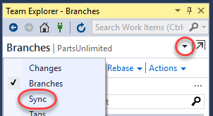

1. Click **Fetch** to pull down the new branch data.

    

1. Switch to the **Branches** view.

    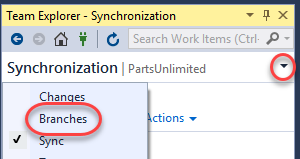

1. Now it's time to create a local version of that branch. Right-click it under **remotes/origin** and select **New Local Branch From**.

    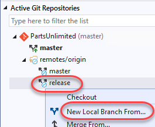

1. Accept the defaults and click **Create Branch**.

    

1. You now have a local version of that branch to work with and it has been checked out.

    

### Task 2: Deleting a branch ###

1. Return to Azure DevOps and click the **Delete** button that appears when you hover over the **release** branch to delete it.

    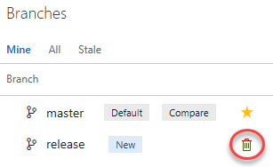

1. However, maybe we should keep it around for a little longer. From its context menu, select **Restore branch**.

    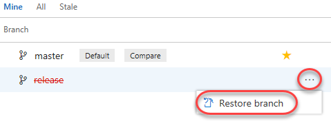

### Task 3: Locking a branch ###

Locking is ideal for preventing new changes that might conflict with an important merge or to place a branch into a read-only state. Alternatively, you can use branch policies and pull requests instead of locking if you just want to ensure that changes in a branch are reviewed before they are merged.

Locking does not prevent cloning of a repo or fetching updates made in the branch into your local repo. If you lock a branch, share with your team the reason why and make sure they know what to do to work with the branch after it is unlocked.

1. From the **master** context menu, select **Lock**.

    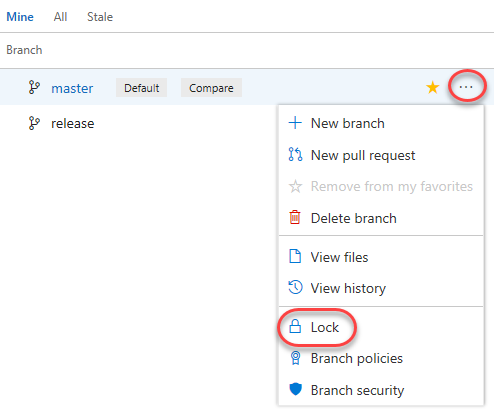

1. The branch is now locked.

    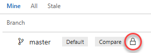

1. Now **Unlock** the branch using the same process.

    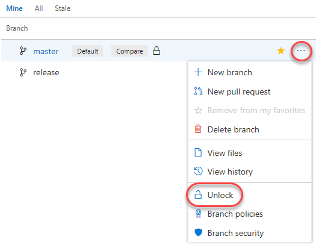

## Exercise 6: Working with pull requests ##

Pull requests let your team give feedback on changes in feature branches before merging the code into the master branch. Reviewers can step through the proposed changes, leave comments, and vote to approve or reject the code.

### Task 1: Creating a new pull request from Visual Studio ###

1. Return to Visual Studio and navigate to the **Changes** view of **Team Explorer**.

    

1. There is still a pending change from earlier in the lab, so enter a comment of **"Checkout controller changes"** and select **Commit All \| Commit All and Sync**.

    

1. Once that sync succeeds, navigate to the **Pull Requests** view.

    

1. Click **New Pull Request** to continue the process on Azure DevOps.

    

1. The **New Pull Request** form should already contain the key information reviewers will need, as well as who those reviewers should be. You can customize any of this, and some of it may be required based on policy. Click **Create**.

    

1. The newly created pull request will load, but don't approve it just yet. We'll come back later on.

    

### Task 2: Managing pull requests ###

1. Select the **Pull Requests** breadcrumb to view the pull requests you have either created or been assigned.

    

1. The new pull request will be in the **Mine** section. There may also be some others based on preconfigured data.

    

1. Select the **Active** tab to see those that are active and expecting attention. Click the new pull request to view it.

    

1. The **Overview** tab contains all of the key information specified in the creation form, as well as options to approve and complete the request.

    

1. Select the **Files** tab to review the files involved in the commit.

    

1. Note that you can select a specific update from the dropdown if you like.

    

1. Click the **Add comment** button next to the source file. Enter a comment using markdown and click **Comment** to save it. Note that there is a live preview of your comment before you commit to it.

    

1. The new comment is placed in line with the code. This makes it very easy to have discussions about lines and sections of code within their proper context.

    

1. The new comment is also tracked as part of the pull request. It's expected that every comment will be resolved before a pull request will be completed, so this convenient marker lets you know if there's anything else that needs to be reviewed.

    

1. Update the comment to mark it as **Resolved**.

    

1. Note that this now updates the tracking as well.

    

1. Select the **Updates** tab. This contains details on the updates in the branch.

    

1. Select the **Commits** tab, where you can review the commits made to the branch.

    

1. Since everything seems to be in order, **Approve** the pull request.

    

1. Since the approvers have signed off, **Complete** the pull request.

    

1. You can accept the default messages in the pull request dialog. Note that you also have the option to delete the target branch after merging, as well as the ability to squash changes during the marge. Squash merging is a merge option that allows you to condense the Git history of topic branches when you complete a pull request. Instead of each commit on the topic branch being added to the history of the default branch, a squash merge takes all the file changes and adds them to a single new commit on the default branch. Squash merging keeps your default branch histories clean and easy to follow without demanding any workflow changes on your team. Click Complete merge.

    

1. When the merge completes, the pull request should be marked as Completed.

    

1. Return to the Pull Requests home.

    

1. Select the **Completed** tab and click the pull request as though you were visiting it fresh.

    

1. You can review the pull request, as well as **Cherry-pick** or **Revert** it if needed.

    

### Task 3: Tagging a release ###

1. While it may not seem like much, the product team has decided that this version of the site is exactly what's needed for v1.1. In order to mark it as such, navigate to the **Tags** tab.

    

1. Click **Create Tag**.

    

1. Enter a name of **"v1.1"** and a Description of **"Great release!"**. Click **Create**.

    

1. You have now tagged the project at this release. You could tag commits for a variety of reasons, and Azure DevOps offers the flexibility to edit and delete them, as well as manage their permissions.

    

## Exercise 7: Managing repositories ##

You can create Git repos in team projects to manage your project's source code. Each Git repo has its own set of permissions and branches to isolate itself from other work in your project.

### Task 1: Creating a new repo from Azure DevOps ###

1. From the project **Add** dropdown, select **New repository**.

    

1. Set the **Repository name** to **"New Repo"** and click **Create**.

    

1. That's it. Your repo is ready. You can now clone it with Visual Studio or your tools of choice.

    

### Task 2: Deleting and renaming Git repos ###

1. Sometimes you'll have a need to rename or delete a repo, which is just as easy. Open **Project settings**.

    

1. Select **Repositories** under **Code**.

    

1. From the **New Repo** context menu, select **Delete repository**. Alternatively, you could rename it here.

    

1. Enter the name **"New Repo"** to confirm the repo and click **Delete**.

    

### Task 3: Managing repo and branch policies ###

1. Select the **PartsUnlimited** repo. Like everything else in Azure DevOps, you can manage security to a great level of detail. Select the **Options** tab. This allows you to set some useful policies, such as whether or not you want to allow users to fork the repo, whether discussed work items are automatically linked, and so on.

    

1. Select the **master** branch. Like the repo, you have a great deal of control over its security settings. You can also define a wide variety of policies for the branch to enforce. Click **Branch Policies**.

    

1. Azure DevOps branch policies are very effective in enforcing a level of quality control in the repo. For example, you can control pull requests by requiring a minimum number of reviewers, checking for linked work items, requiring that all comments have been resolved, and more. You can even require validation through a successful build and configure external approval services. If there are certain sections of code that require their own approvers to be included, you can include them here as well.

    

1. Check **Require a minimum number of reviewers**. By default, this requires at least two reviewers to approve a pull request, and also requires (by default) that the original author is not one of them.

    

1. Click **Add automatic reviewers**.

    

1. Add **Sachin** as a **Reviewer** and set the **Path filter** to **"/PartsUnlimited-aspnet45/src/PartsUnlimitedWebsite/Controllers/*"**. Having the requirement of **Required** ensures that you will be required to sign off on any changes proposed to the controllers code in the web app. Click **Save**.

    

1. Click Save changes to save the changes to the policy.

    

