

## Overview ##

GitHub has grown from being a fledgling source control provider into a formidable DevOps solution in just a few short years. Along with the portal experience, GitHub provides great integration for apps like Visual Studio to deliver a superior experience integrated within the environments developers spend their days in. In this lab, you'll learn about GitHub support in Visual Studio 2019.

If you'd like to learn more about the basics of Git, please check out [this lab](../git).

## Prerequisites ##

In order to complete this lab you will need the Azure DevOps Server 2019 virtual machine provided by Microsoft. Click the button below to launch the virtual machine on the Microsoft Hands-on-Labs portal.

<a href="https://labondemand.com/AuthenticatedLaunch/54149?providerId=4" class="launch-hol" role="button" target="_blank">Launch the virtual machine</a>

Alternatively, you can download the virtual machine from [here](../devopsvmdownload).

## Exercise 1: Getting Started with GitHub using Visual Studio 2019 ##

### Task 1: Setting up a GitHub project ###

1. Log in as **Sachin Raj (VSALM\Sachin)**. All user passwords are **P2ssw0rd**.

1. Install **Google Chrome** from [https://google.com/chrome](https://google.com/chrome). GitHub does not support Internet Explorer, so use Chrome for the remainder of this lab.

1. Fork the project at [https://github.com/Microsoft/PartsUnlimitedE2E](https://github.com/Microsoft/PartsUnlimitedE2E) into your own account.

    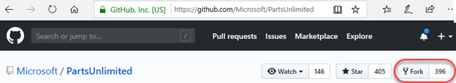

1. Select the **Settings** tab.

    

1. Enable **Issues** by checking its box.

    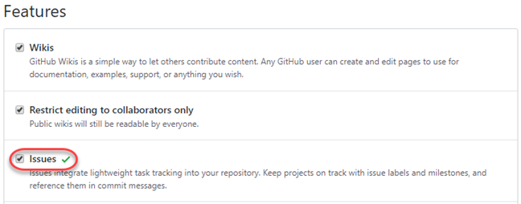

1. Select the **Issues** tab.

    

1. Click **New issue**.

    

1. Create a new issue called **"Update to v2.0"** and click **Submit new issue**. Fixing this issue will be the focus of this lab.

    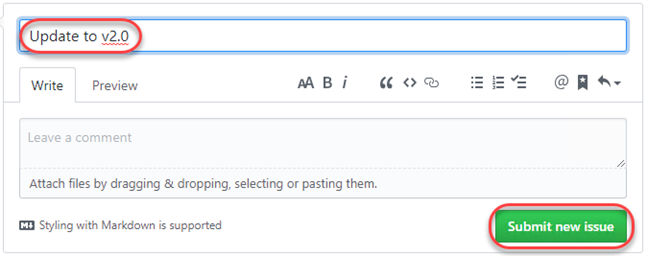

1. Note the ID of the newly created issue.

    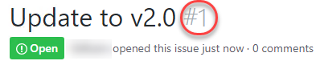

### Task 2: Cloning and configuring a GitHub project in Visual Studio ###

1. Open **Visual Studio**.

1. Click **Continue without code**. Note that you also have the option to start the cloning experience from the welcome dialog.

    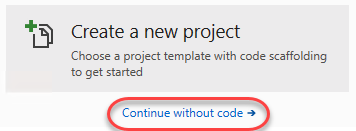

1. From **Team Explorer**, click the **Manage Connections** button.

    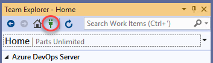

1. Under **GitHub**, click **Connect**. Complete the process to sign in to your GitHub account.

    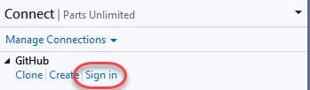

1. Click **Clone**.

    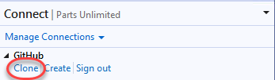

1. Select the project cloned earlier and click **Clone**.

    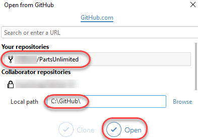

1. After logging in, **Team Explorer** lights up with a variety of shortcuts and features to make your experience with GitHub as seamless as possible. Many of the buttons are shortcuts to the GitHub portal page for this project, such as **Pulse**, **Graphs**, and **Wiki**. Click **Settings**.

    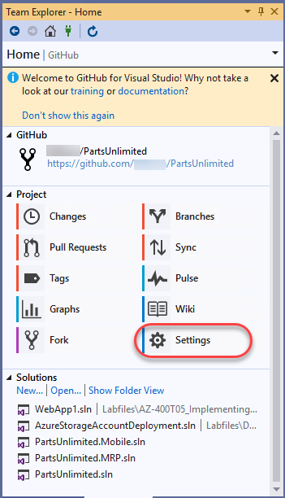

1. You can configure settings at two levels. Click **Global Settings** to review those first.

    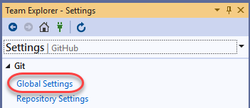

1. The **Global Settings** view provides a way for you to set global defaults that apply to all projects. In this case, the **User Name** and **Email Address** are already configured. However, you may want to change them for your instance. Click the **Back** button.

    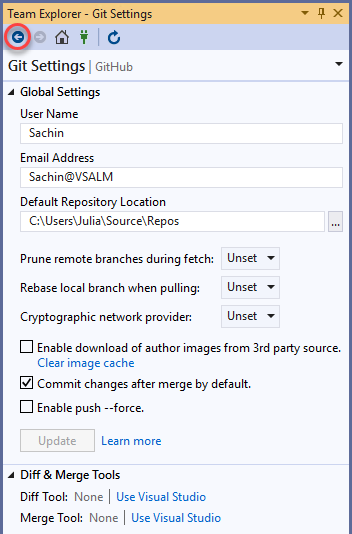

1. Click **Repository Settings**.

    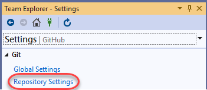

1. These settings are specific to the current project. Click the **Home** button.

    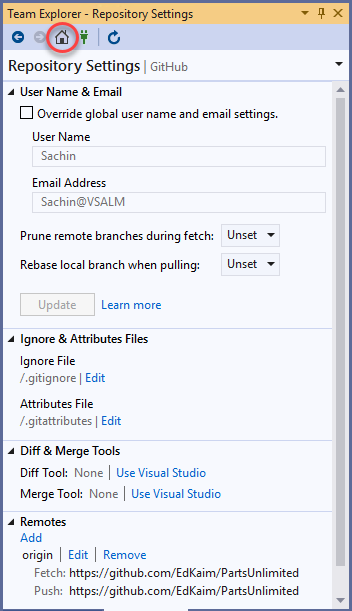

### Task 3: Exploring GitHub version control integration ###

1. To get started on the work item created earlier, click **Branches**. The work will be done on a separate branch and merged in after a review.

    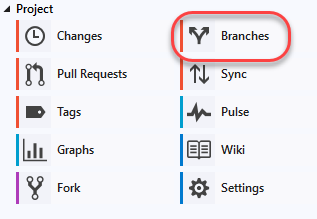

1. Right-click the **master** branch and select **New Local Branch From**.

    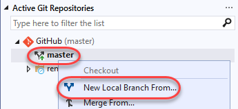

1. Set the name to **"dev"** and click **Create Branch**.

    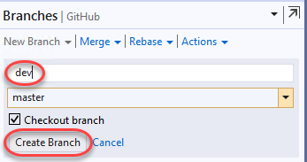

1. The new branch will be checked out after creation. Note that you can see the current branch and perform common options using the button at the bottom of the window.

    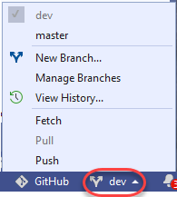

1. Right-click the **dev** branch and select **Push Branch**. This will push the locally created branch to the server.

    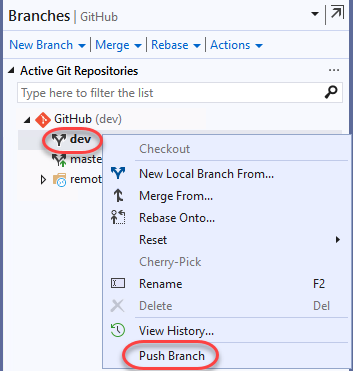

1. From **Solution Explorer**, search for **"_layout"** and open the **_Layout.cshtml** from the **PartsUnlimitedWebsite** project.

    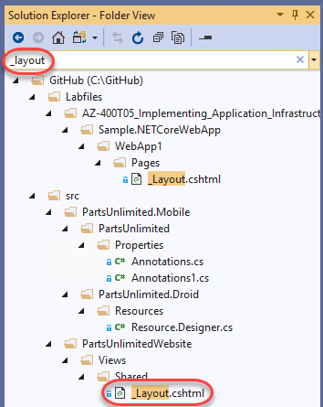

1. Add **"v2.0"** to the **h1** tag text and **Save** the file.

    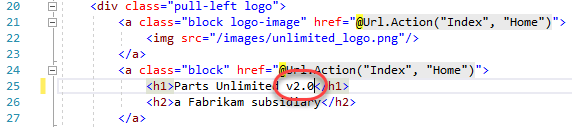

1. In **Team Explorer**, switch to **Changes**.

    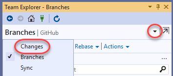

1. The source change made earlier will be shown here. Enter a commit message of **"Updated to v2.0"** and select **Commit All \| Commit All and Sync**. This will commit your change and push it to the server.

    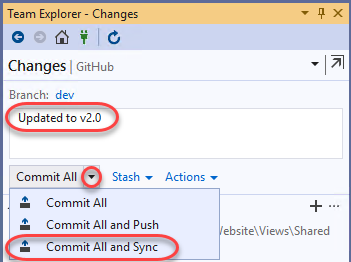

### Task 4: Exploring GitHub pull request integration ###

1. Although the **dev** branch has been updated with the necessary change, it still needs to work its way back in to the **master**. This can be done with a **pull request**. Click the **Home** button.

    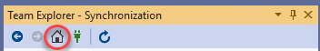

1. Click **Pull Requests** to start the pull request process.

    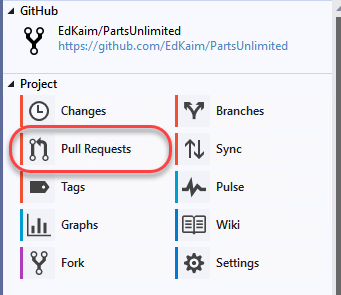

1. Click **Create New** to create a new pull request.

    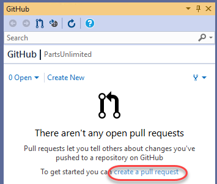

1. Set the branch to merge into to **master** from your project. Note that it will default to the Microsoft project, which you do not want to use. Set the comment to **"Fixes #1."**. Note that you may need to replace the #1 with the ID created earlier if it were different. By tagging the pull request with the issue ID, you can automate closing the issue later on when the request is merged. Click **Create pull request**.

    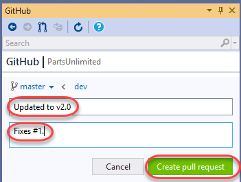

1. From the project dropdown, select the forked version in your GitHub account.

    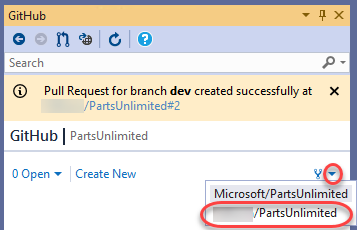

1. The newly created pull request will be visible. Double-click it to open.

    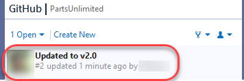

1. The pull request view includes all the information you need to review changes and make comments. Double-click **_Layout.cshtml** to open it in the diff viewer.

    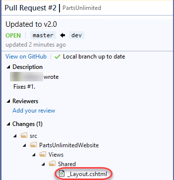

1. The diff viewer makes it easy to understand what changes were made and where.

    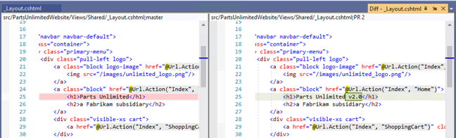

1. You can also leave line-level comments. Click the **Add Comment** button at the changed line and add a comment. Click **Start a review**.

    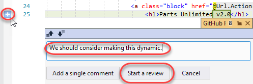

1. Your review is now visible as part of the pull request. Click **Continue your review**.

    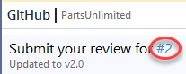

1. Enter a review summary and select **Submit review \| Comment only**.

    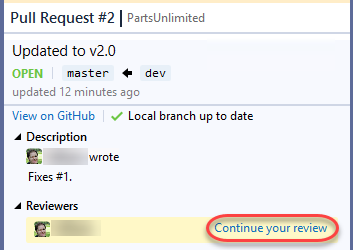

1. In the GitHub browser window, select the **Pull requests** tab.

    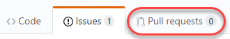

1. Click the pull request to open it.

    

1. All of the information added from Visual Studio is visible in the pull request. Others can comment or review the changes as well. Click **Resolve conversation** to resolve the comment left during your review.

    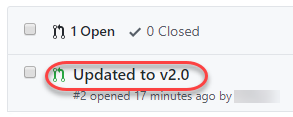

1. Click **Merge pull request**.

    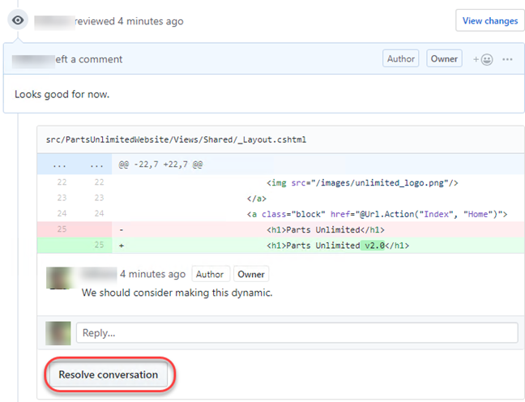

1. Confirm the merge.

    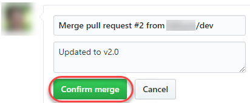

1. Navigate back to the **Issues** tab. Note that the issue created earlier has been closed now that the pull request was approved.

    

