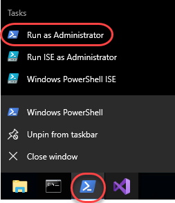
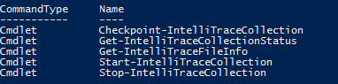
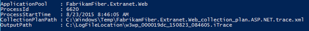
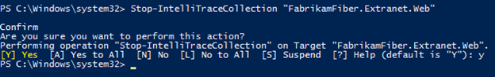
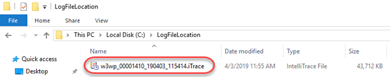
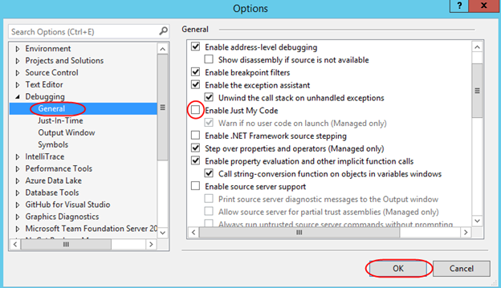

<div class="rw-ui-container"></div>

<a name="Overview"></a>
## Overview ##

IntelliTrace - first released in Visual Studio 2010 - changed the game for debugging by allowing developers to step "back in time" to see how an application got into its current state. By exposing events such as file and registry access, exceptions, and method calls, an IntelliTrace file can provide a detailed view into application behavior. In this lab, you will learn how Visual Studio 2019 extends the capabilities of IntelliTrace beyond the development and testing organizations by providing IT administrators with the ability to capture IntelliTrace files running from production servers. These files can then be analyzed by developers to help diagnose production issues.

<a name="Prerequisites"></a>
## Prerequisites ##

In order to complete this lab you will need the Azure DevOps Server 2019 virtual machine provided by Microsoft. Click the button below to launch the virtual machine on the Microsoft Hands-on-Labs portal.

<a href="https://labondemand.com/AuthenticatedLaunch/38300?providerId=4" class="launch-hol" role="button" target="_blank"><span class="lab-details">Launch the virtual machine</span></a>

Alternatively, you can download the virtual machine from [here](../devopsvmdownload).

<a name="About the Fabrikam Fiber Scenario"></a>
### About the Fabrikam Fiber Scenario ###

This set of hands-on-labs uses a fictional company, Fabrikam Fiber, as a backdrop to the scenarios you are learning about. Fabrikam Fiber provides cable television and related services to the United States. They are growing rapidly and have embraced Windows Azure to scale their customer-facing web site directly to end-users to allow them to self-service tickets and track technicians. They also use an on-premises ASP.NET MVC application for their customer service representatives to administer customer orders.

In this set of hands-on labs, you will take part in a number of scenarios that involve the development and testing team at Fabrikam Fiber. The team, which consists of 8-10 people has decided to use Visual Studio application lifecycle management tools to manage their source code, run their builds, test their web sites, and plan and track the project.

<a name="Exercise1"></a>
## Exercise 1: Using IntelliTrace in production ##

In this exercise, you will learn how to deploy and use IntelliTrace in production to capture trace information for an ASP.NET application.

<a name="Ex1Task1"></a>
### Task 1: Discovering a bug in production ###

1. Log in as **Sachin Raj (VSALM\Sachin)**. All user passwords are **P2ssw0rd**.

1. Launch **Internet Explorer** and click on the **FF Customer Portal** button in the favorites bar to load the customer portal for Fabrikam Fiber Support ([http://www.fabrikam.com](http://www.fabrikam.com/)).

    

1. Select a few of the service tickets from the **My Tickets** section of the page to view their details until you come across one that indicates that an error occurred retrieving data from the server. This information is ultimately pulled from a database, but there could be a number of reasons for the general error message itself.

    

1. Close **Internet Explorer**.

1. Typically, the first step in determining the root cause of an error like this would be to check logs and perhaps a stack trace for details. If that does not provide enough information, and the error is not easily reproduced in a development environment the development team may end up taking a long time to determine the root cause and fix the problem. Installing Visual Studio or other debugging tools in a production environment may not be an option.

<a name="Ex1Task2"></a>
### Task 2: Setting up IntelliTrace data collection in production ###

1. Now let's look at how to deploy and use IntelliTrace in a production environment to collect historical debugging data. Open a Windows Explorer window and navigate to the root of the C: drive. Note that there are two folders here that were created ahead of time for our use in this lab, **c:\IntelliTrace** is where the standalone IntelliTrace files are placed and **c:\LogFileLocation** is where the IntelliTrace files will be written to later on in this lab.

    

1. In the **Explorer** window, right-click on the **LogFileLocation** folder and select **Properties** to open the **Properties** window. We need to make sure that the IIS application pool has permission to use the **LogFileLocation** folder.

1. Select the **Security** tab and then scroll down the existing list of groups and user names to find **IIS_IUSRS.** Permissions were added ahead of time in this VM, but in a production environment, you would need to make sure to perform this step yourself.

    

1. Press **Esc** to close the Properties window.

1. IntelliTrace can be deployed to a production environment simply by performing an xcopy of the contents found in the **IntelliTrace Collector for Visual Studio 2019** package.

    > **Note:** You can find the **IntelliTraceCollection.cab** package within your installation of Visual Studio Enterprise 2019 at **%programfiles(x86)%\Microsoft Visual Studio\2019\Enterprise\Common7\IDE\CommonExtensions\Microsoft\IntelliTrace**. Additional setup instructions, which were performed ahead of time on the virtual machine can be found [here](https://msdn.microsoft.com/en-us/library/vstudio/hh398365%28v=vs.140%29.aspx) on MSDN.

    

    > **Note:** For the purpose of this lab, the production system is the same as our development system, but that will not normally be the case.

<a name="Ex1Task3"></a>
### Task 3: Initiating IntelliTrace collection and repro ###

1. Now we will start IntelliTrace so that we can gather some diagnostic data from the web application. You have two options here, you can follow steps **2** through **17** or you can run the **StartIntelliTraceDemo.cmd** file found within the **Scripts** folder on the **Desktop** (run as administrator) and skip ahead to step **18**.

1. Open a **PowerShell** window from the taskbar by right-clicking its icon and selecting **Run as Administrator**.

    

1. Type the following command to import the IntelliTrace PowerShell module:

    ```
    Import-Module c:\IntelliTrace\Microsoft.VisualStudio.IntelliTrace.PowerShell.dll
    ```
1. To see the commands provided by IntelliTrace use the following PowerShell command:

    ```
    Get-Command *IntelliTrace*
    ```
    

    > **Note:** Commands are provided to start and stop an IntelliTrace collection as well as to make checkpoints during collection.

1. To get help for any of the PowerShell IntelliTrace commands, type something like the following:

    ```
    Get-Help Start-IntelliTraceCollection
    ```
    > **Note:** You may be prompted to download and install the help files, so if you don't want to wait for this to complete simply skip this step and move on.

    

    > **Note:** The REMARKS section from the help listing describes how you can get more detailed examples of command usage.

1. We are now ready to start IntelliTrace collection. Type the following PowerShell command on a single line to start collecting data from the _FabrikamFiber.Extranet.Web IIS_ application pool and store the resulting .iTrace log files in the folder we previously created.

    ```
    Start-IntelliTraceCollection "FabrikamFiber.Extranet.Web" c:\IntelliTrace\collection_plan.ASP.NET.trace.xml c:\LogFileLocation
    ```
    > **Note:** You can hand-edit the collection plan file if you want to make changes.

1. When asked to confirm, type "**Y**" and then press the **Enter** key to continue.

    

    > **Note:** If you see an error related to the app pool not having a writable user environment key, go ahead and try the same command again to start the collection.

1. Launch **Internet Explorer** and click on the **FF Customer Portal** button in the favorites bar to load [http://www.fabrikam.com](http://www.fabrikam.com/).

1. IntelliTrace is now set up to gather the debugging data specified in the collection plan configuration file. Select the service tickets to reproduce the error that we saw before. As soon as you see the error, close **Internet Explorer**.

    

1. Now we will stop the IntelliTrace collection to return the production server into its normal state. You have two options here; you can follow steps **11** through **13** or you can run the _StopIntelliTraceDemo.cmd_ file found within the **Scripts** folder on the **Desktop** (run as administrator) and skip ahead to step **14**.

1. Return to the PowerShell window and type the following command to get the current collection status.

    ```
    Get-IntelliTraceCollectionStatus -ApplicationPool "FabrikamFiber.Extranet.Web"
    ```
    

1. Type the following command to stop gathering IntelliTrace data for the _FabrikamFiber.Extranet.Web_ application pool. Confirm the action when prompted.

    ```
    Stop-IntelliTraceCollection "FabrikamFiber.Extranet.Web"
    ```
    > **Note:** As an alternative to stopping an IntelliTrace collection, it is also possible to get a copy of the current log by using the Checkpoint-IntelliTraceCollection command. This allows you to look at the data you have captured so far while continuing to collect additional data.

1. When asked to confirm, type "**Y**" and then press the **Enter** key to continue.

    

1. In a real-world scenario, it is at this point that the IntelliTrace file would be sent to a developer or tester for a more detailed look.

<a name="Ex1Task4"></a>
### Task 4: Debugging with IntelliTrace files from production ###

In this task, you will see how we can use the IntelliTrace file that was generated on a production server to aid in debugging the error that we saw in the previous exercise.

1. Returning to our scenario, let's assume that we have already taken this IntelliTrace file and transferred it to a development machine that has **Visual Studio Enterprise 2019** installed. **Double-click** the IntelliTrace file from **C:\LogFileLocation** and choose to load it in **Visual Studio**.

    

1. After opening the **IntelliTrace Summary** window, locate the **Exception Data** section. Here you can see a grid showing all exceptions that occurred. By default, they are sorted by most recent event time to the oldest.

    

1. Since this IntelliTrace session isn't associated with an active solution, you'll need to temporarily disable the **Just My Code** feature to get the full experience. From the main menu select **Tools \| Options**.

1. In the left tree view, locate **Debugging \| General** and uncheck the **Enable Just My Code** option in the right panel. Click **OK** to apply.

    

1. Select the last **System.NullReferenceException** found in the list (technically the first one that was thrown) and then select the **Debug Newest Exception in Group** button to start an IntelliTrace debugging session.

    

1. After the IntelliTrace file loads, you will see that you are in Historical Debugging mode where you can examine the historical state of Locals, Call Stack, and events collected during IntelliTrace session. You can rearrange the windows within the IDE to get a better view of the code (**ServiceTicketsController.cs**) and code map (**CallStack1.dgml**) side by side.

    

1. In the **Locals** window, note that there was a **NullReferenceException** event in the **GetServiceTicket** controller method, and that this was associated with **ticketId** value **3**. At this point we could file a bug in Azure DevOps Server and attach the IntelliTrace file to help the development team make the appropriate fix.

    

1. There is also a diagnostic session data window open in the right-hand tab group (.**diagsession**). Select it to activate it.

    

1. All of the recorded diagnostic events are shown here. The one that we are currently viewing is the **NullReferenceException** when it was first thrown. This view can help us put the error into context with other events that were occurring just prior to the exception. For example, perhaps there was a problem with the SQL query that was used. In that scenario we could get the query that was used simply by viewing the previous event.

    

