

## Overview ##

In this lab, you will learn about the release management features available in Azure DevOps Server 2019 and its suite of release and deployment tools that automate the deployment of applications across the desktop, server, and the cloud. Development teams can also model their release processes, visualize their release status, and track approvals and sign-offs.

## Prerequisites ##

In order to complete this lab you will need the Azure DevOps Server 2019 virtual machine provided by Microsoft. Click the button below to launch the virtual machine on the Microsoft Hands-on-Labs portal.

<a href="https://labondemand.com/AuthenticatedLaunch/38301?providerId=4" class="launch-hol" role="button" target="_blank">Launch the virtual machine</a>

Alternatively, you can download the virtual machine from [here](../devopsvmdownload).

This lab requires an Azure account. You can sign up for a free trial at [https://azure.microsoft.com/en-us/free/](https://azure.microsoft.com/en-us/free/). You will also need to create an Azure service principal, which you can set up following the instructions [here](../azureserviceprincipal).

## Exercise 1: Continuous Release Management ##

In this exercise, you will use the release management features of Azure DevOps Server to produce an automated deployment solution. This exercise will take an existing enterprise application and automate its deployment to the development team's testing environment after each source check-in.

### Task 1: Invoking a build ###

This task will create a build as a starting point for a continuous release. If you already completed the [build lab](https://www.azuredevopslabs.com/labs/devopsserver/build/), you can skip to the next task.

1. Log in as **Sachin Raj (VSALM\Sachin)**. All user passwords are **P2ssw0rd**.

1. Launch **Internet Explorer** from the taskbar and click **PU DevOps Portal** from the favorites bar at the top.

    

1. Select **Pipelines**.

    

1. Click **Queue** to invoke a build manually.

    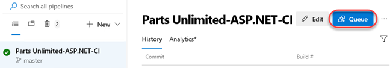

1. Select the build to follow its progress through to completion.

    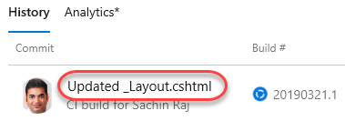

   > If the build pipline fails with `Error: The location of 'vstest.console.exe' specified does not exist.`, edit the pipeline and select **Test Assemblies** task. Select **Specific location** for test platform and enter the path to **vstest.console.exe** as  **“C:\Program Files (x86)\Microsoft Visual Studio\2019\Enterprise\Common7\IDE\Extensions\TestPlatform\vstest.console.exe”** and queue the build again.
    
    
      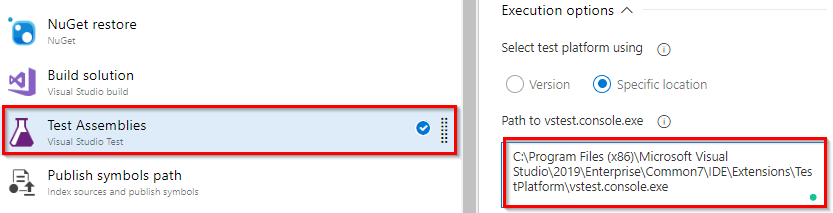

### Task 2: Creating a continuous release pipeline ###

1. Once the build has completed, click **Release** to create a release pipeline. Note that you can also create a release pipeline from scratch, but this option will preconfigure the release pipeline to use this build pipeline's output.

    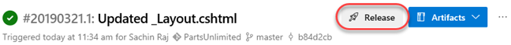

1. There are many release pipeline templates available out of the box for common deployment scenarios. To start off with, we will create a stage in the release pipeline that deploys the application to the IIS instance running on the VM. Select the **IIS website deployment** template and click **Apply**. This will provide the tasks required to deploy to IIS.

    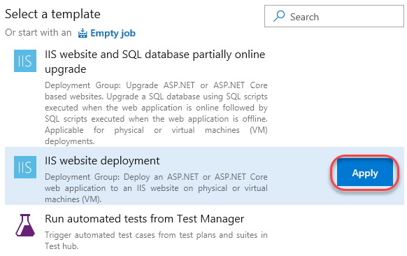

1. Set the **Stage name** to **"Local IIS"**.

    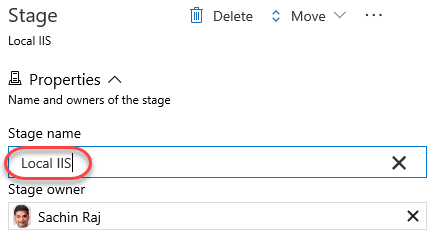

1. Since this release was created based on a successful build, the artifact details have been preconfigured. Click the **continuous deployment trigger** button on the **Artifacts** box to see that continuous deployment has been enabled so that every new build will invoke this release pipeline. And since the build pipeline is triggered by a master branch commit, any change from a developer can result in the site being updated with minimal overhead.

    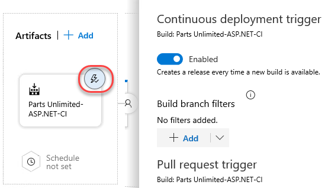

1. Select **1 job, 2 tasks** under the **Local IIS** stage.

    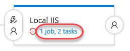

1. The site we want to deploy to is hosted on the local IIS machine, so update the **Website name** to **"PartsUnlimited"**. Also clear the **Add binding** box since the bindings have already been configured.

    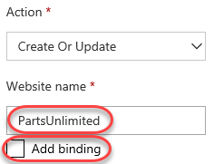

1. Select the **IIS Deployment** job definition. In order to deploy, we will need to define a **deployment group**. Click the **Settings** button to open this configuration in a new browser tab.

    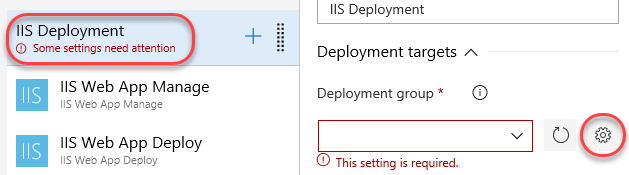

1. Click **Add a deployment group**.

    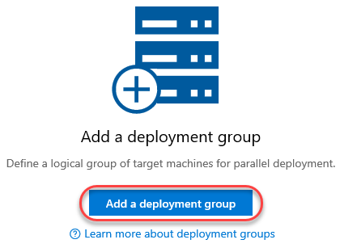

1. Set the **Deployment group name** to **"Local IIS"** and click **Create**.

    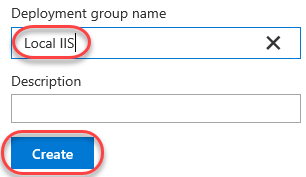

1. The provided PowerShell script will do everything you need to download, install, and configure the local machine as a deployment agent for this group. Click **Copy script to the clipboard**.

    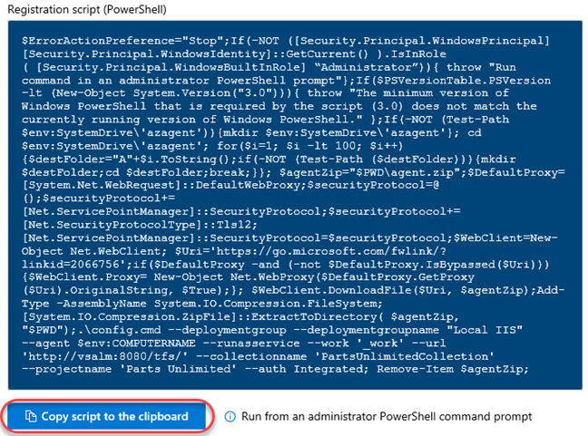

1. From the taskbar, right-click **PowerShell** and select **Run as Administrator**.

    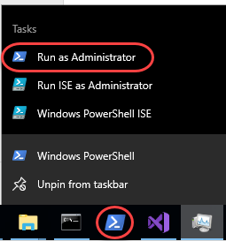

1. Execute the script from the clipboard. Don't forget to click **Enter** after pasting it.

    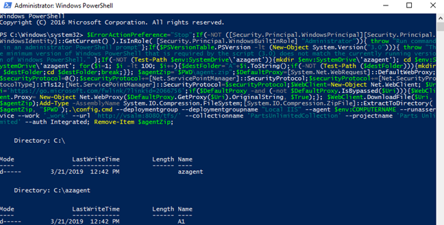

1. Accept the default options along the way. This will configure the agent to run as a service under the System account.

    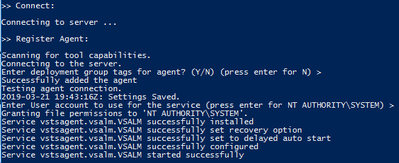

1. Close the deployment groups browser tab.

1. Return to the release pipeline and **Refresh** the deployment groups. Select **Local IIS**.

    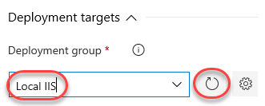

1. Select **IIS Web App Manage**. This is the first task in the job that defines properties such as the local path to deploy to. Update it to **"%SystemDrive%\inetpub\PartsUnlimited"**.

    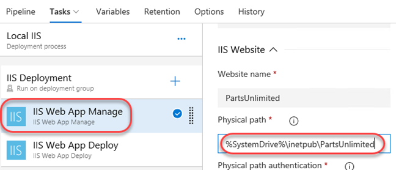

1. Select the **IIS Web App Deploy** tab. This task actually deploys the site.

    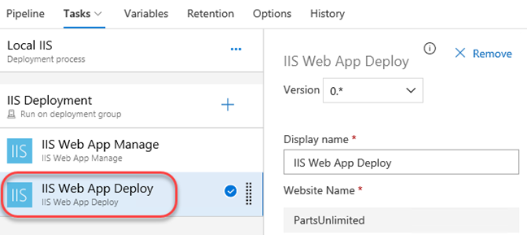

1. Select the **Variables** tab. This enables you to define pipeline-wide variables that can be managed centrally.

    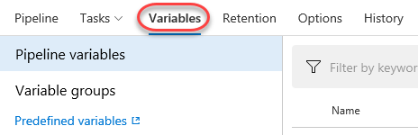

1. The **Retention** tab defines the policies for retaining releases.

    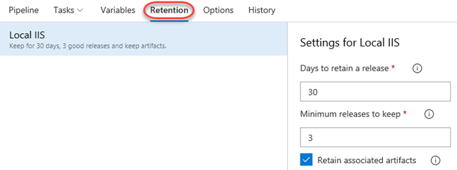

1. The **Options** tab allows you to specify things like how releases are named.

    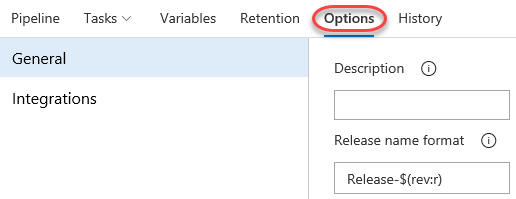

1. The **History** tab lists release history.

    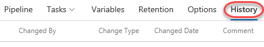

1. Click **Save** and confirm.

    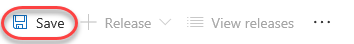

### Task 3: Invoking a manual release ###

1. From the **Release** dropdown, select **Create a release**.

    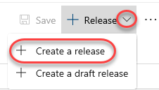

1. You have the option to override the behavior of the pipeline, which we won't do now. Click **Create** to begin the release using the latest build.

    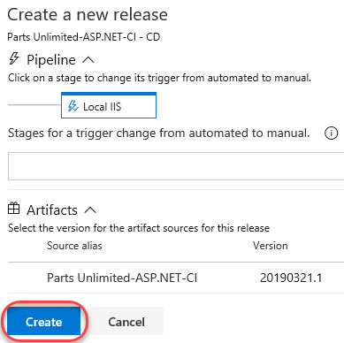

1. Click the new release to view it.

    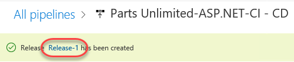

1. You can visualize the release through the pipeline using the same kind of view. Click **In progress**.

    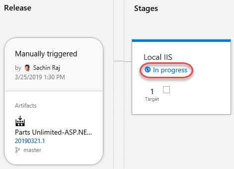

1. The release should complete pretty quickly since it's just a local deployment to IIS. Click the progress chart whether it's done or not.

    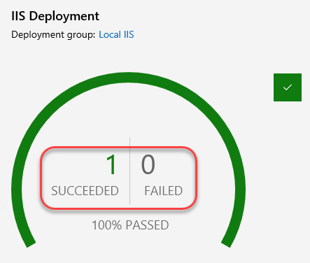

1. You can walk through each of the tasks to see the logs for what occurred.

    

1. Open a new browser tab and click the **Parts Unlimited** site shortcut. If you made a visible change to the site, it should be apparent here.

    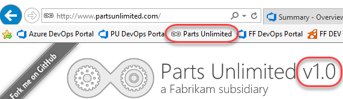

1. Return to the release browser tab. Right-click **Repos** and select **Open in new tab**.

    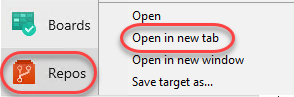

1. Navigate to **PartsUnlimited-aspnet45/src/PartsUnlimitedWebsite/Views/Shared/_Layout.cshtml**.

    

1. Click **Edit**.

    

1. Make a cosmetic change by appending **"v2.0"** to the **h1** tag. Click **Commit** and confirm.

    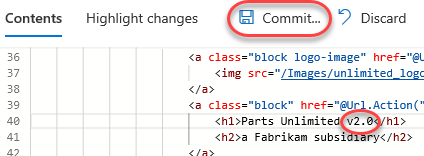

1. Return to the release browser tab and click **Builds**.

    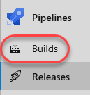

1. Click the newly launched build to follow it.

    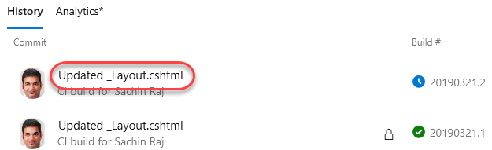

1. Wait for the build to complete.

    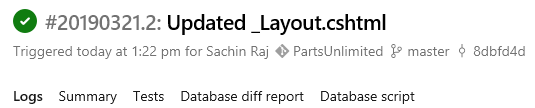

1. Navigate to the **Releases** view.

    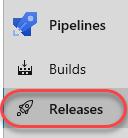

1. There should be a new release invoked by the completed build. Click it to open.

    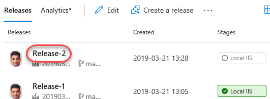

1. Like before, the release should quickly make its way through the pipeline and deploy to the local IIS.

    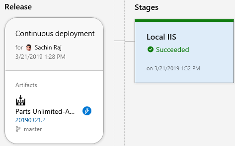

1. Refresh the tab open to the Parts Unlimited site and note that the v2.0 is now visible.

    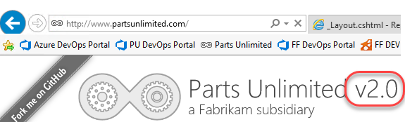

## Exercise 3: Releasing to Azure ##

The release management tools are incredibly flexible. Not only can you automate virtually anything, you can even leverage some of the higher-lever tasks to easily perform complex processes, such as deploying to an Azure web site.

### Task 1: Setting up Azure resources ###

1. Install **Chrome**. The Azure portal does not support Internet Explorer.

1. Open a new Chrome instance to your Azure portal at [https://portal.azure.com](https://portal.azure.com/).

1. Select **Create a resource** and search for **"web sql"**.

    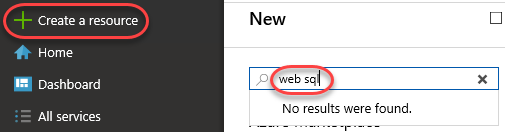

1. Select the **Web App + SQL** template.

    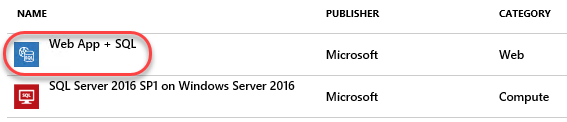

1. Click **Create**.

    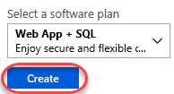

1. Set a unique name for the **App name**. For example, you may want to append your name, such as **"pul-johndoe"**. Select the option to create a new resource group with the same name.

    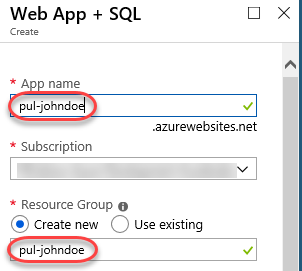

1. Opt to create a new **App Service plan** for this project.

    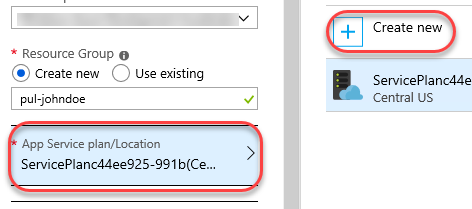

1. Set the **App Service plan** name to **"pul"** and click **OK**.

    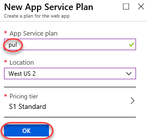

1. Click the **SQL Database** option to define it.

    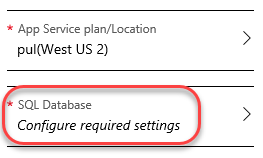

1. Click **Create a new database**.

    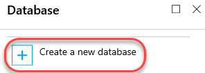

1. Set the **Name** of the database and click **Target server**, opting to **Create a new server**.

    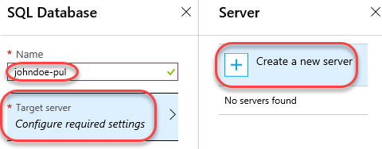

1. Set the **Server name** to something globally unique (like before) and provide **Server admin login** credentials. For example, **sysadmin** and **P2ssw0rd** were allowed at the time of drafting this lab.

    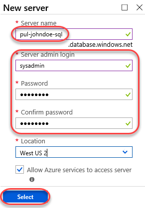

1. Click **Select** to confirm the settings.

    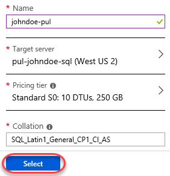

1. Click **Create** to create the service. This will take a while, so move forward to the next step.

    

### Task 2: Adding a gated Azure deployment to the release pipeline ###

1. Return to the release pipeline browser tab and select the dropdown option to **Edit pipeline**.

    

1. From the **Local IIS** stage, select **Add** to add a new stage.

    

1. Select the **Azure App Service deployment** template and click **Apply**.

    

1. Set the **Stage name** to **"Azure Production"**.

    

1. Click the **Post-deployment conditions** button on the **Local IIS** stage.

    

1. Post-deployment conditions are policies you can enforce before considering a release stage to have succeeded. **Enable** the **Gates** condition. This will allow you to define automated quality gates that must be satisfied before the release can continue.

    

1. Set **The delay before evaluation** to **"0"**. This delay is useful if the release needs time to warm up, but isn't relevant to our scenario where we will query the work items.

    

1. Select **Add \| Query Work Items**.

    

1. Select the **Shared Queries \| Critical Bugs** query. The release will be held up until this query returns zero results.

    

1. Set **The time between re-evaluation of gates** to **"5"** minutes.

    

1. Click the **Pre-deployment conditions** button on the **Azure Production** stage. This is similar to the post-deployment conditions from earlier, except that they need to be satisfied before a deployment can occur.

    

1. **Enable** the **Pre-deployment approvals** and select **Sachin** as the **Approver**.

    

1. Click **1 job, 1 task** from the **Azure Production** stage.

    

1. Set the **Azure subscription** to the Azure RM subscription connection created as a prerequisite. Once it loads, select the **App service name** created earlier.

    

1. Click **Save** to save the pipeline.

    

### Task 3: Invoking a continuous delivery to Azure ###

1. Return to the code browser tab and update the site version copy to **"v3.0"** using the same process as before and commit.

1. Use the process from earlier to follow the build pipeline through to completion.

1. Open the new release invoked after the build pipeline completes.

    

1. Click **Processing gates**.

    

1. The first evaluation should fail since there are currently critical bugs logged.

    

1. Navigate to **Boards \| Queries** in a new tab.

    

1. From the **All** tab, select **Shared Queries \| Critical Bugs**.

    

1. Double-click the bug to open it.

    

1. We will assume that this release has fixed this bug. Set its **State** to **Done** and click **Save**.

    

1. Close the work items browser tab.

1. Return to the release in progress and select **Pipeline**.

    

1. It may take a few minutes for the post-deployment gate to run its validation depending on how much time was remaining between checks when you closed the bug. Once it has cleared, you will be asked to approve the deployment to Azure as part of the pre-deployment conditions for that stage. Click **Approve**.

    

1. Confirm the **Approve**.

    

1. Click **View logs** to follow the deployment to Azure.

    

1. The **Run on agent** job will include the tasks required to push the deployment. Click the **Deploy Azure App Service** to see the details.

    

1. Follow the deployment through to completion.

    

### Task 4: Reviewing an Azure deployment ###

1. In your Azure account at [https://portal.azure.com](https://portal.azure.com/), search for **"pul"** and select the **App Service** created earlier. While the deployment has succeeded, there is one application setting that must be configured before the app will run properly.

    

1. Select **Application settings**.

    

1. When the app was deployed with SQL, Azure automatically inserted the proper connection string into the application settings. However, the name of the default string is slightly different from the one the application will look for. Change the **Connection String Name** of the one connection string to **"DefaultConnectionString"** and **Save**.

    

1. Navigate to the **Overview** tab. Click the **URL** to open the URL to the public site in a new tab.

    

1. The site should load from Azure with the v3.0 version expected. You now have continuous deployment to Azure.

    

