

## Overview ##

In this lab, you'll learn about the wiki feature of Azure DevOps Server 2019 that enables easier collaboration experiences for development teams. Each project in Azure DevOps now supports its own wiki, which enables you to conveniently write pages that help your team members and other users understand, use, and contribute to your project.

## Prerequisites ##

In order to complete this lab you will need the Azure DevOps Server 2019 virtual machine provided by Microsoft. Click the button below to launch the virtual machine on the Microsoft Hands-on-Labs portal.

<a href="https://labondemand.com/AuthenticatedLaunch/38296?providerId=4" class="launch-hol" role="button" target="_blank">Launch the virtual machine</a>

Alternatively, you can download the virtual machine from [here](../devopsvmdownload).

## Exercise 1: Wiki collaboration with Azure DevOps Server 2019 ##

### Task 1: Creating and editing a project wiki ###

1. Log in as **Sachin Raj (VSALM\Sachin)**. All user passwords are **P2ssw0rd**.

1. Launch **Internet Explorer** from the taskbar.

1. Click the **PU DevOps Portal** shortcut to navigate to the PartsUnlimited DevOps portal.

    

1. Use the navigation to get to the **Wiki** hub.

    

1. Since this project does not yet have its wiki configured, click **Create Wiki** to set one up. When you create your first wiki, Azure DevOps will provision a git repository that will store all your pages and artifacts.

    

1. Enter **"Home"** as the title of the first wiki page. Enter some body content, such as **"Welcome to *our* project!"**. Azure DevOps wikis support Markdown, and you can learn more [here](https://docs.microsoft.com/en-us/vsts/collaborate/markdown-guidance). Click **Save**.

    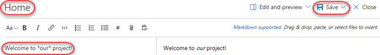

1. Click **Close** to exit the edit experience.

    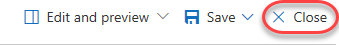

1. Your first wiki page is now available for everyone to see.

    

1. By default, all members of the **Contributors** group can edit README files and wiki pages. **Stakeholders** can read files and revisions, but cannot edit anything. Select **More \| Wiki security** to review permissions.

    

1. Since the wiki is stored as a Git repo, the permissions are set against the repo and passed through the user experience. Close the dialog when satisfied.

    

1. Locate the **Pages** panel on the right side of the window. It lists all of your wiki pages, which is just the one at this time. You can easily add and manage pages here. From the dropdown menu for the **Home** page, select **Add sub-page**.

    

1. Set the title of this new page to **"Getting started"** and type some body content.

    

1. This time, click the **Save** dropdown button to specify a comment. Enter **"Added stub for instructions"** and click **Save**.

    

1. Close the editor view.

    

1. Now add a sub-page to the **Getting started** page.

    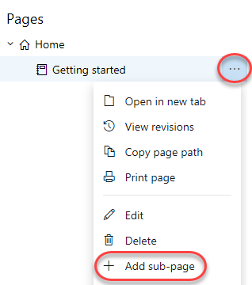

1. Set the title for this page to be **"Development environment"**. Add a list of system requirements that includes **Windows Server 2016**, **Team Foundation Server 2018**, and **Visual Studio 2019** using the markdown list format as shown below. Click **Save**.

    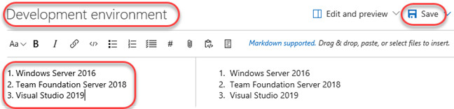

1. Click **Close** to exit the editing view.

    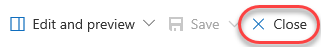

1. Click **Edit page** to make a quick update.

    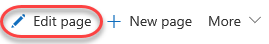

1. Change the reference from TFS 2018 to **Azure DevOps Server 2019**.

    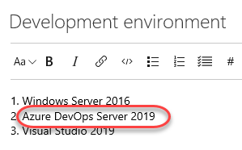

1. Use the **Save** dropdown to provide a more descriptive commit message explaining the change and click **Save**. Then **Close** the edit view.

    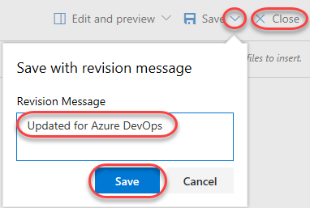

1. Click **Revisions** to see a list of changes committed for this page.

    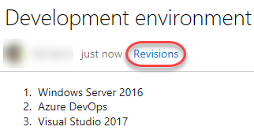

1. Click the most recent revision.

    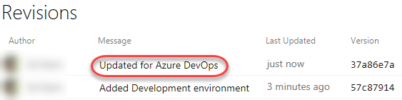

1. Azure DevOps provides a diff view so that you can easily see what was changed. You also have the option to revert to this version with a single button click.

    

1. Return to this wiki's home using the breadcrumb navigation at the top.

    

1. You can easily rearrange the order of the pages using the tree view on the right. Drag the **Getting started** page slightly up until a green line appears under the **Home** page. This indicates that you want to make these pages peers.

    

1. Since the page is being re-parented, you'll need to confirm the move. This kind of move will break links you will have manually added to other pages (none at this point), so you'll need to decide if you want to check for affected links by clicking **Check affected links**.

    

1. In this case there are no links, so click **Move**.

    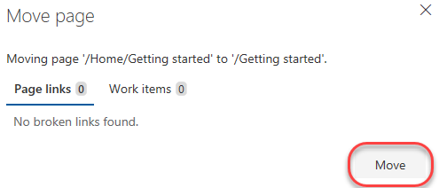

1. Sometimes wikis can get pretty big, so it's important to be able to find specific pages. Type **"env"** to filter the pages down to just those whose titles include that text.

    

1. Wiki pages are also indexed to show up in search results. Use the search bar in the top right corner to search for **"Azure"**.

    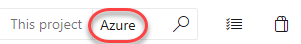

1. The wiki page you just updated should appear as one of the results. Click it.

    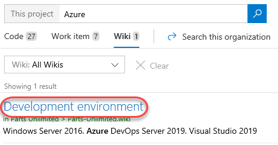

1. Now anyone working on the project can easily find wiki content alongside code and work item results.

    

### Task 2: Publishing code as wiki ###

1. Content that you already maintain in a Git repository can be published to a wiki. For example, content written to support a software development kit (SDK), product documentation, or README files can quickly be published to a wiki. Multiple wikis can be published within a single team project. To get started, navigate to the **Repos** hub.

    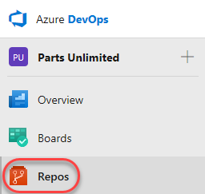

1. Create a **New repository**.

    

1. Set the new **Repository name** to **"Docs"** and check the **Add a README** option. Click **Create**.

    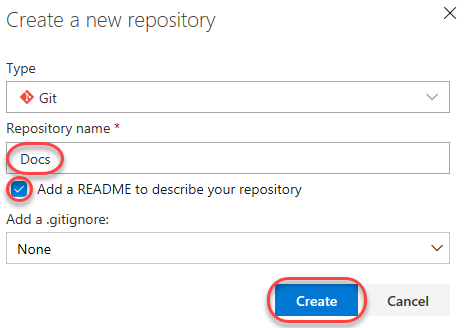

1. From the **README.md** dropdown, select **Rename**. We will reuse this file for the wiki itself.

    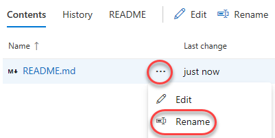

1. Change the name to **"Our-team.md"**. Note that the wiki engine will use the name of the file as a title of the article and automatically replaces dashes with spaces. Click **Commit**.

    

1. From the **Our-team.md** dropdown. Select **Edit**.

    

1. Add some markdown to the file and **Commit** the changes. Confirm the commit when prompted.

    

1. Now that we have a file in place, let's publish our code as wiki. From the **Overview** navigation, right-click **Wiki** and select **Open in new tab**. The next few steps will involve making changes and reviewing the results, so it will be easier to have a browser tab open to each.

    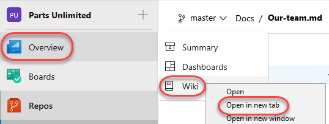

1. From the wiki dropdown, select **Publish code as wiki**. Note that this dropdown will enable you to unpublish a wiki later on.

    

1. Ensure **Docs** is the selected wiki. Note that you also have the option to select a specific branch if you prefer. In this case, leave it to **master**. Click the **Browse** button to select a **Folder**.

    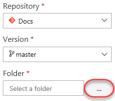

1. Select the root of the repo and click **OK**.

    

1. Set the **Wiki name** to **"Documentation"** and click **Publish**.

    

1. You should now see the markdown file you edited earlier as the landing page of the wiki.

    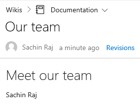

1. Note that you can also publish different versions of a wiki, as well as specify the version you would like to view.

    

### Task 3: Editing wiki in a repo ###

1. You can edit the repo however you like, whether it's using Visual Studio or any other Git-compatible tools. You can also continue to edit the wiki in the browser, which we will do in this lab. Return to the tab open to the wiki repo.

1. From the dropdown for the **Docs** repo root, select **New \| Folder**.

    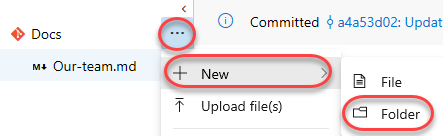

1. Enter a **New folder name** of **"Upcoming-events"** and a **New file name** of **"January-events.md"**. Note that the same naming convention is used for folders. Click **Create**.

    

1. Add some markdown to the January events page and **Commit** the changes. Confirm the commit.

    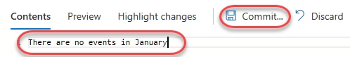

1. Return to the tab open to the wiki browser and refresh the page.

1. There is now a folder for "Upcoming events" and a page for "January events".

    

1. Expand the dropdown menu for **January events**. Note that it provides an option to **Edit in Repos**, which will bring you to the same edit page we have open in the other tab.

    

1. Return to the tab open to the wiki repo.

1. From the **Upcoming-events** dropdown, select **New \| File**.

    

1. Name this file **February-events.md** and click **Create**.

    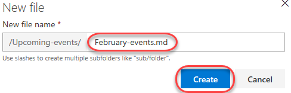

1. Add some markdown to the February events page and **Commit** the changes. Confirm the commit.

    

1. Return to the tab open to the wiki browser and refresh the page.

1. Note that the pages are orders alphabetically by default. If you would like to set a specific order, you may do so using a **.order** file.

    

1. Return to the tab open to the wiki repo.

1. Add a new file to the **Upcoming-events** folder as before.

    

1. Name this file **".order"** and click **Create**.

    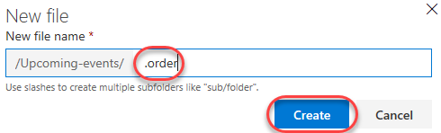

1. Put the names of the files without their extensions in the order you want them to be displayed. In this case, put **January-events** before **February-events**. Commit the file and confirm.

    

1. Return to the browser tab with the wiki viewer and refresh the page. The articles will now be ordered as defined in the .order file.

    

