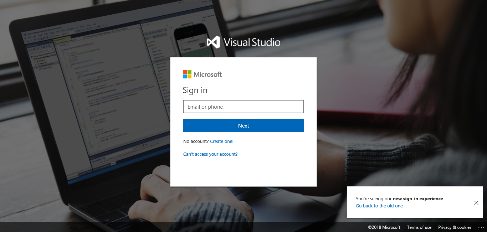
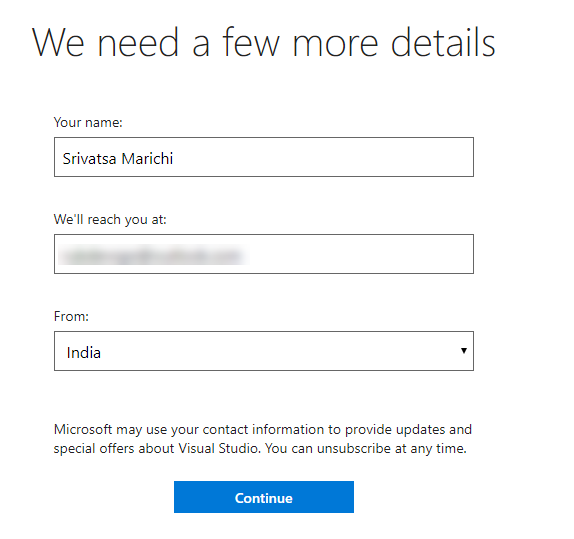
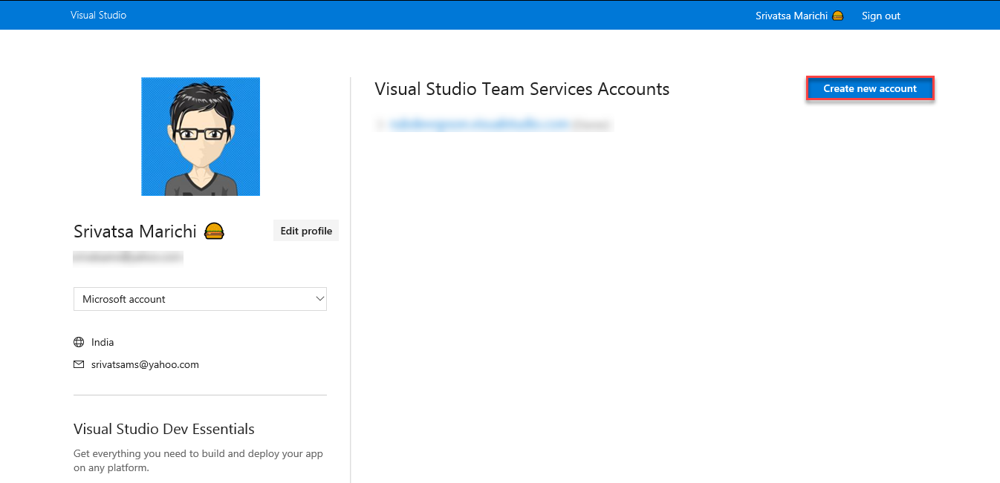
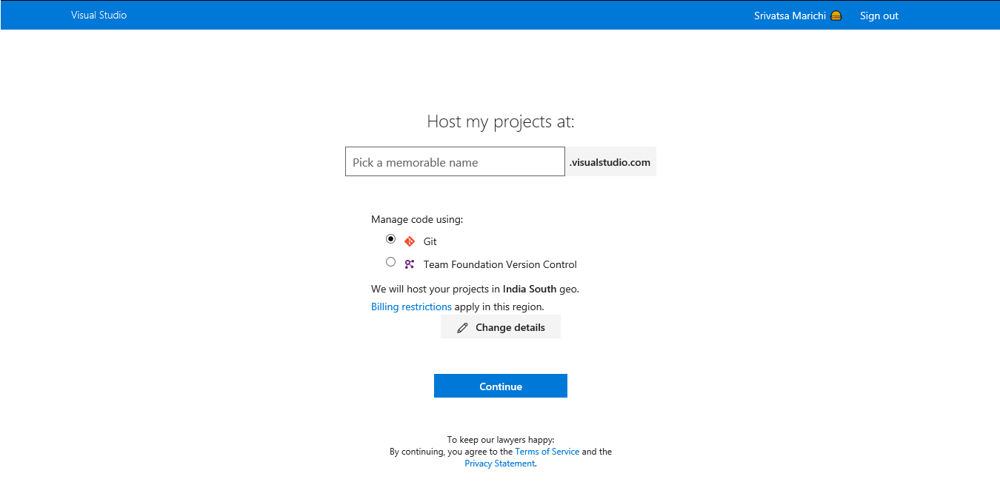
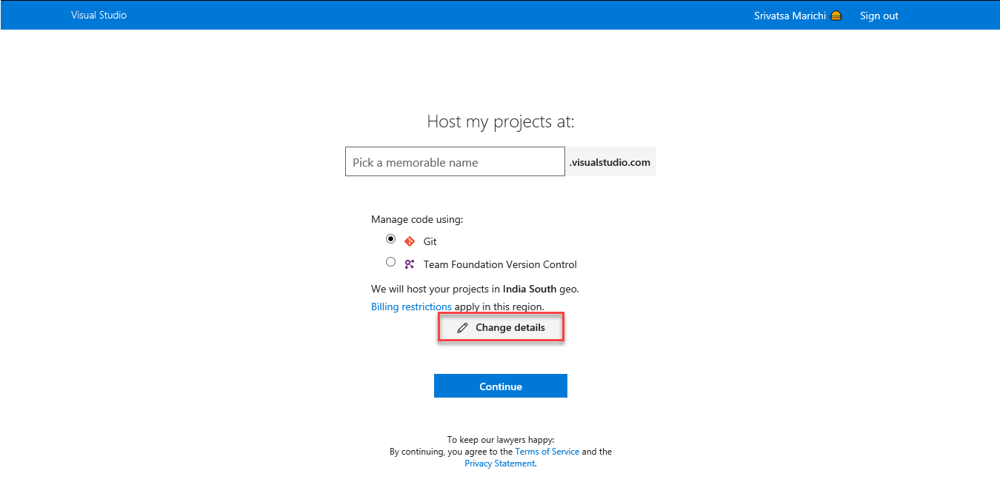
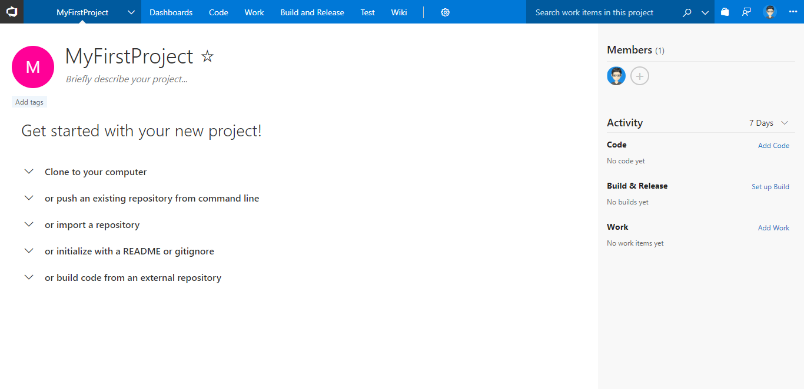

## Overview

This exercise will walk you through the steps to creating your Visual Studio Team Services (VSTS) account and create a new project.

> Watch the [video overview](https://youtu.be/O1UTj-wZr3k)

Depending upon whether or not you have an MSDN Subscription, and whether you’ve tried Visual Studio Team Services before, you can get started a
few ways. Regardless, you’ll need a valid Microsoft Account or already linked Organizational Account to move forward.

## Creating your VSTS account

1. Login to the virtual machine.

1. Start the Firefox web browser.

1. If you don’t have an existing Microsoft account that you want to use, visit <https://outlook.live.com/owa/> to create a Microsoft Account and optionally get yourself a free personal e-mail address. If you have a Microsoft account you want to use, just continue to the next step.

1. Navigate to <https://www.visualstudio.com>.

1. In the upper right-hand corner, click the **Sign In** link.

    

1. The site redirects you to a log in page like the following if you’re not already logged in (If you don’t see the following screen continue to the next step). Enter your e-mail address for your Microsoft account and its password and click **Sign in**.

    

1. Once you’ve logged in, you might be greeted with a page (*if not, jump to the next step*), like the following, that will allow you to confirm your **display name**, **contact e-mail**, and your **country/region**. Once you set this information, you can change it later. Under the **Hello,** field, enter your first and last name. If you want to receive e-mail notifications from Visual Studio Team Services at a different e-mail address than the one associated with your Microsoft account, change the address shown under the **We’ll reach you at:** field. Click **Continue**.

    

    You should now be at the **My Information** page. You’ll jump from here to the account creation process.

    Please continue reading before making choices.

    

    The first piece of data is the **Account URL**. Currently, all Visual Studio Team Services accounts live within the top-level
    **visualstudio.com** domain. The account name you choose could be something personal, like your name, or something more work-related, like
    your company name. If you do intend to set up your account to share with others at your organization, you might want to coordinate this with
    those in your organization that manage your servers and infrastructure.

    The second field that affects your account is where Microsoft hosts your account. Visual Studio Team Services is a purpose-built cloud service hosted in Microsoft Azure. You should pick the one that is closest to you and the majority of users of your account.

    Once you have an account, you need at least one Team Project to track you work, store your code, test, and run builds. This lab gives you specific instructions so you can use some tools and complete the lab. Understand that Visual Studio Team Services is very flexible and that
    you should explore it after the event.

    The next section describes the Visual Studio Team Services on-boarding experience. What you see can and will vary if it is your first time
    accessing Visual Studio Team Services or not.

1. On the **My Information** page find the **Create a free account now** link and click it.

    

    Once you do this, the experience you get might vary. If this is your very first time creating a team project, you will be prompted to create
    an account. Generally, you will see a screen like the following.

    

1. Enter a value in the **Account URL** field. It is possible you might have to try a couple different names.

1. Click the **Change Options** link.

    

1. Select the appropriate region.

1. Click the **Create Account** button.

    If you have picked an account name in use, you will receive a warning. Pick a different name and try again.

    Creating a new account is typically fast and can take as little as a few seconds to complete.

1. Once done, you will be directed to the new Team Project by default.

    

You can use **VSTS Demo Generator** to provision the source code or you can manually import the source code from GitHub.

## Setting up the VSTS team project

1. Use the [VSTS Demo Generator](https://vstsdemogenerator.azurewebsites.net) to provision the team project on the VSTS account.

   

   

1. Use **MyShuttle2** for the template. Provide the Project Name (jdev-labs in this lab) and select Create Project. After the project is provisioned, click the URL to navigate to the project.

   

## Importing a Github Repo into VSTS

In this task you will import code from a Github repo into VSTS.

1. Connect to the virtual machine with the user credentials which you specified when creating the VM in Azure.

1. Open Chrome and browse to `https://<youraccount>.visualstudio.com` (where `youraccount` is the account you created in VSTS).

1. Click on the `jdev` team project to navigate to it. Click on Code in the blue toolbar at the top to open the Code Hub.

1. Click on the repo drop-down in the upper left (in the grey toolbar) and select "Import repository"

    

1. Enter the following url: `https://github.com/nwcadence/MyShuttle2.git` and click Import.

    

1. After a few moments, the code will be imported.

## Importing the MyShuttleCalc code from Github into VSTS

In this task you will import the MyShuttleCalc code from GitHub into VSTS. If you have already done so, skip this step.

1. Click on the `jdev` team project to navigate to it. Click on Code in the blue toolbar at the top to open the Code Hub.

1. Click on the repo drop-down in the upper left (in the grey toolbar) and select "New repository".

    

1. Enter the following url: `https://github.com/nwcadence/MyShuttleCalc.git` and click Import.

    

1. After a few moments, the code will be imported.

   > **Note**: It is not necessary to clone GitHub repos into VSTS. VSTS will work just fine with GitHub (or other Git hoster) repos. However, some linkages from source code to other aspects of the DevOps pipeline (such as work items, builds or releases) work best if the code is in VSTS.

Now you’re going to manage your backlog with Visual Studio Team
Services. You can read more about account creation and more at
[https://docs.microsoft.com/en-us/vsts/user-guide/connect-team-projects](https://docs.microsoft.com/en-us/vsts/user-guide/connect-team-projects)
