## Overview     

In this lab, you will learn about the agile planning and portfolio management tools and processes provided by Team Foundation Server 2017 and how they can help you quickly plan, manage, and track work across your entire team. You will explore the product backlog, sprint backlog, and task boards which can be used to track the flow of work during the course of an iteration. We will also take a look at how the tools have been enhanced in this release to scale for larger teams and organizations.

## Prerequisites 

In order to complete this lab you will need the Visual Studio 2017 virtual machine provided by Microsoft. For more information on acquiring and using this virtual machine, please see [this blog post](http://aka.ms/almvm).

**Important note**:

This lab requires you to use the default state of the virtual machine, before any modifications are made to work items or source in TFS. If you followed the “Working with the Visual Studio 2017 ALM Virtual Machine.docx” instructions you should already have a snapshot/checkpoint of the virtual machine before working with it for the first time. Apply this snapshot/checkpoint before starting this lab.

## Exercises 

This hands-on lab includes the following exercises:

* Agile Project Management

* Agile Portfolio Management

* Flexibility of Agile Tools

* Work Item Charting

Estimated time to complete this lab: **45 minutes**.

### Exercise 1: Agile Project Management 

In this exercise, you will learn how to use Team Foundation Server 2017 to manage your product backlog, create work items, break work items into tasks, assign tasks to team members, and track progress using the task board. This overview will demonstrate the basic project management tools that small- to medium-sized development teams can utilize for product development.

> **Note:** The team project used in this lab uses a Scrum process template, but the core features demonstrated apply to all process templates.

### Task 1: Team Foundation Server Web Portal 

1. Log in as **Sachin Raj** (VSALM\Sachin). All user passwords are **P2ssw0rd**.

    > **Note:** In order to fully demonstrate the ALM features in this lab, we will first set the virtual machine to a specific date that lines up with a pre-configured, in-flight iteration. This lab needs to be walked through using the original virtual machine state (without any modifications made to source or work items), otherwise you will see errors.

1. **Right-click** the **ConfigureALMDemo.bat** file on the Desktop and then select “**Run as administrator**”. This will set the date and time in the virtual machine to be a specific date that lines up with the demonstration data.

1. Launch **Internet Explorer** from the taskbar and click **TFS FF Portal** from the favorites bar at the top.

   

1. Select **Browse all** option from the team dropdown box in the top left corner of the portal.

   

1. This view shows that the Fabrikam Fiber collection has one project in it named **FabrikamFiber**. This project contains a few different teams, with the **Fabrikam Fiber Leadership Team** being set as the default team for the project. We will take a closer look at teams in a later exercise.

    > **Note:** This lab refers to this default team as both the leadership team and the management team. They both refer to the same team.

    

1. Select the **Fabrikam Fiber Web Team** and then click **Navigate**.

   

1. The **Home** view for the Fabrikam Fiber Web team provides a high-level overview of the current iteration (Sprint 3) including team workload versus capacity, burndown of tasks over time, and team favorites, which can include a configurable assortment of work item queries, build definitions, and version control paths. In addition, there are links to quickly create new work items and bugs, load the backlog, task board, initiate requests for feedback and so on.

    

    > **Note:** Team favorites can be added or removed from within the web portal. For example, navigate to the Build tab to assign build definitions as a team favorite. In addition, team favorite work item queries can be modified from within Visual Studio.

    Each team can have different team favorites listed, different work capacity, and even different work items. The determining factor of where a work item will show up is governed by the **Area** field.

1. As you can see under the **Team Members** section, there are several members listed in this team. Teams are a concept that were originally introduced in Team Foundation Server 2012 to make it easier to manage, assign, and track work.

### Task 2: Working with the Backlog 

1. Navigate to the backlog by clicking **Backlogs** under the **Work** section.

    

1. The product backlog helps define the work that needs to be done. Once you have a backlog, you can use it to help manage when that work gets done, as well as associate items on the backlog with check-ins, acceptance tests, or other criteria.

    

    > **Note:** The Current iteration shown in the tree on the left side of this screen is Iteration 3. Team Foundation Server uses the current date and time to determine the current iteration. The virtual machine you are using has been set to use a date of July 9, 2013 for purposes of this lab.

1. Imagine that the VP of Fabrikam Fiber has requested that a new user story be implemented for the customer-facing service portal. This new user story will enable customers to see weather-related service outages. This user story is being designated as high-priority because many customers requested it and customer service indicated that it would greatly reduce phone support during outages.

1. Select the last row of the product backlog and then create a new **Product Backlog Item** with the title “_**Customer should see weather-related outages on portal.”**_

    

    > **Note:** New work items are generally inserted above the selected location. The exception is that if you select the last work item, the insertion will be after the selected location.

1. Click **Add** to add the new user story to the backlog.

    

1. Work items on the product backlog are ordered based on priority with high priority items at the top. Our new work item has a high priority so move it to the top of the list by dragging and dropping it into place.

    

1. Let’s edit the new user story to assign it to the appropriate product owner and record an initial estimate of expected effort. **Double-click** the new user story.

    

1. Assign the new item to **Brian Keller** (the product owner for the Fabrikam Fiber Team), set the state to **Approved**, and set an initial effort of ‘**8**’. Click **Save and Close**.

    

    > **Note:** Each team may choose to define the **Effort** value as they see fit, using a unit of story points, hours, days, or number of sodas required. The point here is that this measure is a relative value with respect to other work items. Work will be broken down into hours later.

    > **Note:** A popular planning approach that helps to eliminate group think and considers input from all team members is known as planning poker. You can read more about it at [http://en.wikipedia.org/wiki/Planning_poker](http://en.wikipedia.org/wiki/Planning_poker).

1. Assign the new user story to the current iteration, _**Iteration 3**_, by dragging and dropping it as shown below.

    

    > **Note:** If you are a Scrum purist, you are probably cringing at the fact that we just added new work to a mid-flight iteration. While this is something you might never do in the real world, this is a shortcut taken for purposes of this lab in order to simplify the workflow and still show you all of the aspects of the project management interface. Well, that and the VP told you to.

1. Look at the **Iteration Path** for the new user story to make sure that it is assigned to _Iteration 3_ as expected. This user story will remain on the product backlog until the work has been completed.

    

1. If you made a mistake when adding a work item, or if the work item simply shouldn’t be part of the backlog for any reason, you can drag it to the **Recycle Bin**. Drag the item you just created onto the **Recycle Bin**. Then click the **Recycle Bin** to view its contents.

   

1. Right now it only contains the item you just deleted. Fortunately, you can right-click the item and select **Restore** to put it back where it belongs. Confirm the restoration when asked.

   

1. It’s now time to return to the backlog. However, since you’re in the **Recycle Bin**, there’s no direct path. Fortunately, TFS now supports a variety of **keyboard shortcuts** that make rapid navigation as easy as possible. Press the “**?”** key (probably **Shift+/**) on your keyboard to view the available options.

   

1. The shortcut to the backlog is the **l** (lowercase “L”) key. Press it now to go there.

1. The product backlog view also provides a velocity chart that shows the amount of work that the team has undertaken in each sprint, with the current sprint breaking that down further to differentiate between work in progress and work completed. Click the mini chart in the upper-right corner to load the larger view.

    

1. During _Iteration 1_, the team completed 35 story points worth of effort. _Iteration 2_ was more productive with 49 story points completed. The current iteration, represented by _Iteration 3_, shows that we do not currently have any work items in the Committed state. Remember that these story points are a relative measure of effort that was agreed upon by the team.

    

1. Press the **Esc** key to close the velocity chart.

1. The product backlog view also groups the past, current, and future iterations by their assigned dates. Click **Iteration 3** so that we can break down work and assign it to the appropriate team members.

    

1. Before we break down the new user story, let’s take a quick tour of this iteration backlog view. To start with, it shows all user stories and associated tasks that are assigned to the selected iteration, regardless of state.

    

1. At a glance, you can see that the current iteration runs from July 1 to 12, with four work days remaining. Just to the right of the current iteration date range, there is a small graph showing the burn down of the remaining work.

    ****

1. Click the burn down graph to view it. The graph shows remaining work over the course of the iteration. It also provides insight for the **Available Capacity** that can be applied to the work (total work hours remaining across resources).

    

1. Press the **Escape** key to close the burn down graph.

### Task 3: Team Capacity Planning 

1. Locate the overall **Work** bar that shows how close to capacity we are for the current iteration based on the total of the Remaining Work for the tasks in this iteration and based on the total capacity for the team. It looks like we are okay now, but we still haven’t broken the new user story into tasks for the team yet.

    

1. Select the **Capacity** tab to review the team capacity details.

    

1. The capacity view allows us to specify the number of hours per day that each team member will be working on this project, days off per team member, and overall team days off. These capacity settings apply to the current iteration. You can optionally use the activity column to describe the disciplines that each team member specializes in. When tasks are broken down by activity as well, it can provide another view across your team’s capacity to determine if, for example, you have enough people working on documentation to meet the demands for this iteration.  For now, leave the capacity settings unmodified.

    

1. Return to the **Backlog** view for the current iteration.

    

1. Let’s say that the decision is made to proceed with committing to the new work item. Return to the **Iteration 3** backlog view. Click the button with the ‘**+**’ symbol in it to the left of the new user story to add a new task. This will become a child task of the user story and will be used to help describe the implementation details required to complete this user story.

    

1. For the new task, enter “**Consume OData feed for weather alerts**” for the Title, assign it to **Brian Keller**, and set the Remaining Work to **8** hours. Click **Save and Close**.

    

1. Note that the new task was added as a child of the user story and that the overall team work bar has turned red indicating that we have too much work assigned based on capacity.

    

1. It looks like the bug has not been worked on yet, so this may be a good candidate to reschedule for a future iteration so that the team can get back on track given their additional workload. Drag and drop the bug onto **Iteration 4** on the left-hand side of the window.

    

1. Take another look at the overall **Work** bar once again to make sure it is now green. This means that we are within the current team capacity. Just don’t tell the VP, or he might find another high-priority request for us to work on!

    

### Task 4: Working with the Task Board 

1. Now that we have finished breaking down the work and assigning it to team members, let’s take a look at the task board that will be used in the next stand-up team meeting to report and record progress. Select the **Board** tab from Iteration 3.

    

1. By default, the task board shows all tasks for the current iteration grouped by product backlog item and by the current state. Drag and drop the “**Consume OData feed for weather alerts**” task to the **In Progress** column.

    

    > **Note:** The task board is touch enabled as well. This will not work within this virtual machine, but you might want to put in your request now for that nice wall-mounted touch-screen monitor you have been desiring for your team.

1. **Single-click** the ‘**8**’ value shown on the “**Consume OData feed for weather alerts**” task and change the Remaining Work to **5** to simulate Brian working on the task during the day.

    

1. The new high-priority task is now in progress with an estimated 5 hours of work left to go.

    

1. Drag and drop the task titled “**Create database for branch office location lookup**” to the **Done** column to record that work as completed. Note that the remaining work is automatically reduced to **0**.

    

1. Notice that the burn down chart in the top-right corner is automatically updated after you made changes on the task board. Click the burn down chart and note that there is about 15 hours of effort left in order to complete the work for the iteration.

    

1. Close the burn down chart.

1. Note that each row representing a work item shows a rollup of hours remaining, which is a sum of remaining work for all child tasks. In addition to that each column representing a status has a rollup of remaining work giving you a good idea of how much work the team is actively working on right now.

    

1. The task board also groups by team members. Select the **People** grouping option in the top-right of the task board view.

    

1. This view makes it easy to see what team members are currently working on and how much effort remains for each for the remainder of the current iteration.

    

1. Click **Backlog Items** to return to the backlog portfolio for the team.

    

## Exercise 2: Agile Portfolio Management 

In this exercise, you will learn about some of the agile portfolio management capabilities provided by Team Foundation Server. These capabilities allow larger organizations to understand the scope of work across several teams and see how that work rolls up into broader initiatives. In this exercise, you will explore how multiple teams at Fabrikam Fiber can collaborate together to work on features.

### Task 1: Configuring Team Hierarchy and Area Paths 

1. Let’s start out by taking a look at the Fabrikam Fiber project from the top-down, in a manner that would typically be associated with a management role.

1. From the gear icon in the top-right corner of the web portal, select **Project settings**.

    

1. The FabrikamFiber project has five teams, with the **Fabrikam Fiber Leadership Team** assigned as the project default.

    

1. Underneath the **Work** tab, select the **Areas** tab.

    

1. The management team currently owns the **Development** area and all sub-areas. This gives them visibility into the backlog of all teams, even for work items that are not mapped to features. Optionally, the management team could also choose to not include sub-areas, thereby removing work items from their product backlog view as soon as they are assigned to one of the teams.

    

1. From the team dropdown in the upper left corner, select the **Fabrikam Fiber Database Team**.

    

1. Select the **Areas** tab. The **Database** team is currently configured to see work items from just the root Development area and the Database Team sub-area. This allows them to see backlog items created by the management team and ones specifically assigned to their team. With this kind of structure, each team can work independently on its own backlog, defined by its area path, unrelated to the other team’s work.

    

1. From the project dropdown, select **FabrikamFiber** to return to the scope of the default team.

   

1. Select **Work | Backlogs** to return to the backlog visible to the leadership team.

    

### Task 2: Portfolio Management 

1. The leadership team can see backlog items across all teams, including status and scheduled iteration.

    

1. The backlog view also includes the ability to toggle the display of in-progress work items. Toggle the “**In progress items**” link in the top-right corner of the backlog view and note that the Committed work items are no longer displayed. Toggle the link once again to view in-progress items before moving on.

    

1. Note that the in-progress work items are no longer displayed. Toggle the link once again to view in-progress items as before.

    

1. Click **Features** to view the feature backlog.

    

1. This view shows the top-level features for the project. It is possible to drill down into backlog items and even individual tasks if desired. Click the **Expand** button to expand one level.

    

    

1. Click the **Expand** button once again to drill down into tasks.

    

1. It is also possible to re-parent work items using drag-and-drop operations in the portfolio backlog view. Try this out by dragging and dropping one of the Product Backlog Items from one feature to another.

    

1. Note that this moved the Product Backlog Item as well as all of the child tasks. Drag the Product Backlog Item back to its original feature.

1. The child work items are always shown for the leadership team, regardless of which team they are assigned to. To see this more clearly, let’s add the **Area Path** column to the view.

1. Click **Column Options**.

    

1. **Double-click** **Area Path** from the available columns and then click **OK**.

    

    

1. If you look at the area path column for different product backlog items, you can see that they are assigned to different teams. The ability to drill down into the various backlogs gives the management team the desired level of visibility into the breakdown and implementation of features.

    

1. Now let’s take a look at how to create a new feature and then link it to a work item that will be assigned to one of the agile teams. Create a new feature titled “**Reporting for technicians and services**” and then click the **Add** button.

    

1. Click the green ‘**+**’ button that is on the left-hand side of the new Feature.

    

1. Create a new Product Backlog Item named “**Modify databases to support on-demand reporting for technician activity**”. Assign it to the database team lead, **Deniz Ercoskun**. Note that you may need to search for Deniz to select her account. Set the Area to the **Database** team so that it shows up on their backlog. Finally, click **Save and close**.

    

    > **Note:** In the event that you create items within the backlog, you can also easily map them to parent Features by enabling the Mapping feature and then dragging and dropping.

    

1. Now let’s load the web portal for the database team. Navigate to the **Fabrikam Fiber Database Team** using the top navigation as before.

1. You should now be looking at the backlog for the database team.

    

1. Although this team may normally only want to view their backlog items, they may also want to see how those backlog items fit in to the bigger picture. Toggle the **Parents** option that is currently set to **Hide**.

    

1. Note that the backlog view now shows parent Feature items.

    

1. To get a more complete view of their organization’s overall work, the database team can also view the Features backlog. Click **Features**.

    

1. Click the **Expand** button twice in order to expand the features backlog two levels. Note that it is easy to distinguish between work that the database team is contributing to or is assigned, and work that is assigned to other teams by looking at the colored bar. If the bar is hollow (not filled in), this means that the work is assigned to a different team.

    

## Exercise 3: Flexibility of Agile Tools ##

In the previous exercise, you learned about how Team Foundation Server can scale to meet the needs of larger teams working towards common goals. This approach requires that everybody in the organization uses the same team project within Team Foundation Server and therefore the same process template (which defines the way work items and their workflows are defined). Understanding this, Microsoft has begun to allow individual teams to customize certain aspects of the ways in which they manage and track their work without requiring centralized changes to their process templates.

In this exercise, you will learn more about Kanban and how it contributes to the flexibility of the agile toolset. You will also learn about work item tagging. Both of these features can be utilized and customized independently by different teams, without making changes to the underlying process template.

### Task 1: Introduction to Kanban Tools ###

1. The **Kanban** board was first introduced with Team Foundation Server 2012 Update 1. Kanban is a process improvement tool that can be used in an incremental fashion regardless of the current software development methodology that you are using. It assists with the throttling and tracking of work and illustrates the delivery of value over time to the project stakeholders. Each backlog has its own Kanban board, and each team has its own view of that.

1. Navigate to the **Fabrikam Fiber Devices Team** using the navigation as before.

    

    

1. The Kanban board shows the top backlog items across all states and iterations allowing you to move items between states and allows you to set Work in Progress (WIP) limits for each state. One of the primary reasons for using Kanban and limiting work in progress is that it helps identify bottlenecks in your development process and minimize lead time for new features. Let’s say that the devices team is not delivering finished work as quickly as desired, and that it is suspected that the underlying issue may have to do with taking on too many tasks at once at the beginning of each sprint (and the associated context-switching tax). If we are more careful about the number of tasks that we commit to, perhaps we can better focus our efforts.

1. Let’s lower the **Work in Progress** limit for the **Committed** state to see what the Kanban board looks like when too much work has been committed to at once. Right now, the limit is **5** work items.

    

1. Click the **Configuration** button (it has a gear icon) to open the **Configure settings** dialog.

    

1. Select the **Columns** tab and click the **Committed** column. Set the **WIP Limit** to “3” and click **Save**.

    

1. On the Kanban board, column headers will provide an indication when a Work in Progress limit is exceeded. In this case, the Committed column shows us that we have exceeded the limit.

    

    > **Note:** Work in Progress limits provide feedback when appropriate but they do not prevent a team from taking on additional work. You need to actively check the Kanban board in order to discover that you are exceeding set limits.

1. You can also configure the Kanban boards to show (or hide) bugs as desired. Click the gear icon to return to the settings dialog.

   

1. Navigate to the **Working with bugs** tab and select the option **Bugs appear on the backlogs with requirements**. Click **Save**.

    

1. Click the **New Item** button and then select **Bug**.

    

1. Add a new bug entitled **“Rendering artifacts on iPhone”** and then press **Enter** to save.

    

1. You can also reorder the backlog priority from the Kanban board. In the **Committed** column, drag the bottom card to the top of the column.

    

1. Filtering on the Kanban board is another key feature for teams. Click the **Search** button and then search for “**technician**”.

    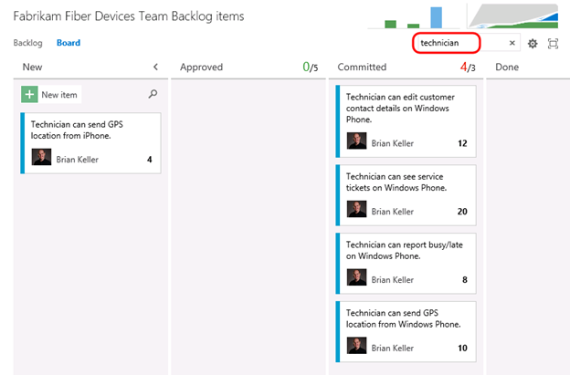

1. **Clear** the search box.

    > **Note:** The New column has an additional search filter box that only applies to work items in the New state, which is useful when you want to search for something from your backlog without losing context of other work items.

1. Let’s say that the devices team has decided that they want to add in a column that represents work that has been tested on a physical device. This is the only team that would desire to keep track of such a state, and they can easily add this to their Kanban board.

1. Click the **Configure settings** button. Here you can add, remove, delete, and even rename columns to better suit your team workflow. However, you are still subject to restrictions put in place by the underlying process template, so you must map columns to valid work item states and respect the valid state transitions.

   

1. Navigate to the **Columns** tab and click the **+ Column** button. Reorder the new column to be next to **Done** and set its **Name** to “Device Tested”.

   

1. You can also modify what your team considers to be the meaning of the Definition of Done for each Kanban column. This will help teams to stay on the same page even when a work item should be moved to the next state. Scroll down to the bottom of the form and define the definition of “done” for this column using plain text or Markdown. Provide a message such as “**Has been tested on Android, Windows Phone, and iPhone**” and then click **Save**.

   

1. You new column is now live on your board, and you can click the helper icon to see the **Definition of Done**.

    

1. Kanban support also adds a new graph to the backlog views called the **Cumulative Flow Diagram**. Click the small diagram to open it.

    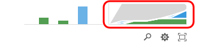

1. The Cumulative Flow Diagram (CFD) shows the amount of work in various states over time for the selected team. The horizontal axis shows lead time and the vertical axis shows work in progress.

    

    > **Note:** The CFD shown above does not necessarily represent an ideal scenario where a team is providing continuous output. More typically and ideally, you would see bands of color representing all states increase over time like the following diagram.

    ****

1. Press the **Escape** key to close the CFD.

1. The Kanban board has a ton of great and convenient configurability options designed to adapt to the way your team works. Reopen to the **Configure settings** dialog used earlier.

   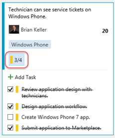

1. Navigate to the **Fields** tab. Here you can configure each work item type to show ID number, Assigned to field, Effort, Tags, or other fields that you wish to show. These options are configured per team, giving each team the flexibility it needs to manage its own workflow. Select the options to **Show ID** and **Show empty fields**.

   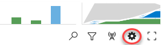

1. Switch to the **Bug** tab and check the same boxes here as well. Click **Save** to confirm.

   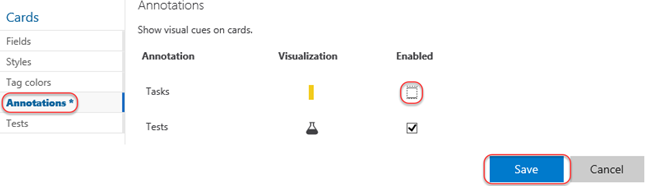

1. Now each work item displays its ID, which is very useful if your team uses these in discussions or in references from code or documentation.

   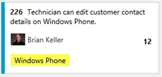

1. In addition, the empty fields are now “shown” in the card, which allows you to initialize them inline. Locate the item created earlier and assign it to **Deniz Ercoskun**.

   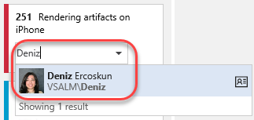

1. Swim lanes are a key feature for teams when managing workloads. These horizontal lanes can be added to Kanban boards to further categorize work, with a common use of this to create an “expedite” lane for high-priority work that needs to skip through the normal workflow. Reopen the **Configure settings** dialog used earlier.

   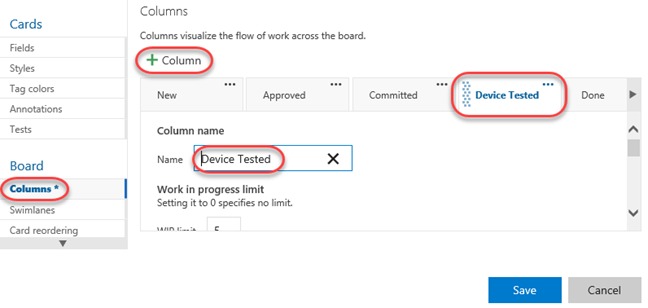

1. Kanban boards only have a single swimlane by default, you can add in as many lanes as you want. For example, you can use them to categorize items by severity (expedite, normal), departments, tiers, and so on. Navigate to the **Swimlanes** tab and add a new swimlane named “**Expedite**”.

    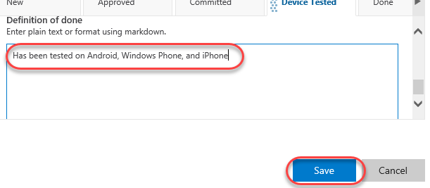

1. Rename the default lane to “**Normal**” and then click **Save**.

    

1. Expedite one of the work items using drag and drop.

    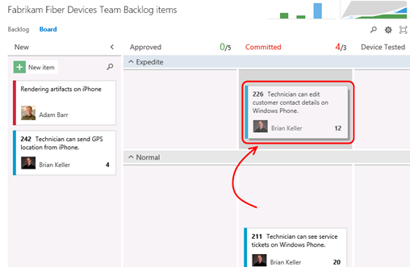

1. In addition to the customization of board behavior, the cards themselves can be easily styled. Click the **Configure settings** icon button to open the configuration dialog.

   

1. Select the **Styles** tab and click **Styling rule**. Set the **Name** to **“High severity”**. This rule will change the style of the cards for bugs with high severity in order to make them easier to identify.

   

1. Scroll down to change the **Card color** to a strong red and set the first clause to **“Severity = 1 – Critical”**.

   

1. Select the **Tag colors** tab and set a tag coloring rule to easily identify all cards tagged with **“Windows Phone”**. Click **Save and close** to continue.

   

1. On the board, you can now see that backlog item tags for **“Windows Phone”** are colored yellow and are easy to identify.

   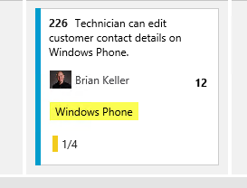

1. Locate the bug created earlier and click to open it.

   

1. Change the **Severity** to **1 – Critical** and click **Save and close**.

   

1. Note that the bug card is now colored red to indicate its critical severity.

 

### Task 2: Kanban prioritization ###

1. As cards are reordered within a column on the Kanban board, their relative priorities are adjusted in the backlog. Select the **Backlog** tab and notice that the “Technician can see service tickets…” work item is prioritized above “Technician can report busy/late…”.

   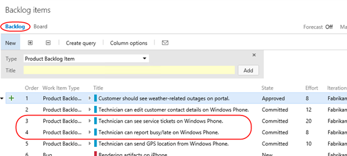

1. Return to the **Board** tab. Locate item #216 and drag it above #211.

   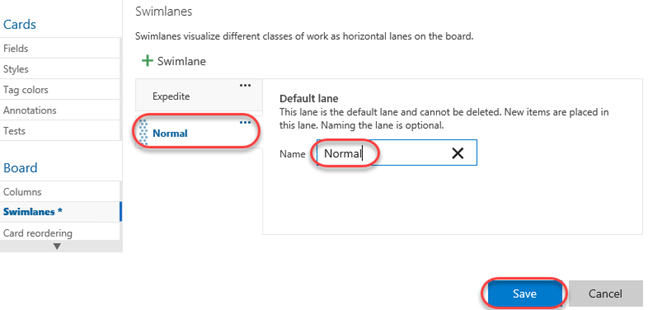

1. With the cards now reordered on the board, return to the **Backlog** tab and notice that the work items have been appropriately reprioritized to reflect their order on the board. Also note that “Customer should see weather-related outages…” has the highest priority in the backlog.

   

1. Return to the **Board**. Drag—but do not drop—the “Customer should see weather-related outages…” card from the **Approved** column over the **Committed** column. Note that as you move it vertically, the existing cards in the column move to allow you to drop it anywhere. Return to drop the card over its original **Approved** column so that no changes are made.

   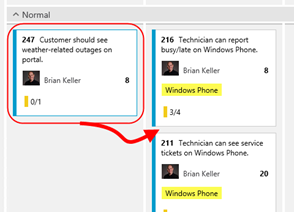

1. While this may be desirable to some teams, there are other teams that would prefer backlog item prioritization to be enforced as cards are moved between columns. After it, it can be difficult to understand where a card is currently prioritized as you graduate it from stage to stage. Click the **Configure settings** icon button to open the configuration dialog.

   

1. Select the Card **reordering** tab and select the second option. This will enforce that cards are placed in the appropriate place in a given column based on their relative priority in the backlog. Note that both options have sample animations to illustrate each behavior. Click **Save**.

   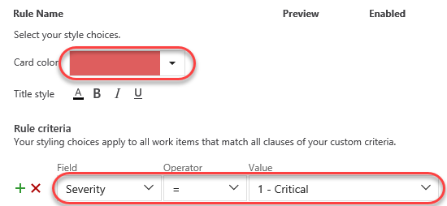

1. Once again, drag the card from the **Approved** column over the **Committed** column. Note that this time, the cards in the target column don’t budge. Go ahead and drop it anywhere over the **Committed** column and note that it automatically flows to the top since it has the highest priority of the items in that column.

   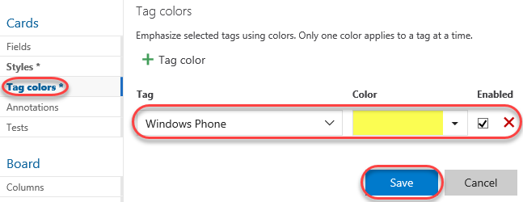

1. It’s important to note that while this setting controls the behavior of card reordering when a card it moved between columns, you can still easily reorder cards within a given column. For additional information on using the Kanban board, please see “[Kanban basics](https://msdn.microsoft.com/Library/vs/alm/Work/kanban/kanban-basics)”.

### Task 3: Work Item Tagging ###

1. **Work item tagging** allows you to easily categorize, query and filter lists of work items.

1. Navigate to the **Fabrikam Fiber Leadership Team**.

    

1. Navigate to the **Backlog Items** view.

    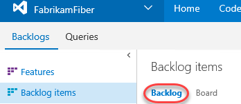

1. Let’s say that a cross-team initiative is put in place to give customer facing work items higher priority. Also imagine that the product backlog is quite large, so much that visually searching through all titles and assigning them to sprints and teams has become quite time consuming. One way to help with this is to create work item tags and then filter the list of work items.

1. Note that a number of work item tags are already in place.

    

1. **Double-click** the work item titled “**Customer should see weather-related outages on portal**”.

1. Click **Add…** to add a tag.

    

1. Enter the text “**Customer**” and then click **Save and Close**.

    

1. Repeat the process of tagging any work items that appear to be customer facing. You should end up with something like the following screenshot, but there is no need to match it exactly.

    > **Note:** You can create work item queries that include tags.

    

1. With the desired tagging in place, click the **Filter** button in the top-right corner of the backlog list.

    

1. Click the **Customer** tag to filter by just that tag.

    

1. With this filtered view the teams will have a much easier time finding the work items that they should focus on first. Note that this filtering also disables the ability to add new backlog items, disables stack ranking and forecasting.

    

    > **Note:** Additional filtering can be done by selecting another tag (if there are any in this filtered subset). To remove the filter, simply click the Filter button once again.

## Exercise 4: Work Item Charting ##

In this exercise, we will demonstrate the work item charting capability of Team Foundation Server. Work item charting allows you to create visual chart representations of the data returned from TFS work item queries. This can be used to help better understand the state of projects.

### Task 1: Creating and Sharing Work Item Charts ###

1. Let’s say that the Fabrikam Fiber management team would like to better understand how tasks are broken down by user. Navigate to the work item queries section of the web portal. Select **Work | Queries**.

    

1. Since these charts are based on work items, we first need to define a query that will return the data that we are interested in. Click **New** and select the **New Query** option.

    

1. The default query will select all work items in any state for the current project. We want to select just Tasks, so modify the value of clause for **Work Item Type** to be **Task**.

    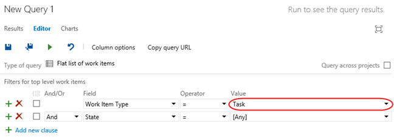

1. Click the **Save Query As** button.

    

    > **Note:** Work item charts require the associated query to return a flat list of work items.

1. Name the query “**All Tasks”**, select the folder “**Shared Queries**”, and then click **OK**.

    

1. Select the **Charts** tab and click **New chart**.

    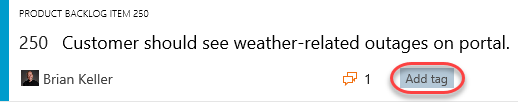

1. Title the chart “**Tasks by User**”, group by the **Assigned To** field, and then click **OK**.

    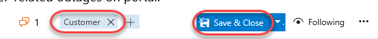

1. Let’s create one more chart to help visualize the task progress for each team member. Click **New Chart** once again.

1. Select the Stacked **Bar** chart type. Note that this chart type requires you to specify two different fields for the rows and columns.

    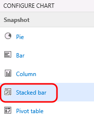

1. Title the chart “**Task State by User**”, select the **Assigned To** field for the **Rows**, select the **State** field for the **Columns**, and finally click **OK** to create the chart.

    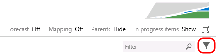

    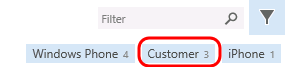

1. You can add to the available grouping options by modifying the work item query and adding in additional display columns. Select the **Editor** tab for the query.

    

1. Click **Column Options**.

    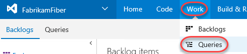

1. Select the **Task** item for the **Work Item Type**.

    

1. Double**-click** the **Area Path** option from the Available Columns list.

    

1. Click **OK**.

    

1. Click the Save button.

    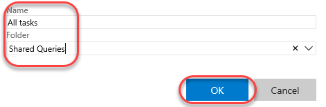

1. Select the **Charts** link to return to the charts view and use your charting skills to create a pie chart showing tasks grouped by the **Area Path** field. Title the chart “**Tasks by Team**”, select the **Area Path** field for the **Group By** field, and finally click **OK** to create the chart. This gives the management team an idea of how the work is distributed amongst the teams.

    

1. These lightweight charts can also be pinned to a dashboard. Click the **Tasks by Team** chart’s ellipses button and select **Add to dashboard | Overview**. This dashboard is used on the project’s home page.

    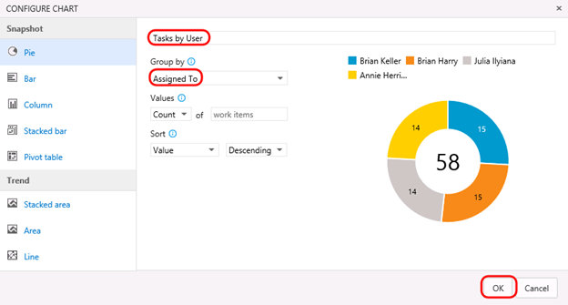

1. Click the **Home** link to return to the leadership team’s homepage and view the pinned chart.

 

### Task 2: Customizing Dashboard ###

1. You can also customize a dashboard by clicking the **Edit** button in the bottom right corner. This will switch the dashboard into **edit mode**. You need to be in edit mode in order to rearrange the dashboard or make configuration changes, which removes the risk of accidental edits during normal usage.

   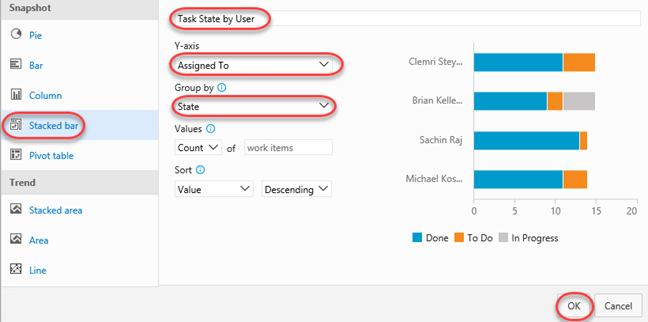

1. Utilize the **Remove** buttons to clean up the dashboard a bit. It doesn’t matter which items you remove.

   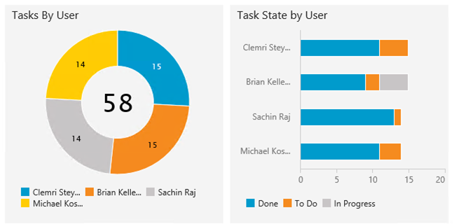

1. You can also easily add new items to the dashboard by clicking the **Add Widget** button. Try it now.

   

1. Search for the **Markdown** widget and click **Add**. This widget allows you to display any markdown file from your repository on the dashboard. Alternatively, you can provide the markdown manually. Click **Close**.

   

1. Locate the Markdown widget on your dashboard and click its **Edit** button.

   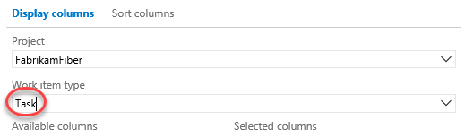

1. This will provide you with access to key settings, such as the size of the widget, as well as the source of the Markdown to display. Press **Esc** to cancel.

   

1. Click the **Manage Dashboards** button in the top right corner of the view.

   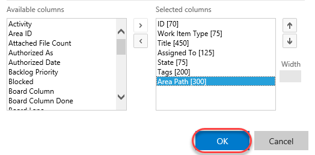

1. This dialog provides access to functionality for managing your dashboard, including its creation. Note that each dashboard has an option to **Auto-refresh dashboard**, which is great for scenarios where you want to display information in public team areas, such as on large TVs.

   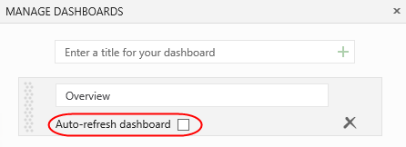

1. When satisfied, click the **Close Edit Mode** button to apply all changes.

   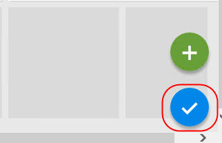

1. You can also create additional tabs for your dashboard in orders to offer different views into the project. Click the **Add a new Dashboard** button to create a new dashboard.

   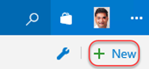

1. Enter **“Quality”** as the name and click **OK**.

   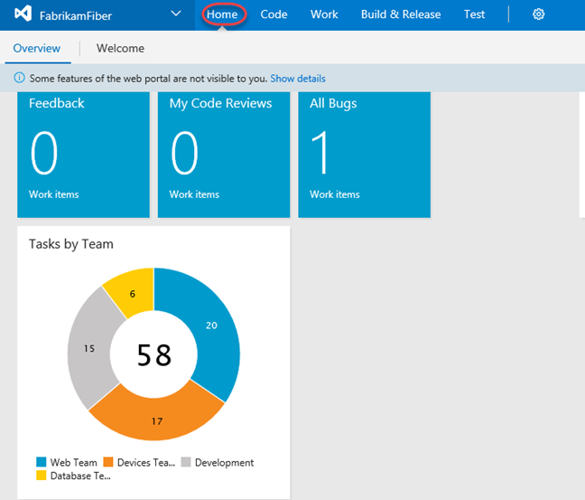

1. You now have multiple dashboard tabs and can edit and customize each using the same process from earlier.

    

    **Note**: After completing this lab, the virtual machine will continue to run with the date & time that was set for demonstration purposes at the beginning of this lab. Don’t forget to reset the virtual machine to its original snapshot/checkpoint after you complete this lab.

