

## Overview

In this lab, you will learn about the agile planning and portfolio management tools and processes provided by Team Foundation Server 2018 and how they can help you quickly plan, manage, and track work across your entire team. You will explore the product backlog, sprint backlog, and task boards which can be used to track the flow of work during the course of an iteration. We will also take a look at how the tools have been enhanced in this release to scale for larger teams and organizations.

## Prerequisites

In order to complete this lab you will need the Visual Studio 2017 virtual machine provided by Microsoft. Click the button below to launch the virtual machine on the Microsoft Hands-on-Labs portal.

<a href="https://labondemand.com/AuthenticatedLaunch/38292?providerId=4" class="launch-hol" role="button" target="_blank">Launch the virtual machine</a>

Alternatively, you can download the virtual machine from [here](../almvmdownload/)

**Important note**:

This lab requires you to use the default state of the virtual machine, before any modifications are made to work items or source in TFS. If you followed the **Working with the Visual Studio 2017 ALM Virtual Machine.docx** instructions you should already have a snapshot/checkpoint of the virtual machine before working with it for the first time. Apply this snapshot/checkpoint before starting this lab.

## About the Fabrikam Fiber Scenario

This set of hands-on-labs uses a fictional company, Fabrikam Fiber, as a backdrop to the scenarios you are learning about. Fabrikam Fiber provides cable television and related services to the United States. They are growing rapidly and have embraced Windows Azure to scale their customer-facing web site directly to end-users to allow them to self-service tickets and track technicians. They also use an on-premises ASP.NET MVC application for their customer service representatives to administer customer orders.

In this set of hands-on labs, you will take part in a number of scenarios that involve the development and testing team at Fabrikam Fiber. The team, which consists of 8-10 people has decided to use Visual Studio application lifecycle management tools to manage their source code, run their builds, test their web sites, and plan and track the project.

## Exercise 1: Agile Project Management

In this exercise, you will learn how to use Team Foundation Server 2018 to manage your product backlog, create work items, break work items into tasks, assign tasks to team members, and track progress using the task board. This overview will demonstrate the basic project management tools that small- to medium-sized development teams can utilize for product development.

> **Note:** The team project used in this lab uses a Scrum process template, but the core features demonstrated apply to all process templates.

### Task 1: Team Foundation Server Web Portal

1. Log in as **Sachin Raj (VSALM\Sachin)**. All user passwords are **P2ssw0rd**.

    > **Note:** In order to fully demonstrate the ALM features in this lab, we will first set the virtual machine to a specific date that lines up with a pre-configured, in-flight iteration. This lab needs to be walked through using the original virtual machine state (without any modifications made to source or work items), otherwise you will see errors.

1. **Right-click** the **ConfigureALMDemo.bat** file on the Desktop and then select **Run as administrator**. This will set the date and time in the virtual machine to be a specific date that lines up with the demonstration data.

1. Launch **Internet Explorer** from the taskbar and click **TFS FF Portal** from the favorites bar at the top.

    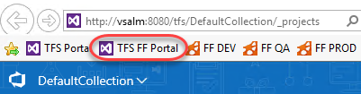

1. Select **Browse all** option from the team dropdown box in the top left corner of the portal.

    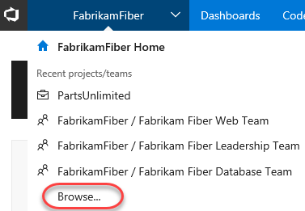

1. The new default view shows that the Fabrikam Fiber collection has one project in it named **FabrikamFiber**. This project contains a few different teams, with the **Fabrikam Fiber Leadership Team** being set as the default team for the project. We will take a closer look at teams in a later exercise. Note that this lab refers to this default team as both the leadership team and the management team. You have easy access to user-specific queries, and can also quickly jump to hubs for any given team by hovering over its row.

    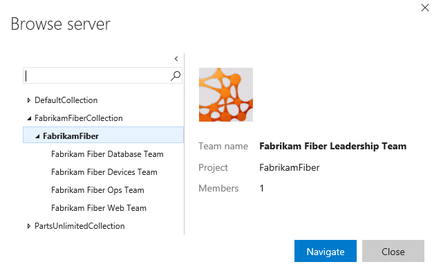

1. Select the **Fabrikam Fiber Web Team** and then click **Navigate**.

    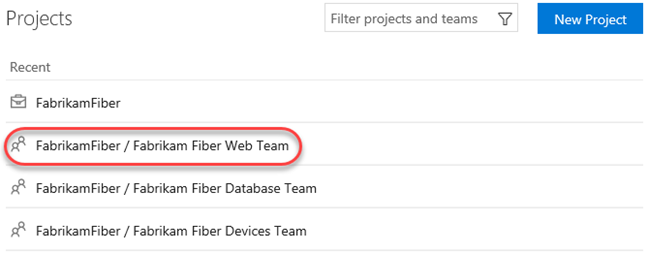

1. The **Home** view for the Fabrikam Fiber Web team provides a high-level overview of the current iteration (Sprint 3) including team workload versus capacity, burndown of tasks over time, and team favorites, which can include a configurable assortment of work item queries, build definitions, and version control paths. In addition, there are links to quickly create new work items and bugs, load the backlog, task board, initiate requests for feedback and so on.

    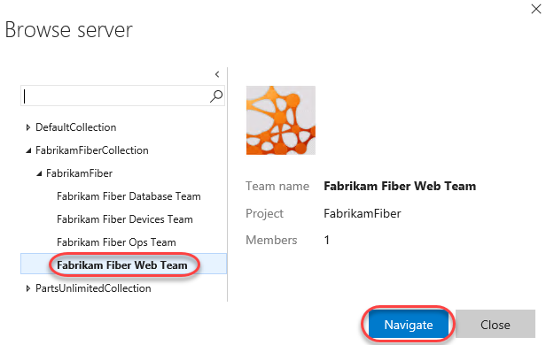

    > **Note:** Team favorites can be added or removed from within the web portal. For example, navigate to the Build tab to assign build definitions as a team favorite. In addition, team favorite work item queries can be modified from within Visual Studio.

    Each team can have different team favorites listed, different work capacity, and even different work items. The determining factor of where a work item will show up is governed by the **Area** field.

1. As you can see under the **Team Members** section, there are several members listed in this team. Teams are a concept that were originally introduced in Team Foundation Server 2012 to make it easier to manage, assign, and track work.

### Task 2: Working with the Backlog

1. Navigate to the backlog by clicking **Backlogs** under the **Work** section.

    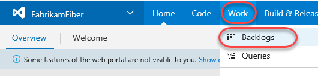

1. The product backlog helps define the work that needs to be done. Once you have a backlog, you can use it to help manage when that work gets done, as well as associate items on the backlog with check-ins, acceptance tests, or other criteria.

    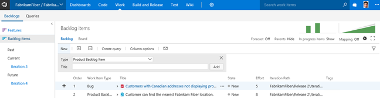

    > **Note:** The Current iteration shown in the tree on the left side of this screen is Iteration 3. Team Foundation Server uses the current date and time to determine the current iteration. The virtual machine you are using has been set to use a date of July 9, 2013 for purposes of this lab.

1. Imagine that the VP of Fabrikam Fiber has requested that a new user story be implemented for the customer-facing service portal. This new user story will enable customers to see weather-related service outages. This user story is being designated as high-priority because many customers requested it and customer service indicated that it would greatly reduce phone support during outages.

1. Select the last row of the product backlog and then create a new **Product Backlog Item** with the title **Customer should see weather-related outages on portal.**

    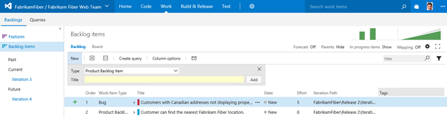

    > **Note:** New work items are generally inserted above the selected location. The exception is that if you select the last work item, the insertion will be after the selected location.

1. Click **Add** to add the new user story to the backlog.

    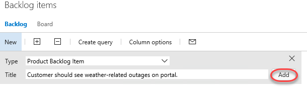

1. Work items on the product backlog are ordered based on priority with high priority items at the top. Our new work item has a high priority so move it to the top of the list by dragging and dropping it into place.

    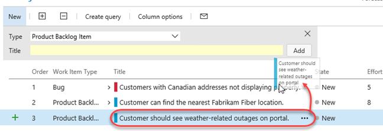

1. Let's edit the new user story to assign it to the appropriate product owner and record an initial estimate of expected effort. **Click** the new user story.

    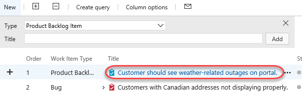

1. The work item form provides full access to every detail you'll ever need for a given work item. It's designed to be responsive so it can adapt to your device's form factor. If you want to make sure you're always aware of this work item changes, you can **Follow** it to get notifications. Note that if you click a link to a work item in a mobile browser, you will be rendered a mobile-friendly work item form.

    

1. You can also fill out many of the extended text fields using rich text. For example, locate the **Discussion** panel and type **"Customers have been asking about this forever!"**. You can then highlight **"forever"** and press **Ctrl+B** to emphasize it.

    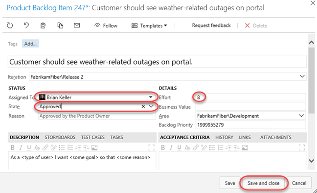

1. You can also drag and drop attachments directly onto the work item. Select the **Attachment** tab on the right side of the work item form. Then open an instance of **Windows Explorer** to **C:\Samples** and drag the **storyboard PPTX** file onto the **Attachments** panel.

    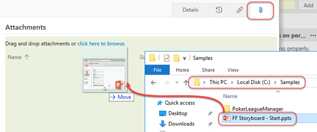

1. Return to the **Details** tab.

    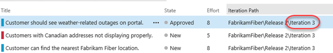

1. Assign the new item to **Deniz Ercoskun** (the product owner for the Fabrikam Fiber Team), set the state to **Approved**, and set an initial effort of '**8**'. Click **Save & Close**.

    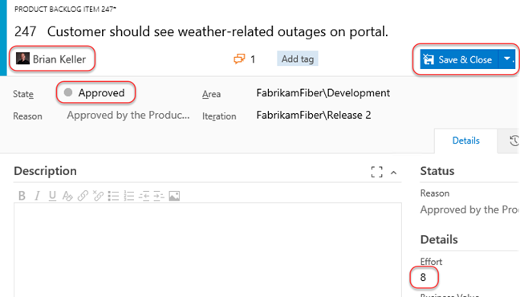

    > **Note:** Each team may choose to define the **Effort** value as they see fit, using a unit of story points, hours, days, or number of sodas required. The point here is that this measure is a relative value with respect to other work items. Work will be broken down into hours later.

    A popular planning approach that helps to eliminate group think and considers input from all team members is known as planning poker. You can read more about it at [http://en.wikipedia.org/wiki/Planning_poker](http://en.wikipedia.org/wiki/Planning_poker).

1. Assign the new user story to the current iteration, **Iteration 3**, by dragging and dropping it as shown below.

    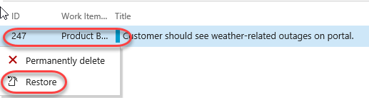

    > **Note:** If you are a Scrum purist, you are probably cringing at the fact that we just added new work to a mid-flight iteration. While this is something you might never do in the real world, this is a shortcut taken for purposes of this lab in order to simplify the workflow and still show you all of the aspects of the project management interface. Well, that and the VP told you to.

1. Look at the **Iteration Path** for the new user story to make sure that it is assigned to **Iteration 3** as expected. This user story will remain on the product backlog until the work has been completed.

    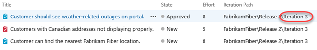

1. Open the work item once again and select the **History** tab. Here you can see a complete audit trail of every action performed against this work item, as well as state graph that makes it easy to visualize changes over time. Press **Esc** to dismiss the work item.

    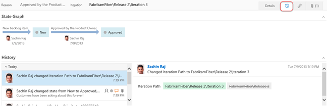

1. If you made a mistake when adding a work item, or if the work item simply shouldn't be part of the backlog for any reason, you can drag it to the **Recycle Bin**. Drag the item you just created onto the **Recycle Bin**. Then click the **Recycle Bin** to view its contents.

    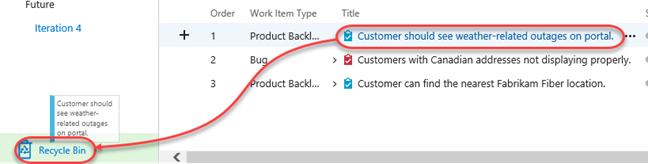

1. Right now it only contains the item you just deleted. Fortunately, you can right-click the item and select **Restore** to put it back where it belongs. Confirm the restoration when asked.

    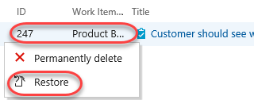

1. It's now time to return to the backlog. However, since you're in the **Recycle Bin**, there's no direct path. Fortunately, TFS now supports a variety of **keyboard shortcuts** that make rapid navigation as easy as possible. Press the "**?"** key (probably **Shift+/**) on your keyboard to view the available options.

    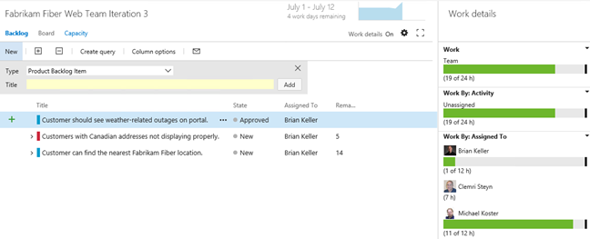

1. The shortcut to the backlog is the **l** (lowercase "L") key. Press it now to go there.

1. The product backlog view also provides a velocity chart that shows the amount of work that the team has undertaken in each sprint, with the current sprint breaking that down further to differentiate between work in progress and work completed. Click the mini chart in the upper-right corner to load the larger view.

    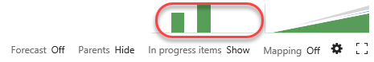

1. During _Iteration 1_, the team completed 35 story points worth of effort. _Iteration 2_ was more productive with 49 story points completed. The current iteration, represented by _Iteration 3_, shows that we do not currently have any work items in the Committed state. Remember that these story points are a relative measure of effort that was agreed upon by the team.

    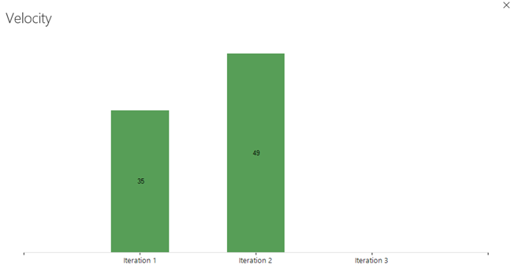

1. Press the **Esc** key to close the velocity chart.

1. The product backlog view also groups the past, current, and future iterations by their assigned dates. Click **Iteration 3** so that we can break down work and assign it to the appropriate team members.

    

1. Before we break down the new user story, let's take a quick tour of this iteration backlog view. To start with, it shows all user stories and associated tasks that are assigned to the selected iteration, regardless of state.

    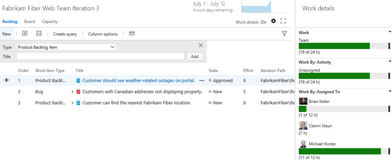

1. At a glance, you can see that the current iteration runs from July 1 to 12, with four work days remaining. Just to the right of the current iteration date range, there is a small graph showing the burn down of the remaining work.

    ****

1. Click the burn down graph to view it. The graph shows remaining work over the course of the iteration. It also provides insight for the **Available Capacity** that can be applied to the work (total work hours remaining across resources).

    

1. Press the **Esc** key to close the burn down graph.

### Task 3: Team Capacity Planning

1. Locate the overall **Work** bar that shows how close to capacity we are for the current iteration based on the total of the Remaining Work for the tasks in this iteration and based on the total capacity for the team. It looks like we are okay now, but we still haven't broken the new user story into tasks for the team yet.

    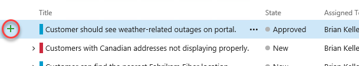

1. Select the **Capacity** tab to review the team capacity details.

    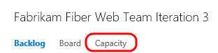

1. The capacity view allows us to specify the number of hours per day that each team member will be working on this project, days off per team member, and overall team days off. These capacity settings apply to the current iteration. You can optionally use the activity column to describe the disciplines that each team member specializes in. When tasks are broken down by activity as well, it can provide another view across your team's capacity to determine if, for example, you have enough people working on documentation to meet the demands for this iteration.  For now, leave the capacity settings unmodified.

    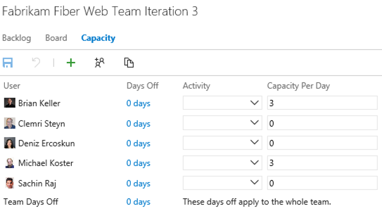

1. Return to the **Backlog** view for the current iteration.

    

1. Let's say that the decision is made to proceed with committing to the new work item. Return to the **Iteration 3** backlog view. Click the button with the '**+**' symbol in it to the left of the new user story to add a new task. This will become a child task of the user story and will be used to help describe the implementation details required to complete this user story.

    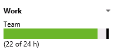

1. For the new task, enter "**Consume OData feed for weather alerts**" for the Title, assign it to **Deniz Ercoskun**, and set the Remaining Work to **8** hours.

    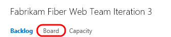

1. Select the **Links** tab and you can see that this task has already been linked to its parent work item.

    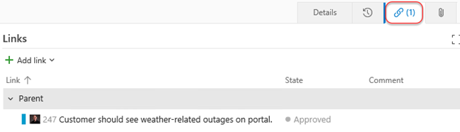

1. Click **Save & Close**.

    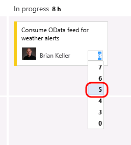

1. Note that the new task was added as a child of the user story and that the overall team work bar has turned red indicating that we have too much work assigned based on capacity.

    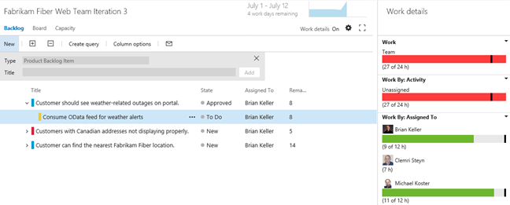

1. It looks like the bug has not been worked on yet, so this may be a good candidate to reschedule for a future iteration so that the team can get back on track given their additional workload. Drag and drop the bug onto **Iteration 4** on the left-hand side of the window.

    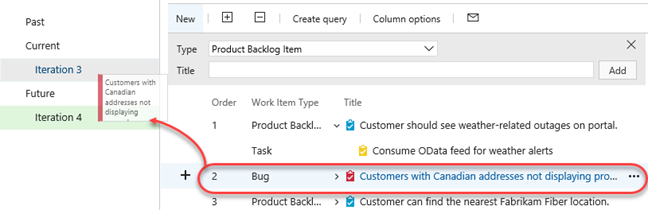

1. Take another look at the overall **Work** bar once again to make sure it is now green. This means that we are within the current team capacity. Just don't tell the VP, or he might find another high-priority request for us to work on!

    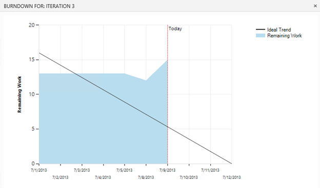

### Task 4: Working with the Task Board

1. Now that we have finished breaking down the work and assigning it to team members, let's take a look at the task board that will be used in the next stand-up team meeting to report and record progress. Select the **Board** tab from Iteration 3.

    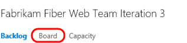

1. By default, the task board shows all tasks for the current iteration grouped by product backlog item and by the current state. Drag and drop the "**Consume OData feed for weather alerts**" task to the **In Progress** column.

    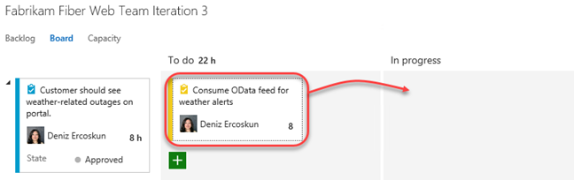

    > **Note:** The task board is touch enabled as well. This will not work within this virtual machine, but you might want to put in your request now for that nice wall-mounted touch-screen monitor you have been desiring for your team.

1. **Single-click** the '**8**' value shown on the **Consume OData feed for weather alerts** task and change the Remaining Work to **5** to simulate Brian working on the task during the day.

    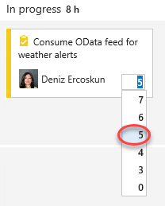

1. The new high-priority task is now in progress with an estimated 5 hours of work left to go.

    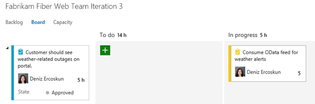

1. Drag and drop the task titled **Create database for branch office location lookup** to the **Done** column to record that work as completed. Note that the remaining work is automatically reduced to **0**.

    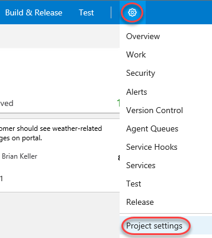

1. Notice that the burn down chart in the top-right corner is automatically updated after you made changes on the task board. Click the burn down chart and note that there is about 15 hours of effort left in order to complete the work for the iteration.

    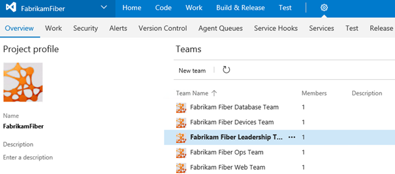

1. Close the burn down chart.

1. Note that each row representing a work item shows a rollup of hours remaining, which is a sum of remaining work for all child tasks. In addition to that each column representing a status has a rollup of remaining work giving you a good idea of how much work the team is actively working on right now.

    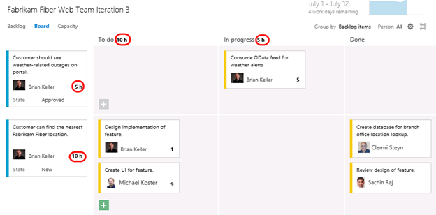

1. The task board also groups by team members. Select the **People** grouping option in the top-right of the task board view.

    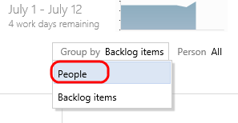

1. This view makes it easy to see what team members are currently working on and how much effort remains for each for the remainder of the current iteration.

    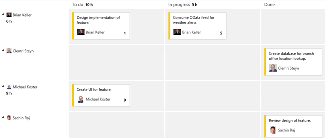

### Task 5: Using work item search

1. With work item search, you can quickly and easily find relevant work items across all projects in an account. Click the search box at the top of the page to expand the search help. Note that you can specify filters for properties like state and type inline.

    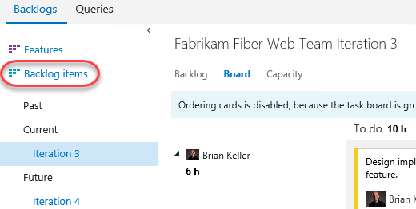

1. Search for **customer**.

    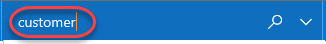

1. There will be many results for this generic query. You can use the options on the left side to filter down to the work items you're looking for. You can also edit the selected work item inline using the form on the right.

    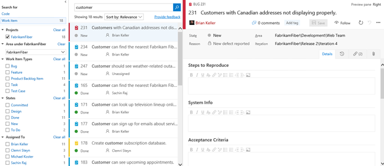

1. Append **"t:Task"** to the end of the query and press **Enter** to filter down to just tasks.

    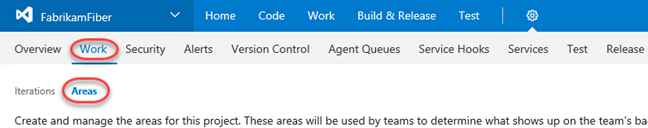

1. Append another inline filter **"s:To Do"** and press **Enter** to filter down to tasks with that state.

    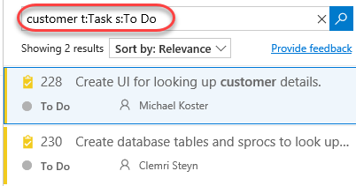

1. Append **"a:Clemri"** to filter down by assignment. TFS will offer Clemri's account in a drop down. Click it to autocomplete the query.

    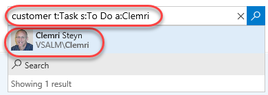

1. The full path to Clemri's account will be inserted. Press **Enter** to run the search.

    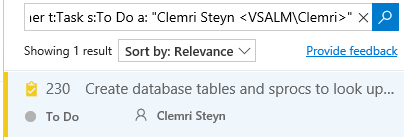

1. In addition to searching through work items, you can also search code using the same process in the **Code** hub.

## Exercise 2: Agile Portfolio Management

In this exercise, you will learn about some of the agile portfolio management capabilities provided by Team Foundation Server. These capabilities allow larger organizations to understand the scope of work across several teams and see how that work rolls up into broader initiatives. In this exercise, you will explore how multiple teams at Fabrikam Fiber can collaborate together to work on features.

### Task 1: Configuring Team Hierarchy and Area Paths

1. Let's start out by taking a look at the Fabrikam Fiber project from the top-down, in a manner that would typically be associated with a management role.

1. From the gear icon in the top-right corner of the web portal, select **Project settings**.

    

1. The FabrikamFiber project has five teams, with the **Fabrikam Fiber Leadership Team** assigned as the project default.

    

1. Underneath the **Work** tab, select the **Areas** tab.

    

1. The management team currently owns the **Development** area and all sub-areas. This gives them visibility into the backlog of all teams, even for work items that are not mapped to features. Optionally, the management team could also choose to not include sub-areas, thereby removing work items from their product backlog view as soon as they are assigned to one of the teams.

    

1. From the team dropdown in the upper left corner, select the **Fabrikam Fiber Database Team**.

    

1. Select the **Areas** tab. The **Database** team is currently configured to see work items from just the root Development area and the Database Team sub-area. This allows them to see backlog items created by the management team and ones specifically assigned to their team. With this kind of structure, each team can work independently on its own backlog, defined by its area path, unrelated to the other team's work.

    

1. From the project dropdown, select **Fabrikam Fiber Leadership Team** to return to that scope.

    

1. Select **Work \| Backlogs** to return to the backlog visible to the leadership team.

    

1. Select the **Backlog items** tab.

    

### Task 2: Portfolio Management

1. The leadership team can see backlog items across all teams, including status and scheduled iteration.

    

1. The backlog view also includes the ability to toggle the display of in-progress work items. Toggle the "**In progress items**" link in the top-right corner of the backlog view and note that the Committed work items are no longer displayed. Toggle the link once again to view in-progress items before moving on.

    

1. Note that the in-progress work items are no longer displayed. Toggle the link once again to view in-progress items as before.

1. Click **Features** to view the feature backlog.

    

1. This view shows the top-level features for the project. It is possible to drill down into backlog items and even individual tasks if desired. Click the **Expand** button to expand one level.

    

1. Click the **Expand** button once again to drill down into tasks.

    

1. It is also possible to re-parent work items using drag-and-drop operations in the portfolio backlog view. Try this out by dragging and dropping one of the product backlog items from one feature to another.

    

1. Note that this moved the product backlog item as well as all of the child tasks. Drag the product backlog item back to its original feature.

1. The child work items are always shown for the leadership team, regardless of which team they are assigned to. To see this more clearly, let's add the **Area Path** column to the view.

1. Click **Column Options**.

    

1. Double-click **Area Path** from the available columns and then click **OK**.

    

    

1. If you look at the area path column for different product backlog items, you can see that they are assigned to different teams. The ability to drill down into the various backlogs gives the management team the desired level of visibility into the breakdown and implementation of features.

    

1. Now let's take a look at how to create a new feature and then link it to a work item that will be assigned to one of the agile teams. Create a new feature titled **"Reporting for technicians and services"** and then click the **Add** button.

    

1. Click the **"+"** button on the left-hand side of the new feature to add a child product backlog item.

    

1. Create a new product backlog item named **"Modify databases to support on-demand reporting for technician activity"**. Assign it to the database team lead, **Deniz Ercoskun**. Set the **Area** to the **Database Team** so that it shows up on their backlog. Finally, click **Save & Close**.

    

    > **Note:** In the event that you create items within the backlog, you can also easily map them to parent Features by enabling the Mapping feature and then dragging and dropping.

    

1. Now let's load the web portal for the database team. Navigate to the **Fabrikam Fiber Database Team** using the top navigation as before.

1. Switch to the backlog item view.

    

1. Although this team may normally only want to view their backlog items, they may also want to see how those backlog items fit in to the bigger picture. Toggle the **Parents** option that is currently set to **Hide**.

    

1. Note that the backlog view now shows parent Feature items.

    

    **Note**: After completing this lab, the virtual machine will continue to run with the date & time that was set for demonstration purposes at the beginning of this lab. Don't forget to reset the virtual machine to its original snapshot/checkpoint after you complete this lab, unless you are moving on to a follow-up lab based on this lab's endpoint.
