

## Overview

In this lab, you will learn about the agile planning and portfolio management tools and processes provided by Team Foundation Server 2018 and how they can help you quickly plan, manage, and track work across your entire team. You will explore the product backlog, sprint backlog, and task boards which can be used to track the flow of work during the course of an iteration. We will also take a look at how the tools have been enhanced in this release to scale for larger teams and organizations.

## Prerequisites

In order to complete this lab you will need the Visual Studio 2017 virtual machine provided by Microsoft. Click the button below to launch the virtual machine on the Microsoft Hands-on-Labs portal.

<a href="https://labondemand.com/AuthenticatedLaunch/38293?providerId=4" class="launch-hol" role="button" target="_blank">Launch the virtual machine</a>

Alternatively, you can download the virtual machine from [here](../almvmdownload/)

**Important note**:

This lab requires you to use the default state of the virtual machine, before any modifications are made to work items or source in TFS. If you followed the "Working with the Visual Studio 2017 ALM Virtual Machine.docx" instructions you should already have a snapshot/checkpoint of the virtual machine before working with it for the first time. Apply this snapshot/checkpoint before starting this lab.

## About the Fabrikam Fiber Scenario

This set of hands-on-labs uses a fictional company, Fabrikam Fiber, as a backdrop to the scenarios you are learning about. Fabrikam Fiber provides cable television and related services to the United States. They are growing rapidly and have embraced Windows Azure to scale their customer-facing web site directly to end-users to allow them to self-service tickets and track technicians. They also use an on-premises ASP.NET MVC application for their customer service representatives to administer customer orders.

In this set of hands-on labs, you will take part in a number of scenarios that involve the development and testing team at Fabrikam Fiber. The team, which consists of 8-10 people has decided to use Visual Studio application lifecycle management tools to manage their source code, run their builds, test their web sites, and plan and track the project.

## Exercise 1: Flexibility of Agile Tools

In the previous exercise, you learned about how Team Foundation Server can scale to meet the needs of larger teams working towards common goals. This approach requires that everybody in the organization uses the same team project within Team Foundation Server and therefore the same process template (which defines the way work items and their workflows are defined). Understanding this, Microsoft has begun to allow individual teams to customize certain aspects of the ways in which they manage and track their work without requiring centralized changes to their process templates.

In this exercise, you will learn more about Kanban and how it contributes to the flexibility of the agile toolset. You will also learn about work item tagging. Both of these features can be utilized and customized independently by different teams, without making changes to the underlying process template.

### Task 1: Introduction to Kanban Tools

1. The **Kanban** board was first introduced with Team Foundation Server 2012 Update 1. Kanban is a process improvement tool that can be used in an incremental fashion regardless of the current software development methodology that you are using. It assists with the throttling and tracking of work and illustrates the delivery of value over time to the project stakeholders. Each backlog has its own Kanban board, and each team has its own view of that.

1. Navigate to the **Fabrikam Fiber Devices Team** using the navigation as before. Note that you may need to browse for the team if it hasn't been accessed recently.

    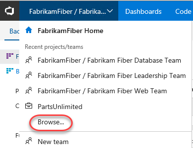

1. Navigate to the backlog Kanban board for this team.

    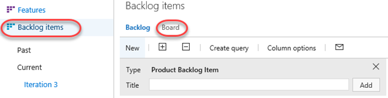

1. The Kanban board shows the top backlog items across all states and iterations allowing you to move items between states and allows you to set Work in Progress (WIP) limits for each state. One of the primary reasons for using Kanban and limiting work in progress is that it helps identify bottlenecks in your development process and minimize lead time for new features. Let's say that the devices team is not delivering finished work as quickly as desired, and that it is suspected that the underlying issue may have to do with taking on too many tasks at once at the beginning of each sprint (and the associated context-switching tax). If we are more careful about the number of tasks that we commit to, perhaps we can better focus our efforts.

1. To start off with, click the **Enable Live Updates** button. This will ensure that any changes made to the Kanban board on other clients will be immediately updated on this board. In this scenario we just have one window, but in large teams this can be extremely useful.

    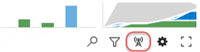

1. Next, let's lower the **Work in Progress** limit for the **Committed** state to see what the Kanban board looks like when too much work has been committed to at once. Right now, the limit is **5** work items.

    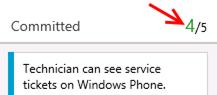

1. Click the **Configuration** button (it has a gear icon) to open the **Configure settings** dialog.

    

1. Select the **Columns** tab and click the **Committed** column. Set the **WIP Limit** to "3" and click **Save**.

    

1. On the Kanban board, column headers will provide an indication when a Work in Progress limit is exceeded. In this case, the **Committed** column shows us that we have exceeded the limit.

    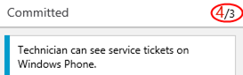

    > **Note:** Work in Progress limits provide feedback when appropriate but they do not prevent a team from taking on additional work. You need to actively check the Kanban board in order to discover that you are exceeding set limits.

1. You can also configure the Kanban boards to show (or hide) bugs as desired. Click the gear icon to return to the settings dialog.

    

1. Navigate to the **Working with bugs** tab and select the option **Bugs are managed with requirements**. Click **Save**.

    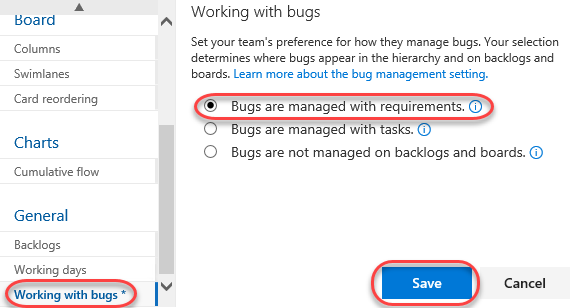

1. Click the **New Item** button and then select **Bug**.

    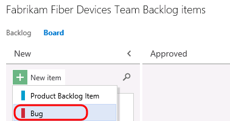

1. Add a new bug entitled **"Rendering artifacts on iPhone"** and then press **Enter** to save.

    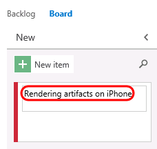

1. You can also reorder the backlog priority from the Kanban board. In the **Committed** column, drag the bottom card to the top of the column.

    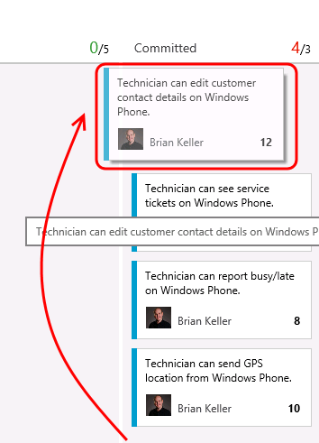

1. Filtering on the Kanban board is another key feature for teams. Click the **Filter** button and search for "**technician**".

    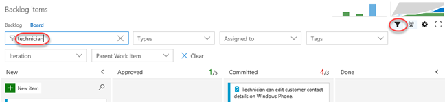

1. Locate the **Technician can see...Windows Phone** work item. Click the **3/4** indicator that illustrates that 3 of the 4 tasks associated with this work item have been completed. Now you can easily see (and update) the tasks at hand using the checklist.

    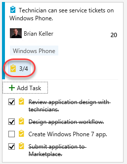

1. Clear the search filter and hide the filters.

    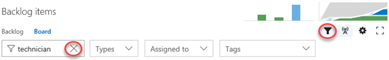

1. Sometimes you may prefer not to have these annotations visible in the cards. Click the **Configure settings** icon button to open the configuration dialog.

    

1. Select the **Annotations** tab and uncheck the **Tasks** box. Click **Save**.

    

1. Note that the Task annotations are no longer visible.

    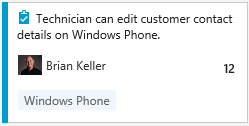

1. Let's say that the devices team has decided that they want to add in a column that represents work that has been tested on a physical device. This is the only team that would desire to keep track of such a state, and they can easily add this to their Kanban board.

1. Click the **Configure settings** button. Here you can add, remove, delete, and even rename columns to better suit your team workflow. However, you are still subject to restrictions put in place by the underlying process template, so you must map columns to valid work item states and respect the valid state transitions.

    

1. Navigate to the **Columns** tab and click the **+ Column** button. Reorder the new column to be next to **Done** and set its **Name** to **"Device Tested"**.

    

1. You can also modify what your team considers to be the meaning of the Definition of Done for each Kanban column. This will help teams to stay on the same page even when a work item should be moved to the next state. Scroll down to the bottom of the form and define the definition of "done" for this column using plain text or Markdown. Provide the message **"Has been tested on Android, Windows Phone, and iPhone"** and click **Save**.

    

1. You new column is now live on your board, and you can click the helper icon to see the **Definition of Done**.

    

1. Kanban support also adds a new graph to the backlog views called the **Cumulative Flow Diagram**. Click the small diagram to open it.

    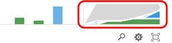

1. The Cumulative Flow Diagram (CFD) shows the amount of work in various states over time for the selected team. The horizontal axis shows lead time and the vertical axis shows work in progress.

    

    > **Note:** The CFD shown above does not necessarily represent an ideal scenario where a team is providing continuous output. More typically and ideally, you would see bands of color representing all states increase over time like the following diagram.

    

1. Press the **Esc** key to close the CFD.

1. The Kanban board has a ton of great and convenient configurability options designed to adapt to the way your team works. Reopen to the **Configure settings** dialog used earlier.

    

1. Navigate to the **Fields** tab. Here you can configure each work item type to show ID number, Assigned to field, Effort, Tags, or other fields that you wish to show. These options are configured per team, giving each team the flexibility it needs to manage its own workflow. Select the options to **Show ID** and **Show empty fields** (you may need to scroll down for this one).

    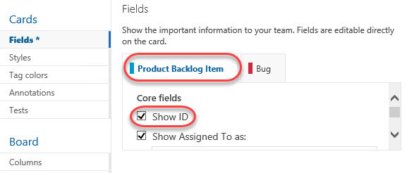

1. Switch to the **Bug** tab and check the same boxes here as well. Click **Save** to confirm.

    

1. Now each work item displays its ID, which is very useful if your team uses these in discussions or in references from code or documentation.

    

1. In addition, the empty fields are now "shown" in the card, which allows you to initialize them inline. Locate the item created earlier and assign it to **Deniz Ercoskun**.

    

1. Swim lanes are a key feature for teams when managing workloads. These horizontal lanes can be added to Kanban boards to further categorize work, with a common use of this to create an "expedite" lane for high-priority work that needs to skip through the normal workflow. Reopen the **Configure settings** dialog used earlier.

    

1. Kanban boards only have a single swimlane by default, you can add in as many lanes as you want. For example, you can use them to categorize items by severity (expedite, normal), departments, tiers, and so on. Navigate to the **Swimlanes** tab and add a new swimlane named "**Expedite**".

    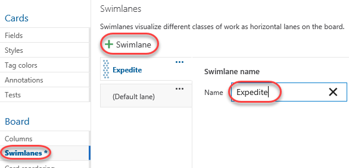

1. Rename the default lane to "**Normal**" and then click **Save**.

    

1. Expedite one of the work items using drag and drop.

    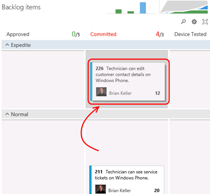

1. In addition to the customization of board behavior, the cards themselves can be easily styled. Click the **Configure settings** icon button to open the configuration dialog.

    

1. Select the **Styles** tab and click **Styling rule**. Set the **Name** to **"High severity"**. This rule will change the style of the cards for bugs with high severity in order to make them easier to identify.

    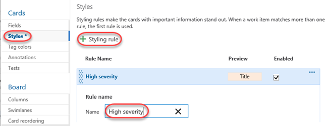

1. Scroll down to change the **Card color** to a strong red and set the first clause to **"Severity = 1 - Critical"**.

    

1. Select the **Tag colors** tab and set a tag coloring rule to easily identify all cards tagged with **"Windows Phone"**. Click **Save** to continue.

    

1. On the board, you can now see that backlog item tags for **"Windows Phone"** are colored yellow and are easy to identify.

1. Locate the bug created earlier and click to open it.

    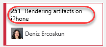

1. Change the **Severity** to **1 - Critical** and click **Save & Close**.

    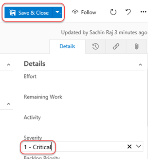

1. Note that the bug card is now colored red to indicate its critical severity.

   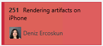

### Task 2: Kanban prioritization

1. As cards are reordered within a column on the Kanban board, their relative priorities are adjusted in the backlog. Select the **Backlog** tab and notice that the "Technician can see service tickets..." work item is prioritized above "Technician can report busy/late...".

    

1. Return to the **Board** tab. Locate item #216 and drag it above #211. Note that the card may slide back to the bottom. However, it still has been reordered.

    

1. Return to the **Backlog** tab and notice that the work items have been appropriately reprioritized to reflect their order on the board. Also note that "Customer should see weather-related outages..." has the highest priority in the backlog.

    

1. Return to the **Board**. Drag-but do not drop-the "Customer should see weather-related outages..." card from the **Approved** column over the **Committed** column. Note that as you move it vertically, the existing cards in the column move to allow you to drop it anywhere. Return to drop the card over its original **Approved** column so that no changes are made.

    

1. While this may be desirable to some teams, there are other teams that would prefer backlog item prioritization to be enforced as cards are moved between columns. After it, it can be difficult to understand where a card is currently prioritized as you graduate it from stage to stage. Click the **Configure settings** icon button to open the configuration dialog.

    

1. Select the Card **reordering** tab and select the second option. This will enforce that cards are placed in the appropriate place in a given column based on their relative priority in the backlog. Note that both options have sample animations to illustrate each behavior. Click **Save**.

    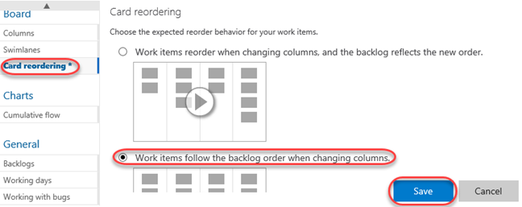

1. Once again, drag the card from the **Approved** column over the **Committed** column. Note that this time, the cards in the target column don't budge. Go ahead and drop it anywhere over the **Committed** column and note that it automatically flows to the top since it has the highest priority of the items in that column.

    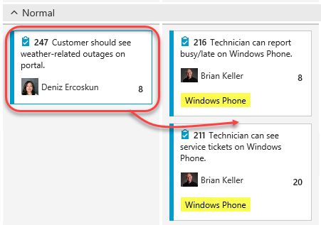

1. It's important to note that while this setting controls the behavior of card reordering when a card it moved between columns, you can still easily reorder cards within a given column. For additional information on using the Kanban board, please see "[Kanban basics](https://msdn.microsoft.com/Library/vs/alm/Work/kanban/kanban-basics)".

1. In addition to viewing by backlog items, you can also view the Kanban board relative to features. Click **Features** to switch the board mode. You can then click on the **Backlog Item** annotations to expand their checklists.

   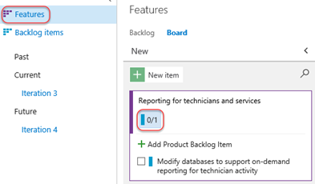

### Task 3: Work Item Tagging

1. **Work item tagging** allows you to easily categorize, query and filter lists of work items.

1. Navigate to the **Fabrikam Fiber Leadership Team**.

    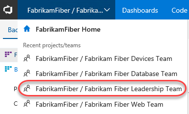

1. Navigate to the **Backlog Items** view.

    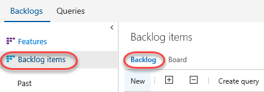

1. Let's say that a cross-team initiative is put in place to give customer facing work items higher priority. Also imagine that the product backlog is quite large, so much that visually searching through all titles and assigning them to sprints and teams has become quite time consuming. One way to help with this is to create work item tags and then filter the list of work items.

1. Note that a number of work item tags are already in place.

    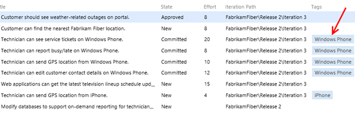

1. **Double-click** the work item titled **"Customer should see weather-related outages on portal"**.

1. Click **Add tag** to add a tag.

    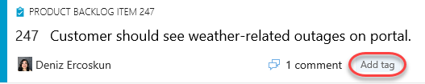

1. Enter the text "**Customer**" and then click **Save & Close**.

    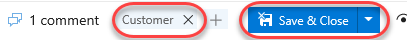

1. Repeat the process of tagging any work items that appear to be customer facing. You should end up with something like the following screenshot, but there is no need to match it exactly.

    > **Note:** You can create work item queries that include tags.

    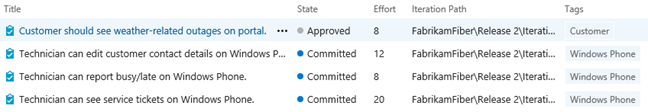

1. With the desired tagging in place, click the **Filter** button in the top-right corner of the backlog list.

    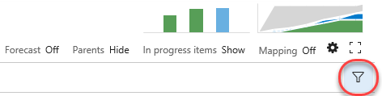

1. Filter down to the **Customer** tag.

    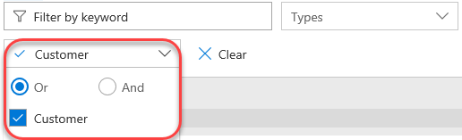

1. With this filtered view the teams will have a much easier time finding the work items that they should focus on first. Note that this filtering also disables the ability to add new backlog items, disables stack ranking and forecasting.

    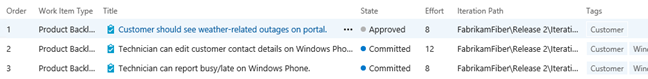

    > **Note:** Additional filtering can be done by selecting another tag (if there are any in this filtered subset). To remove the filter, simply click the Filter button once again.

## Exercise 2: Work Item Charting

In this exercise, we will demonstrate the work item charting capability of Team Foundation Server. Work item charting allows you to create visual chart representations of the data returned from TFS work item queries. This can be used to help better understand the state of projects.

### Task 1: Creating and Sharing Work Item Charts

1. Let's say that the Fabrikam Fiber management team would like to better understand how tasks are broken down by user. Navigate to the work item queries section of the web portal. Select **Work \| Queries**.

    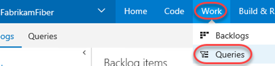

1. Since these charts are based on work items, we first need to define a query that will return the data that we are interested in. Click **New** and select the **New Query** option.

    

1. The default query will select all work items in any state for the current project. We want to select just Tasks, so modify the value of clause for **Work Item Type** to be **Task**.

    

1. Click the **Save Query As** button.

    

    > **Note:** Work item charts require the associated query to return a flat list of work items.

1. Name the query "**All Tasks"**, select the folder "**Shared Queries**", and then click **OK**.

    

1. Select the **Charts** tab and click **New chart**.

    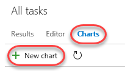

1. Title the chart "**Tasks by User**", group by the **Assigned To** field, and then click **OK**.

    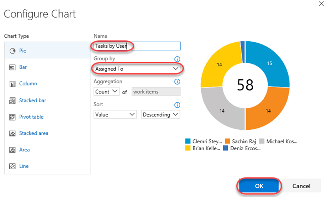

1. Let's create one more chart to help visualize the task progress for each team member. Click **New Chart** once again.

1. Select the Stacked **Bar** chart type. Note that this chart type requires you to specify two different fields for the rows and columns.

    

1. Title the chart "**Task State by User**", select the **Assigned To** field for the **Rows**, select the **State** field for the **Columns**, and finally click **OK** to create the chart.

    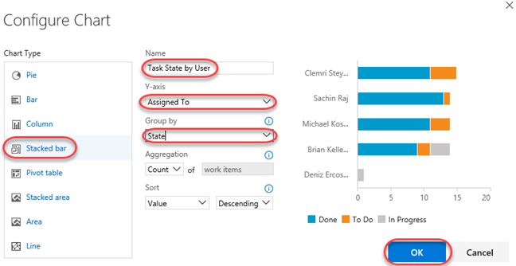

    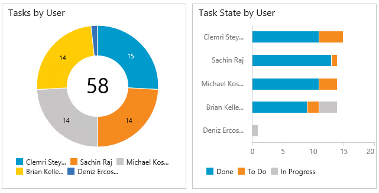

1. You can add to the available grouping options by modifying the work item query and adding in additional display columns. Select the **Editor** tab for the query.

    

1. Click **Column Options**.

    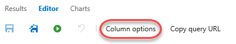

1. Select the **Task** item for the **Work Item Type**.

    

1. Double**-click** the **Area Path** option from the Available Columns list.

    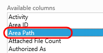

1. Click **OK**.

    

1. Click the **Save** button.

    

1. Select the **Charts** link to return to the charts view and use your charting skills to create a pie chart showing tasks grouped by the **Area Path** field. Title the chart "**Tasks by Team**", select the **Area Path** field for the **Group By** field, and finally click **OK** to create the chart. This gives the management team an idea of how the work is distributed amongst the teams.

    

1. These lightweight charts can also be pinned to a dashboard. Click the **Tasks by Team** chart's ellipses button and select **Add to dashboard \| Overview**. This dashboard is used on the project's home page.

    

1. Navigate to the **Overview** dashboard.

    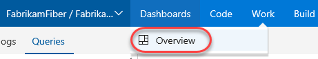

1. Click the **Home** link to return to the leadership team's homepage and view the pinned chart.

   

### Task 2: Customizing the dashboard

1. You can also customize a dashboard by clicking the **Edit** button in the bottom right corner. This will switch the dashboard into **edit mode**. You need to be in edit mode in order to rearrange the dashboard or make configuration changes, which removes the risk of accidental edits during normal usage.

    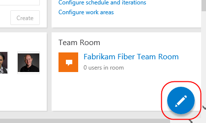

1. Utilize the **Remove** buttons to clean up the dashboard a bit. It doesn't matter which items you remove.

    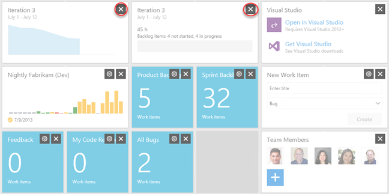

1. You can also easily add new items to the dashboard by clicking the **Add Widget** button. Try it now.

    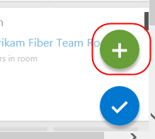

1. Search for the **Markdown** widget and click **Add**. This widget allows you to display any markdown file from your repository on the dashboard. Alternatively, you can provide the markdown manually. Click **Close**.

    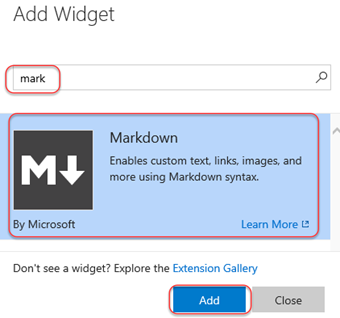

1. Locate the Markdown widget on your dashboard and click its **Edit** button.

    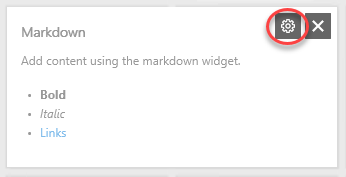

1. This will provide you with access to key settings, such as the size of the widget, as well as the source of the Markdown to display. Press **Esc** to cancel.

    

1. Click the **Manage Dashboards** button in the top right corner of the view.

    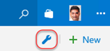

1. This dialog provides access to functionality for managing your dashboard, including its creation. Note that each dashboard has an option to **Auto-refresh**, which is great for scenarios where you want to display information in public team areas, such as on large TVs.

    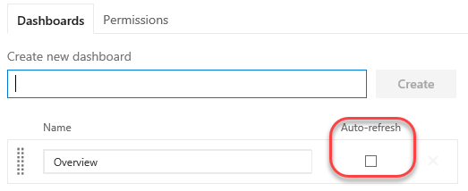

1. When satisfied, click the **Close Edit Mode** button to apply all changes.

    

1. You can also create additional tabs for your dashboard in orders to offer different views into the project. Click the **Add a new Dashboard** button to create a new dashboard.

    

1. Enter **"Quality"** as the name and click **OK**.

    

1. You now have multiple dashboard tabs and can edit and customize each using the same process from earlier.

    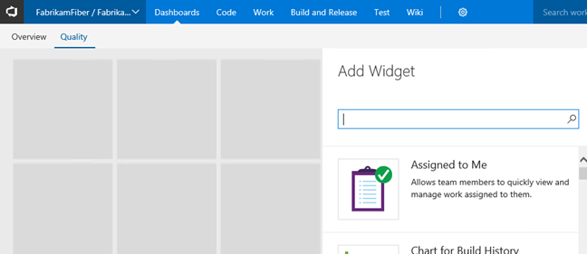

    **Note**: After completing this lab, the virtual machine will continue to run with the date & time that was set for demonstration purposes at the beginning of this lab. Don't forget to reset the virtual machine to its original snapshot/checkpoint after you complete this lab.