Lab version: 15.0.26020.0

Last updated: 2/28/2017


## Overview

[Visual Studio Application
Insights](https://azure.microsoft.com/services/application-insights) is
an extensible analytics service that helps you understand the
performance and usage of your live web application. It's designed for
developers, to help you continuously improve the performance and
usability of your app. It works with web apps on .NET or J2EE, hosted
on-premises or in the cloud. You can also apply it to Windows background
services and desktop apps.

In this lab we will start with a fresh ASP.NET application and explore
how you can instrument it with Application Insights. This will make it
easier to track site usage and patterns, as well as to detect, diagnose,
and triage issues related to performance and more.

## Pre-requisites

In order to complete this lab you will need the Visual Studio 2017
virtual machine provided by Microsoft. For more information on acquiring
and using this virtual machine, please see [this blog
post](http://aka.ms/almvm).

You will also need an Azure account, which you can set up at
<http://azure.com>.

## Exercise 1: Instrumenting with Application Insights

### Task 1: Adding Application Insights to an ASP.NET Application


1.  Log in as **Sachin Raj (VSALM\\Sachin)**. All user passwords are
    **P2ssw0rd**.

2.  Launch **Visual Studio** from the taskbar.

3.  Select **File \| New \| Project** from the main menu.

4.  From the **Visual C\# \| Web** section, select the **ASP.NET Web
    Application (.NET Framework)** template and enter a **Name** of
    **“AppInsightsLab”**. Click **OK** to continue.

    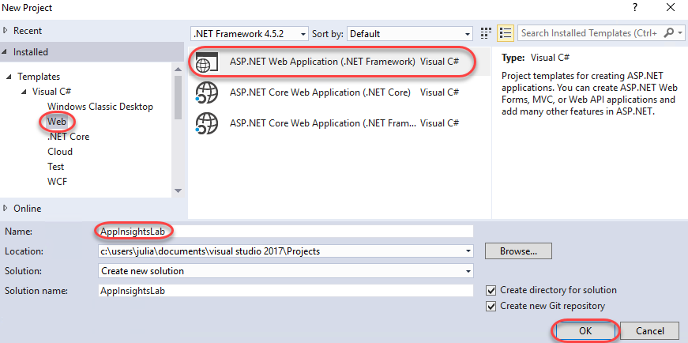

5.  Select the **MVC** template and uncheck **Host in the cloud**.
    Everything we’re covering here works just as well regardless of
    where it’s hosted, so we’ll work locally to keep things simple.
    Click **OK** to create the project.

    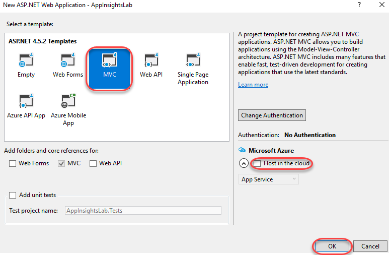

6.  Press **F5** to build and run the app. As you can see, there’s
    nothing special here yet. Close the browser to end the
    debugging session.

7.  In **Solution Explorer**, right-click the **AppInsightsLab** project
    node and select **Application Insights | Configure Application
    Insights**.

    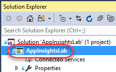

8.  By default, the NuGet references to the core Application Insights
    packages are added. However, you’ll need to connect with an Azure
    account to collect and analyze data. Click **Get started for free**.

    

9.  Click **Sign in** and sign in with your Azure account.

    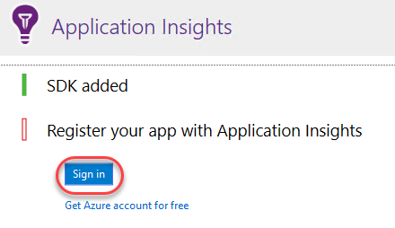

10. Click **Register for free** to use the default settings. Click
    **Finish** when the process completes.

    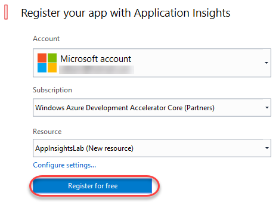

11. Click **Collect traces from System.Diagnostics** to add that trace
    listener to the project. This will enable you to send logs to
    Application Insights so that they can be merged in with other
    telemetry data collected in the application. Click **Finish** when
    the process completes.

    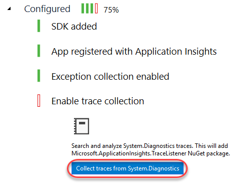

12. Let’s walk through **Solution Explorer** to take a look at what was
    added and changed to the project. First, locate the **Application
    Insights** folder inside the **Connected Services** node. This
    provides a link to more information on getting started.

    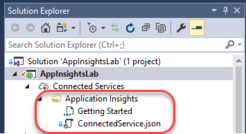

13. Expand the **References** node and locate the
    **Microsoft.AI.\*** assemblies. These are the payloads of NuGet
    packages added by Application Insights.

    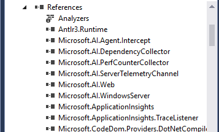

14. Double-click the **ErrorHandler\\AiHandleErrorAttribute.cs** file to
    open it.

    

15. This class contains a global exception handler that automatically
    sends unhandled exceptions to Application Insights for logging.

    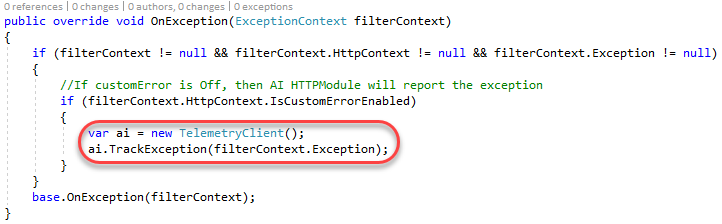

16. Double-click the **Views\\Shared\\\_Layout.cshtml** file to open it.

    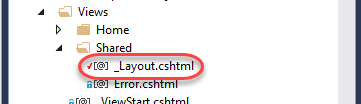

17. This file is the outer-most template for HTML pages rendered by
    this application. Application Insights has inserted initialization
    code inside the **&lt;head&gt;** tag so that you can immediately
    start using the JavaScript API to instrument the client-side portion
    of the application. Note the **instrumentationKey** property in the
    middle of the code block. This key is unique to your Application
    Insights account.

    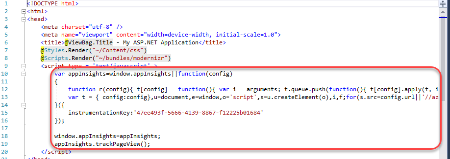

18. Double-click **ApplicationInsights.config** to open it.

    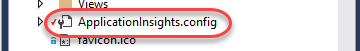

19. This file contains virtually all of the configuration used by
    Application Insights on the server. Note the same **InstrumentationKey**.

    

20. Finally, **packages.config** has been updated to reflect the NuGet
    packages and **Web.config** has been updated to reflect the
    assembly references.

    

### Task 2: Tracking usage data

1.  Press **F5** to build and run the project. Navigate around the site
    for a few pages using the navigation links at the top to
    generate traffic. Be sure to visit the **Contact** page.

    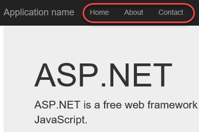

2.  Leave the browser window open and return to **Visual Studio**.

3.  Click the **Application Insights** button. Note that it may be
    minimized inside a collapsed menu button if the window is narrow.

    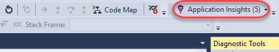

4.  The default action of the button is to open the **Application
    Insights Search**. This provides access to the full set of telemetry
    data collection throughout the application’s history. Search for
    **“contact”** and click the first result that comes up.

    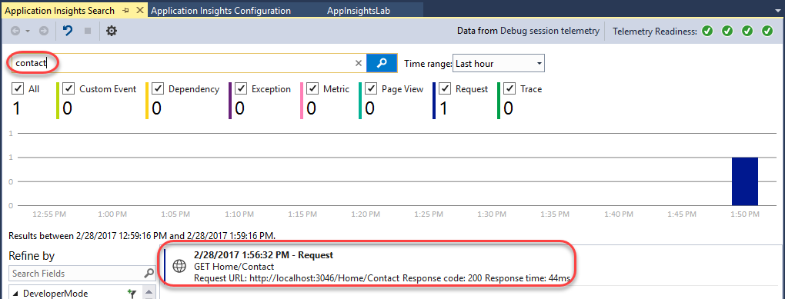

5.  The **Request Details** that open provide a wealth of information
    about the collected data from the request, such as the request and
    response details. Click the **Track Operation** tab.

    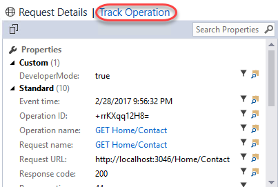

6.  The **Track Operation** tab provides the details and timeline of the
    steps involved in the request. In this case, it’s a pretty simple
    single-step operation that succeeded.

    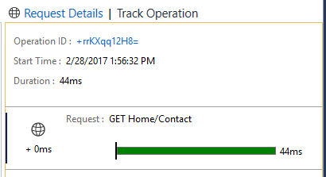

### Task 3: Working with the Application Insights Portal

1.  Open a new browser window (not a new tab in the debug
    browser window) and navigate to <https://portal.azure.com>. The
    portal provides even more functionality.

2.  Click **Application Insights** from the navigation menu.

    

3.  Click the **AppInsightsLab** account to open it.

    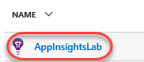

4.  The **Overview** blade provides a dashboard view of the account.
    There are shortcut links and standard reports as well.

    

5.  Click the **Open chart in Analytics** button.

    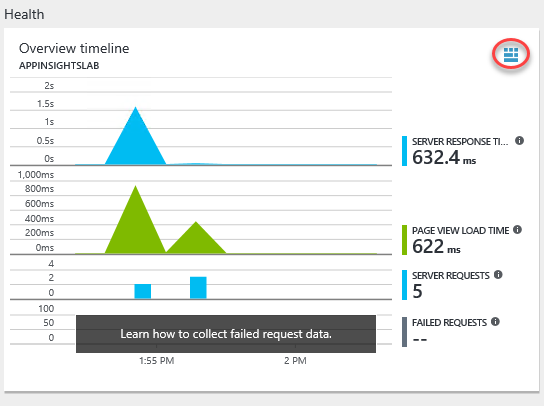

6.  This will open the extremely powerful **Analytics** engine for query
    and analysis. You can create virtually any kind of report you need
    using the flexible syntax and access to everything in the platform.
    Close the browser tab.

    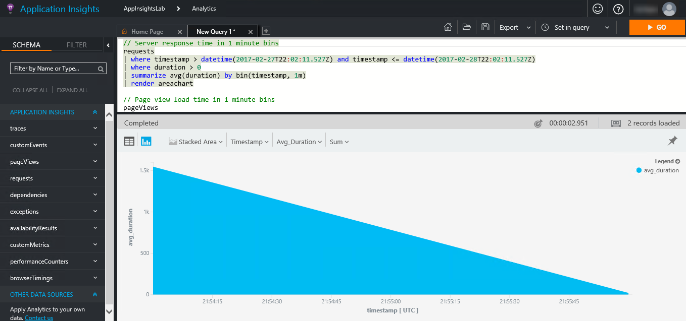

7.  Back on the **Overview** blade, click **Alerts**. Alerts are
    proactive notifications the platform can send you based on the
    circumstances you define.

    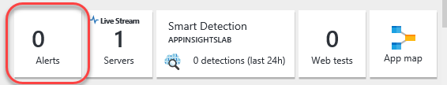

8.  Click **Add alert**.

    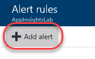

9.  Expand the **Metric** dropdown to see the list of metrics you can
    monitor for alerts. Close the alert blades until you return to the
    **Overview** blade.

    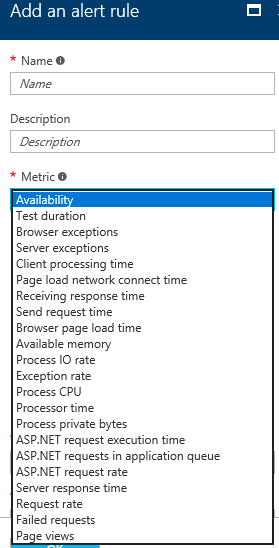

10. **Smart Detection** is a machine learning feature that learns about
    your app’s behavior over time and can proactively identify
    circumstances that may be unexpected so that you can be alerted.

    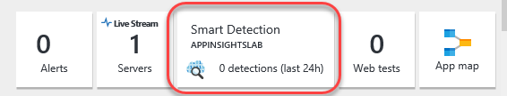

11. Click **Web tests**. Web tests are automated processes you can
    configure Application Insights to run periodically to ensure the
    application is running as expected.

    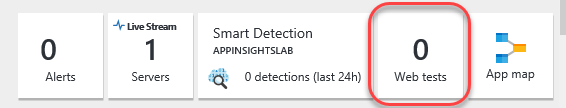

12. Click **Add web test**.

    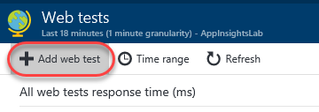

13. You can create web tests that either ping a URL periodically or run
    a **.webtest** file you provide in order to determine whether the
    site is running as expected. Close the test blades until you return
    to the **Overview** blade for this project.

    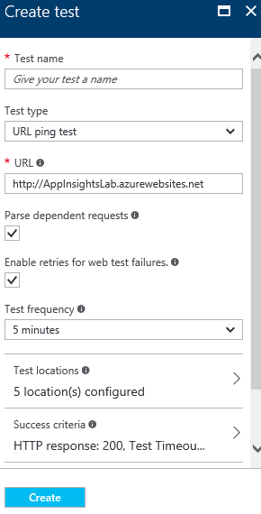

14. Click the **Live Stream** button to begin live streaming the
    Application Insights collections into the portal.

    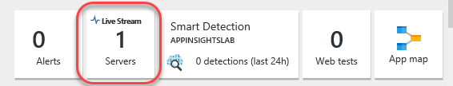

15. Return to the debug test app browser and use the navigation links to
    generate some site traffic. Close the debug application browser
    window (not the portal window) when done.

    

16. Return to the portal window and notice how the traffic you just
    generated is already showing up.

    

17. Close the **Live Metrics Stream** blade.

18. Click the **App map** button.

    

19. The **Application Map** is a visual layout of the dependency
    relationships of your application components. Each component shows
    KPIs such as load, performance, failures, and alerts, to help you
    discover any component causing a performance issue or failure. You
    can click through from any component to more detailed diagnostics,
    such as Application Insights events. If your app uses Azure
    services, you can also click through to Azure diagnostics, such as
    SQL Database Advisor recommendations. Click the **+** button to
    expand the **Client**
    relationships.

20. Besides the **Server**, the **Client** also has a dependency on
    **AJAX** requests, which you can see here.

    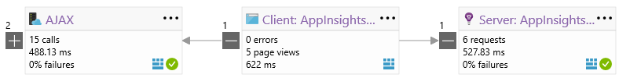

### Task 4: Tracking exceptions

1.  Return the **Solution Explorer** in **Visual Studio** and
    double-click **Controllers\\HomeController.cs** to open that file.

    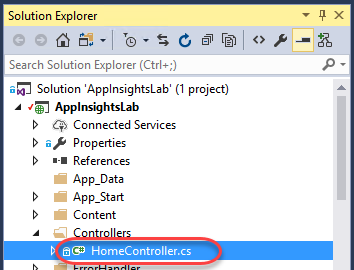

2.  Insert the following line of code at the top of the
    **Contact** method.

    ```
    // C\#

        throw new Exception("Contact exception!");

    ```

3.  The final method should look like this.

    

4.  Press **F5** to build and run the newly flawed project.

5.  Navigate to the **Contact** page.

    

6.  This will throw an exception and break in **Visual Studio**. Press
    **F5** to continue anyway.

7.  In **Visual Studio**, click the **Application Insights** button.

    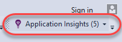

8.  There should be data in the view, but if there isn’t, click the
    **Reset** button and set the **Time range** to **Last 30 minutes**.
    This occasionally needs to be done to refresh the view. Note that
    there is now an **Exception** tracked.

    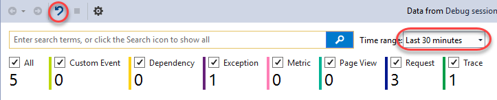

9.  Locate and click on the **Exception** in the list view.

    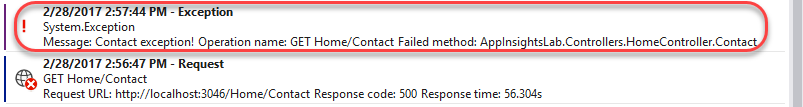

10. Like the request earlier, you can also click **Track Operation** to
    see the steps involved to get to this exception.

    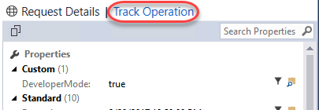

11. As we already knew, the exception began with a request to
    **Home/Contact**.

    

12. Expand the **Application Insights** dropdown and select **Explore
    Telemetry Trends**.

    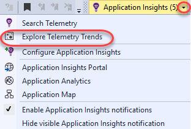

13. The **Application Insights Trends** tool visualizes how your
    application's important telemetry events change over time, helping
    you quickly identify problems and anomalies. By linking you to more
    detailed diagnostic information, Trends can help you improve your
    app's performance, track down the causes of exceptions, and uncover
    insights from your custom events. Change the **Telemetry Type** to
    **Exceptions** and click **Analyze Telemetry** to see the trends
    for exceptions.

    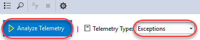

14. Return to the portal window, which should still be open to the
    **Application Map**. Click **Refresh**.

    

15. Note that the **Server** now indicates that there is a warning,
    which is a direct result of the exception. Click the warning.

    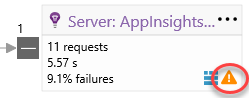

16. Scroll to the bottom of the new blade and click the exception.

    

17. In the **Exceptions** panel, click **Contact exception!** to review
    its details.

    

18. Even in the portal, you can review the full stack trace and other
    details about the exception.

    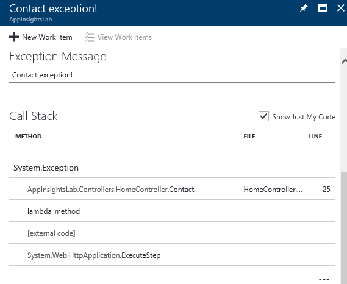

19. Return to **HomeController.cs** in **Visual Studio**. Note the two
    **CodeLens** markers on the right side of the **Contact** method.
    Click the last one to review **Exception** details. Click the one
    before it to view requests. These are pulling data from Application
    Insights to provide you with timely information in the editor.

    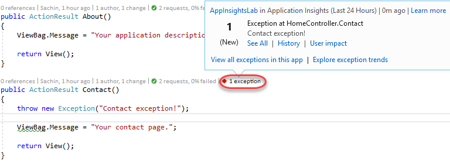

20. Close the debug app browser window.

### Task 5: Integrating telemetry

1.  Add the following code inside the **About** method. This will track
    a server-side custom event every time someone visits **Home/About**.

    ```
    // C\#

        var ai = new Microsoft.ApplicationInsights.TelemetryClient();

        ai.TrackEvent("About - server");
    
    ```

2.  In **Solution Explorer**, double-click **Views\\Home\\About.cshtml**
    to open it.

    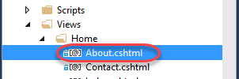

3.  Add the following code to the end of the file. It will use the
    JavaScript API to track a custom browser-side event when the
    **About** page is visited.

    ```
    @section scripts

        {

        &lt;script type="text/javascript"&gt;

        appInsights.trackEvent("About - client");

        &lt;/script&gt;

        }
    ```

4.  Press **F5** to build and launch the site. Since **About.cshtml**
    was open, it should open to that page. Otherwise, navigate to it
    using the link at the top.

5.  In **Visual Studio**, click **Application Insights**.

    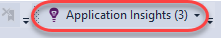

6.  Now you should see a **Custom Event** has been tracked, which is
    from the server-side telemetry.

    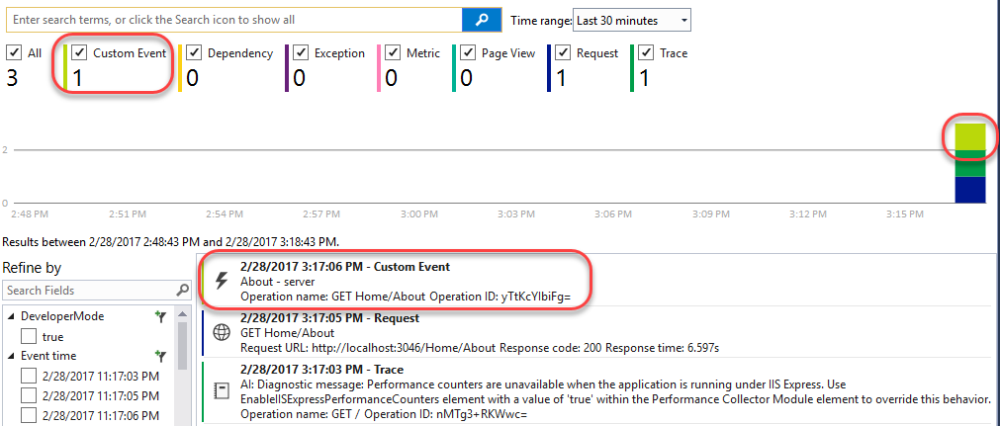

7.  Return to the portal window and close all blades until you get back
    to the **Overview** blade. Click the **Page view load time** chart.

    

8.  Click the **Page Views** chart.

    

9.  Click **Filters**.

    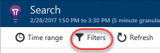

10. Check the **Custom Event** filter to add it. This will add
    browser-side events to the report. Click **Update**.

    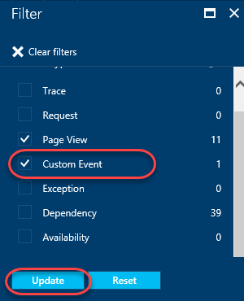

11. On the **Search** blade, you will now see the custom event in
    the chart. You can now even drill in to the event to get more
    details, see other requests in the same session, and more.

    


