<div class="rw-ui-container"></div>

## Overview

[Visual Studio Application Insights](https://azure.microsoft.com/services/application-insights) is an extensible analytics service that helps you understand the performance and usage of your live web application. It's designed for developers, to help you continuously improve the performance and usability of your app. It works with web apps on .NET or J2EE, hosted on-premises or in the cloud. You can also apply it to Windows background services and desktop apps.

In this lab we will start with a fresh ASP.NET application and explore how you can instrument it with Application Insights. This will make it easier to track site usage and patterns, as well as to detect, diagnose, and triage issues related to performance and more.

## Prerequisites

In order to complete this lab you will need the Visual Studio 2017 virtual machine provided by Microsoft. Click the button below to launch the virtual machine on the Microsoft Hands-on-Labs portal.

<a href="https://labondemand.com/AuthenticatedLaunch/38304?providerId=4" class="launch-hol" role="button" target="_blank"><span class="lab-details">Launch the virtual machine</span></a>

Alternatively, you can download the virtual machine from [here](../almvmdownload/)

You will also need an Azure account, which you can set up at [http://azure.com](http://azure.com/).

## Exercise 1: Instrumenting with Application Insights

### Task 1: Adding Application Insights to an ASP.NET Application

1. Log in as **Sachin Raj (VSALM\Sachin)**. All user passwords are **P2ssw0rd**.

1. Launch **Visual Studio** from the taskbar.

1. Select **File \| New \| Project** from the main menu.

1. From the **Visual C# \| Web** section, select the **ASP.NET Web Application (.NET Framework)** template and enter a **Name** of **"AppInsightsLab"**. Click **OK** to continue.

    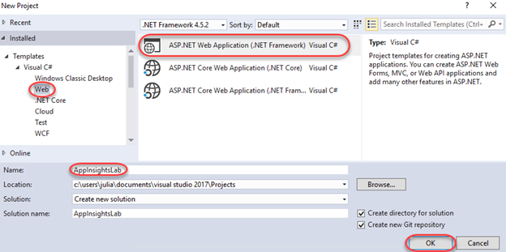

1. Select the **MVC** template and click **OK** to create the project.

    

1. Press **F5** to build and run the app. As you can see, there's nothing special here yet. Close the browser to end the debugging session.

1. In **Solution Explorer**, right-click the **AppInsightsLab** project node and select **Application Insights \| Configure Application Insights**.

    

1. If there is an update available to the Application Insights SDK, click **Update SDK**.

    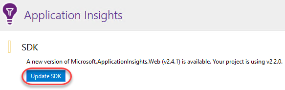

1. Next, you'll need to connect with an Azure account to collect and analyze data. Click **Start Free**.

    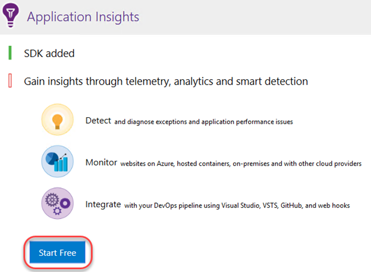

1. Click **Sign in** and sign in with your Azure account.

1. Select a pricing mode and click **Register**.

    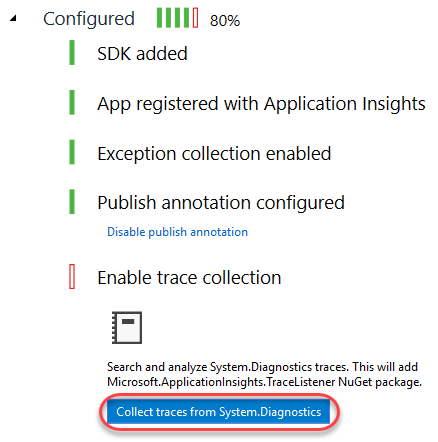

1. Click **Collect traces from System.Diagnostics** to add that trace listener to the project. This will enable you to send logs to Application Insights so that they can be merged in with other telemetry data collected in the application. Click **Finish** when the process completes.

    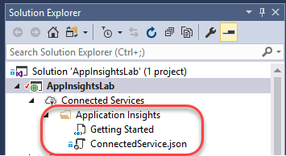

1. Let's walk through **Solution Explorer** to take a look at what was added and changed in the project. First, locate the **Application Insights** folder inside the **Connected Services** node. This provides a link to more information on getting started.

    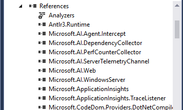

1. Expand the **References** node and locate the **Microsoft.AI.*** assemblies. These are the payloads of NuGet packages added by Application Insights.

    

1. Double-click the **ErrorHandler\AiHandleErrorAttribute.cs** file to open it.

    

1. This class contains a global exception handler that automatically sends unhandled exceptions to Application Insights for logging.

    

1. Double-click the **Views\Shared\_Layout.cshtml** file to open it.

    

1. This file is the outer-most template for HTML pages rendered by this application. Application Insights has inserted initialization code inside the **head** tag so that you can immediately start using the JavaScript API to instrument the client-side portion of the application. Note the **instrumentationKey** property in the middle of the code block. This key is unique to your Application Insights account.

    

1. Double-click **ApplicationInsights.config** to open it.

    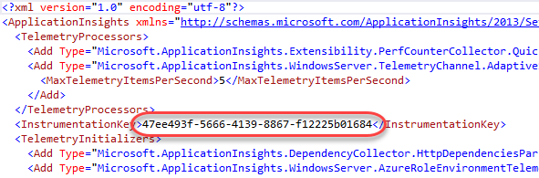

    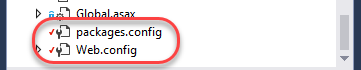

1. Finally, **packages.config** has been updated to reflect the NuGet packages and **Web.config** has been updated to reflect the assembly references.

    

### Task 2: Tracking usage data

1. Press **F5** to build and run the project. Navigate around the site for a few pages using the navigation links at the top to generate traffic. Be sure to visit the **Contact** page.

    

1. Leave the browser window open and return to **Visual Studio**.

1. Click the **Application Insights** button. Note that it may be minimized inside a collapsed menu button if the window is narrow.

    

    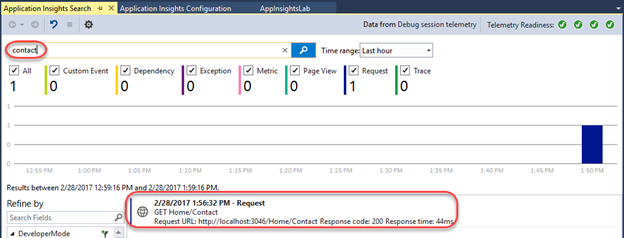

1. The default action of the button is to open the **Application Insights Search**. This provides access to the full set of telemetry data collection throughout the application's history. Search for **"contact"** and click the first result that comes up.

    

1. The **Request Details** that open provide a wealth of information about the collected data from the request, such as the request and response details. Click the **Track Operation** tab.

    

1. The **Track Operation** tab provides the details and timeline of the steps involved in the request. In this case, it's a pretty simple single-step operation that succeeded.

    

### Task 3: Working with the Application Insights Portal

1. Open a new browser window (not a new tab in the debug browser window) and navigate to [https://portal.azure.com](https://portal.azure.com/). The portal provides even more functionality.

1. Click **Application Insights** from the navigation menu.

    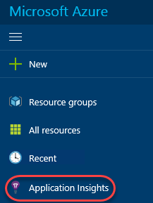

1. Click the **AppInsightsLab** account to open it.

    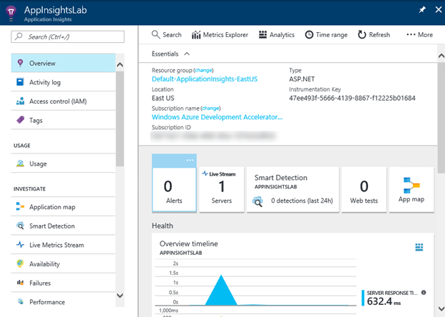

1. The **Overview** blade provides a dashboard view of the account. There are shortcut links and standard reports as well.

    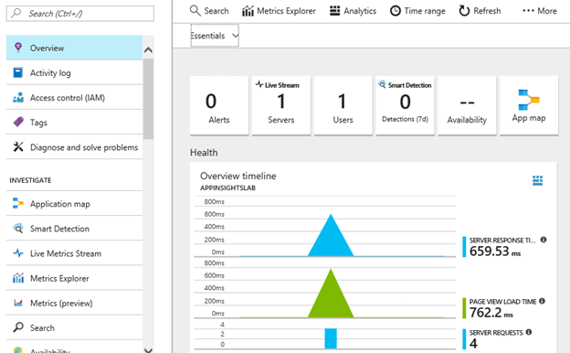

1. Click the **Open chart in Analytics** button.

    

1. This will open the extremely powerful **Analytics** engine for query and analysis. You can create virtually any kind of report you need using the flexible syntax and access to everything in the platform. Close the browser tab.

    

1. Back on the **Overview** blade, click **Alerts**. Alerts are proactive notifications the platform can send you based on the circumstances you define.

    

1. Click **Add metric alert**.

    

1. Expand the **Metric** dropdown to see the list of metrics you can monitor for alerts. Close the alert blades until you return to the **Overview** blade.

    

1. **Smart Detection** is a machine learning feature that learns about your app's behavior over time and can proactively identify circumstances that may be unexpected so that you can be alerted.

    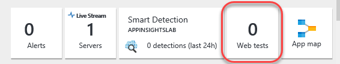

1. Click **Availability**. Web tests are automated processes you can configure Application Insights to run periodically to ensure the application is running as expected.

    

1. Click **Add test**.

    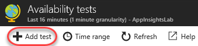

1. You can create web tests that either ping a URL periodically or run a **.webtest** file you provide in order to determine whether the site is running as expected. Close the test blades until you return to the **Overview** blade for this project.

    

1. Click the **Live Stream** button to begin live streaming the Application Insights collections into the portal.

    

1. Once the live stream is ready, return to the debug test app browser and use the navigation links to generate some site traffic. Close the debug application browser window (not the portal window) when done.

    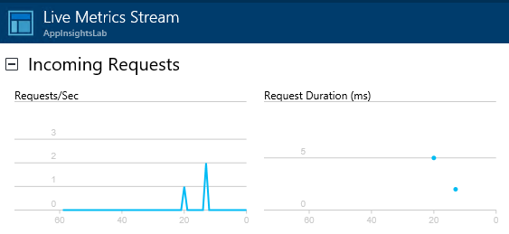

1. Return to the portal window and notice how the traffic you just generated is already showing up.

    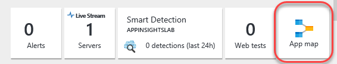

1. Close the **Live Metrics Stream** blade.

1. Click the **App map** button.

    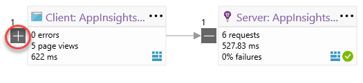

    

### Task 4: Tracking exceptions

1. Return the **Solution Explorer** in **Visual Studio** and double-click **Controllers\HomeController.cs** to open that file.

    

1. Insert the following line of code at the top of the **Contact** method.

    ```c#
    throw new Exception("Contact exception!");
    ```
1. The final method should look like this.

    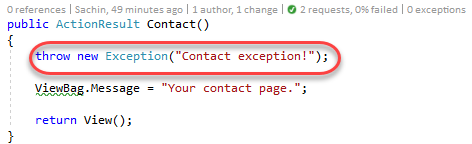

1. Press **F5** to build and run the newly flawed project.

1. Navigate to the **Contact** page.

    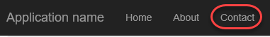

1. This may throw an exception and break in **Visual Studio**. If so, press **F5** to continue anyway.

1. In **Visual Studio**, click the **Application Insights** button.

    

1. There should be data in the view, but if there isn't, click the **Reset** button and set the **Time range** to **Last 30 minutes**. This occasionally needs to be done to refresh the view. Note that there is now an **Exception** tracked.

    

1. Locate and click on the **Exception** in the list view.

    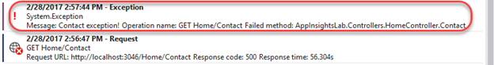

1. Like the request earlier, you can also click **Track Operation** to see the steps involved to get to this exception.

    

1. As we already knew, the exception began with a request to **Home/Contact**.

    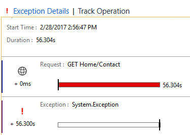

1. Expand the **Application Insights** dropdown and select **Explore Telemetry Trends**.

    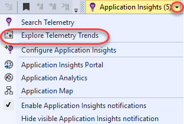

1. The **Application Insights Trends** tool visualizes how your application's important telemetry events change over time, helping you quickly identify problems and anomalies. By linking you to more detailed diagnostic information, Trends can help you improve your app's performance, track down the causes of exceptions, and uncover insights from your custom events. Change the **Telemetry Type** to **Exceptions** and click **Analyze Telemetry** to see the trends for exceptions.

    

1. Return to the portal window, which should still be open to the **Application Map**. Click **Refresh**.

    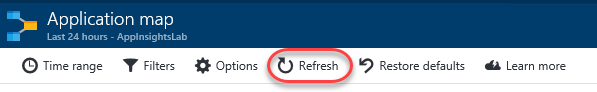

1. Note that the **Server** now indicates that there is a warning, which is a direct result of the exception. Click the warning. Note that it may take some time for the warning to appear.

    

1. Scroll to the bottom of the new blade and click the exception.

    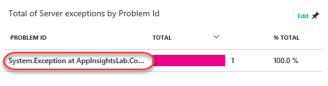

1. In the **Exceptions** panel, click **Contact exception!** to review its details.

    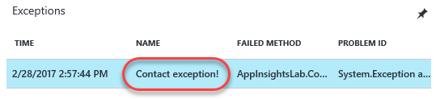

1. Even in the portal, you can review the full stack trace and other details about the exception.

    

1. Return to **HomeController.cs** in **Visual Studio**. Note the two **CodeLens** markers on the right side of the **Contact** method. Click the last one to review **Exception** details. Click the one before it to view requests. These are pulling data from Application Insights to provide you with timely information in the editor.

    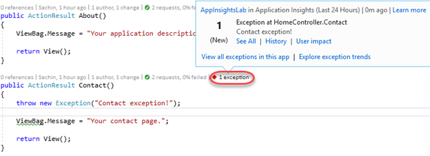

1. Close the debug app browser window.

### Task 5: Integrating telemetry

1. In **HomeController.cs**, add the following code inside the **About** method. This will track a server-side custom event every time someone visits **Home/About**.

    ```c#
    var ai = new Microsoft.ApplicationInsights.TelemetryClient();
    ai.TrackEvent("About - server");
    ```
1. In **Solution Explorer**, double-click **Views\Home\About.cshtml** to open it.

    

1. Add the following code to the end of the file. It will use the JavaScript API to track a custom browser-side event when the **About** page is visited.

    ```javascript
    @section scripts
    {
        <script type="text/javascript">
            appInsights.trackEvent("About - client");
        </script>
    }
    ```
1. Press **F5** to build and launch the site. Since **About.cshtml** was open, it should open to that page. Otherwise, navigate to it using the link at the top.

1. In **Visual Studio**, click **Application Insights**.

    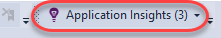

1. Now you should see a **Custom Event** has been tracked, which is from the server-side telemetry.

    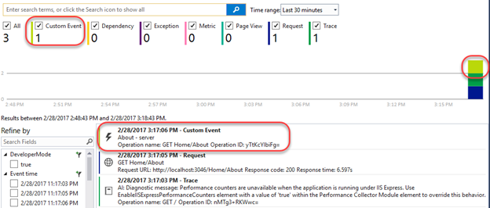

1. Return to the portal window and close all blades until you get back to the **Overview** blade. Click the **Page view load time** chart.

    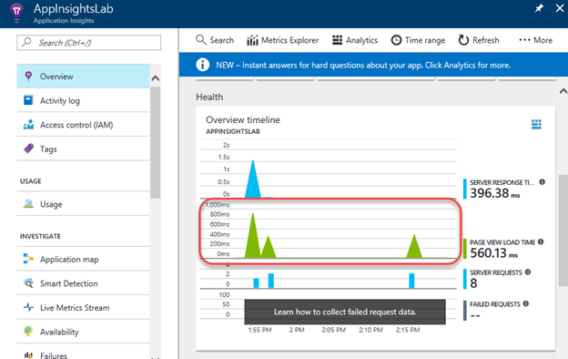

1. Click the **Page Views** chart.

    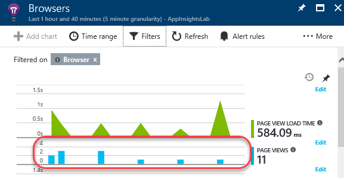

1. Click **Filters**.

    

1. Check the **Custom Event** filter to add it. This will add browser-side events to the report. Click **Done**.

    

1. On the **Search** blade, you will now see the custom event in the chart. You can now even drill in to the event to get more details, see other requests in the same session, and more.

    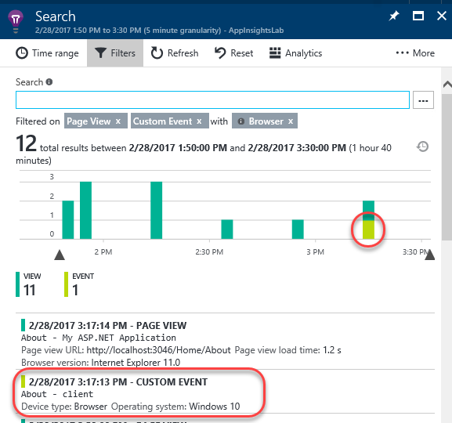
