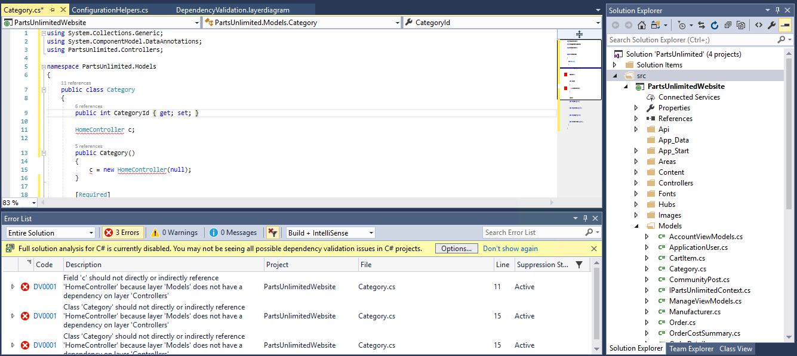
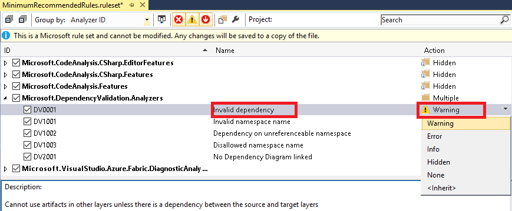

Visual Studio enables teams to validate architectural dependencies in their solutions using the [Layer Designer](https://msdn.microsoft.com/en-us/library/dd465141.aspx). 
It first shipped in Visual Studio 2010. The experience of the Layer Designer has been improved in Visual Studio 2017 with the introduction Dependency Validation experience to help ensure that developers respect the architectural constraints of the application as they edit their code.

In Visual Studio 2017 we have re-written the validation code to use **Roslyn analyzers**, which not only fixes many of these issues that were in the previous versions, but also gives us live validation in the IDE. As you type you get issues, and squiggles in the editor, and you can immediately stop introducing architectural flaws.
We’ve also renamed layer diagrams to **‘dependency validation’** diagrams to make it clearer what they are for.

## Related Resources

- Read this [Blog Post](https://blogs.msdn.microsoft.com/visualstudioalm/2016/11/30/live-dependency-validation-in-visual-studio-2017/) for a detailed discussion comparing the new experience with the past

## Pre-requisites

- Visual Studio 2017 (download [here](https://www.visualstudio.com/vs/visual-studio-2017-rc/))

- Download the Parts Unlimited project [here](https://github.com/Microsoft/PartsUnlimited/tree/aspnet45)

### Task 1: Real Time Dependency Validation in Visual Studio 2017

1. Download and extract the zip file

2. Open the solution in Visual Studio 2017

3. Right click on the **Parts Unlimited** solution and click **Restore Nuget Packages**. Make sure your project builds locally without any issues

 

4. Now that we have a clean solution, I have opened the solution in my **Visual Studio 2017**. A Dependency Validation diagram was created by a code expert before he left for his retirement, and it describes the design principles he enforced, and want them to be  enforced in future changes. I was asked to add a feature, and I understand what to do. I will edit some code to add a feature.

  The below diagram indicates **Dependency Validation** for Parts Unlimited 

  

5. I'm trying to access **HomeController** under **Controllers**, from the **Category** class under **Models** by instantiating it in the constructor, but I am notified early with a clear message as to what I am trying to do is violating architectural constraints as shown below-

  
 
 
 This validation is well integrated in the **Error List**, which means I can use all the filters and sorting capabilities. This is implemented as a **static analyzer** and therefore I can change the severity of the error to a warning if I want to.
 
  
### Task 2: Creating Validation Diagrams in Visual Studio 2017

Now that we have seen what the developer experience is in the editor, let's see how to create a dependency diagram.

1. Load the Parts Unlimited solution

2. Go to **Architecture** tab in your Visual Studio and select **New Dependency Validation Diagram** as shown below. You should see a new project being added in your **Solution Explorer**

  
 
3. You will be prompted with a new window, give the name and select **ok**. You will be prompted with an **update** in your **Solution Explorer**. Update the project to enable **Live Dependency** by clicking on the **update** button

  
 
  

 Your Project is amended to enable the **Live Validation**, in particular **Rosyln analyzer** is provisioned as a Nuget package.
 
4. Open the file **YOURFILENAME.layerdiagram** in your Visual Studio from the Solution Explorer as shown below
 
  

5. Let's add layers. A simple way to do this is by drag & drop from **Solution Explorer or Class View**.

 Drag and drop the **controllers & models** from the solution explorer and add a **dependency** from the toolbox as shown below 

  
 
6. Let's test now. Open the file **Category.cs** from **Models** and add the following code

  **using PartsUnlimited.Controllers;**
  
  **HomeController c;**
   
   You can see that, I immediately get red squiggly and an error that clearly explains that this reference is not allowed.
   
  

7. Now try building the solution you will see that failure of dependency validation gets flagged as build errors.

  
 
 
8. You can convert these **errors** to **warnings** by updating the rule settings. Right click and select **Open Active Rule Set** from the **Analyzers node** under **PartsUnlimitedWebsite** as shown

  
 
9. You can now change the error level for all or select a set of dependency validation checks. Let's change the **Invalid Dependency** rule to **Warning** as shown below

  
 
10. Now rebuild the solution. You can see that the build succeeds with **warnings**

  

Once the code is committed to the source control repository, this will enable the whole team to benefit from the dependency validation **(including in Visual Studio Pro and Community where dependency diagrams cannot be created but can be viewed as read-only)**. The dependency validation will also happen during **Continuous Integration** builds and if you install the **[SonarQube](https://marketplace.visualstudio.com/items?itemName=SonarSource.sonarqube)** plugin for Dependency Validation, you will even see the architectural flaws in SonarQube.
