

## Overview

With Visual Studio and the [Azure SDK](https://azure.microsoft.com/downloads/), you can create a project that deploys your infrastructure and code to Azure. For example, you can define the web host, web site, and database for your app, and then deploy that infrastructure along with the code. Or, you can define a virtual machine, virtual network, and storage account to be deployed along with a script to execute on the new virtual machine. The **Azure Resource Group** deployment project enables you to deploy all the needed resources in a single, repeatable operation. For more information about deploying and managing your resources, see [Azure Resource Manager overview](https://docs.microsoft.com/en-us/azure/azure-resource-manager/resource-group-overview).

Azure Resource Group projects contain Azure Resource Manager JSON templates, which define the resources that you deploy to Azure. To learn about the elements of the Resource Manager template, see [Authoring Azure Resource Manager templates](https://docs.microsoft.com/en-us/azure/azure-resource-manager/resource-group-authoring-templates). Visual Studio enables you to edit these templates, and provides tools that simplify working with templates.

In this lab, you will deploy a web app and SQL database. However, the steps are almost the same for any type resource. You can as easily deploy a virtual machine and its related resources. Visual Studio provides many different starter templates for deploying common scenarios.

## Prerequisites

In order to complete this lab you will need the Visual Studio 2017 virtual machine provided by Microsoft. Click the button below to launch the virtual machine on the Microsoft Hands-on-Labs portal.

<a href="https://labondemand.com/AuthenticatedLaunch/38294?providerId=4" class="launch-hol" role="button" target="_blank">Launch the virtual machine</a>

Alternatively, you can download the virtual machine from [here](../almvmdownload/)

You also need an [Azure account](https://azure.microsoft.com/) ([Get 1 yr of free services, $200 for 1st month by joining Visual Studio Dev Essentials](https://www.visualstudio.com/dev-essentials/)).

## Exercise 1: Authoring ARM Templates with Visual Studio

### Task 1: Creating an Azure Resource Group project

1. Log in as **Sachin Raj (VSALM\Sachin)**. All user passwords are **P2ssw0rd**.

1. Launch **Visual Studio** from the taskbar.

1. Select **File \| New \| Project**.

1. Select the **Visual C# \| Cloud** category and the **Azure Resource Group** template. Leave the other defaults and click **OK**.

    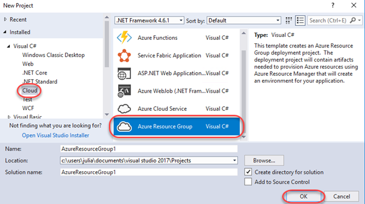

1. Select the **Web app + SQL** template and click **OK**. This is a basic template that defines the infrastructure required for a web app and a SQL server. Note that template you pick is just a starting point and that you can add or remove resources to fulfill your scenario. Also note that Visual Studio retrieves a list of available templates online, so the list may change.

    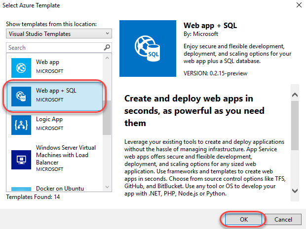

1. Locate **Solution Explorer** to review the files created for this template. Note that these are specific to the template chosen for this lab and other templates may contain additional files to support other functionality.

    

1. **Deploy-AzureResourceGroup.ps1** is a PowerShell script that invokes PowerShell commands to deploy to Azure Resource Manager. Note that Visual Studio uses this PowerShell script to deploy your template to Azure.

1. **WebSiteSQLDatabase.json** is the Resource Manager template that defines the infrastructure you want deployed to Azure, as well as the parameters you provide during deployment. It also defines the dependencies between the resources so that Resource Manager will deploy the resources in the correct order.

1. **WebSiteSQLDatabase.parameters.json** is a parameters file that contains values needed by the template. You pass in parameter values to customize each deployment.

### Task 2: Customizing the Resource Manager template

1. You can customize a deployment project by modifying the JSON templates that describe the resources you want to deploy. These JSON files use a schema that you reference at the top of each file. To learn about the elements of the Resource Manager template, see [Authoring Azure Resource Manager templates](https://docs.microsoft.com/en-us/azure/azure-resource-manager/resource-group-authoring-templates).

1. From **Solution Explorer**, open **WebSiteSQLDatabase.json**.

    

1. Expand the **JSON Outline** window from the left side of Visual Studio and pin it open. This window provides an easy way to navigate and understand the configuration file.

    

1. Select the **resources \| Website** node and note how the associated JSON is highlighted in the editor.

    

1. Right-click the **resources** node and select **Add New Resource**.

    

1. Search for **"storage"** and select **Storage Account**. Enter a **Name** of **"storage"** and click **Add**.

    

1. Adding the storage account adds three new nodes to the **JSON Outline**: **storageType**, **storageName**, and **storage**.

    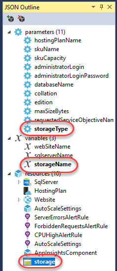

1. Select **storageType**. The **storageType** parameter is pre-defined with allowed types and a default type. You can leave these values or edit them for your scenario. For example, if you don't want anyone to deploy a **Premium_LRS** storage account through this template, remove it from the allowed types.

    

1. Visual Studio also provides IntelliSense to help you understand what properties are available when editing the template. Select the **HostingPlan** node and start to add a new property in the editor (don't forget the comma after the **name** property). IntelliSense will step in to offer assistance.

    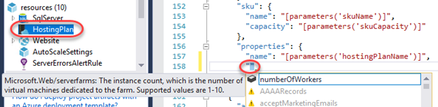

1. Add a **numberOfWorkers** property and set it to **1**.

    

### Task 3: Deploying the Resource Group project to Azure

1. From **Solution Explorer**, right-click the **AzureResourceGroup1** project nod and select **Deploy \| New**. When you deploy an Azure Resource Group project, you deploy it to an Azure resource group. The resource group is a logical grouping of resources that share a common lifecycle.

1. Select **Add an account** and log in using the Microsoft account associated with your Azure subscription.

    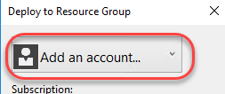

1. Create a new **Resource group** from its dropdown.

    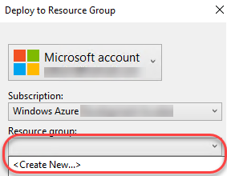

1. Leave the default name and select a location. Click **Create**.

    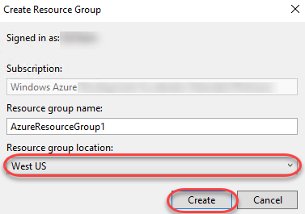

1. Click **Edit Parameters**.

    

1. Enter **"HostingPlan"** as the plan name **"LabDB"** as the name of the database. You will also need to provide SQL administrator credentials. For the purposes of this lab, use **"sysadmin"** and a password like **P2ssw0rd**. Note that there is a **Save passwords as plain text in the parameters file** option. This is not secure and should generally not be used, so make sure that option is cleared. Since the password is not saved as plain text, you will be prompted for the SQL admin password again during deployment. Click **Save**.

    

1. Click **Deploy** to begin the deployment.

    

1. The PowerShell output will print to the **Output** window.

    

1. During the deployment process, a PowerShell window will be launched to prompt for the SQL admin password configured earlier. Note that it may pop behind Visual Studio, so keep a keen key on the taskbar. Provide the password to continue.

    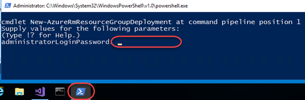

1. Key an eye on the **Output** window to track when the deployment has completed.

    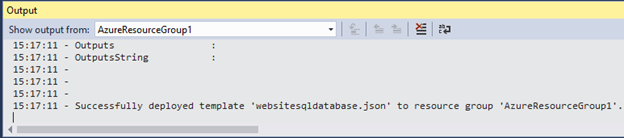

1. Open a new browser window to [https://portal.azure.com](https://portal.azure.com/) and log in using your Microsoft account credentials.

1. Search for **"azureresourcegroup1"** to locate the newly deployed resource group.

    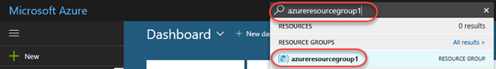

1. Here you can review all the deployed resources. Notice that the name of the storage account is not exactly what you specified when adding that resource. Since the storage account name must be globally unique, the template automatically appended a string of characters to your specified name.

    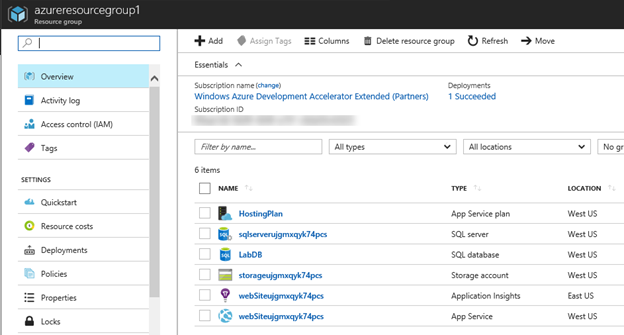

1. Return to Visual Studio.

1. In **Solution Explorer**, right-click the **AzureResourceGroup1** project node and select **Deploy**. Note that you now have a shortcut to **AzureResourceGroup1**. If you want to redeploy, you can simply select this option. Escape out of this context menu for now.

    

### Task 4: Deploying code with your infrastructure

1. At this point, you have deployed the infrastructure for your app, but there is no actual code deployed with the project. This task walks through the process of deploying a web app and SQL database tables. Note that if you were deploying a virtual machine instead of a web app, you would instead want to run some code on the machine as part of deployment. The processes for deploying code for a web app or for setting up a virtual machine are very similar.

1. In **Solution Explorer**, right-click the solution node and select **Add \| New Project**.

    

1. From the **Visual C$ \| Web** category, select the **ASP.NET Web Application (.NET Framework)** template. Accept the defaults and click **OK**.

    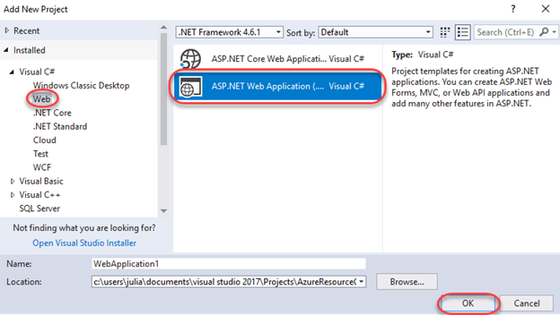

1. Select the **MVC** template and click **OK**.

    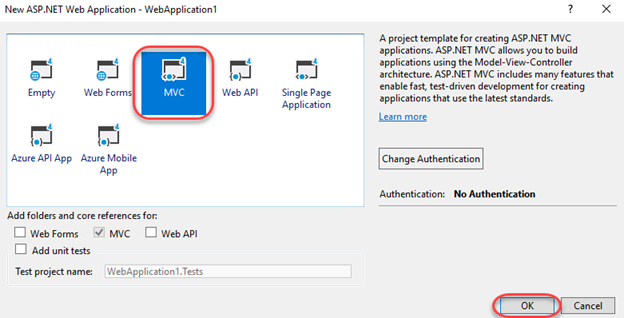

1. Once the web app project has been created you can then add a reference to it from the resource group project. In **Solution Explorer**, right-click the **References** node under the resource group project and select **Add Reference**.

    

1. Check the **WebApplication1** project and click **OK**.

    

1. By adding a reference, you linked the web app project to the resource group project, and automatically set three key properties. Select the **WebApplication1** reference and you can see these properties in the **Properties** window.

    

1. **Additional Properties** contains the web deployment package staging location that is pushed to the Azure Storage. Note the folder (**WebApplication1**) and file (**package.zip**). You need to know these values because you provide them as parameters when deploying the app. **Include File Path** contains the path where the package is created. **Include Targets** contains the command that deployment executes. You don't need a publish profile as the deployment gets the necessary information from these properties to create the package.

1. Return to **WebSiteSQLDatabase.json**.

1. In **JSON Outline**, click the **Add Resource** button to add a resource to the template.

    

1. Search for **"web deploy"** and select the **Web Deploy for Web Apps** resource. Enter a **Name** of **"WebApp"** and click **Add**.

    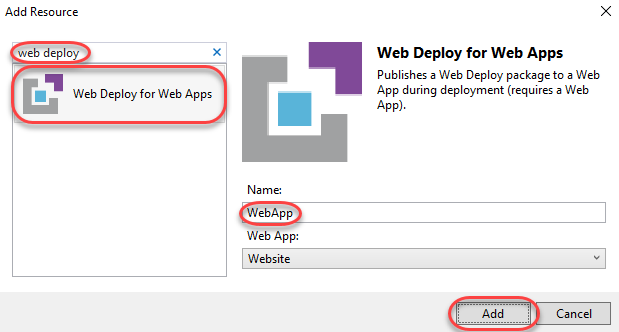

1. Now you can deploy the full app. In **Solution Explorer**, right-click the resource group project node and select **Deploy \| AzureResourceGroup1**.

    

1. Once all of the previous settings load, click **Deploy**.

    

1. This time there are some new parameters you'll need to provide. You do not need to specify values for **_artifactsLocation** or **_artifactsLocationSasToken** because Visual Studio automatically generates those values. However, you have to set the folder and file name to the path that contains the deployment package. Provide the values you saw earlier in the reference properties (**WebApplication1** and **package.zip**). Click **Save** to continue the deployment.

    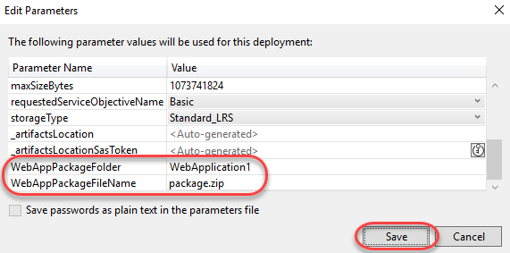

1. Don't forget to keep an eye out for the PowerShell prompt to enter your SQL admin password.

1. Return to the Azure portal window and click the **App Service** to view it.

    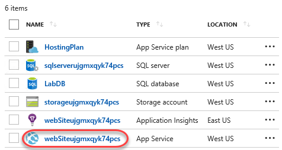

1. There will be a URL in the top right corner. Click it to visit your deployed site.

    

1. The site will load in a new tab.

    