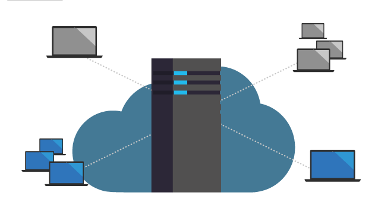
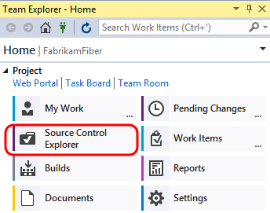
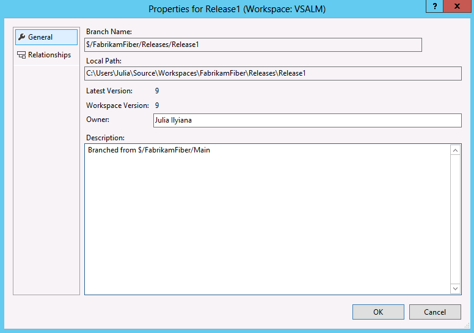
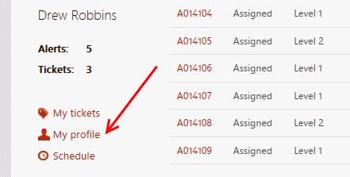
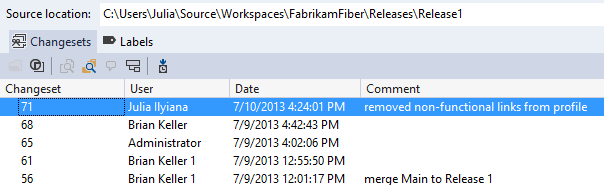
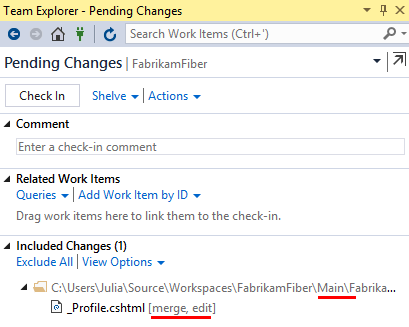

Branching and Merging Visualizaton with Visual Studio Team Foundation Server 2017

### Overview

In this lab, you will be introduced to the branching and merging visualization support in Visual Studio Team Foundation Server 2017.
This support makes it much easier to understand a solution branch hierarchy and to propagate changes during the merge process.

### Pre-requisites

*  In order to complete this lab you will need the Visual Studio 2017
    virtual machine provided by Microsoft. For more information on
    acquiring and using this virtual machine, please see [this blog
    post](http://aka.ms/almvm).

### About the Fabrikam Fiber scenario

This set of hands-on-labs uses a fictional company, Fabrikam Fiber,
    as a backdrop to the scenarios you are learning about. Fabrikam
    Fiber provides cable television and related services to the
    United States. They are growing rapidly and have embraced Windows
    Azure to scale their customer-facing web site directly to end-users
    to allow them to self-service tickets and track technicians. They
    also use an on-premises ASP.NET MVC application for their customer
    service representatives to administer customer orders.

In this set of hands-on labs, you will take part in a number of
    scenarios that involve the development and testing team at
    Fabrikam Fiber. The team, which consists of 8-10 people, has decided
    to use Visual Studio application lifecycle management tools to
    manage their source code, run their builds, test their web sites,
    and plan and track the project.

<!-- -->

1.  

### Exercises 

This hands-on lab includes the following exercises:

* Working with Team Foundation Server Code Branches

Estimated time to complete this lab: **30 minutes**.

## Exercise 1: Working with Team Foundation Server Code Branches

In this exercise, you will learn about some of the code branching
    features in Team Foundation Server, as well as how to open a
    solution that corresponds to a specific code branch. In addition,
    this exercise will serve as the setup for a scenario where
    production code needs to be updated with changes that are ultimately
    merged through active branches in the system.

#### Task 1: Updating a Source Control Branch

1.  Log in as **Sachin Raj** (VSALM\\Sachin). All user passwords are
    **P2ssw0rd**.

2.  Launch **Visual Studio 2017** from the taskbar and open **Team
    Explorer**. You should now be connected to the FabrikamFiber
    team project. If you are not automatically connected to the
    FabrikamFiber project, select the **Connect to Team Projects**
    button () to
    do so.

3.  Open the **Source Control Explorer** window by selecting the Source
    Control Explorer tile.

    

4.  The **Fabrikam Fiber** project contains a main code base (under
    **Main**), a development code base (under Dev), as well as release
    branches (under **Releases**). Branches are first-class objects that
    are represented with their own icon in Source Control Explorer.

    

5.  Expand the **Releases** node and right-click **Release1** to select
    **Advanced |Properties** from the context menu.

    

6.  The **Properties** window provides general details like version and
    description, hierarchical relationship to other branches,
    and permissions.

    

7.  Click **Cancel** to return to **Source Control Explorer**.

8.  Expand the **Release1** branch node in the **Releases** folder and
    locate the **FabrikamFiber.CallCenter.sln** solution file in the
    **FabrikamFiber.CallCenter** folder. Double-click to open it.

    

9.  Rebuild the solution (**Build | Rebuild Solution** from the
    main menu).

10. Ensure that the **FabrikamFiber.Web** project is set as the startup
    project (**right-click** and select **Set as StartUp Project** in
    Solution Explorer).

11. Press **F5** to launch the Fabrikam Fiber intranet portal.

    

12. Imagine a scenario where the **Release1** branch represents the code
    that is currently running on the production web server. Management
    has decided that the non-functional links under the profile section
    on the left side of the page should be removed as soon as possible.
    We have decided to “fast track” this change by making the update
    directly to the **Release1** branch. Later, you will see how we can
    merge this change back to the **Dev** branch so that it becomes a
    part of the changes we’re working on for the next release.

    

13. **Close** the **Internet Explorer** window and return to
    Visual Studio.

14. Our first task is to update the Release1 branch and deploy the
    changes to the production web server. From **Solution Explorer**,
    open **FabrikamFiber.Web | Views | Shared | \_Profile.cshtml**.

15. Comment out the **My tickets** link through the **Schedule** link as
    shown below.

    

16. Press **F5** to launch the website and verify that the
    non-functional links are no longer displayed. For the purposes of
    this demonstration, assume that at this point we have successfully
    deployed the updated change to the production server.

17. **Close** the **Internet Explorer** window and return to
    Visual Studio.

18. Navigate to **Team Explorer – Pending Changes**.

19. In the **Comment** field, enter “**removed non-functional links from
    profile**”, verify only **\_Profile.cshtml** is changed, and click
    **Check In**. Select **Yes** if prompted to confirm check-in.

    

20. In the next task, we will merge the changes to the other branches.

#### Task 2: Branching and Merging Visualization

In this task, you will learn how to visualize and track changesets
    while merging the changes that you made in the previous exercise.

1.  In **Source Control Explorer**, right-click the **Release1** branch
    and select **View History** from the context menu. Note that the
    items in your history may vary from the screenshot below.

    

2.  **Right-click** the changeset that you just checked in and select
    **Track Changeset** from the context menu.

    

3.  In the **Select Branches** window, change **Starting branch** to
    **Release1**. Click **Visualize** to see the current state of the
    changeset as it relates to the other branches.

    

4.  This visualization shows us that the changeset has been applied to
    **Release1** but not to **Dev**. It also makes it clear that in
    order to merge our changes into **Dev** we will need to merge with
    the **Main** branch first.

    **Note**: Your changeset numbers may be different from those in the screenshots.
  
    

5.  To perform the merge of this changeset and the Main branch, **drag
    and drop** the green **Release1** node onto the **Main** node. This
    will load the Source Control Merge Wizard.

    

6.  Ensure that the source branch to merge ends with “Release1” and the
    target branch ends with “Main”. Select the **Next** button
    to continue.

    

7.  The next screen of the merge wizard specifies the version to merge.
    By default, you should see the changeset that you just checked in.
    Select the **Finish** button to perform the merge.

    

8.  After the merge is complete, open the **Team Explorer -** **Pending
    Changes** window and note that **\_Profile.cshtml** changed status
    for the **Main** code branch and is now “merge, edit”. The merge
    process is complete, but we still need to check in the changes.

    

9.  Add a **Comment** of “**Merging fast-tracked changes from Release to
    Main**” and then click **Check In** to finalize the merge. Select
    **Yes** if asked to confirm the check-in.

    

10. In the **Tracking Changeset** window, select the **Rerun** button to
    generate an updated view. You will need to click **Visualize** again
    when the **Select Branches** window appears.

    

    

11. Next, merge the changeset from the **Main** branch with the **Dev**
    branch in the same manner as before by dragging and dropping to load
    the Source Control Merge Wizard.

12. Select **Next** followed by **Finish** to perform the merge process.

13. In the **Pending Changes** window, enter a **Comment** of “**Merged
    fast-tracked changes from Main to Dev**”.

14. Select the **Check In** button to finalize the merge with the
    Dev branch. Select **Yes** if asked to confirm the check-in.

15. In the **Tracking Changeset** window, click on the **Rerun** button
    to see the updated view.

    

16. Another useful view is the Timeline Tracking view. Select the
    **Timeline Tracking** button to the left of the Hierarchy Tracking
    button to switch to this view. This shows the order in which the
    original changeset was merged with the other branches.

    

    

17. In **Solution Explorer**, navigate to and right-click
    **\_Profile.cshtml** to select **Source Control | Annotate** from
    the context menu.

18. Scroll to the bottom of the annotated **\_Profile.cshtml** file and
    locate the HTML that you previously commented out.

19. In the annotation column on the left-hand side, mouse over the
    recent changeset (it should show the date of the guest
    virtual machine). Note that the changeset path and comment refer to
    the Production branch where the original change was made.

    

